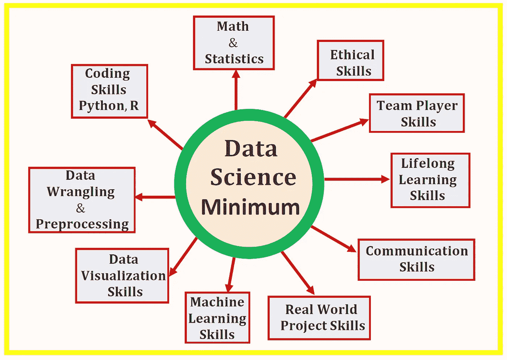

# 数据科学最低要求:开始从事数据科学时你需要知道的 10 项基本技能

> 原文：<https://towardsdatascience.com/data-science-minimum-10-essential-skills-you-need-to-know-to-start-doing-data-science-e5a5a9be5991?source=collection_archive---------1----------------------->

数据科学是一个广阔的领域，包括几个细分领域，如数据准备和探索；数据表示和转换；数据可视化和显示；预测分析；机器学习等。对于初学者来说，提出以下问题是很自然的:**我需要什么技能才能成为一名数据科学家？**

本文将讨论实践数据科学家必备的 10 项基本技能。这些技能可以分为两类，即**技术技能**(数学&统计、编码技能、数据争论&预处理技能、数据可视化技能、机器学习技能和真实世界项目技能)和**软技能**(沟通技能、终身学习技能、团队合作技能和道德技能)。

数据科学是一个不断发展的领域，但是掌握数据科学的基础将为您提供必要的背景，您需要这些背景来追求高级概念，如深度学习、人工智能等。本文将讨论实践数据科学家的 10 项基本技能。

# 开始从事数据科学时需要知道的 10 项基本技能

# 1.数学和统计技能

## (一)统计和概率

统计和概率用于特征的可视化、数据预处理、特征转换、数据插补、降维、特征工程、模型评估等。以下是您需要熟悉的主题:

a)平均值

b)中间值

c)模式

d)标准偏差/方差

e)相关系数和协方差矩阵

f)概率分布(二项式、泊松、正态)

g) p 值

h) MSE(均方差)

i) R2 分数

j) Baye 定理(精确度、召回率、阳性预测值、阴性预测值、混淆矩阵、ROC 曲线)

k) A/B 测试

l)蒙特卡罗模拟

## ㈡多变量微积分

大多数机器学习模型是用具有几个特征或预测器的数据集构建的。因此，熟悉多变量微积分对于建立机器学习模型极其重要。以下是您需要熟悉的主题:

a)几个变量的函数

b)导数和梯度

c)阶跃函数、Sigmoid 函数、Logit 函数、ReLU(校正线性单位)函数

d)成本函数

e)绘制功能图

f)函数的最小值和最大值

## ㈢线性代数

线性代数是机器学习中最重要的数学技能。数据集被表示为矩阵。线性代数用于数据预处理、数据转换和模型评估。以下是您需要熟悉的主题:

a)矢量

b)矩阵

c)矩阵的转置

d)矩阵的逆矩阵

e)矩阵的行列式

f)点积

g)特征值

h)特征向量

## ㈣优化方法

大多数机器学习算法通过最小化目标函数来执行预测建模，从而学习为了获得预测标签而必须应用于测试数据的权重。以下是您需要熟悉的主题:

a)成本函数/目标函数

b)可能性函数

c)误差函数

d)梯度下降算法及其变体(例如随机梯度下降算法)

在这里了解更多关于梯度下降算法的信息: [**机器学习:梯度下降算法如何工作**](https://medium.com/towards-artificial-intelligence/machine-learning-how-the-gradient-descent-algorithm-works-61682d8570b6) 。

# 2.基本编程技能

编程技能在数据科学中至关重要。因为 Python 和 R 被认为是数据科学中最流行的两种编程语言，所以掌握这两种语言的基本知识至关重要。一些组织可能只需要 R 或 Python 中的一种技能，而不是两者都需要。

## (一)Python 中的技能

熟悉 python 的基本编程技能。以下是您应该掌握如何使用的最重要的软件包:

a)数字

b)熊猫

c) Matplotlib

d) Seaborn

e) Scikit-learn

PyTorch

## ㈡研发技能

a)潮汐

b) Dplyr

c) Ggplot2

d)插入符号

e)字符串

## ㈢其他编程语言技能

一些组织或行业可能需要以下编程语言技能:

a) Excel

b)画面

c) Hadoop

d) SQL

e)火花

# 3.数据争论和预处理技巧

数据是数据科学中任何分析的关键，无论是推理分析、预测分析还是规定分析。模型的预测能力取决于构建模型时所用数据的质量。数据以不同的形式出现，如文本、表格、图像、声音或视频。最常见的情况是，用于分析的数据必须经过挖掘、处理和转换，才能呈现为适合进一步分析的形式。

i) **数据争论**:数据争论的过程对于任何数据科学家来说都是至关重要的一步。在数据科学项目中，很少能够轻松访问数据进行分析。数据更有可能在文件、数据库中，或者从网页、tweets 或 pdf 等文档中提取。知道如何争论和清理数据将使您能够从数据中获得关键的洞察力，否则这些洞察力将被隐藏。

ii) **数据预处理**:关于数据预处理的知识非常重要，包括以下主题:

a)处理缺失数据

b)数据插补

c)处理分类数据

d)为分类问题编码类别标签

e)特征变换和降维技术，例如主成分分析(PCA)和线性判别分析(LDA)。

# 4.数据可视化技能

理解良好的数据可视化的基本组件。

a) **数据成分**:决定如何可视化数据的第一个重要步骤是了解数据的类型，例如分类数据、离散数据、连续数据、时间序列数据等。

b) **几何组件:**在这里您可以决定哪种可视化适合您的数据，例如散点图、线形图、条形图、直方图、QQ 图、平滑密度、箱线图、对线图、热图等。

c) **映射组件:**这里你需要决定用什么变量作为你的 x 变量，用什么变量作为你的 y 变量。这一点非常重要，尤其是当数据集是包含多个要素的多维数据集时。

d) **秤组件:**在这里您可以决定使用哪种秤，例如线性秤、对数秤等。

e) **标签组件:**这包括轴标签、标题、图例、使用的字体大小等。

f) **伦理成分**:在这里，你要确保你的可视化讲述真实的故事。在清理、总结、操作和制作数据可视化时，你需要意识到你的行为，并确保你没有利用你的可视化来误导或操纵你的观众。

# 5.基本的机器学习技能

机器学习是数据科学的一个非常重要的分支。理解机器学习框架很重要:问题框架；数据分析；建模、测试&Evaluation;和模型应用。从这里了解更多机器学习框架: [**机器学习流程**](https://medium.com/towards-artificial-intelligence/the-machine-learning-process-3ac14c9a557c) 。

以下是需要熟悉的重要机器学习算法。

## I)监督学习(连续变量预测)

a)基本回归

b)多元回归分析

c)正则化回归

## ii)监督学习(离散变量预测)

a)逻辑回归分类器

b)支持向量机分类器

c)K-最近邻(KNN)分类器

d)决策树分类器

e)随机森林分类器

## iii)无监督学习

a)k 均值聚类算法

# 6.来自真实世界顶点数据科学项目的技能

仅仅从课程工作中获得的技能不会让你成为数据科学家。合格的数据科学家必须能够证明成功完成了真实世界的数据科学项目，该项目包括数据科学和机器学习过程中的每个阶段，如问题框架、数据采集和分析、模型构建、模型测试、模型评估和部署模型。现实世界的数据科学项目可以在以下项目中找到:

a) Kaggle 项目

b)实习

c)来自访谈

# 7.通讯技能

数据科学家需要能够与团队的其他成员或组织中的业务管理员交流他们的想法。良好的沟通技巧将在这里发挥关键作用，能够向很少或根本不了解数据科学技术概念的人传达和展示非常技术性的信息。良好的沟通技巧将有助于培养与其他团队成员(如数据分析师、数据工程师、现场工程师等)团结一致的氛围。

# 8.做一个终身学习者

数据科学是一个不断发展的领域，所以要做好接受和学习新技术的准备。与该领域的发展保持联系的一种方式是与其他数据科学家建立联系。一些促进网络化的平台有 LinkedIn、github 和 medium ( [**向数据科学**](https://towardsdatascience.com/) 和 [**向 AI**](https://towardsai.net/) 出版物)。这些平台对于获取该领域最新发展的最新信息非常有用。

# 9.团队合作技能

作为一名数据科学家，你将在一个由数据分析师、工程师和管理员组成的团队中工作，因此你需要良好的沟通技巧。您还需要成为一名优秀的倾听者，尤其是在早期项目开发阶段，您需要依靠工程师或其他人员来设计和构建一个优秀的数据科学项目。成为一名优秀的团队成员有助于你在商业环境中茁壮成长，并与团队中的其他成员以及组织的管理人员或主管保持良好的关系。

# 10.数据科学中的伦理技能

理解你的项目的含义。对自己诚实。避免操纵数据或使用有意造成结果偏差的方法。从数据收集到分析，再到模型构建、分析、测试和应用的所有阶段都要符合道德规范。避免为了误导或操纵你的观众而捏造结果。在解释你的数据科学项目的发现时要合乎道德。

总之，我们已经讨论了实践数据科学家所需的 10 项基本技能。数据科学是一个不断发展的领域，但是掌握数据科学的基础将为您提供必要的背景，您需要这些背景来追求高级概念，如深度学习、人工智能等。