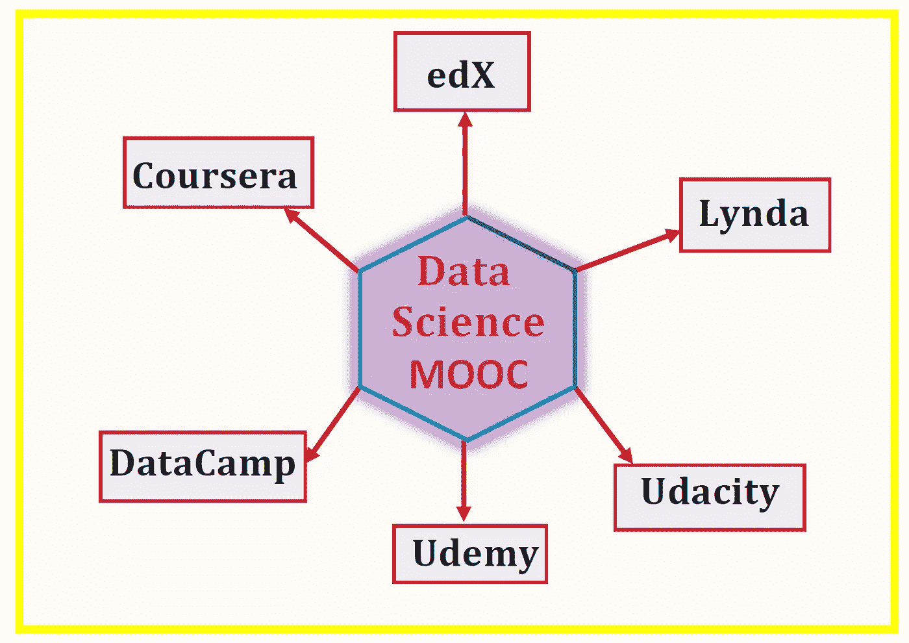

# 数据科学 MOOC 验证证书—值得吗？

> 原文：<https://towardsdatascience.com/data-science-mooc-verified-certificate-is-it-worth-it-5d60a6e574e0?source=collection_archive---------5----------------------->

大部分辅助开放在线课程都是免费的在线课程，任何人都可以注册。MOOCs 提供了一种负担得起、灵活的方式来学习新技能，推进你的职业发展，并提供大规模的优质教育体验。MOOCs 涵盖了领导力、分析、数据科学、机器学习、专业技能、工程、商业管理、人文科学、计算机科学等广泛的在线课程。这些课程通常由世界各地的顶尖大学提供，如麻省理工学院、哈佛大学、加州大学伯克利分校、密西根大学、EPFL 大学、香港理工大学、昆士兰大学等等。一些课程也由大公司提供，如 IBM、google 和微软。MOOCs 最大的优势是有机会向领导和专家学习，有特权选修世界顶尖大学的课程。最受欢迎的 MOOCs 提供商包括:

a)**EDX**:https://www.edx.org/[T5](https://www.edx.org/)

b)**Coursera**:[https://www.coursera.org/](https://www.coursera.org/)

c) **数据营**:[https://www.datacamp.com/](https://www.datacamp.com/)

丁)**乌代米**:[https://www.udemy.com/](https://www.udemy.com/)

e) **乌达城**:[https://www.udacity.com/](https://www.udacity.com/)

琳达:[https://www.lynda.com/](https://www.lynda.com/)

这些 MOOCs 提供商中，有些会让你免费旁听他们的课程，而有些则要求你获得认证证书(每门课程可能要花费 50 至 100 美元，甚至更多)。因此，自然的问题是:**我应该为 MOOC 申请认证证书吗？**

在回答这个问题之前，我先在这里提一下，我的大部分数据科学知识都是从 MOOCs 获得的。以下是我列出的 3 个最佳数据科学 MOOC 专业:

## [1。数据科学专业证书(哈佛，通过 edX)](https://www.edx.org/professional-certificate/harvardx-data-science)

包括以下课程，全部使用 R 教授(您可以免费旁听课程或购买认证证书):

1.  数据科学:R 基础；
2.  数据科学:可视化；
3.  数据科学:概率；
4.  数据科学:推理和建模；
5.  数据科学:生产力工具；
6.  数据科学:扯皮；
7.  数据科学:线性回归；
8.  数据科学:机器学习；
9.  数据科学:顶点

## [2。分析:基本工具和方法(Georgia TechX，通过 edX)](https://www.edx.org/micromasters/analytics-essential-tools-methods)

包括以下课程，全部使用 R、Python 和 SQL 讲授(您可以免费审计或购买经过验证的证书):

1.  分析建模导论；
2.  数据分析计算导论:
3.  商业数据分析。

## [**3。应用数据科学与 Python 专业化(密执安大学，通过 Coursera)**](https://www.coursera.org/specializations/data-science-python)

包括以下课程，全部使用 python 教授(您可以免费旁听大多数课程，有些课程需要购买认证证书):

1.  Python 中的数据科学导论；
2.  应用 Python 绘图、制图和数据表示；
3.  Python 中的应用机器学习；
4.  Python 中文本挖掘的应用:
5.  Python 中的应用社会网络分析。

## 为一个 MOOC 支付一个验证过的证书值得吗？

让我提供我的看法。

追求认证证书可以激励你保持专注。大多数情况下，审计学习者不会完成整个课程，也不会认真对待家庭作业。我认为你花钱买的东西是有价值的。然而，如果旁听课程可以让你接触到包括家庭作业在内的所有课程材料，并且如果你有足够的动力去完成这些作业，那么我认为旁听课程是更好的选择。在一些学科，如数据科学和其他一些专业领域，学习只能通过实践来实现，例如，你不能仅仅通过听讲座来学习编程。你必须参加家庭作业和讨论论坛，这些将帮助你发展实践技能。

如果你是某个领域的新手，你需要一些东西来展示你的知识，那么追求一个经过验证的课程可能是好的。如果你已经有了坚实的背景，而你只是对增长知识或推进职业生涯感兴趣，那么你真的不需要追求一个经过验证的证书。例如，在计算机科学、软件工程、数据科学和分析等领域，人们更关注的是你能做什么，而不是你有什么证书。因此，如果你已经有一些定量学科的背景，如物理、数学、统计和计算机科学，那么你可以旁听数据科学和分析课程，以便探索和学习该领域。展示你的工作还有其他重要的方式，比如你可以在 LinkedIn、Github、Medium 和 Kaggle 等其他平台上展示你的项目和成就。

有太多好的数据科学课程了。对于像我这样终身学习的人来说，有很多选择。如果你每次参加 MOOC 课程都想获得认证证书，你可能会花很多钱。大约 3 年前，当我开始参加数据科学 MOOCs 时，我对追求认证证书感到兴奋。今天，我更关心我能用知识做什么，而不是到处积累经过验证的证书。我总是搜索我可以旁听的课程，但这也让我可以完成家庭作业。因此，在课程结束时，我与追求认证证书的人没有任何不同，唯一的区别是一张名为认证证书的纸，每门课程的费用从 50 美元到 100 美元不等。

总之，MOOCs 为学习新技能、拓展知识和职业发展提供了独一无二的机会。在某些情况下，追求认证证书作为展示你技能的一种方式可能是值得的，但在大多数情况下，审计学习者可以获得同样的技能和经验。**始终搜索你可以免费完成的课程，只有在特殊情况下，你才应该学习经过认证的课程**。