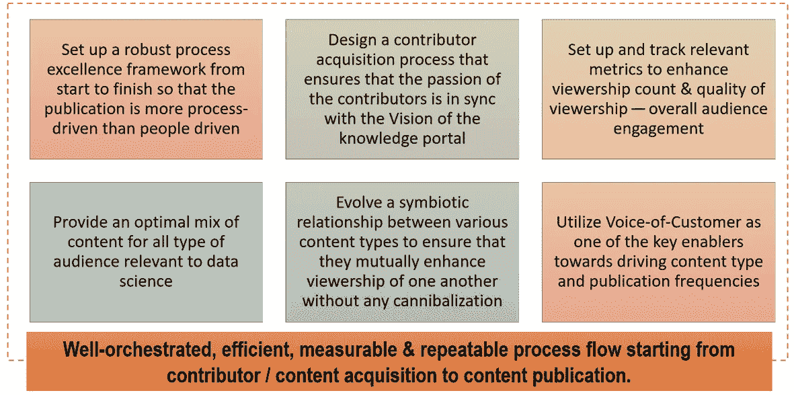
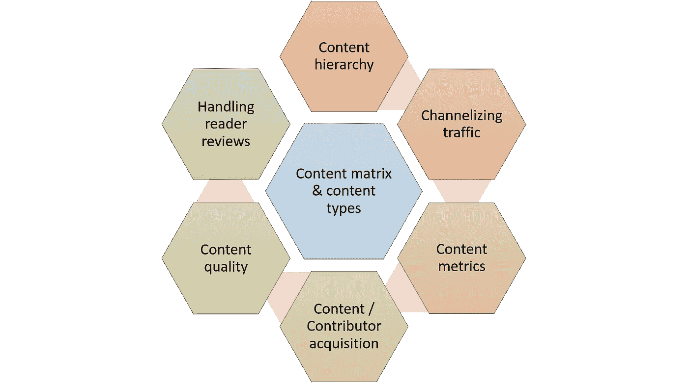
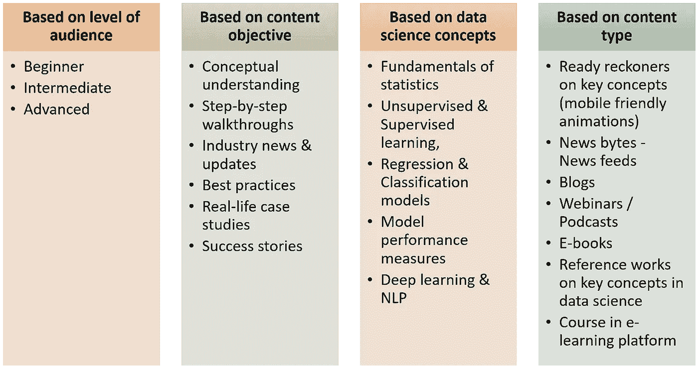
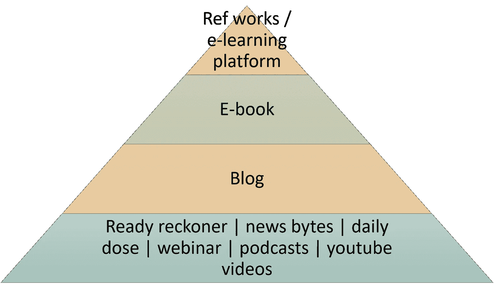
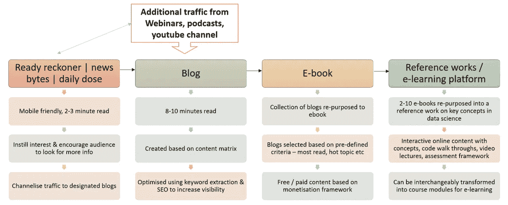
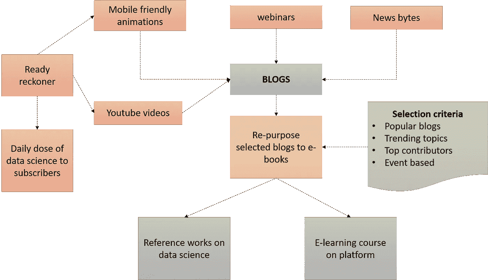
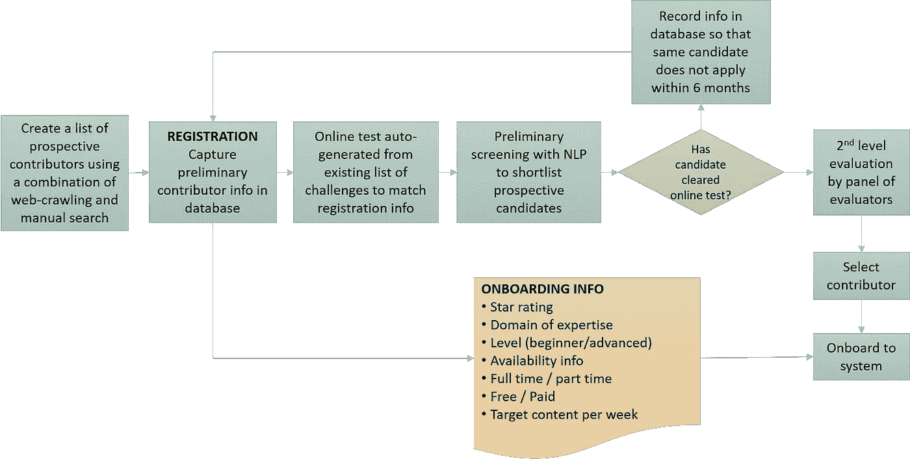
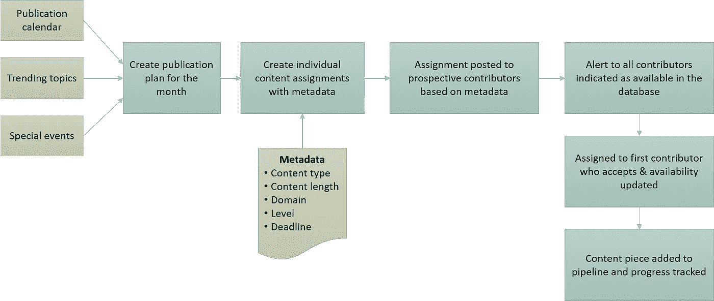
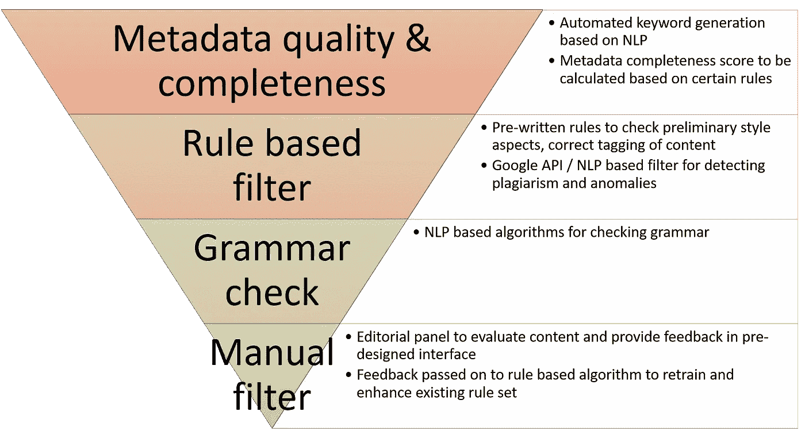
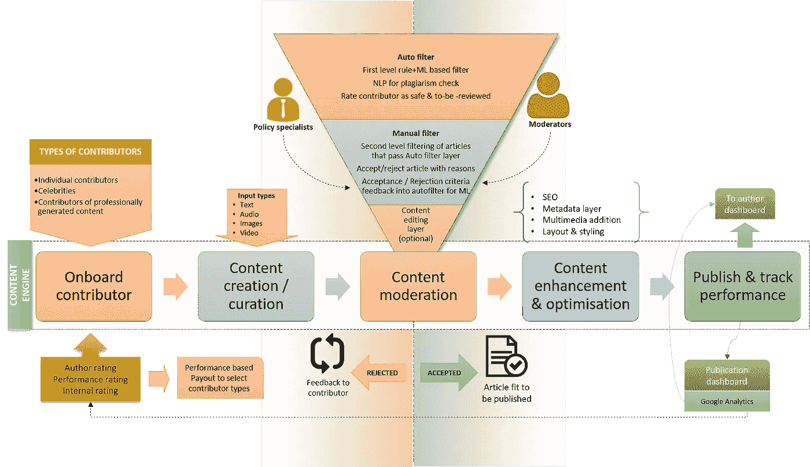

# 有效内容策略的数据科学和 NLP

> 原文：<https://towardsdatascience.com/data-science-nlp-for-an-effective-content-strategy-8e87f12246b5?source=collection_archive---------13----------------------->

## 利用流程优化、分析和 NLP 的力量来设计数据科学知识门户的内容策略

# 背景

过去几年，对数据科学和人工智能技能的需求呈指数级增长。然而，熟练数据科学家的供应并没有以同样的速度增长，从而导致需求和供应之间的巨大差距。

除了针对数据科学各个学科的结构化培训之外，由数据科学知识门户推动的全方位知识共享和增强将在很大程度上帮助弥补数据科学家的供需缺口。

知识门户的成功和有效性取决于能够在尽可能短的时间内以最佳内容质量交付的内容范围。这又取决于确定合适的内容贡献者和自动化整个内容监管过程。

# 内容战略的总体方法

设计内容策略的总体方法基于利用流程优化、分析和 NLP 的力量，通过以下方式确保内容和贡献者的质量:

Overarching approach to content strategy

# 内容战略的组成部分

以下是内容战略的组成部分:

Building blocks of content strategy

# 使用建议的内容类型构建内容矩阵

该门户将有各种内容类型的均匀组合，并将开发一个多维内容矩阵。达到内容类型的标准将对应于多维内容矩阵的每个维度。提议的标准是:

Content matrix and content types

# 内容层次&内容链中的观众流

内容层次结构是为了使观众从需要相对较少注意力的最简单的内容形式到需要更多注意力和兴趣的最复杂的内容类型无缝流动。

Content hierarchy

*   内容层次的第一层将包括内容片段，如分析中概念的每日剂量、conecpts 上的 youtube 短视频等，这些内容片段需要读者很少的阅读时间。这将有助于吸引门户网站的初始受众，并可以引导读者选择需要更长阅读时间和更长注意力的更密集的内容类型。
*   层次结构中的下一层是博客，它可以基于第一层，可以是上面提出的任何标准——针对各种层次的受众，基于各种数据科学和 ML 的概念。这些内容将被认为比第一级内容更受关注，并且通常来自第一级内容类型之一。
*   然后，可以将关于特定主题的选定博客集合合并到一本电子书中——为该集合选择文章的标准可以是关于类似主题的博客，也可以是已经被读者接受且具有高阅读率和收视率的博客。
*   下一级或最高级别的内容类型可以是关于数据科学广泛领域的广泛参考著作，其中包含关于该领域的大量文章、播客和行业发展，可以重新用作该领域的培训内容。

这样，内容层次将创建一个观众链，一个层次将读者引向下一个层次，以此类推，从而创建一个无缝的观众漏斗。

# 基于内容层次结构的内容链

内容链的灵感来自于生态系统中的食物链，它显示了从一个层次的内容到另一个层次的理想流量。

The content chain

# 内容链上的建议流量

创建内容层次结构背后的深谋远虑是从需要最少关注范围的内容开始，逐步构建需要更高关注范围的更复杂内容类型的轨迹。

下面的流程图用代表内容层次结构级别的颜色说明了跨几个级别的内容类型的建议流量。

Flow of traffic across the content chain

# 设置内容指标

设计内容指标的目的是从内容质量和受众偏好两方面评估内容的有效性。这将为编辑团队提供一种方向感，指导他们如何选择内容和投稿人。

1.  **重复查看次数与查看次数** —这表明有多少用户不止一次阅读过该内容，这意味着该内容片段被频繁引用，此处较高的比率可能意味着该内容片段可以作为参考资料。
2.  **点击数&点击率** —这是对内容质量的直接衡量，因为它表明有多少点击内容的观众阅读了完整的内容。
3.  **点赞数**——这是对内容收视率的衡量。
4.  **亮点数量&引用数量** —与第一个指标类似，这是对内容被其他作者引用的频率的衡量。它也给出了将流量导向内容片段的其他来源的度量。
5.  **跳出率** —这是来自 web analytics 的一个典型指标，表示一进入内容就离开的观众的百分比。这表明读者参与度较低。
6.  **来自读者评论的情感分析的情感分数**将提供关于内容最喜欢和最不喜欢的方面的见解。
7.  **影响因素** —最后，可以基于上面提到的几个指标的组合，为内容块开发一个综合评分，这是对内容质量和它吸引读者的程度的测量。

# 在职贡献者

能够吸引观众的高质量内容的关键是拥有一群充满激情、知识渊博的贡献者，他们能够创作出内容大师作品。雇用贡献者的核心原则是确定对写作和数据科学有着同等热情的候选人。在寻找潜在贡献者时，招聘流程应考虑以下方面:

1.  适合写作的动机
2.  将贡献者的热情与知识门户的愿景结合起来
3.  领域专业知识
4.  预计保留倾向
5.  具有不同人口统计和领域专业知识的贡献者的良好组合

基于自动和手动相结合的搜索来寻找贡献者，通常包括:

*   数据科学各个领域的行业专家/名人
*   拥有自己的博客或为其他出版物写作的当前作家
*   想要开始写作的数据科学爱好者
*   学生作家

## 贡献者选择和加入的半自动方法(行业专家/名人除外)

下图所示的方法将有助于创建一个同步且有记录的流程，用于创建贡献者管道，并在选择流程的每个里程碑获取贡献者信息。

半自动方法还将确保整个选择过程随着投稿人数量和出版物规模的增加而可伸缩，而不会引入对人的依赖性的瓶颈。

Selecting & On-boarding contributors

# 贡献者的工作分配

一旦基于上述选择过程选择了贡献者，重要的是要确保贡献者有一个持续的工作流，而不是工作不足或工作过度。随着出版物规模的增长，结构化和自动化的工作分配方法对于维护可伸缩性再次变得至关重要。

工作分配的过程应基于以下因素:

*   将要创建的内容与贡献者的域和能力相匹配
*   建立基于配置文件匹配的自动分配系统，以便内容自动分配给贡献者，而无需等待时间
*   根据贡献者的可用性和发布截止日期，为贡献者创建一个工作渠道。
*   使分配过程透明且可衡量

Work allotment to contributors

# 内容质量

贡献者创建的内容应该使用多层次的方法进行动态评估。这将是一个基于规则的算法，自然语言处理和人工编辑层的组合，具有对基于规则的算法的反馈机制，以保持一致的内容质量。这将确保保持内容质量不会成为阻碍出版周期的瓶颈。

最上面的三层是基于自动 NLP 的层，用于保持内容质量，这将在内容被传递到手动过滤器之前对其进行相当程度的过滤，从而减少手动工作，进而减少对人的依赖。此外，来自人工层的反馈将用于增强 NLP 层的学习，从而日益加强自动化质量层。

Multi-layer content quality filtering

# 处理读者评论

任何商业冒险只有在能够倾听客户意见并根据客户反馈勤奋工作时才是成功的。这有利于门户发展成为由客户声音驱动的以受众为中心的门户。阅读读者评论和回答读者问题对维持这方面很重要。这可以通过 NLP 层和手动层的组合来实现，以确保其可扩展性。

1.**读者评论的文本挖掘**标记高度批评的评论或不满意的读者，以及自动升级机制，以便此类评论引起相关利益相关方的注意

2.**一个聊天机器人或 Q &一个基于 RNN** 设置的层，用来回答读者的问题。聊天机器人无法回答的问题可以转发给人类代理，答案可以反馈给聊天机器人进行学习。

# 提议的高级流程

考虑到整体内容策略中讨论的所有方面，建议采用以下包含内容策略所有方面的高级流程:

End-to-end workflow of knowledge portal

# 结束语

基于流程优化、NLP 和数据科学概念的各个方面发展的内容策略将为知识门户带来优化且可靠的内容流。最后，这样的策略也加强了知识门户在“ ***实践所宣扬的*** ”方面的理想。