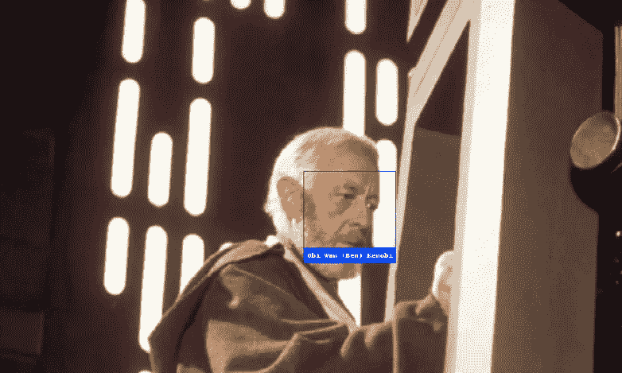

# 死星上的数据科学

> 原文：<https://towardsdatascience.com/data-science-on-the-death-star-af80c9b34d6e?source=collection_archive---------45----------------------->

## 改善帝国的生活，一次一个 DS 项目

Photo by [Agnieszka Kowalczyk](https://unsplash.com/@koalamoose?utm_source=unsplash&utm_medium=referral&utm_content=creditCopyText) on [Unsplash](https://unsplash.com/s/photos/star-wars?utm_source=unsplash&utm_medium=referral&utm_content=creditCopyText)

数据科学不是魔法(就此而言的力量)。作为一个对该领域真正感兴趣的人，我经常被其他人警告，并读到关于在组织中采用数据科学的复杂世界。有很多这样的故事:一个地方雇用了一名数据科学家，因为他们被告知这是一件很酷的事情，失望随之而来，因为缺乏理解，数据科学家需要重新工作。很明显，有时角色会出现脱节。

我对这个角色的简单定义是:数据科学家在那里分析和解释数据，以构建业务解决方案。这是一项需要情境化、问题框架化、实验设计和数据收集的工作，以制定使事情变得更好的解决方案。你可以自由地搜索无数的维恩图，这些图可能会更深入地挖掘所需的技能和知识，但本质上是业务理解、统计数据和编程知识放在一个高高的搅拌机中。

我经常收到朋友关于数据科学可以做什么的问题，这有时很有挑战性，因为它可以根据组织的工作环境而有很大的不同。如果你在网飞，你可能会用大数据来测试推荐算法。如果你在易贝，你可能正在开发上市欺诈监控工具。如果你在苹果公司工作，你可能会对用户拍摄的照片进行物体识别。正如每个企业都有不同的需求一样，他们对数据科学的使用和需求也是如此。

我绝不是专家，但让我们通过一个例子来思考，看看想到了什么类型的解决方案:

## 恭喜你，你现在是帝国雇佣的第一个数据科学家！

他们有很好的福利，很高的薪水，旅行也很棒。皇帝已经派你到总部，死星，来帮助建设，看看是否有你能帮忙的任务。为了帮助构建问题，你需要从 [CRISP-DM](https://www.sv-europe.com/crisp-dm-methodology/#businessunderstanding) 开始，并从员工那里获得一些业务理解。你以前从未在多泪星系的统治机构工作过，所以和其他人交流一下，看看你能在哪些地方帮上忙是很好的。

## 死星枪手

> “也许我们可以找到一种方法来更好地在一个星球上自动点火，这样我就不必承受我对这样做感到的难以置信的内疚和厌恶”

哇哦。那是粗糙的。有没有办法进一步自动化发射摧毁一颗巨大星球的超级激光？有可能，但由于启动指令来自简单的人工指令，我认为增加人工监督可能是有意的。仅仅因为一些事情可以自动化并不意味着它们需要自动化，确保星球毁灭命令的正确执行可以使用个人方法。对计算过程的任何改变更可能是纯粹的工程改进。也许换了部门？

## 莫提上将

> “我想我们可能有一个叛军间谍正在发送我们的计划。你能怎么办？”

那听起来是一个相当严重的问题！我们可能还有一个现有的数据源可以使用:通信日志。因为我们是帝国，这里没有秘密，我们可以收集尽可能多的基地对外通讯的数据。我们首先需要对这些通信数据有所了解，也许看看我们是否发现了任何不正常的情况，比如员工在预定的值班时间发送信息，在非正常时间发送信息，任何包含图表附件的信息，或者任何发送给已知敌人的信息(rebelalliance.org 的电子邮件是一种常见的密报)。如果我们仍然没有找到足够的内容，我们可以对实际文本进行更多的评估，或者只是通过搜索特定的关键词或短语，甚至是情绪来寻找气馁的员工。如果我们想要监控未来的消息，我们可以建立一个模型来搜索特定的标准(基于我们在研究中发现的)，并在潜在的违规者出现时提醒我们！

## 皮特上将

> “我需要确保我们不会让持有旧密码的人穿过我们的防护罩。我的脖子在危险中，哈哈哈，但是说真的。我见过。”

是的，我听说这可能是个问题。我会假设，因为你轻率地允许旧代码，除了一些手写的便利贴之外，没有管理它们的正式系统。这可能不是我们可以做好分析的地方，但是我们可以考虑为代码管理创建一些组织，也许通过组织一个新的数据库。我们可以作为一个团队，与工程一起工作，来理解代码应该如何组织，并提出一个适当的系统。我们可以创建代码使用报告，让每个人都知道什么是可接受的。如果我们对代码的使用有了足够的了解，我们可以研究一些其他的解决方案来自动化这个过程，但是听起来我们还有很长的路要走。

## 大总督塔金

> "我担心绝地登船会严重危及我们的安全系统."

你可以拥有所有你想要的帝国冲锋队，但是如果他们落入绝地的心灵诡计，那还有什么意义！？维护基地安全肯定是一个关键的优先事项，我认为我们可能有一些选择。或许用一些摄像头，我们可以利用面部识别来提防讨厌的绝地。如果我们收集任何已知绝地的一些图像，我们可以训练一个模型来寻找确切的人，并警告我们他们是否在空间站上。举个例子，让我们以欧比万·克诺比这个角色为例，对他进行训练，因为我很确定他是唯一的幸存者。下面是一个例子，如果他出现了，我们可能会发现什么:

这将花费我们一些时间和计算能力，但我认为这是可能的。

## 奥泽尔上将

> “我希望有一个系统能够自动向高层管理人员提供关键更新，而不会被扼杀”

对不起，奥兹尔。与他人打交道，尤其是那些有超自然窒息能力的人，是工作的一部分。沟通，尤其是团队内部的沟通，不是可以自动消除的。我们可以更多地讨论你的团队如何沟通，看看是否有系统可以设置到位，使更新更加透明，但你必须处理与其他人的工作。如果你感到害怕，我建议和人力资源部谈谈，但我觉得他们也帮不了你。

## 达斯·维达

> “我想系统地消灭所有反抗帝国的人，这样我就可以停止杀戮五分钟，坐在那里感受我生活中发生的事情带来的情感冲击。”

这是可以理解的令人沮丧的是，这种反叛的事情是如此经常。我不认为有找到所有叛军联盟的灵丹妙药，但我们可以在信息中寻找趋势，看看我们是否能帮助缩小找到他们的范围。我们可以查看过去叛军基地的数据，找出尽可能多的位置细节(气候、太阳系、与以前基地的距离等。)和资源(有多少叛军，火力类型等。)，看看我们是否能找到任何有帮助的趋势。如果看起来我们能找到一个足够清晰的模式，我们也许能进一步研究创造一个模型，根据最近发现的基地，可以估计他们下一步可能去哪里。

如您所见，数据科学解决方案并非万能，但如果可能，您可以做一些惊人的工作来改善组织的运营方式。