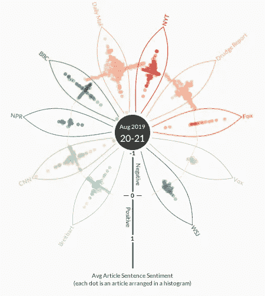

# 数据科学解释为什么阅读新闻会让你紧张

> 原文：<https://towardsdatascience.com/data-science-on-why-reading-the-news-might-stress-you-out-11281dbbe445?source=collection_archive---------16----------------------->

Visualization of individual articles published by each news source over roughly one day (Aug 20th–21st 2019 because timezones). Code for generation below.

最近在准备一篇关于新闻媒体语言模式的论文时，我发现自己通读了我的神经网络处理过的许多文章，试图通过具体故事的镜头来理解它的发现。看过许多不同来源的文章，消化了来自不同政治派别的观点，我可以第一手证实，阅读新闻是令人疲惫的，因为每时每刻都感觉它表达了一种持续的紧迫感。

从数据开始，“情绪”大致指的是一段文本中单词的积极或消极程度。在这篇文章的上下文中，文本是新闻机构的 RSS 源中看到的文章“描述”(通常是文章本身的片段或出版商网站上看到的简短预览/摘要文本)。通过 [TextBlob 的](https://textblob.readthedocs.io/en/dev/)自然语言处理情感模型赋值，值-1 表示能得到多负面，1 表示能得到多正面，0 表示中性。值得注意的是，情绪可能是上下文相关的(且有细微差别)，因此在这种情况下，极性的大小可能比方向更重要，而且，由于情绪模型不是特定于新闻媒体的，因此计算并不完美。尽管如此，如上面的可视化所示，一些机构在文章情感上看到了不同的分布，有些像 Vox 或《华尔街日报》非常狭窄(更中性的情感)，而其他像《每日邮报》或 CNN 则探索语言光谱中更“两极”的部分。这不是对任何机构的批评，也不是对更多极性词汇选择的必要性的评论，但它强调了，鉴于当天的新闻，不仅不同机构对世界的报道比其他机构更“激烈”(就词汇选择而言)，而且，在随机的一天里，人们可以*在整个媒体领域经历*许多极端的情绪极性。事实上，对一个随机月份(六月)的快速分析表明，在每一天，范围往往很广，许多天至少看到一篇平均句子极性为 1 或-1 的文章。

Most days of June 2019 saw a wide sentiment polarity range across the 10 news agencies examined (listed in the visualization above).

也许我们确实生活在一个大加速的时代，关键时刻总是发生，但另一方面，持续的极端极性可能会带来麻烦，因为，[正如乔恩·斯图尔特观察到的](https://en.wikiquote.org/wiki/Jon_Stewart)，“如果一切都被放大，我们什么也听不到。”话虽如此，这一分析将新闻中的两极分化引起的焦虑置于[的背景中:数据证实，至少部分媒体确实沉浸在情绪高涨的长期状态中，因为它看到了尖锐的语言，所以可以理解新闻如何引起担忧。我还不确定该怎么办，尽管通过你的媒体消费习惯来批判性地审视你所接触到的语言的“极性”是值得的。然而，就像我看到勾勒出这一景观的趋势的经历一样，我希望你看到这些数据时能有一种洞察力，甚至是冷静。](https://www.nbcnews.com/better/health/what-headline-stress-disorder-do-you-have-it-ncna830141)

【https://github.com/sampottinger/news_flower】*[*的代码和数据。文章经过编辑，以帮助读者更好地理解使用现有情感模型的局限性。*](https://github.com/sampottinger/news_flower)*