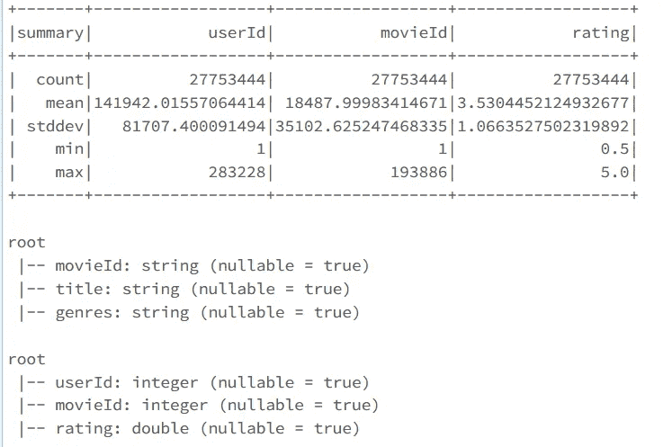
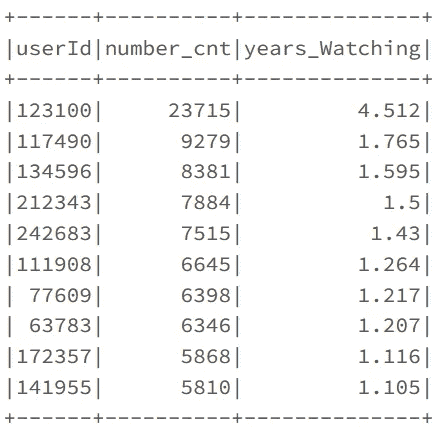
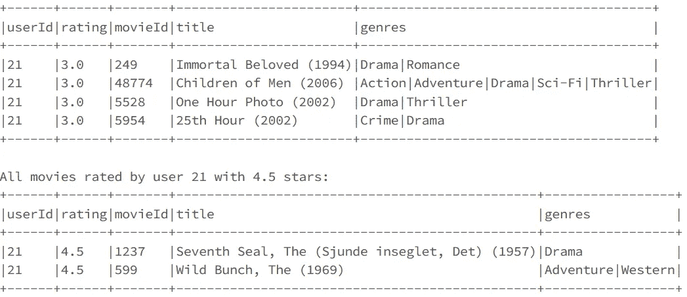
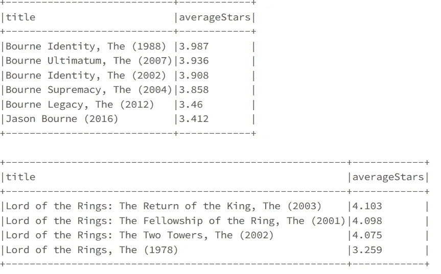
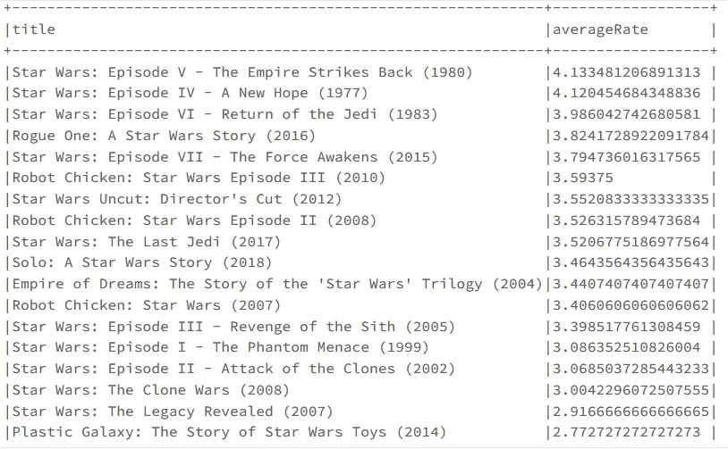
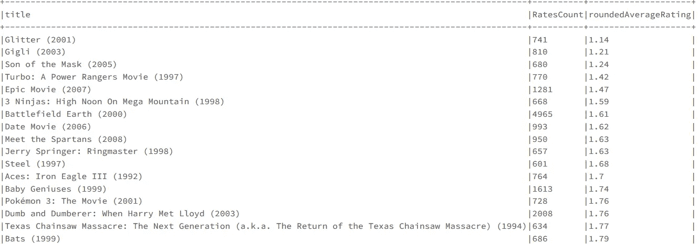
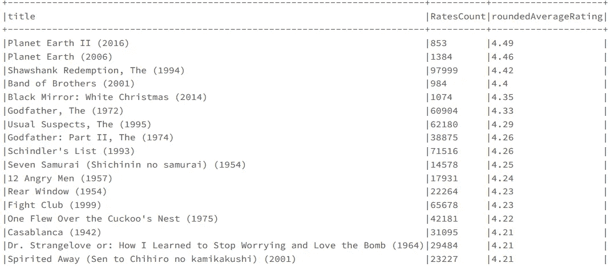
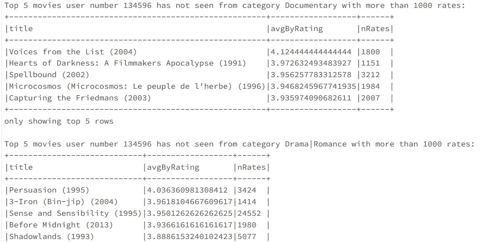
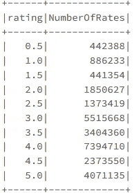
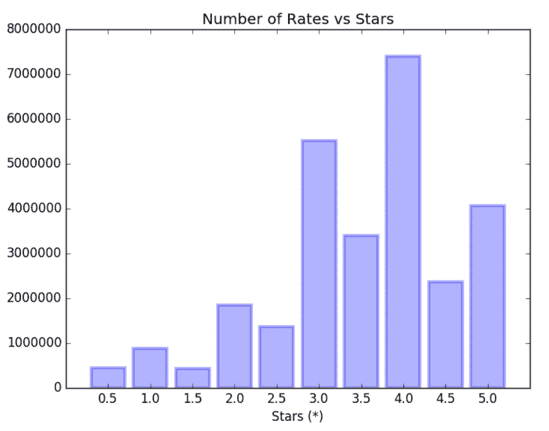

# 使用 Spark、Scala 和一些 SQL 对电影数据集进行数据科学分析。和一些蟒蛇。(第一部分)。

> 原文：<https://towardsdatascience.com/data-science-over-the-movies-dataset-with-spark-scala-and-some-sql-and-some-python-part-1-f5fd4ee8509e?source=collection_archive---------6----------------------->

## ***Spark SQL*** *是一个用于结构化数据处理的* ***Spark*** *模块。它提供了一个名为 DataFrames 的编程抽象，也可以作为一个分布式的****SQL****查询引擎。让我们在数据块上使用它来对电影数据集执行查询。*


Photo by [Jake Hills](https://unsplash.com/@jakehills?utm_source=medium&utm_medium=referral) on [Unsplash](https://unsplash.com?utm_source=medium&utm_medium=referral)

一天，我的一位 SQL 开发人员朋友告诉我，她对大数据处理引擎感兴趣，但除了 SQL 之外，她没有任何其他编程语言的经验。我想向她展示，了解 SQL 是学习大数据的良好起点，因为借助 Spark，可以对表执行平面 SQL 查询，而且其代码 sintax 与 SQL 类似。我希望你喜欢这个故事。

为了证明这一点，我执行了一些查询和描述性统计，以从一个奇特的数据集**电影镜头数据集**中提取洞察力，该数据集**可在【https://grouplens.org/datasets/movielens/】[](https://grouplens.org/datasets/movielens/)**的**上获得，包含了超过近 3 万部电影的不同用户的大量评分。该报告可能有助于了解如何进行聚合和执行基本的 spark 查询。我既不是 Spark 专家，也不是 Scala 专家，所以代码可能不会以最有效的方式实现，但我不会停止学习，我非常欢迎建议和评论。**

**当我们想要学习大数据并在 Hadoop 生态系统上使用 Scala 的 **Spark 时，我们面临的最大问题之一**总是安装和集成来自这些框架的所有工具。然而， **Databricks 社区版**将把我们从那个问题中解救出来。实际上，它拥有我们需要使用的一切:它自己的文件系统，以及我们将要使用的所有已安装(并正常工作)的 API(**Hive 与 Spark 和 Scala** 以及其余的 Spark 库如 MLlib 或 Graphx 很好地集成)。为了不让这篇文章写得太长，我将不涉及那些技术，但是关于的好文档可以在他们的网站上找到:[**https://databricks.com/spark/about**](https://databricks.com/spark/about)。**

****

**本文的主题不是数据块的使用，而是电影数据集**(统计、查询、聚合…)** 上的 **scala-Spark 编码**。**一些查询将在 SQL 中显示它们的等价物。Databricks 还将允许我们管理这个巨大的数据集，它可能适合我们本地机器的内存。Spark 将为我们提供处理数据的有效方法。****

****

# **1)导入数据**

**第一步也是必要的一步是下载两个**长格式数据集**，它们在新研究的推荐部分。之后，我们必须**将它们导入 databricks 文件系统，然后将它们加载到 Hive 表**。现在我们可以对两个数据集/表执行一些基本的查询，一个是关于电影的信息，另一个是关于电影的价格。**描述和打印模式方法**总是一个很好的切入点:**

```
**val movies = table("movies")
val ratings = sql("select userId, movieId, rating from ratingsB")
ratings.describe().show
movies.printSchema
ratings.printSchema**
```

****

# **2)执行一些查询和知识提取。**

**为了改进我们的 spark 编码，我们可以执行任何我们能想到的带有学习目的的查询。首先，让我们检查对电影评分最多和最少的用户:**

```
import org.apache.spark.sql.functions.count
import org.apache.spark.sql.functions.{desc,asc} **ratings.groupBy("userId").agg(count("*").alias("number_cnt"))
.orderBy(desc("number_cnt"))** **ratings.groupBy("userId").agg(count("*").alias("number_cnt"))
.orderBy(asc("number_cnt"))**
```

**等价的 sql 查询(重要的是要注意，只要我们可以，我们应该用 spark 编写这个**查询，因为它会像纯 SQL 查询**一样在编译时给我们带来错误和运行时带来错误**，以避免将来浪费时间，特别是在大型进程上):****

```
**sql("select userId, count(*) from ratingsB group by userId order by count(*) desc")**
```

**有一些用户评价了超过 5000 部电影！！这太疯狂了。**

**这让我想知道他们看电影花了多长时间**考虑到电影 100 分钟的平均时间。**这个结果值得展示！！一些查询将被打包到函数中，以便在我们想要/需要它们时使用，甚至在笔记本的不同单元或部分代码中使用:**

```
**ratings.groupBy("userId").agg(count("*").alias("number_cnt")).withColumn("years_Watching", round($"number_cnt" * 100/ 60 / 24 / 365,3)).orderBy(desc("years_Watching")).show(10)**
```

****

**我们可以看到，**用户数 123100 花了超过 4.5 年的时间看电影**和**看了超过 20000 部电影**。真是个电影迷！！关于代码，它有一些有用的方法，比如一个适当的 gropuBy agregation 和一个 count，这个 count 和 round 函数一起应用于用。带列(因为我们不需要那么多小数火花显示)。现在，我们将连接两个数据帧，将所有信息放在一个 df 中进行处理:**

```
**val df_full = ratings.join(movies, $"ratingsb.movieId" === $"movies.movieId").drop($"ratingsb.movieId")**
```

**你有兴趣知道哪些电影被影迷评为 3 星或 5 星吗？我们可以知道，这个函数接收一个 **scala 整数序列**作为输入，以及我们想要查询的星星数和我们要查询的用户数。如果 seq 为空，将显示该用户评价的所有电影(使用 scala **检查)。isEmpty** 方法):**

```
import org.apache.spark.sql.functions.{asc, desc}**def movie_query (df: org.apache.spark.sql.DataFrame, stars: Seq[Double], user: Int ) : Unit = 
{
 if (stars.isEmpty)
 {
 println(s"All movies rated by user $user")
 df.filter(df("userId") ===user).orderBy(desc("rating")).show(20, false)
 }
 else 
 stars.foreach(starsNum =>{ 
 println(s"All movies rated by user $user with $starsNum stars:")
 df.filter(df("userId") === user).filter(df("rating") === starsNum).orderBy(asc("movieId")).show(7, false)})
}** movie_query(df_full, Seq((3.0, 4.5), 21)
```

****

**通常，我们都会从朋友和家人那里得到很多电影推荐，我们会把这些电影列一个清单。在那之后，当我犹豫应该先看哪部电影时，我总是去 filmaffinity 或 imdb 查看我列表中评价最好的电影。原来我们也可以做类似的事情。要做到这一点，我们需要获得电影的平均评级，并按照从最好到最差的评级对它们进行检索。值得注意的是，一个优秀的电影搜索者可能不会收到电影的确切名称，这可以用 scala contains 方法解决:**

```
import org.apache.spark.sql.functions._**def movie_grade (df: org.apache.spark.sql.DataFrame, movie: String ) : Unit = df.filter((df("title").contains(movie))).groupBy("title").agg((round(avg($"rating"),3)).as("averageStars")).orderBy(desc("averageStars")).show(false)**
```

**我们将在两个著名的传奇故事上测试我们的功能:**

```
movie_grade(df_full, "Wild Bunch")
movie_grade(df_full, "Lord of the Rings")
```

********

**Photo by [Thomas Schweighofer](https://unsplash.com/@thomasschweighofer_?utm_source=medium&utm_medium=referral) on [Unsplash](https://unsplash.com?utm_source=medium&utm_medium=referral)**

**耶！我们爱魔戒！评分最低的电影对应的是我还没看过的动画版。**

****

**阿拉贡和两个哈比人在指环王动画电影中。**

**我相信也有很多星战迷，所以让我们用类似的 SQL 查询得到所有电影的分数:**

```
**sql("Select title, avg(rating) as averageRate from full_movies where title like '%Star Wars%' group by title order by averageRate desc").show(false)**
```

********

**Photo by [Daniel Cheung](https://unsplash.com/@danielkcheung?utm_source=medium&utm_medium=referral) on [Unsplash](https://unsplash.com?utm_source=medium&utm_medium=referral)**

**正如我们所看到的，老电影是最好的评级，但在我看来，前 3 集并没有那么糟糕，得分低于 3.5 星。但那只是观点！！我们还获得了一些衍生产品和平行电影，对《星球大战》迷来说也很有趣。**

**我想知道的下一件事是哪些是收视率最高和最低的电影。由于这是一个相当大的数据集，它包含了大量可视化效果差的电影，其中一些电影的评分低于 5 分。当然，如果我们想做一个连贯的研究，我们应该忽略那些电影。我只会关注那些收视率超过 600 的电影，这代表了总收视率的 1%(完全不是主流电影)。为此，我们将创建一个新的数据框架，其中包含每部电影的总评分和平均评分。之后，我们将筛选出超过 600 个评分的电影，并按其平均评分以升序和降序的方式显示，以检查最差和最好的电影。**

```
**val df_count = df_full.groupBy("title").agg(avg("rating").as("averageRating"), 
count("title").as("RatesCount"))** **df_count.withColumn("roundedAverageRating", round(df_count("averageRating"),2)).filter(df_count("RatesCount") > 600).orderBy(asc("averageRating")).drop("averageRating").show(20, false)** **df_count.withColumn("roundedAverageRating", round(df_count("averageRating"),2)).filter(df_count("RatesCount") > 600).orderBy(desc("averageRating")).drop("averageRating").show(20, false)**
```

****

**收视率超过 600 的排名最低的电影。**

**如你所见,《闪光》是最差的电影。我在 imbd 上搜索过，确实看起来很恐怖:**

****

**现在好的部分来了，注意列表的头:**

****

**这也是其在 imdb 上评级的结果:**

****

# **3)推荐系统(一)**

**这个数据集对于改进和理解推荐系统是如何工作的是完美的。我正在使用 spark 机器学习库 **MLlib** 研究推荐系统的机器学习模型，它们将在下一篇文章中展示。我刚刚提出了一个简单的解决方案，只需要执行一个大的查询。这是一个简单的模型，可以作为虚拟解决方案。解决方案是关于**检索用户观看最多的类别，并从用户尚未观看的类别中输出评价最高的电影。**这是一个打包到 **easy_recommender** 函数中的更复杂的查询，该函数将接收我们想要推荐的用户数量、我们将对一部电影使用的作为最小阈值的数量或比率(请记住，从统计的角度来看**不是检索只有一点比率的电影的好做法**)以及我们想要显示的电影数量。这些是我们将要遵循的步骤:**

1.  **获取用户 X 看到最多的类别。要做到这一点，我们需要根据用户进行过滤，根据类型进行分组，进行计数，然后根据计数进行排序。一旦有了这些，我们只需选择“流派”列并用 map 映射该列，然后执行一个收集操作，然后使用:。**map(r =>r . getstring(0)). collect . to list .****
2.  **之后，我们将使用一个新列“ToDelete”来标记用户 X 看过的电影，该列包含一个简单的字符串，例如“Delete ”,一旦我们执行连接，就可以很容易地找到它。这样我们就可以很好地识别用户 X 看过的电影。**
3.  **我们将把那个数据帧和大数据帧连接起来。我们想忽略的电影标有“删除”(所以我们会用**过滤掉那一栏为空的。过滤器(" ToDelete 为空")**)。**
4.  **最后，我们将使用 foreach scala 方法遍历我们想要过滤的类别，现在我们已经选择了用户 X 没有看过的电影。现在，我们只需按标题分组，获得平均评分，再一次按电影筛选出 Y 个以上的评分(记住，出于统计原因)，并按平均评分降序排列。**

**这是一个有点复杂的过程，我相信有更好的方法来做这件事。在这里你可以看到代码:**

```
**def easy_recommender(nUser: Int, nRates: Int, nMovies: Int) : Unit = {
 val mostSeenGenresList = df_full.filter(df_full("userId") === nUser).groupBy("genres").agg(count("*").alias("cuenta")).orderBy(desc("cuenta")).limit(3).select("genres").map(r => r.getString(0)).collect.toList
 println(s"List of genres user $nUser has seen the most : $mostSeenGenresList")** ** val movies_watched_by_userX = df_full.filter($"userId" === nUser).withColumn("ToDelete", lit("DELETE")).select($"ToDelete", $"title".as("title2"))** **var df_filt = df_full.join(movies_watched_by_userX, $"title" === $"title2", "left_outer")** **df_filt = df_filt.filter("ToDelete is null").select($"title", $"rating", $"genres")** **mostSeenGenresList.foreach(e => {
 println(s"Top $nMovies movies user number $nUser has not seen from category $e with more than $nRates rates: ")** **df_filt.filter($"genres" === e).groupBy("title").agg(avg("rating").as("avgByRating"), count("*").alias("nRates")).filter($"nRates" > nRates).orderBy(desc("avgByRating")).show(nMovies, false)
 })
}** easy_recommender(134596, 1000, 5)
```

**我们从“推荐系统”获得的结果用 scala **字符串插值:**打印出来**

****

**你可以看到，首先我们打印出用户 X 看到最多的类别。我们可以通过**控制要推荐的类别数量。**极限③法。正如你所看到的，我们可以通过函数的输入来控制我们想要包含在模型中的大多数参数。**

# **4)可视化时刻**

**总之，如果没有适当的可视化/绘图，这**就不是一部好的数据科学作品。为了实现这一点，Python 总是一个很好的选择，我将向你展示 databricks 的另一个精彩特性，它允许我们在同一个笔记本上运行 **Python 和 Scala 代码。******

**第一步是将我们的 df_full 保存到一个**临时配置单元表**(它只在当前会话期间持续存在):**

```
**val ratesDF = df_full.select("rating").groupBy("rating").agg(count("rating").as("NumberOfRates")).orderBy(asc("rating"))
** 
**ratesDF.createOrReplaceTempView("ratedDF")
spark.sql("select * from ratedDF").show**
```

****

**现在是魔法降临的时刻了。只需在单元格顶部键入 **%python** ，我们就可以执行具有所有 Spark (pyspark)优势和特性的 python 代码。我们**将表加载到 pyspark 数据帧中，并使用这些 **Python 命令行程序**将两列转换成 Python 列表**:**

```
%python**df = table("ratedDF")
rating_list = df.select("rating").collect()
number_rates = df.select("NumberOfRates").collect()
rate_category = [float(row.rating) for row in rating_list]
n_rates = [int(row.NumberOfRates) for row in number_rates]**
```

**最后，我们将使我们的视觉化。这是一个完全自由式的过程，一些情节会比其他的更漂亮。记住**分类变量**应该用**条形图**表示:**

```
%python
import matplotlib.pyplot as plt
import numpy as np**fig, ax = plt.subplots()
ax.bar(rate_category, n_rates, align='center', width=0.4, facecolor='b', edgecolor='b', linewidth=3, alpha=.3)
plt.title('Number of Rates vs Stars')
plt.xlabel('Stars (*)')
plt.xlim(0,5.5)
plt.ylim(0,8000000)
ax.set_xticks(rate_category)
display(fig)** 
```

****

**除了**没有 0 星的电影**以及**看起来不像人们预期的那样是正态分布**之外，没有太多评论。**

# **5)总结**

**这就是所有的人。我希望你和我一样喜欢这篇文章，了解 scala、spark 和 Databricks，思考关于电影数据集的见解。现在我正在使用 spark 的机器学习库 **Spark MLlib 在这个数据集上实现和改进推荐系统的性能**。在未来的文章中，这些模型可能会与数据集上更复杂的查询和描述性统计一起显示。我玩了一会儿流派专栏，获得了更深入的统计数据，但我不希望这篇文章过于密集。**

**由于这是我的第一篇文章，再次感谢任何反馈和评论。**

****

**Photo by [Gwen Ong](https://unsplash.com/@gwenong?utm_source=medium&utm_medium=referral) on [Unsplash](https://unsplash.com?utm_source=medium&utm_medium=referral)**

***原载于 2019 年 7 月 23 日*[*https://medium.com*](https://medium.com/@borjagg042/some-data-science-on-the-movies-dataset-with-spark-scala-and-some-sql-and-some-python-part-1-b52ec62b04c1)*。***