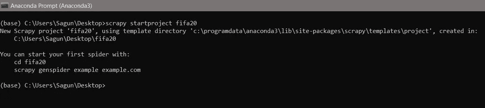

# 使用 Scrapy 构建自己的数据集

> 原文：<https://towardsdatascience.com/data-science-pipeline-part-1-obtaining-data-from-web-using-scrapy-fe0ad9963d84?source=collection_archive---------17----------------------->

## 了解如何构建自己的数据集，并将其用于数据科学和分析


Photo by [Markus Spiske](https://unsplash.com/@markusspiske?utm_source=medium&utm_medium=referral) on [Unsplash](https://unsplash.com?utm_source=medium&utm_medium=referral)

# 数据科学管道

*   获取数据(在本文中讨论)
*   数据清理
*   探索/可视化数据
*   数据建模
*   解释结果

几乎每个数据科学家都面临的一个常见问题是收集数据。虽然有很多网站可以找到[这篇文章](/top-10-great-sites-with-free-data-sets-581ac8f6334)中提到的数据集，但这总是不够。有时，构建自己的数据集是一条可行之路。另一方面，尽管 web 是一个巨大的数据源，我们只需要知道如何有效地挖掘它。在本文中，我将带您了解使用 [Scrapy](https://scrapy.org/) 从 web 抓取数据的过程，这是一个用 Python 编写的强大的 web 爬行框架。

如果你想直接进入代码，就去看看这个 [github repo](https://github.com/sagunsh/sofifa) 。

# 数据源

国际足联 20 名球员的排名出来了，作为一个狂热的足球爱好者，我发现这样的数据很吸引人。你可以在 [sofifa](https://sofifa.com/?col=oa&sort=desc) 上找到这些数据。我们将抓取数据，并使用 Scrapy 将它们保存在 csv 文件中。

# 安装和设置

在这篇文章中，我将使用 Python 3 和 Scrapy 1.7。对于 Linux 和 Mac，使用以下命令通过 pip 安装 scrapy 相当简单:

```
pip install Scrapy  # or pip3 install Scrapy
```

Windows 用户需要安装 Anaconda。你可以在这里找到安装说明。安装 Anaconda 后，打开 Anaconda 提示符并键入以下命令来安装 Scrapy:

```
conda install -c conda-forge scrapy
```

# 创建项目

一旦我们的系统中有了 Scrapy，下一步就是创建一个项目。打开终端/anaconda 提示符并键入

```
scrapy startproject fifa20
```



starting scrapy project

默认情况下，Scrapy 会在`fifa20.`中创建一堆文件和目录


inside fifa20 project

在`fifa20`里面，你会发现另一个`fifa20`文件夹，里面包含了我们所有的代码。`spiders`目录包含负责从网络中提取数据的 Scrapy spiders。一般来说，每个蜘蛛负责抓取一个特定的网站。一个 scrapy 项目可以有多个蜘蛛。例如，如果你正在创建一个价格监控系统，你可能想要抓取多个网站，如亚马逊、沃尔玛、新蛋等。每个网站都有一个专门的蜘蛛来处理抓取逻辑。

包含项目的设置，例如运行多少个并发线程，两个请求之间的延迟，使用哪个中间件或管道。

对于这个项目，我们将设置一个真实的用户代理。继续在`settings.py`中更改这些变量。

您的`settings.py`文件看起来会像这样

```
BOT_NAME = 'fifa20'SPIDER_MODULES = ['fifa20.spiders']
NEWSPIDER_MODULE = 'fifa20.spiders'# Crawl responsibly by identifying yourself (and your website) on the user-agent
USER_AGENT = 'Mozilla/5.0 (Windows NT 10.0; Win64; x64) AppleWebKit/537.36 (KHTML, like Gecko) Chrome/76.0.3809.132 Safari/537.36'# Obey robots.txt rules
ROBOTSTXT_OBEY = True
```

查看 [Scrapy architecture](https://doc.scrapy.org/en/latest/topics/architecture.html) 探索更多关于中间件、物品、管道和其他设置的信息。

# 创建蜘蛛

要创建一个蜘蛛，导航到外部的`fifa20`项目目录并键入

```
scrapy genspider sofifa sofifa.com
```

这将在`spiders`目录中创建一个名为 sofifa 的蜘蛛。这是文件的样子

```
# -*- coding: utf-8 -*-
import scrapyclass SofifaSpider(scrapy.Spider):
    name = 'sofifa'
    allowed_domains = ['sofifa.com']
    start_urls = ['[http://sofifa.com/'](http://sofifa.com/')] def parse(self, response):
        pass
```

让我们试着理解这是怎么回事。

*   `SofifaSpider`是 spider 类，它继承了包含我们所有抓取代码的`scrapy.Spider`。
*   命令中使用的蜘蛛名称是`sofifa`。我们稍后将使用它从命令行运行蜘蛛。
*   `allowed_domains`包含蜘蛛爬行的域列表。在这种情况下，蜘蛛只抓取 sofifa.com 域名的网址，而忽略其他网址。这有助于我们限制爬虫仅爬行期望的域。
*   `start_urls`包含一个 url 列表，蜘蛛使用它作为初始 URL。
*   `parse`方法是一个回调函数，默认情况下在爬取`start_urls`中的 URL 后调用。
*   `parse`(或任何回调)方法接收包含下载网页的响应对象。

我们将使用以下网址作为我们的起始网址

```
start_urls = ['[https://sofifa.com/?col=oa&sort=desc&showCol%5B%5D=ae&showCol%5B%5D=hi&showCol%5B%5D=wi&showCol%5B%5D=pf&showCol%5B%5D=oa&showCol%5B%5D=pt&showCol%5B%5D=bo&showCol%5B%5D=bp&showCol%5B%5D=jt&showCol%5B%5D=vl&showCol%5B%5D=wg&showCol%5B%5D=rc&showCol%5B%5D=wk&showCol%5B%5D=sk&showCol%5B%5D=aw&showCol%5B%5D=dw&showCol%5B%5D=ir](https://sofifa.com/?col=oa&sort=desc&showCol%5B%5D=ae&showCol%5B%5D=hi&showCol%5B%5D=wi&showCol%5B%5D=pf&showCol%5B%5D=oa&showCol%5B%5D=pt&showCol%5B%5D=bo&showCol%5B%5D=bp&showCol%5B%5D=jt&showCol%5B%5D=vl&showCol%5B%5D=wg&showCol%5B%5D=rc&showCol%5B%5D=wk&showCol%5B%5D=sk&showCol%5B%5D=aw&showCol%5B%5D=dw&showCol%5B%5D=ir)']
```

不要担心看起来杂乱的 url，它是通过选择我们希望在最终数据集中使用的某些列而生成的。

# 使用 Scrapy Shell 剖析 HTML

Scrapy shell 是一个有用的命令行工具，可以用来分析网页的结构，找出想要的 xpaths 和选择器。键入以下命令开始

```
scrapy shell "[https://sofifa.com/?col=oa&sort=desc&showCol%5B%5D=ae&showCol%5B%5D=hi&showCol%5B%5D=wi&showCol%5B%5D=pf&showCol%5B%5D=oa&showCol%5B%5D=pt&showCol%5B%5D=bo&showCol%5B%5D=bp&showCol%5B%5D=jt&showCol%5B%5D=vl&showCol%5B%5D=wg&showCol%5B%5D=rc&showCol%5B%5D=wk&showCol%5B%5D=sk&showCol%5B%5D=aw&showCol%5B%5D=dw&showCol%5B%5D=ir](https://sofifa.com/?col=oa&sort=desc&showCol%5B%5D=ae&showCol%5B%5D=hi&showCol%5B%5D=wi&showCol%5B%5D=pf&showCol%5B%5D=oa&showCol%5B%5D=pt&showCol%5B%5D=bo&showCol%5B%5D=bp&showCol%5B%5D=jt&showCol%5B%5D=vl&showCol%5B%5D=wg&showCol%5B%5D=rc&showCol%5B%5D=wk&showCol%5B%5D=sk&showCol%5B%5D=aw&showCol%5B%5D=dw&showCol%5B%5D=ir)"
```

你会看到大量的日志和消息。它们只是您项目的设置。上面的命令为我们做的是下载给定 url 的 HTML 内容，并且可以通过`response`对象访问。要进行检查，请键入

```
response.url
```

你会看到

```
'[https://sofifa.com/?col=oa&sort=desc&showCol%5B%5D=ae&showCol%5B%5D=hi&showCol%5B%5D=wi&showCol%5B%5D=pf&showCol%5B%5D=oa&showCol%5B%5D=pt&showCol%5B%5D=bo&showCol%5B%5D=bp&showCol%5B%5D=jt&showCol%5B%5D=vl&showCol%5B%5D=wg&showCol%5B%5D=rc&showCol%5B%5D=wk&showCol%5B%5D=sk&showCol%5B%5D=aw&showCol%5B%5D=dw&showCol%5B%5D=ir'](https://sofifa.com/?col=oa&sort=desc&showCol%5B%5D=ae&showCol%5B%5D=hi&showCol%5B%5D=wi&showCol%5B%5D=pf&showCol%5B%5D=oa&showCol%5B%5D=pt&showCol%5B%5D=bo&showCol%5B%5D=bp&showCol%5B%5D=jt&showCol%5B%5D=vl&showCol%5B%5D=wg&showCol%5B%5D=rc&showCol%5B%5D=wk&showCol%5B%5D=sk&showCol%5B%5D=aw&showCol%5B%5D=dw&showCol%5B%5D=ir')
```

如果您想在浏览器中查看页面的外观，请键入

```
view(response)
```

您将能够在浏览器中查看该页面。

我们可以选择在 Scrapy 中使用 css 选择器和/或 xpath。如果您不熟悉 css 和 xpath 的概念，请查看这些教程以了解它是如何工作的。

*   [https://docs . scrapy . org/en/XPath-tutorial/topics/XPath-tutorial . html](https://docs.scrapy.org/en/xpath-tutorial/topics/xpath-tutorial.html)
*   [https://docs . scrapy . org/en/XPath-tutorial/topics/selectors . html](https://docs.scrapy.org/en/xpath-tutorial/topics/selectors.html)
*   【https://www.guru99.com/xpath-selenium.html】
*   [http://scraping authority . com/2016/09/07/XPath-and-CSS-selectors/](http://scrapingauthority.com/2016/09/07/xpath-and-css-selectors/)

现在让我们检查网页并获取数据。


我们可以看到所有的数据都在一个表标签里面，每个球员的信息都在`tbody -> tr`里面。遍历所有 tr 标签将有助于我们接近数据。

```
for player in response.css('table>tbody>tr'):
    print(player.css('td.col-name>div>a::attr(title)').extract())
```

这将同时打印出国家和玩家的名字。让我们试着理解这个片段。

*   `table>tbody>tr`选择`tbody`内的`tr`标签，该标签在`table`内
*   `response.css('table>tbody>tr')`返回选择器列表
*   `player.css('td.col-name>div>a::attr(title)')`选择带有类`col-name`的第一个`td`，类`col-name`包含一个`div`，其内部是一个`a`标签。`::attr(title)`提取你在 HTML 中看到的标题属性，分别是国家和玩家名字。

为了简单起见，让我们用一个玩家的数据测试所有东西，并在我们的脚本中使用它。所以在 shell 中，键入

```
player = response.css('table>tbody>tr')[0]country = player.css('td.col-name>div>a::attr(title)').extract()[0]
player = player.css('td.col-name>div>a::attr(title)').extract()[1]
positions = player.css('td.col-name span.pos ::text').extract()
```

遍历标签时使用`>`和空格的区别在于

*   `>`表示类似于`td.col-name>div>a`中的直接子标签
*   空格意味着任何子元素，不一定是直接子元素，比如在`td.col-name span.pos`中，中间包含一个`a`标签。

我们来看看第一个位置，这是玩家的主要位置。

```
primary_position = player.css('td.col-name span.pos ::text').get()
```

> extract()返回一个列表，而 get()或 extract_first()返回第一个元素

类似地，我们可以得到其他字段

```
age = player.css('td.col-ae ::text').get()
overall = player.css('td.col-oa ::text').get()
potential = player.css('td.col-oa ::text').get()
height = player.css('td.col-hi ::text').get()
value = player.css('td.col-vl ::text').get()
wage = player.css('td.col-wg ::text').get()
```

*以此类推。*

# 处理分页

滚动到页面底部，我们可以看到下一页链接。每个页面有 60 个玩家，这个网站上大约有 18K 个玩家。因此，我们需要获得分页链接并抓取数据，直到没有下一页的那一页，也就是最后一页。

```
response.css('div.pagination>a::attr(href)').get()
```

上面一行打印了一个不完整的 url，它是一个相对 url，这在现代网站中很常见。为了完成它，scrapy 提供了一个方法`urljoin`。

```
response.urljoin(response.css('div.pagination>a::attr(href)').get())
```

这将打印完整的 url。现在点击下一页，尝试验证我们的 css 是否适用于所有页面。你会发现两个分页链接:上一页和下一页，我们使用的选择器将获得上一页链接。

**解决方案:**使用 Xpath。到目前为止，我们能够使用类来区分 web 元素，但情况并不总是如此。这两个分页链接之间的唯一区别是文本内容(上一页和下一页)。Xpath 允许我们根据文本内容精确地选择 web 元素。

```
response.xpath('//span[@class="bp3-button-text" and text()="Next"]/parent::a/@href').get()
```

让我们来分解一下:

*   `//span[@class="bp3-button-text" and text()="Next"]`将选择等级为`bp3-button-text`的跨度，然后输入文本**。**
*   `parent::a/@href`将遍历树并获取其父`a`标签的 href 属性。

同样，我们可以使用`response.urljoin`来完成 url。所以我们的代码应该是这样的。

```
next_page = response.xpath('//span[@class="bp3-button-text" and text()="Next"]/parent::a/@href').get()
if next_page:
    yield Request(response.urljoin(next_page), callback=self.parse)
```

这是为了检查`next_page`元素是否存在。然后，它通过加入 url 向该页面发送请求，并再次调用`parse`方法。`parse`是默认的回调函数，所以如果需要的话，您可以删除回调参数。现在，爬行器递归地爬行每个页面，同时产生数据。

这是我们最终代码的样子。

sofifa.py

# 执行蜘蛛

Scrapy 有一个内置功能，可以将数据直接转储到 json 或 csv 文件中。记住我们的`SofifaSpider`类中的`name`变量，我们将使用它来调用蜘蛛。

```
scrapy crawl sofifa - fifa20_data.csv
```

如果您想要 json 中的数据

```
scrapy crawl sofifa - fifa20_data.json
```

Scrapy 提供了许多现成的特性，使得编写 scrapers 和收集数据变得很容易。我们在这篇文章中看到了其中的一些。在 40 行代码下，我们设法创建了一个爬虫，它将在不到 30 分钟内抓取超过 18K 的数据。

您可以查看其他高级设置，如使用代理、添加延迟、更改并发请求等。

你可以从这个 [github repo](https://github.com/sagunsh/sofifa) 下载代码和数据。

# 结论

每个数据科学项目都需要数据，而 web 是一个巨大的数据源。数据收集是任何数据科学项目的第一步，您的分析结果取决于您所拥有的数据的质量，或者简单地说就是垃圾进垃圾出。因此，如果我们花一些时间在无聊的部分，如收集、清理和准备上，而不是仅仅关注使用哪种模型或制作哪种可视化效果，我们可以改善最终结果。

接下来，我们将了解如何清理数据并为分析做好准备。

以下是一些你可能会觉得有用的学习材料:

*   https://docs.scrapy.org/en/latest/intro/tutorial.html
*   【https://learn.scrapinghub.com/scrapy/ 
*   [http://scrapingauthority.com/](http://scrapingauthority.com/)
*   [https://www . data camp . com/community/tutorials/making-web-crawlers-scrapy-python](https://www.datacamp.com/community/tutorials/making-web-crawlers-scrapy-python)
*   [https://www . analyticsvidhya . com/blog/2017/07/we B- scraping-in-python-using-scrapy/](https://www.analyticsvidhya.com/blog/2017/07/web-scraping-in-python-using-scrapy/)
*   [https://www . digital ocean . com/community/tutorials/how-to-crawl-a-web-page-with-scrapy-and-python-3](https://www.digitalocean.com/community/tutorials/how-to-crawl-a-web-page-with-scrapy-and-python-3)

如果您在代码中有任何困惑，或者在推导 xpath 和 css 选择器时需要帮助，请告诉我。另外，如果你对如何在接下来的步骤中分析这些数据有任何建议，请在评论中告诉我。你也可以在推特上找到我。