# 人工智能符合营销细分模型

> 原文：<https://towardsdatascience.com/data-science-powered-segmentation-models-ae89f9bd405f?source=collection_archive---------6----------------------->


Flickr [DesignAndTechnologyDepartment](https://www.flickr.com/photos/designandtechnologydepartment/3972528235), Wikimedia [BronHiggs](https://commons.wikimedia.org/wiki/File:Bases_for_segmentation.png), (CC BY 2.0)

## *新黄金标准:使用机器学习从行为数据中获得用户和产品细分，用于营销 STP 策略*

细分、目标和定位(STP)是当今营销方法中常见的战略模式。这反映出**以客户为中心的营销策略**比产品差异化策略更受欢迎。例如，营销中以受众为中心的方法有助于向商业相关细分市场提供更具相关性和针对性的沟通。因此，STP 与**营销角色**密切相关。

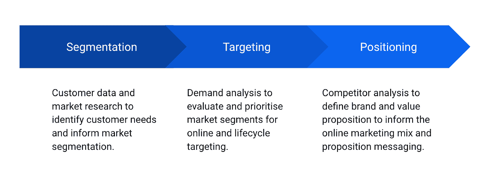

[OC] (CC BY 4.0)

战略中细分的流行一方面源于 CRM 和 ad-tech 系统过去的局限性，另一方面源于 STP 过程中对人类决策的依赖。在**数据驱动个性化**兴起之前，大多数系统只能处理少量的细分市场，因此目标定位仅限于一般的受众细分。

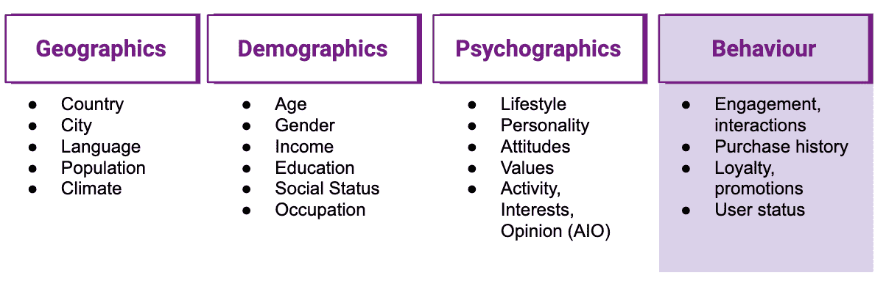

[OC] (CC BY 4.0)

为了创建丰富而有意义的受众群体或营销人物角色，有大量的地理、人口、心理和行为数据可供选择。在我们创建人类可解释的分段的愿望中，我们倾向于

1.  优先考虑地理、人口和心理数据，而不是使用行为数据
2.  给我们的细分市场分配或多或少的离散标签。


([Pixabay](https://pixabay.com/illustrations/target-target-group-personal-3845096/))

这种在或多或少不相关的人物角色中的想法引起了市场商人和决策者的强烈共鸣，但最终是有缺陷的和有局限性的。仅举几个问题:

*   对于用户群来说，地理、人口和心理数据通常很少，而且质量参差不齐
*   严重依赖个人数据，限制越来越多，同意程度越来越低
*   这种角色很难扩展、更新和自动化
*   人物角色的不同特征没有相关的重要性或相关性权重
*   现实本质上是不确定和可变的——你的数据和你在其上构建的人物角色也是如此

一些重要的发展促使我们对目前如何进行细分进行了重大的反思:

1.  CRM 系统和 ad-tech 在处理**倾向**而非离散细分市场方面的进步
2.  人工智能的进步和大数据的可用性，可以从大行为数据中间接提取地理、人口和心理信息。

# 新的黄金标准是行为数据

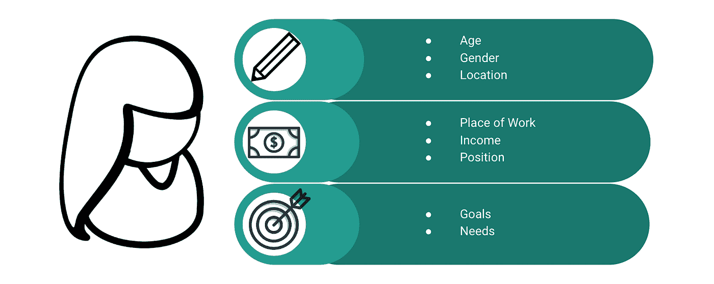

([Pixabay](https://pixabay.com/vectors/woman-artwork-concept-drawing-309426/))

你可能听说过数据是新的石油，但这到底意味着什么呢？随着数据技术和机器学习的进步，数据科学家可以处理大量数据，以提取微妙的隐藏信号。这种支持数据的方法不仅开启了新的和创新的用例，而且有助于扩展和自动化它们。我们谈论的是哪种数据？特别是**行为数据**，比如来自你的电子商务网站或应用的点击流、事件和搜索数据。

您客户的不同地理、人口和心理属性对他们的需求和行为有微妙但明确的影响。因此，机器学习允许我们从行为数据中间接提取这些因素。

这种数据驱动的方法有明显的**优势**:

*   它**可以轻松扩展**到您的整个客户群——不再有缺失或不完整的数据
*   这完全基于你的第一方数据
*   它包含关于客户属性的**相关性的信息。只有与您的产品和品牌相关的相关客户特征才会反映在细微的客户行为中，并以相应的信号强度记录在您的行为数据中。**
*   它提供了**机器可理解的**编码特征，可用于许多其他机器学习问题，如聚类、预测和推荐系统。

有一个**缺点**:

*   你提取的所有客户属性都经过数学编码，机器可以理解，但**人类无法直接理解**。

这对市场商人来说可能是件大事，但这真的重要吗？不一定！它只需要改变我们理解和处理客户特征的方式。

1.  您可以在不了解“ML 黑盒”本身的情况下对输出进行检测和质量保证。
2.  您可以叠加额外的数据来推断人类的可解释性
3.  您可以在不理解的情况下操作它，例如使用[多臂土匪优化](/comparing-multi-armed-bandit-algorithms-on-marketing-use-cases-8de62a851831)

# 动物园

在 Zoopla 上，每天大约有 150 万人搜索我们的房源并与之互动，每天产生大约 1000 万的页面浏览量。为了更好地了解这些人和他们的产品需求，Zoopla 自然会关注细分市场。在传统的细分方法中，我们会关注**人物角色**，比如租户、买家、卖家、房东等。但是房产阶梯并不是一目了然的:如果你正在购买一处房产，你可能会卖掉现有的房产来融资。这种房产链占了英国房产交易的大部分。在伦敦，租房者可能出于需要而租房，但他们也是拥有“先买后租”房产的房东。那些爱管闲事的人又如何呢？他们只是喜欢浏览所在街道的房产详情。与此同时，对于像 Zoopla 这样的房地产门户网站来说，这样的人物角色如何转化为不同的**产品需求**还不清楚。

# 从行为中分离

使用行为数据进行细分的第一步是将你的点击流转化为选择的**相关维度**及其值。找到这些维度的一个很好的方法是利用**推荐引擎**的数学，并将**因子分解**应用于用户-产品交互矩阵。如果你读过我之前关于[推荐系统和协作过滤](/how-to-build-a-recommendation-engine-quick-and-simple-aec8c71a823e)的文章，这被称为**用户项目模型**:

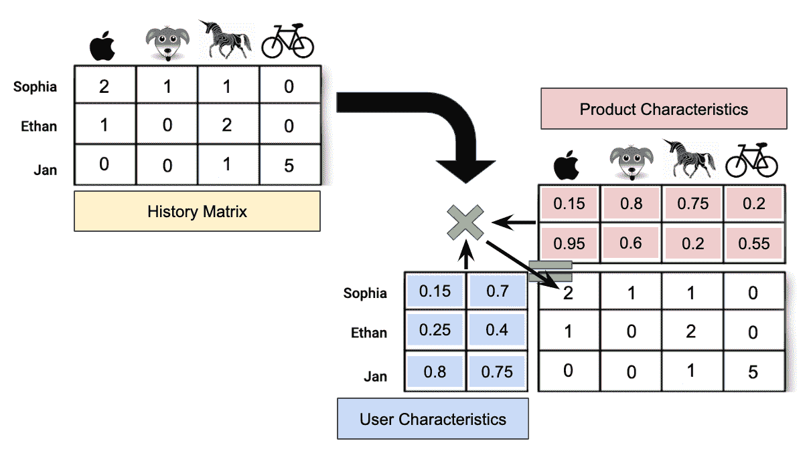

[OC] (CC BY 4.0)

目的是将历史矩阵分解为**用户和产品特征**，这可以预测我们的历史用户-产品交互。该历史矩阵可以是产品购买、用户评级或您企业的其他相关事件。

矩阵分解可以以不同的复杂程度进行，例如是否考虑用户和产品偏差。 [Fast.ai](https://docs.fast.ai/collab.html) 为**协同过滤**提供了一些有用的高层抽象。我们使用 [SVD++](https://en.wikipedia.org/wiki/Matrix_factorization_(recommender_systems)) 作为我们的因子分解，其中包括针对项目 *i* 和用户 *u* 的偏差 *b* ，以及针对维度 *f* 的用户特征 *U* 和产品特征 *P* :

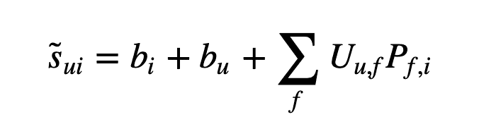

[OC]

在这个例子中，我们使用了 Zoopla 用户的样本数据集，以及他们对某些房产列表的参与度。分数描述了从 0 到 1 的意图度量，捕捉用户与 Zoopla 上的列表的交互深度(例如，页面时间、浏览的图像数量、查看的平面图、向代理发送线索等)。)如下:

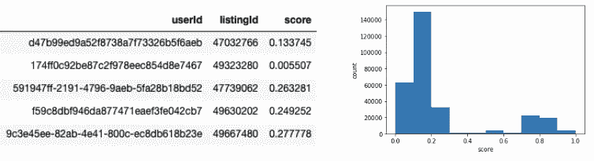

[OC] (CC BY 4.0)

我们使用 Fast.ai 和 PyTorch 来训练我们的 SVD++模型:

```
import fastai.collab as fst_collabdatabunch = fst_collab.CollabDataBunch.from_df(
  data, user_name=”userId”, item_name=”listingId”,  
  rating_name=”score”, valid_pct=0.25
)learner = fst_collab.collab_learner(
  databunch, n_factors=10, y_range=(0.,1.)
)learner.fit_one_cycle(10, 1e-1)
learner.show_results()target, prediction = learner.get_preds()
```

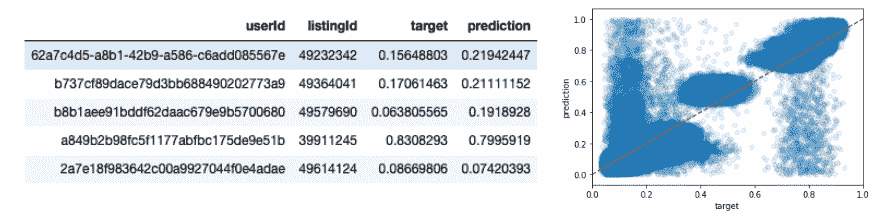

[OC] (CC BY 4.0)

我们的模型学习了 10 个因素来描述 Zoopla 上的用户和房产列表。为了理解这些高维数据，我们可以使用 **t-SNE** 算法来聚类和可视化我们的数据。t-SNE 是一种随机 ML 算法，用于以可视化的方式降低维度，将相似的用户和列表聚集在一起。这也叫做**邻居嵌入**。

```
from sklearn.manifold import TSNEU_embedded = (
  TSNE(n_components=2)
  .fit_transform(learner.model.u_weight.weight.detach().numpy())
)ax = plt.scatter(
  U_embedded[:,0], U_embedded[:,1],
  c=learner.model.u_bias.weight.detach().numpy().flatten()
)
cb = plt.colorbar()
_ = ax.axes.set_title(“User Factors”)
_ = cb.set_label(“User Bias”)
```

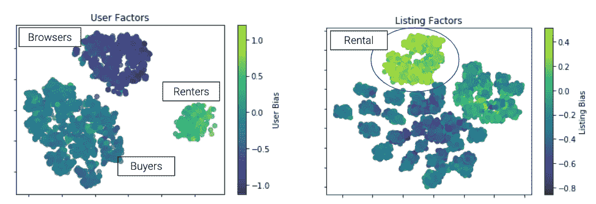

[OC] (CC BY 4.0)

从那些情节中我们可以了解到一些有趣的**定性见解**:

*   房源的种类似乎高于用户的种类。
*   用户偏好比房产列表的偏好更对称，范围更广。更多的房产清单是负面的，而不是正面的。这与人们的观察相吻合，即 Zoopla 的许多待售清单不会产生很多线索。
*   用户分为三个主要群体。租房者彼此更加相似，普遍有积极的偏好，比因子分析预测的更关注房源。买家是最多样化的用户群，拥有更小的子群。浏览器会查看大量待售和待出租的房产列表，但不会深入地关注这些列表，从而导致负面偏见。
*   房产列表显示了一个主要由租赁列表组成的具有正偏差的集群。许多租赁房源吸引的参与度似乎比它们的因子分析预测的要高。造成这种积极偏向的因素包括英国的住房危机、可负担性和地理位置。第二类主要是待售房产，偏向中性。这些房产列表比剩余的“冷”列表彼此更相似，显示出负面偏见。

你可以在我的后续文章中了解使用深度学习和 Tensorflow 的替代方法:

[](/customer-preferences-in-the-age-of-the-platform-business-with-the-help-of-ai-98b0eabf42d9) [## 人工智能平台时代的客户偏好

### 如何使用深度学习来发现客户的偏好，并了解您的产品库存

towardsdatascience.com](/customer-preferences-in-the-age-of-the-platform-business-with-the-help-of-ai-98b0eabf42d9) 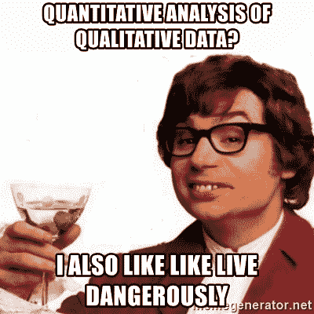

memegenerator.net (fair use)

但是营销想更深入！

对于高维数据，T-SNE 是一种有用的可视化技术，但我们从像这样的邻居嵌入中获得的定量信息是有限的。如何从高维因素中提取洞察力取决于您的使用案例和行业。

**地理信息**:房地产市场非常本地化，我们的用户和房地产特征包含地理信息并不奇怪。房产列表有相关的位置数据，用户可以在 Zoopla 上搜索地理区域。让我们按照最频繁的 Zoopla 搜索的外部代码对属性列表和用户进行分组。然后，我们可以通过外码(如 SE1)查看因子分解中 10 个因子的方差。假设编码地理信息的因素在一个外码中比其他类型的因素显示出较少的变化。

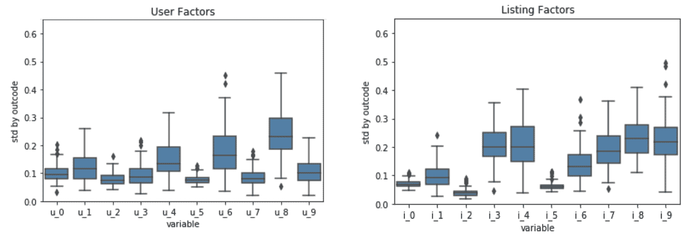

[OC] (CC BY 4.0)

因子 0、2 和 5 似乎编码了地理信息。不足为奇的是，用户因素显示了这些因素的更大的标准偏差:用户在多个位置进行搜索，但我们只根据他们最频繁的搜索对他们进行了汇总。与用户相反，房产列表具有明确的位置，因此地理因素的预期标准偏差较低。该地图显示了与全英国人口中心相关的外码平均用户系数 u_0。但这个因素也凸显了一个重要的观点:它编码了地理信息和人口统计信息，比如租房者和买房者。

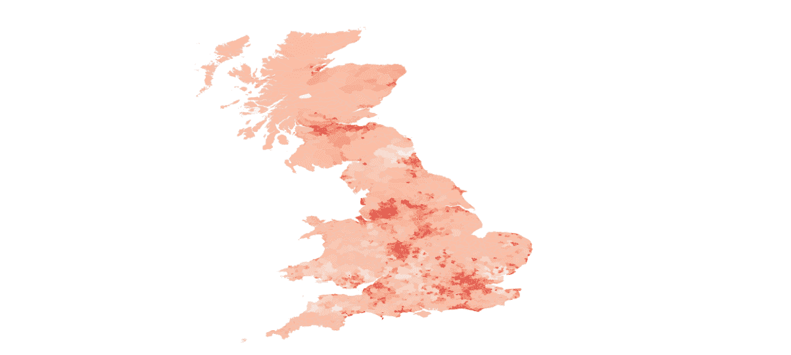

[OC] (CC BY 4.0)

在传统的细分方法中，我们独立处理的许多维度实际上是**强相关的**，我们的因子分解产生了**衍生的混合地理、人口和心理信息的维度**。例如，在我们的用户-物业分解中，物业的价格、卧室数量以及一些地理信息被编码到一些派生的**本地化的可支付性指标**中。

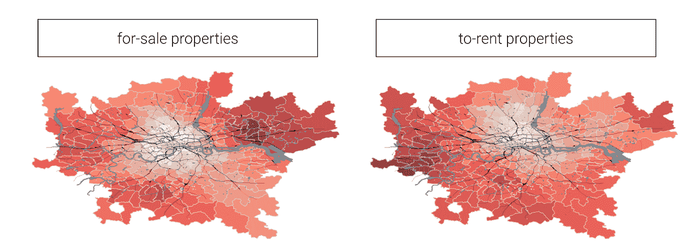

[OC] (CC BY 4.0)

不同地区的房价承受能力存在有趣的差异:

*   不出所料，伦敦中南部的房产和河以北一样难以承受，但河以南的房租更容易承受。
*   罗姆福德地区的房价非常便宜，但相比之下，在罗姆福德租房的人负担不起房租。它显示了**本地化市场**的程度，以及该模型的可负担性指标不是一个绝对的衡量标准，因为它是从本地化的用户资产分解中得出的。
*   相反，希思罗机场地区买房比租房便宜。

# 局限性和一些关于数据伦理的话

**技术** : SVD++和所有协同过滤模型一样，都有一个**冷启动**的问题。Zoopla 上的新属性和人必须接收/产生一定程度的交互才能被包括在细分中。这也意味着，要向模型中添加新的属性或用户，我们必须重新运行分解。对于 Zoopla 高度动态的房地产目录来说，这比传统的电子商务业务更成问题。

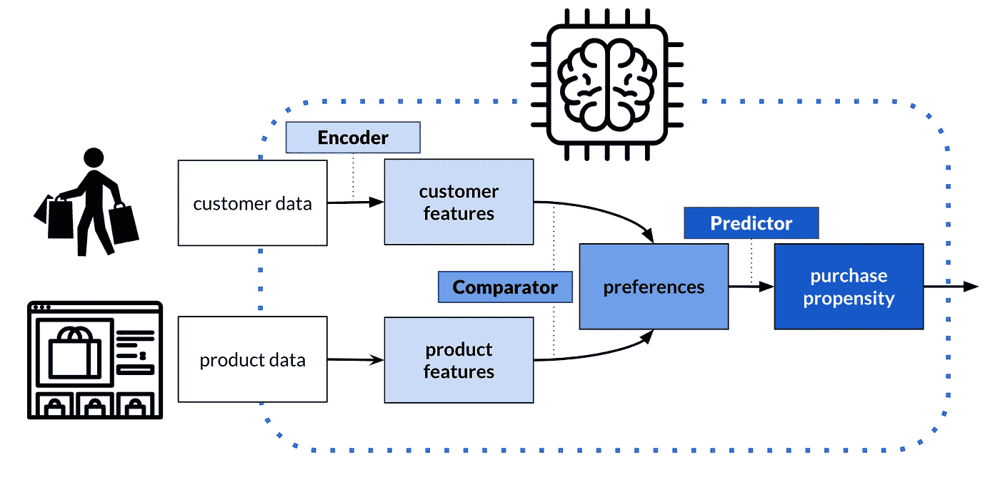

**你可以在我的后续文章中读到使用 Tensorflow 的深度神经网络的替代实现，它没有冷启动问题:**

[](/customer-preferences-in-the-age-of-the-platform-business-with-the-help-of-ai-98b0eabf42d9) [## 人工智能平台时代的客户偏好

### 如何使用深度学习来发现客户的偏好，并了解您的产品库存

towardsdatascience.com](/customer-preferences-in-the-age-of-the-platform-business-with-the-help-of-ai-98b0eabf42d9) 

**伦理**:这篇博文展示了可以通过机器学习提取的行为数据有多丰富，信号有多详细。但是这样做道德吗？在人们没有明确给我们任何数据的情况下，我们推导出了**的详细信号**。一方面，这意味着它不一定对用户透明。另一方面，如果我们得出的用户或财产的属性是不正确的，那么更正可能需要无意中披露更多的数据。

读完这篇博文后，你可能不会马上明白为什么这很重要。毕竟，我只提出了定性的见解，主要是在一个汇总的区域级别，以告知一般的 STP 策略。这显然是合乎道德的，并且有助于改善我们的产品和服务。

但我们关注的一个信号是一些派生的可负担性。在分解模型中，此数据存在于酒店和用户级别。把它从一个聚集的领域降低到财产层面，似乎仍然是合乎道德的。我们确实一直在谈论房产的可负担性。但是把它降低到**个人** **用户级别**怎么样？理论上，我们可以告诉代理我们对您发送的销售线索的可承受性的看法。如果这让你感到不舒服，让你想起 DSS(住房福利)歧视，那么你是对的。在这种情况下使用这个数据点会让人立即感到**不道德。**

作为数据科学家，我们有**责任**不仅在我们训练的模型的背景下，而且在这些模型可能实现的用例中思考数据伦理。我们应该只使用数据，建立符合比例的模型(T21)。将这一点纳入我们的分解模型的一个方法是我们得到的信号的数量。我在另一篇博文中训练的地理区域嵌入包含 50 个信号。但是用户属性交互的分解我故意限制为 10 个信号，**限制了我提取的细节层次。**

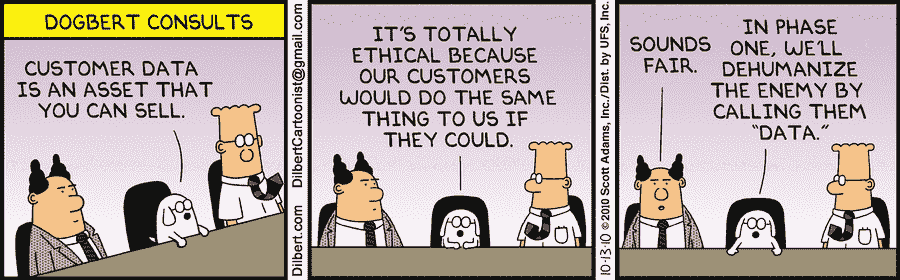

© [https://dilbert.com/strip/2010-10-13](https://dilbert.com/strip/2010-10-13), (personal use)

这是一个非常肤浅和高层次的数据伦理讨论，仅仅是为了强调使用数据时的责任。每个数据科学家都应该理解并应用**数据伦理框架**:[https://www . gov . uk/government/publications/Data-Ethics-Framework](https://www.gov.uk/government/publications/data-ethics-framework)

我不是专家，但你也可以阅读我关于偏见和算法公平的文章，以了解更多关于这个问题和缓解策略的信息:

[](/bias-and-algorithmic-fairness-10f0805edc2b) [## 偏见和算法公平

### 现代商业领袖在由数据统治的勇敢新世界中的新责任。

towardsdatascience.com](/bias-and-algorithmic-fairness-10f0805edc2b) 

Jan 是公司数据转型方面的成功思想领袖和顾问，拥有将数据科学大规模应用于商业生产的记录。他最近被 dataIQ 评为英国 100 位最具影响力的数据和分析从业者之一。

【https://www.linkedin.com/in/janteichmann/】在领英上连接:[](https://www.linkedin.com/in/janteichmann/)

****阅读其他文章:**[**https://medium.com/@jan.teichmann**](https://medium.com/@jan.teichmann)**