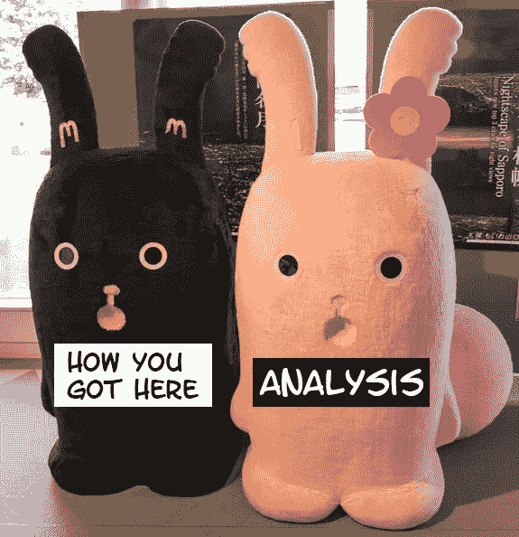
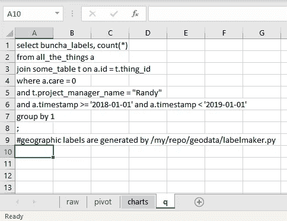
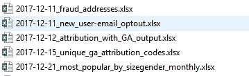

# 数据科学实践 101:永远留下分析文件线索

> 原文：<https://towardsdatascience.com/data-science-practice-101-always-leave-an-analysis-paper-trail-cc17079fae5a?source=collection_archive---------24----------------------->

## 它会救你一命。很多。

Bunny… things from Hokkaido.

对于大多数数据科学家来说，即席分析请求是不争的事实。即使你的主要角色是做高层次的建模/产品开发，你总会做很多小的分析，无论是为你自己还是为别人做一个大项目的基础。

在这样的环境中，很容易得到一大堆分析输出，它们漂浮在一个几乎没有上下文的永久“临时”目录中。“不值得检入的快速小东西”你说，“数据从哪里来很明显”。我明白，这是常有的事，我自己也说过无数次了。从来没有好结果。

忙碌的数据科学家要做什么？不管现在听起来工作有多忙，你都需要留下书面记录，可以清晰地追踪到原始数据。不可避免地，有人会希望你重新运行 6 个月前完成的分析，以便他们可以更新报告。或者有人会伸出手来问你，你对“活跃用户”的具体定义是否恰好包括戴绿帽子的人。除非你有完美的记忆力，否则你不会记得细节，必须去寻找答案。

> *TL；DR:任何可交付的分析都应该始终带有文档，以显示分析的完整路径，从原始数据一直到交付，包括查询和代码，以及到以前的分析和原始数据转储的链接(如果可行的话)。*

# 分析应该是独立的

在学术界，当发表一篇论文时，我们被训练引用我们的来源，展示我们的推理，并(理想地)记录我们的方法，足以让第三方复制我们的工作和结果。在编写代码时，我们(再次强调，理想情况下)应该编写足够清晰的代码，并辅以注释和文档，让其他人(包括你未来的自己)在审查你的代码时能够理解发生了什么。决定性的特征是最终的可交付成果，无论是签入的代码还是发表的论文，都与文档打包在一起。他们一起生活，一起消费。

***这通常不会发生在一个可交付的分析中！***

分析可交付成果通常与用来生成它的东西分离开来。结果以幻灯片、电视屏幕上的仪表板、粘贴到电子邮件中的图表、面向高管的联合演示中的单张幻灯片的形式发送出去，或者只是在某处的文件结构中四处浮动的随机 CSV 转储。可交付成果和源代码之间的耦合是不存在的，除非我们有意识地做些什么。

Package all the things!

## 但是我已经将我的 SQL/代码签入 git 了！

当然，对你来说很好。但是当有人指着你 6 个月前分享的一张图表问“你在这张图表中排除了内部用户吗？”会有答案吗？如果没有，您是否能够利用该图表并追溯到为其生成数据的数据查询/ETL 来回答这个问题？不将大型数据集签入 git repo 通常是最佳实践，因此在签入的代码和产生的数据制品之间总是存在脱节。

这不是一个关于“某处”是否有记录的问题，而是在需要时，在提出问题的任何时间和地点，在几秒钟内是否可以随时获取记录的问题。

## 开门见山，有哪些示例解决方案？

这里有一个不完整的列表，列出了把东西放在一起的方法。使用对所有利益相关者来说最自然的方式。

*   **Excel 文件**:为你的原始数据转储制作一个标签，一个标签用于查询，一个标签用于分析。如果有些东西太大，放不下，就放上链接/参考。
*   **CSV 文件**:无论如何，你会想压缩你的数据用于发送/存档，tar/zip/bz2/xz 用你的 query.sql 文件，任何处理代码，等等。
*   **幻灯片组**:取决于观众和论坛，幻灯片本身的引用，或带有分析计算/文档链接的附录幻灯片，或演讲者笔记中链接的文档
*   仪表盘:棘手的，如果可行的话，UI 上的链接，或者隐藏在生成特定仪表盘元素的代码中的注释/链接。
*   **电子邮件报告**:提供更详细来源的链接，或相关数据的参考。
*   Jupyter/colab 笔记本:文档应该被编入代码和笔记本本身，这些文本/html 块是有原因的。
*   **生产模型**:代码注释和/或链接，指向模型所在的原始分析，或者至少是生成任何参数的分析。

# 我还应该做什么？

**记录文件日期—** 大多数分析，尤其是临时分析，都与时间相关—季度董事会议、新功能发布等。2017 年的东西在 2019 年通常不太相关。当所有的上下文都丢失了，但是有人可以在交付物发出的时候产生一封电子邮件通知，你就有了一个可以去寻找的日期。

My personal habit of dating analysis and deliverable files

**无论何时运行查询，都可以得到相同的结果。**通常情况下，很容易进行“提取所有内容”或“最近 7 天”的查询，但它们的一个缺陷是，数据会根据您运行查询的时间而变化，甚至是在 10 分钟之后。这使得不修改查询就无法再现查询结果，这可能是不希望的。

在某些情况下，使用动态时间窗口进行查询很有意义，而在其他情况下则不然。在做决定时，要意识到你潜在的未来用例(人们会要求你用更新的数据重新运行它，等等)。

外面的世界很混乱。试着在你自己的小范围内保持有组织性。