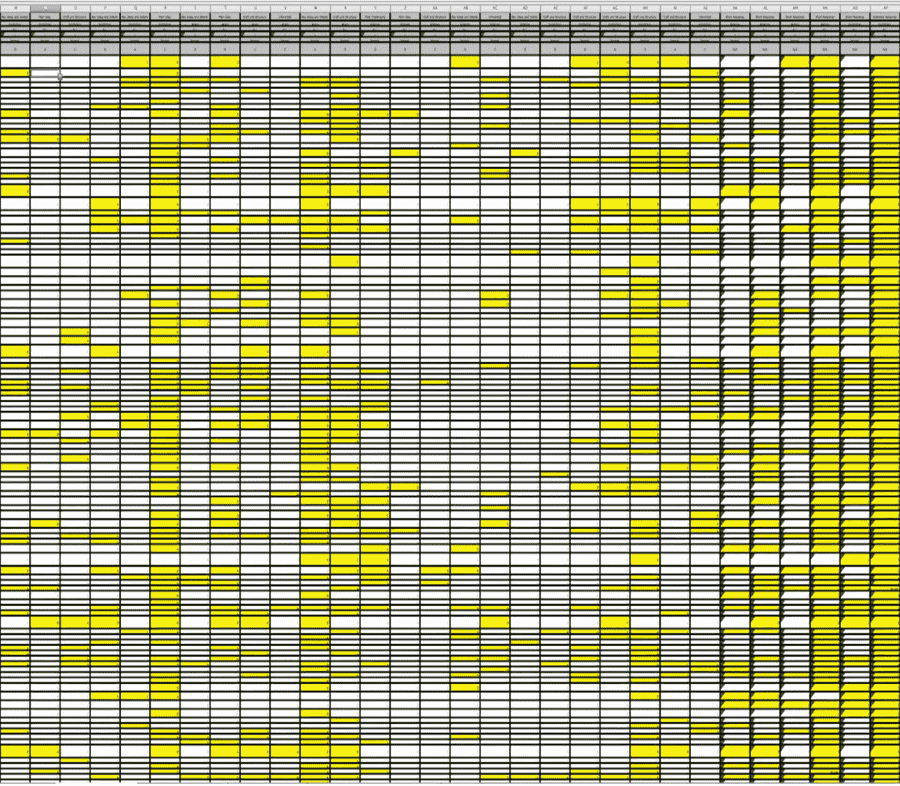
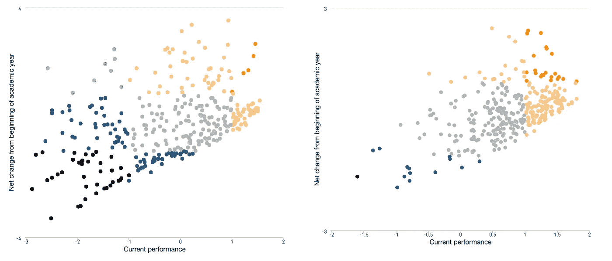

# 数据科学生产:维护

> 原文：<https://towardsdatascience.com/data-science-productionization-maintenance-af59ce6c958?source=collection_archive---------7----------------------->

## [DS 生产化](https://towardsdatascience.com/tagged/ds-productionization)

## 花费在可维护性上的时间减少了实际维护的时间。

这是关于数据科学生产的五部分系列的第三部分:

1.  [数据科学的“生产化”意味着什么？](/what-does-it-mean-to-productionize-data-science-82e2e78f044c)
2.  [便携性](/data-science-productionization-portability-f5d1a1f2f45b)
3.  [维护](/data-science-productionization-maintenance-af59ce6c958)
4.  [刻度](/data-science-productionization-scale-1884ca4e969e)
5.  [信任](/data-science-productionization-trust-b37f10b8f426)

在上一篇文章中，我使用了一个简单的单词规范化函数来说明代码可移植性的一些原则:

现在让我们看一下同样的功能，但这次是优先维护:

第一部分甚至不包括函数本身。我在这里建立的是日志基础设施。我已经指定了一个记录错误的文件(名为“error.log ”),并设置了每当出现错误时在该文件中打印什么单词的规则。通常，日志记录比引发完整错误更可取，因为它允许系统的其余部分即使在出错时也能继续运行。停机时间往往比错误或缺口更具破坏性。还要注意，我添加了注释(以散列符号开头的行)来解释日志设置的每个部分是做什么的。

然后我们到了函数定义(以‘def’开头的那一行，但是在这一点上还是没有实际的代码。这部分被称为“文档串”。它解释了函数的目的、预期输入和预期输出。

现在我们来看函数内容。首先，我们有一个“断言”语句。这种说法是一种考验。如果“word”输入不是一个字符串，那么后续的代码都将不起作用，所以这个测试检查以确保输入是一个有效的类型，如果不是，就抛出一个错误。之后，您可以看到该函数的实际代码，但是我已经将它们都包装在一个“try”语句中了。这条语句首先尝试运行我们最初编写的所有代码。如果有一个系统退出错误或键盘中断错误(这两个问题都来自函数之外)，函数会告诉我。任何其他错误，该函数在日志文件中打印错误。这样，我就可以监视日志文件，查看发生的任何错误，并获得帮助我调试错误的信息。

最基本的，可维护性是关于日志、警报和测试的。令人高兴的是，这些东西通常是编程语言的内置组件。不幸的是，设置它们真的很无聊，而且经常被搁置。它们需要额外的几分钟甚至几个小时来设置，但是一旦设置好，它们可以为您节省几个小时甚至几天的时间来识别问题。

当我们从特定的代码中抽离出来，考虑整个代码系统的可维护性时，我们不再仅仅谈论文档字符串和日志基础设施(尽管这些东西很重要)。文档是企业确保其数据科学能力可维护性的主要非代码方式。这是每个人都说你应该做的其他事情之一，但是很少有人真的去做。我认为这是因为人们通常不知道文档提供了什么价值。有不同种类的文档，每一种都有不同的用途:

## **技术文件**

技术文档应该允许一个以前不熟悉代码的有能力的程序员编写新的代码，这些代码将实质上再现原始代码的结果。我说“实质性地”复制是因为精确的复制通常依赖于实现的微小细节——这些细节只能在代码本身中找到。标准技术文档可以分为以下几类:

*   **背景**。这是产品背后的动机——它试图解决的一般业务问题。它可能还包括产品的目标(和非目标——我稍后会详细介绍)。
*   **设计**。这是文档中最长的部分。它一步一步地列出了产品的组成部分。它确定了所有要用作输入的数据源，强调了对其他产品的依赖性，定义了将用于处理数据的模型、算法或程序。标记这些过程的配置与标准实践或程序包默认设置的任何不同之处。在这些部分中，流程图会有所帮助。代码片段通常也很有帮助。
*   **结果**。本节定义了衡量产品性能的具体指标。这可能是显示模型准确性的误差分布或混淆矩阵；它可能是按客户、地区或其他类别细分的结果。这一部分本质上是在论证你的产品做了它应该做的事情。
*   **开放式问题**。这可能会突出产品中的弱点或它所带来的风险，比如安全性缺陷或不适合的用例。未解决的设计或实现问题，以及改进产品的方法应该在这里列出，这些方法很值得探索，但还不够紧迫，不能马上解决。

**非技术文件**

非技术文档应该允许非技术用户理解产品在公司提供的更大的生态系统中的位置，不仅理解产品的优点和局限性，而且在高层次上理解为什么这些优点和局限性存在。非技术文档可以分为以下几类:

*   **商业背景**。这应该简要描述为什么企业应该期望从产品中发现价值。
*   **目标**。这是产品应该实现的具体结果的列表。这些都应该是可以明确评估的事情——在产品运行一段时间后，您应该能够回顾每个目标，并询问它是否已经完成。
*   **非目标**。这是产品不打算完成的事情的列表。这是文档的一个重要方面，它定义了产品的范围。
*   **注意事项**。这应该是一个非常诚实的列表，列出了产品没有做的事情，或者没有尽可能做好的事情。利益相关者在与外部客户交流时，可能会软化列表中的语言，但是总应该有一个地方可以坦率地讨论产品的弱点，而不是罗列出来。
*   **解释/使用指南。**这将为非技术用户提供建议，帮助他们了解如何负责任地使用产品输出。这可能包括解释指标的指导方针(例如，什么构成“高”分，什么构成“低”分？)，以及在利益相关方对结果不满意时可以要求的设置更改。

非技术文档尤其重要，因为你必须像维护产品本身一样维护用户对产品的参与。只关注技术维护就像建了一座漂亮的房子，却从来没有人住在里面。

## 一个个人的例子

当我为一个大型特许学校网络组建数据科学团队时，最迫切的业务需求是使用大量不同类型的数据创建学生表现的汇总评估。在我们的每一门核心课程中——英语语言艺术、数学和科学——学生每两到三周接受一次评估，每次评估有 1 到 40 个问题。评估形式从简单的多项选择考试到监考阅读考试不等，在监考阅读考试中，学生大声朗读，教师对他们的流利程度进行评分。每隔几周，一群学校管理人员、内容创建者和教师就会聚在一起，审查分数的电子表格，并就数据的意义展开争论。这是一个学校的电子表格，针对一项评估:

每行是一名学生，每列是一个问题—黄色单元格表示学生在某个问题上的表现低于预期。想象几十个这样的电子表格。现在想象一下，试着回答一个表面上看起来很简单的问题:哪些学生最需要我们的帮助？

当我来到特许学校网络的工作岗位时，我花了至少一周的时间来回答这个问题。管理员会争论一个月前的评估有多相关。老师们会说，最近评估中的第 2 题和第 15 题写得很差，因此没有很好地解读学生的表现。这是我的团队需要应对的挑战。

我们的主要数据科学产品是一种算法，它将这一过程从一周和一个委员会减少到几秒钟内可获得的自动结果。我们通过对每个问题进行评分来区分历史表现差的和历史表现好的。所以，当看个人评估中的个别问题时，如果一年中历史上该科目大多数问题不及格的学生答对了，而历史上该科目大多数问题答对的学生答错了，这意味着该特定问题的结构可能很差。设计糟糕的问题对整体分数的影响应该较小，因为学生不应该因为老师和管理者的错误而受到惩罚。

一旦我们对每个问题进行了评分，我们就可以对几个月的工作进行平均，用问题质量分数对平均值进行加权。我们还加入了指数衰减，使得最近的数据更重要。所有这些使我们能够创建支持这些可视化的数据产品:

每张图代表一所学校，每个点代表一个学生。学生横向从当前最低成绩到当前最高成绩，纵向从一年中成绩下降最多到成绩增加最多。最暗的点是那些处于最大困境的学生——他们的表现很差，并且在下降。橙色圆点最深的是成绩好，成长中的学生。

学校网络管理员可以使用这样的摘要来快速比较学校，并查看它们彼此之间的表现。个别学校领导可以利用这一点来快速识别需要更多帮助或需要更多挑战的学生。

成功采用该产品的最大因素是支持它的非技术性文档。为了让学校领导使用这个工具，我们需要对我们如何计算问题质量分数进行广泛的解释。我们还需要非常详细地阐明算法提供信息的情况。例如，该算法的目的是帮助资源分配——教育工作者一天只有这么多时间，所以我们希望他们将尽可能多的时间花在最需要的学生身上。学校里表现最差的学生仍然可能超过政府规定的表现标准。该算法并不关心这个——它只关心那些学生比他们的同龄人获得的教育收益少。

随着时间的推移，我们必须构建非技术文档来解决关于原始文档的目的和范围的新问题。有一次，几个学校领导来找我，他们认为这是算法中的一个错误。他们拿出了他们的电子表格，显示一些在我们的英语语言艺术表现指数中得分很低的学生实际上在许多 ELA 个人评估中得分很高。当我们深入研究这个问题时，我们发现他们确实在许多评估上得了高分——所有的每周拼写测试。他们的核心读写能力评估得分很低。该算法能够识别出，与能够有意义地解读文本相比，能够记忆单词是一种不太可靠的表现衡量标准。我们记录的越多，这个工具就被越广泛地采用，我们希望，我们能够给学生带来更多的好处。

该系统需要的技术文档和非技术文档一样多。随着对该工具需求的增加，我们不得不改变存储和检索底层数据的方式。在某一点上，来自教育者的反馈使我们确信我们在时间衰减权重上设置了错误的半衰期，所以我们需要进去修改它。我们在使用该算法的第二年发现，在学年开始时，由于没有足够的数据，在评估不太重的科目中，它给出了无意义的结果。所有这些都需要被整理(换句话说，使之可移植)，但也需要被记录下来，这样我们未来的自己就可以在不破坏系统的情况下修改它。

花费在可维护性上的时间减少了实际维护的时间。如果我们在构建时没有考虑到未来的维护，那么随着时间的推移，我们构建新东西的能力会变得更弱，因为我们必须花费所有的时间来保持旧东西的运行。