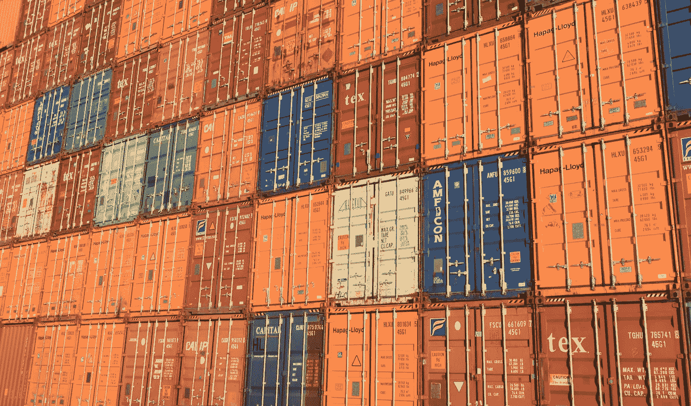
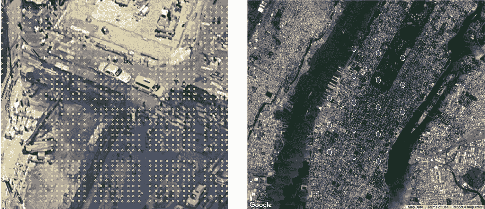
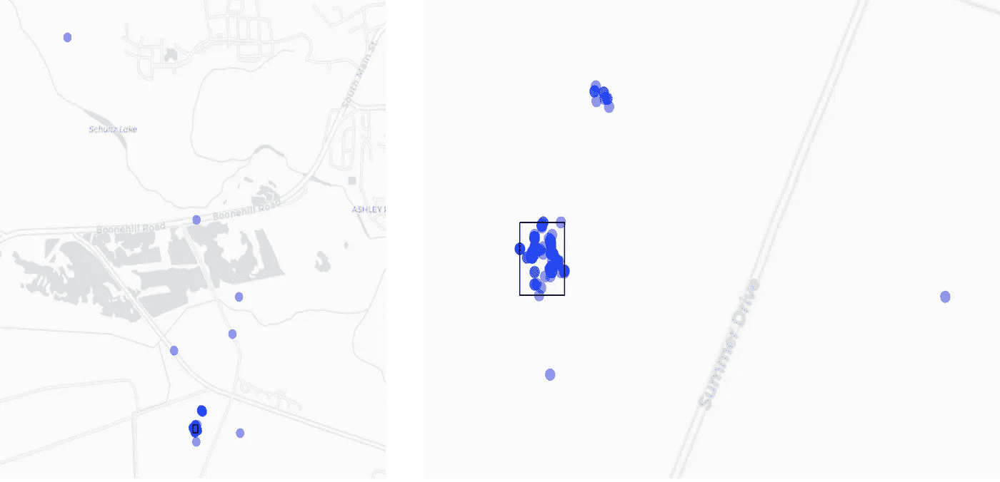
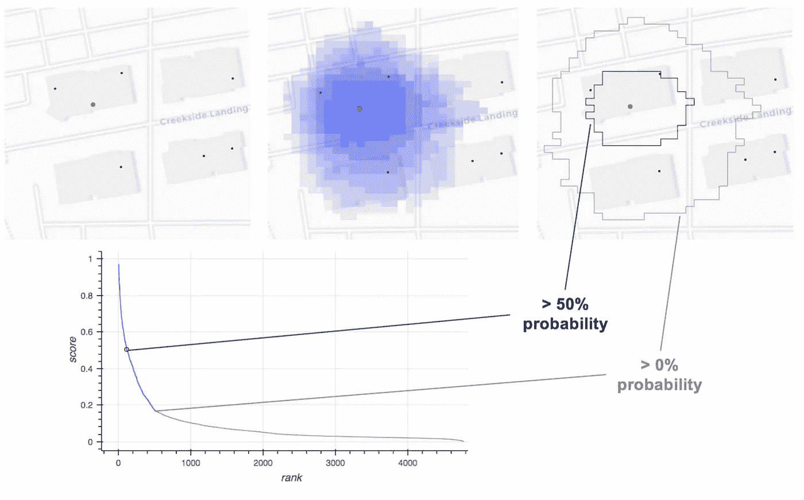

# 数据科学生产化:可移植性

> 原文：<https://towardsdatascience.com/data-science-productionization-portability-f5d1a1f2f45b?source=collection_archive---------11----------------------->

## [DS 生产化](https://towardsdatascience.com/tagged/ds-productionization)

## 当你的目标改变时，可移植性通过减少你必须重写的代码量来减少从你的代码中获得价值的时间。

这是关于数据科学生产的五部分系列的第二部分。当这些帖子可用时，我会用链接更新下面的列表:

1.  [数据科学的“生产化”意味着什么？](/what-does-it-mean-to-productionize-data-science-82e2e78f044c)
2.  [便携性](/data-science-productionization-portability-f5d1a1f2f45b)
3.  [维护](/data-science-productionization-maintenance-af59ce6c958)
4.  [刻度](/data-science-productionization-scale-1884ca4e969e)
5.  [信任](/data-science-productionization-trust-b37f10b8f426)

生产数据科学的第一步是使其可移植。为了解释我的意思，让我们看一个代码可移植性的简单例子:

上面的代码执行一个在文本分析中常见的简单任务:取一个单词，去掉两端的所有空格，并将所有字符小写；然后依次检查该单词每个字符；如果字符在“停止”列表中，省略它；最后，将所有剩余的字符连接在一起，使它们再次成为一个单词。该示例使用了一个特定的单词“abracadbra”，您可以看到结果只包含字符“rr”，因为所有其他字母都在我们的停靠点列表中。

现在来看看相同的代码，其中有一些变化:

新代码采用相同的输入并产生相同的输出。但是这段代码在一些方面优于以前的版本:

*   它将变量“STOPCHARS”大写，遵循标记常量的 [Python 约定](https://www.python.org/dev/peps/pep-0008/#constants)——它告诉阅读这段代码的人，如果他们想使用这部分代码，他们需要复制并粘贴它，因为它不是从任何其他来源派生的。它是一个视觉信号，告诉程序员如何在不同的上下文中使用那部分代码。
*   整个工作流被包装在一个函数中。这个函数可以接受任意一个单词和任意一个停靠点列表。如果我想使用第一个代码示例来更改这些内容，我需要删除我拥有的单词定义，并写入一个新的定义。有了新的代码，我可以用新的输入来调用函数——我不必删除任何以前的工作；我可以加入新的作品。
*   我在函数定义中引入了止损点的默认值。如果函数中没有输入任何停止符，它将删除空格、小写字母并返回单词，而不需要花费任何时间单独查看每个字符。因此，它可以自动处理我想要规范化一个单词但没有任何停顿可以删除的情况 one 函数自动处理两种用例。

简而言之，修改后的代码可以用于任何数量的项目——甚至是我在编写函数时从未预料到的项目。原始代码可以用于我编写它的项目，如果我想在其他地方使用它，必须进行编辑。所以第二个代码示例是两个示例中更容易移植的。

## 便携性的类型

我们也可以让整个代码集合具有可移植性。有几种方法可以做到这一点:

**包装。**打包是获取大量代码(多个文件和目录)并将其捆绑在一起以便于在其他计算机上安装的过程。例如，Python 的打包系统从 PyPi 到 conda，前者被广泛使用且相对简单，后者越来越受欢迎，因为它使安装更容易且更健壮地处理依赖性。依赖性管理是打包软件的主要原因之一——模块化软件通常建立在其他模块化软件的基础上，这意味着当你想使用一个软件时，你需要安装所有的软件。通过打包来跟踪这些依赖性使得代码可以跨用户移植。此外，根据打包代码时所依赖的依赖关系，代码的性能可能会有很大的不同。例如，下图显示了使用 tensorflow 每秒可处理的图像数量的差异:

[https://www.anaconda.com/tensorflow-in-anaconda/](https://www.anaconda.com/tensorflow-in-anaconda/)

Conda 中的代码包比 PyPi 中的代码包执行速度快 4-8 倍。这在很大程度上是由于打包依赖项的不同。

**版本控制。打包有助于用户之间的可移植性，而版本控制有助于贡献者之间的可移植性。最流行的版本控制系统是 git。Git 运行在分叉-修改-提交-合并模型上。在下图中，最上面一行是代码的“主”分支，其余几行是为不同目的创建的其他分支。**

[https://br.atlassian.com/git/tutorials/comparing-workflows/gitflow-workflow](https://br.atlassian.com/git/tutorials/comparing-workflows/gitflow-workflow)

当您看到想要使用的代码时，您会“派生”您自己的副本。你想怎么弄就怎么弄，原件还是会在原来的地方。当您对本地机器上的代码进行更改时，您可以将其提交到您的分支——您的本地代码将反映您所做的任何更改，但是您的分支将只反映您所提交的更改，而原始代码将保持原样。如果您的分支达到了原始代码的所有者认为它有用、稳定并且通常是所期望的程度，您可以将您的分支与主分支合并，在这之后，主分支将反映您提交到您的分支的所有更改。版本控制允许许多不同的人同时处理相同的基本代码集合，强制执行关于什么可以成为代码的“正式”版本的规则，并提供审计跟踪和灾难恢复的基础，所有这些都是通过将代码打包到单独的分支和版本中来实现的。

集装箱化。有时候光包装代码本身是不够的。像 Docker 这样的容器化系统通过不仅列出代码的依赖项，而且实际上将那些依赖项——系统工具、其他库和设置——与代码一起运送，来处理依赖项管理。这就像把你的整个机器打包，这样它就可以交给其他人打开包装。

**工作流自动化。**有时候，你的代码本身不需要可移植，但是使用代码的进程需要可移植。像 Airflow 这样的工具允许您指定各种脚本运行的时间和顺序，并指定该过程的输出应该存储在哪里以及如何存储。

这实际上是数据科学生产化的一个重要部分，它没有得到足够的重视—如果您试图在每次需要时(或每次需要更新时)从头到尾运行每个流程，您将不得不并行运行大量流程，这可能会变得昂贵，或者您不得不减少运行某些流程的频率，这可能会与您的业务需求背道而驰。通过将流程分割成中间部分并存储那些中游结果，您可以将下游流程指向那些产品而不是产生它们的脚本，从而节省计算时间，并且您可以获得数据的审计跟踪。而且，像你的代码的其余部分一样，你可以选择那些自动化的工作流，并把它们移动到不同的服务器或指向不同的数据库，而不必重写你的整个过程。

当你的目标改变时，可移植性通过减少你必须重写的代码量来减少从你的代码中获得价值的时间。

## 一个例子

让我举一个我亲身经历的例子。这是纽约市的麦迪逊广场花园——宾州车站在下面:

Madison Square Garden

这是同一地点的两张卫星图像:

Satellite images of Madison Square Garden

第一幅卫星图像显示了我们在宾州车站一天内获得的所有移动设备定位信号。第二张图片仅显示了当天有超过 100 个不同的移动设备访问过的位置。起初，让数百甚至数千台设备在短短 24 小时内出现在一个 10 厘米的正方形中似乎不太现实——这就是右图所示——但实际上可能有一定的意义。麦迪逊广场花园的中间是长岛铁路的主要等候区。人们坐在等候区的专用位置，他们聚集在开放的电源插座周围，等等。总之，我不能说那些地点明显不现实。甚至那些沿着车站东边广场酒店旁边的街道的位置也符合我所知道的那条街上的出租车等候模式。

所以我[花了几个月开发了几种方法](/data-is-a-stakeholder-31bfdb650af0)来区分人工地点和简单的繁忙地点。在许多情况下，方法标记的位置并不令人惊讶。例如，我们已经知道，当公司不知道 ip 地址位于何处时，美国的地理中心就被用作垃圾场。各州的中心和邮政编码似乎使用类似。但是其他的模式是意想不到的:

左边的网格模式是典型的高密度区域:城市环境中心、机场、游乐园等等。当多个冲突信号的高层建筑使获得良好的 GPS 读数变得困难时，[许多手机将回复到](https://www.researchgate.net/publication/231849997_Positional_Accuracy_of_Assisted_GPS_Data_from_High-Sensitivity_GPS-enabled_Mobile_Phones)一种更老的、不太精确的位置报告方法，导致网格化。另一方面，右边的网格图案实际上不是一个网格——它是一个六边形网格[，被气象公司](https://portal.enes.org/oasis/general-information/events/workshop-on-coupling-technologies-for-earth-system-modelling-today-and-tomorrow-1/talks/MDuda_mpas_meshes_framework.pdf)用来报告天气预报。天气应用程序倾向于以这种模式报告位置。我们最初对此一无所知——我们发现了模式，然后不得不做一些研究来试图发现数据生成过程。

我们开发的模式识别模型有一个直接的商业用途:我们可以标记有问题的位置，这样我们就可以忽略它们。这样，我们的位置报告将只基于我们可以信任的位置。因为我们使该过程可移植，所以我们可以轻松地获取新的位置数据源并自动应用我们的过滤器——适用于一个数据集的过程也适用于另一个数据集。因为我们对流程进行版本控制，所以我们可以对过滤器进行调整——添加新流程或修改旧流程——而不会破坏任何下游流程。因为我们自动化了工作流程，并将结果从这些过滤器放入存储完整结果的中间产品中，所以我们可以将这些结果用于新的用途。例如:

上面的图像显示了一堆替代的可能位置——那些没有被我们的过滤器标记的位置——它们可能被用来代替一个不可信的位置。无需深入了解具体实现的太多细节，您可以看到替代位置并不是随机分布在世界各地的。事实上，它们或多或少分散在一个小镇上。因此，我们可以用一个边界框来替换一个不好的位置，让我们大致了解报告该位置的设备的实际位置。我们甚至开发了一种成本效益算法，在最小化边界框大小的同时，最大化所使用的可信位置信号的数量。通常，我们可以减小边界框的大小，直到它聚焦于单个家庭而不是单个城镇，并且仍然使用我们所拥有的关于替代位置的大部分信息。

我们将成本收益平衡过程变得可移植，并很快发现了它的一个意想不到的用途:

我们有兴趣了解人们何时会光顾特定的地点，特别是，光顾商店对我们的客户来说非常重要。在上面的图像中，点代表建筑物内各个商店的质心。红点是我们在这种情况下的目标商店。我们只有在人们浏览提供广告的应用程序或网站时才会收到位置信号，而这并不总是发生在实际的商店中。可能发生在外面的人行道上，也可能发生在停车场。此外，GPS 信号本身就有噪声，因此一家商店的手机可能会报告隔壁商店的一些信号。因此，我们研究了一种方法，来判断任何特定的一片土地表明有人去过特定的商店的概率。

您可以看到我们贴在商店上的所有蓝色瓷砖，以及该关联的分数。我们需要告诉商店应该贴多少瓷砖。我们使用了之前使用的相同的成本效益平衡算法(其结果可以在商店图片下方看到),在新的环境中使用已建立的流程节省了数周的工作。

在我看来，这是使数据科学过程可移植的主要好处:它大大减少了从识别问题到部署问题解决方案所需的时间。在一个截止日期很重要的世界里，最好的工具通常是你已经构建好的工具。至少，你已经建立的工具可以让你得到一个解决方案，这给了你时间去寻找改进这个解决方案的方法。