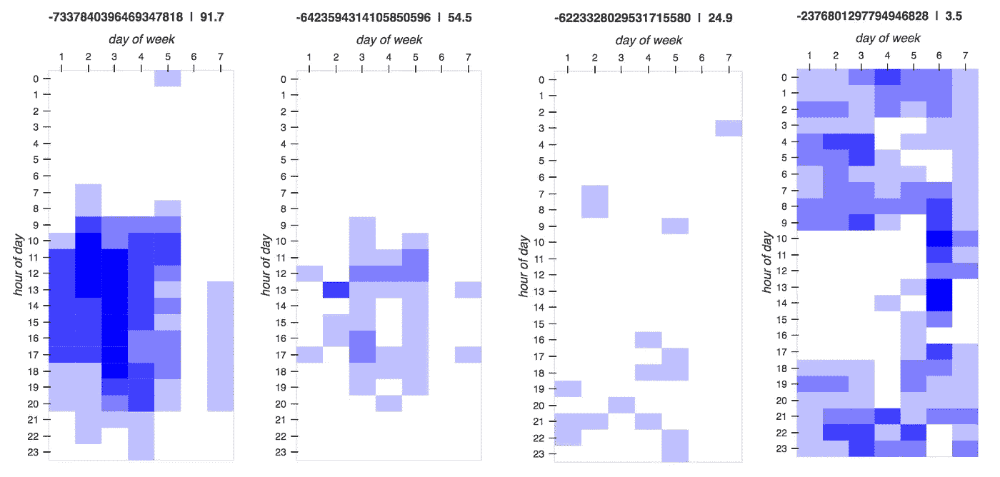
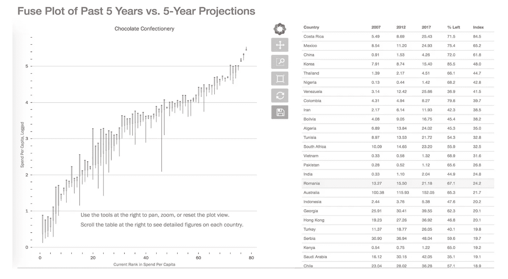
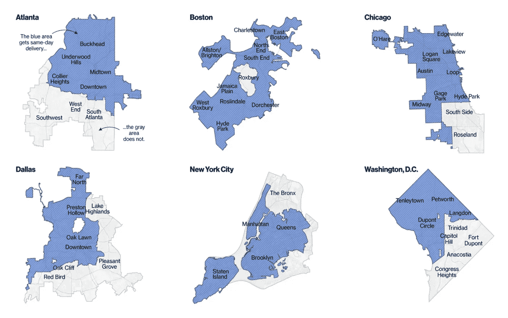

# 数据科学生产化:信任

> 原文：<https://towardsdatascience.com/data-science-productionization-trust-b37f10b8f426?source=collection_archive---------36----------------------->

## [DS 生产化](https://towardsdatascience.com/tagged/ds-productionization)

## 对于数据科学的消费者来说，询问他们为什么应该相信他们得到的分析结果是完全合理的。

这是关于数据科学生产的五部分系列的最后一部分。该系列的其余部分可在以下链接中找到:

1.  [数据科学的“生产化”意味着什么？](/what-does-it-mean-to-productionize-data-science-82e2e78f044c)
2.  [便携性](/data-science-productionization-portability-f5d1a1f2f45b)
3.  [维护](/data-science-productionization-maintenance-af59ce6c958)
4.  [刻度](/data-science-productionization-scale-1884ca4e969e)
5.  [信任](/data-science-productionization-trust-b37f10b8f426)

我将本系列的大部分文章致力于生产的技术方面，尽管这些方面严重依赖于一些非常人性化的过程。但是假设我们的代码都是打包的、容器化的和版本控制的；我们的工作流程已经全部自动化；所有流程都有技术和非技术文档；并且没有重大的资源短缺或有问题的集成。换句话说，我们已经实现了*技术*生产化。我们还没完。

我认为，生产化需要所有必要的步骤来确保使用你的产品的人能够从中获得最大的利益。大多数公司都入不敷出:他们只获得了可用技术总价值的一小部分，因为他们没有使用他们拥有的所有东西——事实上，他们往往不知道自己一开始就拥有这些东西。

机器学习模型通常是不透明的——在许多情况下，即使是建立和训练模型的人也很难理解为什么特定的结果会变成这样。此外，数据科学经常被用来让计算机做出人类以前做出的决定。在这种情况下，信任成为一个主要问题是很自然的。

在监督学习的情况下，模型是根据基本事实数据集训练的，有多种度量标准可以告诉您模型的表现如何-预测的平均偏差有多远，或者有多少百分比的记录被错误分类，等等。然而，对于数据科学的非技术消费者来说，这些指标只是更多的数字——它们没有多大意义。通常帮助消费者信任模型的是讲述模型如何工作的能力。这个故事的一部分——解释模型一般如何工作的部分——在非技术文档中讲述。但故事的另一部分讲述了该模型在应用它的特定用例中获得的具体结果。

我倾向于将信任优先级分为三类:解释、可视化和伦理。

## **解读**

讲述模型故事的一个简单但通常无效的方法是显示模型系数(在简单线性模型如逻辑回归的情况下)或重要性分数(在更复杂的模型如随机森林的情况下)。这些数字从技术上允许用户理解模型的哪些部分是重要的，但它确实回避了一个问题——我们为什么要相信模型选择了正确的重要特征？记住，信任是最关键的问题。如果我们没有给用户一个信任模型的理由，我们就没有解释它。

我以前写过，在我目前的工作中，我们如何使用移动定位信号，以及在其他用途中，我们如何将这些信号映射到地块上。我们需要确定设备对包裹的访问是否表明该包裹是设备所有者的工作场所。我不会深入讨论我们开发的算法的细节——只要说它产生了 0(肯定不是工作地点)到 100(肯定是工作地点)之间的分数就足够了。如果我们只是把高于 0.5 的都归类为“工作”，低于 0.5 的都归类为“不工作”，用户就不会充分利用产品。一些客户想要数量，并不认为假阳性的代价很高，所以 50%的截止值太严格了。与此同时，这些客户不希望因为瞄准明显不是工作场所的地点而浪费金钱。此外，可能还有一个更基本的问题:一个地块有 50%的概率是工作地点，这到底意味着什么？那实际上看起来像什么？

这里的热图显示了单个设备在长达一个月的时间内倾向于访问四个不同的包裹:

我们给每个关系的分数都在每个图的上方(大而长的数字只是包裹的唯一标识符)。对于每个图形，每一列是一周中的一天，从星期一到星期天；每行代表一天中的一个小时。你可以很容易地看到，91 分非常明显是一个工作场所——他们主要在周一到周五，从早上 9 点到晚上 6 点。另一方面，3 分显然不是工作场所——用户只在晚上和周末在那里。54 分算是“正常”。访问模式主要是在正确的日子和时间，但覆盖面有点参差不齐。当我们降到 24 分的时候，这个图案看起来充其量是随机的，最差的看起来有点像住宅。

这些解释指南为客户提供了正确使用工具所需的知识，同时也让他们有信心感觉到他们正在正确使用工具。这两者都是工具被采用的必要条件。

## **可视化和 UX**

通常，最好的解释是顾客自己发现的。一个好的可视化——理想情况下，是交互式的——允许用户与模型进行对话。换句话说，在某种程度上，它允许模型讲述自己的故事。这并不意味着视觉效果必须在美学上非常专业。事实上，我见过的一些最漂亮的可视化效果几乎没有信息价值。当我们谈论建立信任时，一个好的可视化可以引导用户完成数据驱动的决策过程。如果用户能够经历从没有准备好决定到有决定的过程，他们会更信任结果，因为大多数人对自己的判断有一种固有的信任。

我曾在一家资产管理初创公司工作过一段时间，我们试图为新兴经济体的潜在投资者提供建议。我们有许多不同国家的历史产品类别消费数据。我们建立了一个模型，预测未来五年每个国家每个产品类别的消费量。这个想法是，通过预测未来(当然，考虑到预测中包含的所有不确定性)，我们的客户可以决定他们想在哪里投资。

但我们客户的突出问题不是“五年后，中国的人均巧克力支出会达到某个水平吗？”它甚至不是“五年后支出会有一定的增长吗？”这是“如果我现在投资，我能期望支出的增长是快速和持久的良好结合吗？”如果一个市场将在五年内呈指数增长，然后突然暴跌，这可能不是一个好的投资。一个几乎没有增长的市场显然是一个糟糕的投资。为了帮助我们的客户做出这些决定，我创建了一个简单的交互式可视化，我称之为融合图:

每个国家都有一个导火索。导火索的细枝末节是将五年前的人均支出与当前支出联系起来——这是这个国家在五年内走过的路。换句话说，是保险丝已经烧断的部分。保险丝最粗的部分是仍在燃烧的部分——当前支出与五年后的预期支出之间的距离。好的投资是那些保险丝烧得相对较少的投资。

这改变了我们对投资机会的看法。有些市场的支出大幅增长，但我们预计这不会持续下去。还有一些地方的支出相对较低且较慢，但我们预计支出会加快。可视化使客户能够进入模型并探索结果。他们不需要模型如何工作的明确解释，因为他们可以自己直观地发现这些东西。

良好的可视化往往需要更多的定制，而不仅仅是选择一种特定的固定模式。可视化应该像流程的其他部分一样被设计。

## **道德规范**

伦理通常被视为一套价值观或原则。我说的不是这个。可视化和解释度量的目的是在用户知道他们应该不信任的模型方面建立信任:“模型说我应该把钱花在 x 上，我为什么要相信呢？”或者“模型说 Y 是对我的操作最重要的影响？我应该相信什么？”在生产化的背景下，伦理指的是你建立的工具，帮助用户看到模型中他们不知道质疑，但应该质疑的部分。

彭博对亚马逊提供的当天送达服务进行了一项调查，调查显示，更贫穷、更少数民族聚居的邮政编码经常被排除在外。看起来，该算法建议在亚马逊已经拥有大量 Prime 订户的地方实现当天送达，这些订户在较贫困地区的数量往往较少:

Source: [*https://www.bloomberg.com/graphics/2016-amazon-same-day/*](https://www.bloomberg.com/graphics/2016-amazon-same-day/)

一个完全生产化的系统有许多自动化和模块化的部分。这使得引入具有非预期的二阶或三阶后果的系统变化变得非常容易。负责任的生产需要道德保障，从长远来看，这既保护了系统的完整性，也保护了受系统影响者的福祉。

合乎道德的增长是明智的增长。没有道德保障的系统面临信任灾难性失败的风险。如果你有一个适当的系统来标记和有意义地解决出现的道德问题，那么当一个重大的道德问题真的发生时，你已经在你的用户中有了信任和善意的基线水平。然而，如果道德失败在最终暴露在你面前之前不被发现，那就很难(通常也很昂贵)从中恢复过来。

《华盛顿邮报》上一篇由餐馆老板写的文章很好地说明了道德如何融入生产过程。员工使用一个颜色系统将令人不舒服的客户行为分为黄色(不好的氛围)、橙色(冒犯的暗示)或红色(公开的骚扰或重复的橙色事件)。一名员工所要做的就是报告颜色——“我在五号桌有一个橘子”——经理就采取了行动，没有问任何问题。红灯导致顾客被要求离开。一个橘子让经理占了桌子。黄色表示如果员工愿意，经理会接手。

[算法开发的地方道德法规](https://hackernoon.com/the-hidden-risk-of-ethics-regulation-54649158394d)并不比上面简单的工作场所例子更复杂。如果员工对分析产品的含义感到不舒服，如果愿意，他或她应该被调到另一个项目(同等报酬和声望),并且应该有一个团队对该问题进行审查。如果员工可以指出具体的道德问题，他或她应该被转移到另一个项目，并需要团队审查。如果员工有特别强烈的顾虑，应暂停项目，等待审核。是的，建立和遵守这种制度是不方便的。这比诉讼或媒体惨败要方便得多。即使从冷酷无情的商业角度来看，道德也是明智风险管理的重要组成部分。

## 信任是必须的，而不是美好的

在本系列的前几节中，我重点关注了文档、自动化、集成和其他或多或少的技术方法，以确保数据科学在部署它的任何企业或组织中产生有意义的影响。世界上所有的先进技术都无法拯救一个在信任赤字下运行的系统。数据科学的存在是为了做人类历史上已经做过的事情，以便人类可以花时间做其他事情。如果人类不信任这种能力来完成工作——完成他们的工作——那么他们不会让这种能力发挥作用。他们会想办法忽视或破坏它。这将导致系统失败，而且失败的代价比我们从劣质的技术实现中看到的要大得多。

最终，数据科学中的“数据”是人类的占位符，包括生成数据的人和利用数据的人。如果数据科学不是以与人合作的方式构建的，它就不会很好或持久。伙伴关系需要信任。