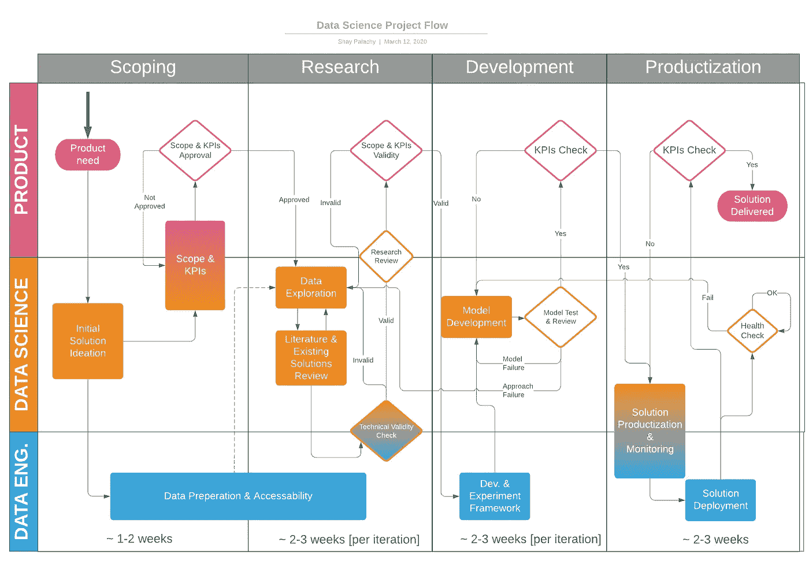
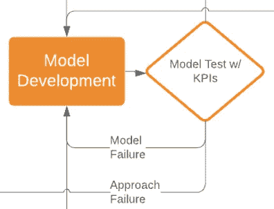

# 面向初创企业的数据科学项目流程

> 原文：<https://towardsdatascience.com/data-science-project-flow-for-startups-282a93d4508d?source=collection_archive---------2----------------------->

## 数据科学家对我们流程的看法

最近，我正在咨询的一家初创公司( [BigPanda](https://www.bigpanda.io/) )要求我就数据科学项目的结构和流程发表意见，这让我思考是什么让它们独一无二。经理和创业公司的不同团队可能会发现数据科学项目和软件开发之间的差异，这种差异既不直观又令人困惑。如果没有明确说明和解释，这些基本差异可能会导致数据科学家和她的同事之间的误解和冲突。

分别来说，来自学术界(或高度研究导向的行业研究小组)的研究人员在进入初创公司或较小的公司时可能会有自己的挑战。他们可能会发现将新类型的输入(如产品和业务需求、更严格的基础架构和计算约束以及客户反馈)融入到他们的研发流程中很有挑战性。

这篇文章的目的是展示我和我的同事们在近几年的工作过程中发现的有特色的项目流程。希望这可以帮助数据科学家和与他们一起工作的人以反映他们独特性的方式构建数据科学项目。这篇文章还由[的第二篇博文](https://medium.com/@shay.palachy/peer-reviewing-data-science-projects-7bfbc2919724?source=friends_link&sk=914d618224f713cbcabf1f6ead3ba3d9)补充，这篇博文致力于[同行评审流程](https://medium.com/@shay.palachy/peer-reviewing-data-science-projects-7bfbc2919724?source=friends_link&sk=914d618224f713cbcabf1f6ead3ba3d9)，这是这个流程的一部分。

该流程是在小型初创公司的基础上构建的，其中一个小型数据科学家团队(通常是一到四个)每次由一个人领导运行中短期项目。更大的团队或那些机器学习优先的高科技初创公司可能仍然会发现这是一个有用的结构，但在许多情况下，那里的流程更长，结构也不同。

Figure 1: Data Science Project Flow for Startups

我将这个过程分为三个并行的方面:产品、数据科学和数据工程。在许多情况下(包括我工作过的大多数地方)，可能没有数据工程师来履行这些职责。在这种情况下，数据科学家通常负责与开发人员合作，在这些方面提供帮助。或者，数据科学家可能会做这些准备，如果他们碰巧是所有神兽中最稀有的:*全栈数据科学家！* ✨🦄✨.因此，无论何时提到*、*，您都可以用*数据科学家*替换*数据工程师*，这取决于您的环境。

在时间轴上，我将这个过程分为四个不同的阶段:

1.  辖域
2.  研究
3.  (模型)开发
4.  部署

我会试着按顺序向你介绍每一个。

# 1.范围界定阶段

定义数据科学项目的范围比任何其他类型的项目都更重要。

## 1.1.产品需求

一个项目应该总是从产品需求开始(即使最初的想法是技术性的或理论性的)，这种需求在某种程度上被产品/业务/客户成功人士所确认。产品人员应该知道这个功能应该(大致)如何结束，现有客户或新客户是否愿意为它付费(或者它将防止流失/推动订阅/推动其他产品的销售/等等)。).

产品需求不是一个完整的项目定义，而是应该作为一个问题或挑战来陈述；例如*“我们的客户需要一种了解他们如何花费预算的方式”*或*“我们无法让我们的老年用户继续服药；这增加了客户流失率"*或*“客户会为一个还能预测他们经营的机场高峰时间的产品支付更多的钱”*。

## 1.2.初始解决方案构思

在这里，数据科学家与产品负责人、数据工程师和任何其他利益相关者一起，为可能的解决方案提出不同的草图。这意味着一般方法(例如，无监督聚类与基于提升树的分类与概率推理)**和**要使用的数据(例如，我们数据库中的特定表格，或者我们尚未监控或保存的特定用户行为，或者外部数据源)。

这通常还涉及某种程度的数据探索。你不能真正深入这里，但任何有前途的“低挂水果”可以帮助指导构思。

数据科学家应该领导这一过程，并且通常负责提供大多数解决方案想法，但是我强烈建议您使用所有参与解决方案构思过程的人；我有幸从后端开发人员、首席技术官或产品负责人那里获得了项目的最佳解决方案。不要假设不同的、更少理论导向的背景会使人们不参与这个阶段；额外的想法和观点总是有价值的。

## 1.3.数据准备和可访问性

团队现在应该对有望用于探索可能的解决方案的数据有一个很好的想法(或者至少是第一个这样的数据集或数据源)。因此，提供数据访问并为探索和使用做好准备的进程应该已经开始，与下一阶段并行。

这有时可能需要将大型数据集从生产数据库转储到它们的暂存/探索副本中，或者转储到较冷的存储中(例如，对象存储),如果在研究阶段时间可用性并不重要的话。相反，这可能意味着将大型数据转储从非常冷的存储中拉回表或文档形式，以实现快速查询和复杂计算。无论是哪种情况，这个阶段都是研究阶段开始所必需的，并且经常会比预期花费更多的时间，所以这是启动它的正确时间。

## 1.4.范围和关键绩效指标

这个阶段是关于共同决定项目的范围和 KPI。

KPI 应该首先用产品术语来定义，但要比以前详细得多；例如，对于上述三种产品需求，它们可能会变成*“客户现在可以使用带有每个类别的 CTR 统计和预测的仪表板”*，或者*“65 岁以上用户错过的服药天数将在接下来的两个季度中减少至少 10%”*，或者*“客户将收到其机场高峰时间的每周预测，粒度至少为一小时，近似值至少为 50%”*。

这些 KPI 应该被转化为可测量的模型度量。幸运的话，这些将是非常硬的指标，例如*“对于任何运行至少一周的广告，以及任何具有两个月以上历史数据的客户，在至少 Y%的情况下，预测广告的预期点击率至少接近 X %”*。然而，在某些情况下，必须使用更软的指标，例如*“与原始查询相比，使用生成的扩展查询进行主题探索所需的时间将会缩短，和/或结果质量将会提高”*。当模型旨在帮助一些复杂的人类功能时，尤其如此。

从技术上来说，即使这些指标也可以非常严格地定义(在学术研究中，它们通常是这样)，但是根据资源和时间的限制，我们可能会使用人类的反馈来近似地解决它们。在这种情况下，每个反馈迭代可能会花费更长的时间，因此我们通常会试图找到额外的硬指标来指导我们完成大多数即将到来的研究迭代，代价更高的反馈仅在每几个迭代或重大更改时引发一次。

最后，范围在这里特别重要，因为研究项目往往会拖延，并且随着研究过程中新的可能性的出现，或者当一种经过检验的方法只能部分满足需求时，项目的规模和范围会自然扩大。

**范围限制 1:** 我发现明确限制范围更有成效；例如，如果您已经决定了一个基于 Multi-Armed Bandit 的模型是最有前途的开始方法，那么您可以将项目范围定义为一个两三周的模型开发迭代，部署模型而不考虑它的准确性(例如，只要它超过 60%)。然后，如果准确性的提高是有价值的(在某些情况下，它可能不那么有价值)，开发第二个模型可能被认为是一个单独的项目。

**范围限制 2:** 范围限制的另一个变化是使用增加的复杂度；例如，第一个项目可能旨在部署一个模型，该模型只需要为您自己的客户成功人士提供一个相当大的广告措辞和颜色变化的候选集；第二种可能试图建立一个模型，给出一个更小的建议集，让客户可以看到自己；最后一个项目可能会尝试一个突出单一选项的模型，比它低几级，并为每个变量添加 CTR 预测和人口统计范围。

> 这已经与软件工程大相径庭，在软件工程中，组件通常是为了增加规模而不是复杂性而迭代的。

然而，度量到产品价值的函数可能是一个阶跃函数，这意味着在某个 X 值下运行的任何模型对客户来说都是无用的；在这些情况下，我们更喜欢迭代，直到那个阈值被抑制。然而，虽然这个 X 在某些情况下可能非常高，但我相信产品/业务人员和数据科学家都倾向于高估这个台阶的高度；可以很容易地说，任何低于 95%准确率的东西都没有价值，都卖不出去。然而，在许多情况下，对产品假设的仔细检查和挑战可能会导致非常有价值的产品在技术上可能不那么苛刻(至少对于产品的第一次迭代)。

## 1.5.范围和 KPI 批准

最后，产品负责人需要批准定义的范围和 KPI。数据科学家的工作是确保每个人都理解范围的含义——包括什么和优先考虑什么——以及产品 KPI 和更难的指标之间的关系，这些指标将在模型开发期间指导她，包括后者在多大程度上接近前者。明确说明这一点可以防止被开发模型的消费者——产品和业务人员——只在模型开发期间或之后才理解错误的度量被优化。

## 关于范围界定的一般说明

在许多地方，这一阶段被跳过，数据科学家急于开始挖掘数据，探索关于可能的解决方案的酷论文；根据我的经验，这几乎总是最坏的情况。跳过这一阶段可能会导致花费数周或数月的时间来开发酷模型，最终无法满足真正的需求，或者无法实现一个非常具体的 KPI，而这个 KPI 本来可以通过一些预谋来明确定义。

# 2.研究阶段

## 2.1.数据探索

这就是乐趣的开始！在范围界定之后开始这个阶段的主要优点是，我们的探索现在可以由我们已经决定的实际硬 KPI 和模型度量来指导。

一如既往，在探索和开发之间需要找到一个平衡点；即使心中有明确的 KPI，在一定程度上探索一些看似不相关的途径也是有价值的。

到目前为止，数据工程应该已经提供了所需的初始数据集。然而，在这个阶段，经常会发现所研究的数据中的一些缺陷，并且额外的数据源可能会被添加到工作集中。数据工程师应该为此做好准备。

最后，尽管这里与文献和解决方案评审阶段分开，但它们通常是并行进行的，或者交替进行。

## 2.2.文献与解决方案评论

在这一阶段，学术文献和现有的代码和工具都要接受审查。平衡也很重要；在探索和开发之间，在深入到错综复杂的材料中，在快速提取有用信息和可能的用途之间。

在学术文献的情况下，对形式证明和先前文献等方面的深入程度的选择在很大程度上取决于时间限制和项目的背景:我们是在为公司的核心能力建立一个强大的基础，还是在为一次性问题设计一个解决方案？我们计划在一篇学术论文中发表我们在这个主题上的工作吗？你打算成为团队在这方面的专家吗？

> 例如，假设一名数据科学家正在着手一个项目，以帮助销售部门更好地预测潜在客户产量或流失量，但她觉得自己对随机过程理论了解不多，而这些问题的许多常见解决方案都是建立在随机过程理论的基础上的。对这种感觉的适当反应可以是非常不同的；如果她在一家算法交易公司工作，她肯定会一头扎进上述理论，甚至可能会上一门关于这个话题的在线课程，因为这与她的工作非常相关；另一方面，如果她在一家专注于肝脏 x 射线扫描中自动肿瘤检测的医疗成像公司工作，我会说她应该迅速找到一个适用的解决方案，然后继续前进。

在代码和实现的情况下，要达到的理解深度取决于技术方面，其中一些可能在过程的后期才被发现，但许多也可以提前预测。

> 例如，如果生产环境只支持部署 Java 和 Scala 代码以供后端使用，那么解决方案应该以 JVM 语言提供，数据科学家将不得不更深入地研究她在研究阶段发现的基于 Python 的实现，因为将它们推进到模型开发阶段需要将它们翻译成 JVM 语言。

最后，在回顾文献的时候，记住不仅仅是选择的研究方向(或者几个方向)应该呈现给团队的其他成员。相反，在做出选择的同时，应该对该领域和所有被检查的解决方案进行简要回顾，解释每个方向的优缺点以及做出该选择的理由。

## 2.3.技术有效性检查

对于一个可能的解决方案的建议，数据工程师和任何相关的开发人员需要在数据科学家的帮助下，估计这个解决方案在生产中的形式和复杂性。产品需求以及建议解决方案的结构和特征应该有助于确定足够的数据存储、处理(流与批处理)、扩展能力(水平和垂直)以及成本的粗略估计。

这是在这个阶段执行的一个重要检查，因为一些数据和软件工程可以与模型开发并行开始。此外，从工程角度来看，建议的解决方案可能不够充分或成本过高，在这种情况下，应尽快确定并解决这一问题。当在模型开发开始之前考虑技术问题时，在研究阶段获得的知识可以用来建议可能更适合技术约束的替代解决方案。这也是为什么研究阶段还必须对解决方案前景有所了解，而不仅仅是单一解决方案方向的另一个原因。

## 2.4.研究综述

这是一个专门针对此阶段的同行评审流程，由一位数据科学家提供。如上所述，这里的主要目标是通过明确地将过程的核心方面置于检查之下，同时还对几个捕获点执行基本的健全性检查，来尽早捕捉代价高昂的错误(即*接近失败*)。

然而，这里可以陈述两个额外的子目标:首先，提高数据科学家在即将到来的产品/业务评审过程中解释和捍卫其决策的能力。第二，更好地准备向团队的其他成员展示研究阶段的成果，这在大多数数据科学团队/小组中是一种极其常见和重要的做法。

我已经给[写了一篇单独的简短博文](https://medium.com/@shay.palachy/peer-reviewing-data-science-projects-7bfbc2919724?source=friends_link&sk=914d618224f713cbcabf1f6ead3ba3d9)来介绍这个过程，以及执行这个过程的结构化方法。

## 2.5.范围和 KPI 验证

同样，产品经理需要批准建议的解决方案(现在用更专业的术语表述)满足范围和定义的 KPI。通常具有容易察觉的产品含义的可能的技术标准是响应时间(及其与计算时间的关系)、数据的新鲜度和有时缓存的中间计算(与查询和批量计算频率有关)、领域特定模型(领域通常是客户，但可以是行业、语言、国家等)的领域适应的难度和成本(包括数据成本)以及解决方案的可组合性(例如，数据和模型结构是否允许容易地将一个国家模式分解为一个区域模式，或者将几个这样的模式组合为一个洲模式)，尽管还存在更多

# 3.发展阶段

## 3.1.模型开发和实验框架设置

开始模型开发所需的设置数量和复杂性在很大程度上取决于基础设施和数据科学家可用的技术支持数量。在较小的地方，以及还不习惯支持数据科学研究项目的地方，设置可能总结为数据科学家打开一个新的代码存储库并启动本地 Jupyter 笔记本服务器，或者请求一个更强的云机器来运行计算。

在其他情况下，它可能需要为更复杂的功能编写定制代码，例如数据和模型版本化或者实验跟踪和管理。当这种功能由一些外部产品或服务提供时(现在越来越多的产品或服务出现了)，一些连接数据源、分配资源和设置定制包的设置可能会随之而来。

## 3.2.模型开发

有了所需的基础设施，实际的模型开发就可以开始了。此处被视为要开发的模型的范围因公司而异，并且取决于数据科学家要交付的模型和要在生产中部署的服务或功能之间的关系和划分。这种划分的各种类型的方法也许可以通过考虑一个范围而得到某种程度的把握。

在光谱的一端，一切都是模型:从数据聚合和预处理，通过模型训练(可能定期)，模型部署，服务(可能有伸缩性)和持续监控。另一端是模型类型和超参数的选择，通常还有高级数据预处理和特征生成，被认为是模型的*。*

一家公司在光谱上的位置取决于许多因素:数据科学家更喜欢的研究语言；相关库和开源可用性；公司支持的生产语言；存在专门致力于数据科学相关代码的数据工程师和开发人员；以及数据科学家的技术能力和工作方法。

如果有一个非常全面的数据科学家，加上来自专门的数据工程师和开发人员的足够支持，或者，有足够的现有基础设施专门用于数据湖和聚合、模型服务、缩放和监控(可能还有版本控制)的操作和自动化，那么可以对模型进行更广泛的定义，并且可以在模型开发的大部分迭代中使用端到端解决方案。

这通常意味着首先构建完整的管道，从数据源一直到可扩展的服务模型，为数据预处理、特征生成和模型本身提供简单的占位符。然后对数据科学部分进行迭代，同时将范围限制在现有基础设施上可用和可部署的内容。

这种端到端的方法可能会花费更多的时间来设置，并且模型类型和参数的每次迭代会花费更长的时间来测试，但是它可以节省以后在产品化阶段所花费的时间。

我个人很喜欢它，但是它的实现和维护很复杂，而且并不总是合适的。在这种情况下，管道的开始和结束的一些部分被留给产品化阶段。

## 3.3.模型试验

在开发模型时，不同版本的模型(以及伴随它的数据处理管道)应该根据预先确定的硬性指标进行连续测试。这提供了对进度的粗略估计，并且还允许数据科学家决定模型何时工作得足够好以保证整体 KPI 检查。请注意，这可能会产生误导，例如，在许多情况下，从 50%到 70%的准确率要比从 70%到 90%的准确率容易得多。

Figure 2: Model failure entails iteration, but an approach failure might send you back to research

当测试表明一个模型不符合标准时，我们通常会调查它和它的输出来指导改进。然而，有时表现的差距非常大，所选研究方向的不同变化都达不到要求——一个*方法失败*。这可能需要改变研究方向，将项目送回研究阶段。这是数据科学项目最难接受的方面:回溯的真实可能性。

*方法失败*的另一个可能结果是目标的改变。幸运的话，它可能是产品方面的小问题，但在技术上以更简单的方式重申了目标。

> 例如，不要试图用一句话概括一篇文章，而是选择文章中最能概括它的句子。

最终可能的结果当然是项目取消；如果数据科学家确信已经探索了所有的研究途径，并且产品经理确信不能围绕现有的性能构建有效的产品，那么可能是时候转移到另一个项目了。不要低估识别一个不可救药的项目的能力和决定结束它的勇气；这是*快速失效*方法的关键部分。

## 3.4.模型开发评论

正如在研究综述中，这里的动机是模型开发阶段的错误也可能是昂贵的。因此，目标是相同的:首先，为模型开发阶段提供一个结构化的审查过程，这将通过正式地将它合并到项目流程中来增加同行审查。第二，通过检查准备好的问题和议题列表来降低代价高昂的错误的风险，这些问题和议题是根据必须解决它们的其他数据科学家的宝贵经验来检查的。

我已经给[写了一篇单独的简短博文](https://medium.com/@shay.palachy/peer-reviewing-data-science-projects-7bfbc2919724?source=friends_link&sk=914d618224f713cbcabf1f6ead3ba3d9)来介绍这个过程，以及执行这个过程的结构化方法。

## 3.5.KPI 检查

如果预先确定的硬性指标是唯一的 KPI，并且准确地捕获了所有的产品需求，那么这个阶段可能更多的是一种形式，当最终的模型被呈现并且开发阶段被宣布结束时。**通常情况不是这样。**

在更常见的情况下，硬性指标是实际产品需求的一个很好的近似，但不是完美的。因此，这个阶段是一个机会，可以确保无法自动检查的更软的指标也得到满足。这是与产品和客户的成功一起完成的。如果您可以直接额外检查客户的实际价值——例如，当与设计合作伙伴一起工作时——那么这是您可以为您的迭代找到的最佳指南。

> 例如，假设我们正在处理一个复杂的任务，比如从一个巨大的语料库中提取给定查询的相关文档。团队可能已经决定尝试提高结果集的质量，关注返回文档的内容和主题的差异，因为客户认为系统倾向于将非常相似的文档聚集在顶部结果中。
> 
> 模型开发可能随着结果集中内容变化的一些可测量的度量而进展——给定一组测试查询，每个模型根据它返回的前 20 个文档的变化程度来评分；也许您在一些主题向量空间中测量文档主题之间的总距离，或者仅仅测量独特主题的数量或者重要单词分布的平坦性。
> 
> 即使当数据科学家选定了一个显著改进这个度量的模型，产品和客户成功人士也应该明确地看一看测试查询的一个重要样本的实际结果；他们可能会发现难以量化但可能解决的问题，例如通过推高一些重复出现的不相关主题，或通过包含类似主题但来自不同来源的结果(例如，新闻文章与推文，它们使用非常不同的语言)来增加结果差异的模型。

当产品人员确信模型回答了项目的既定目标(达到令人满意的程度)时，团队就可以将它产品化了。

# 4.部署阶段

## 4.1.解决方案产品化和监控设置

如前所述，这一阶段取决于数据科学研究和公司模型服务的方法，以及几个关键的技术因素。

产品化:在研究语言可以用于生产的情况下，这个阶段可能需要修改模型代码，以可伸缩的方式工作；这个过程的简单或复杂程度取决于对模型语言的分布式计算支持，以及所使用的特定库和定制代码。

当研究语言和生产语言不同时，这可能还涉及到将模型代码包装在生产语言包装器中，将其编译成低级二进制或在生产语言中实现相同的逻辑(或找到这样的实现)。

还需要设置可伸缩的数据接收和处理，在这种情况下(很常见),这不是模型的一部分。这可能意味着，例如，将在单核上运行的 Python 函数转换为数据流通过的管道，或者转换为定期运行的批处理作业。在大量数据重用的情况下，有时会建立一个缓存层。

**监控:**最后，设置一种持续监控模型性能的方式；在极少数情况下，当生产数据的来源是恒定的时，这也许可以安全地跳过，但是我要说，在大多数情况下，您不能确定源数据分布的稳定性。建立这样的性能检查，不仅可以帮助我们发现模型中的问题，这些问题可能是我们在开发和产品化过程中遗漏的，而且更重要的是，模型运行的源数据分布的变化——通常被称为*协变量转移*——这可能会及时降低一个完美模型的性能。

> 以为例，我们的产品是一个检测皮肤痕迹并评估是否建议用户去看皮肤医生的应用程序。当一款受欢迎的新手机上市时，其配备的摄像头与我们数据中的摄像头明显不同，我们的数据可能会发生协变量变化。

## 4.2.解决方案部署

如果一切都设置正确，那么这个阶段可以总结为，有希望地，按一个按钮来部署新模型——以及服务于它的任何代码——到公司的生产环境。

**部分部署:**但是，为了测试模型的有效性(例如，在减少客户流失或增加每个用户的平均月支出方面)，可能会以只有部分用户/客户群接触到模型的方式部署模型。这使得能够直接比较用户群中两个(或更多)组之间对任何可测量 KPI 的影响。

您可能不希望将模型部署到每个人的另一个原因是，如果它是为了满足特定客户或一组客户的需求而开发的，或者如果它是一个高级功能或特定计划的一部分。或者，该模型可能包含一些针对每个用户或客户的个性化元素；这有时可以通过实际拥有考虑客户特征的单一模型来实现，但有时需要为每个客户实际培训和部署不同的模型。

无论是哪种情况，所有这些场景都增加了部署模型的复杂性，并且取决于公司中现有的基础设施(例如，如果您已经向客户的子集部署了一些产品特性)，它们可能需要您的后端团队进行大量的额外开发。

当模型部署在终端产品(如用户手机或可穿戴设备)上时，这一阶段甚至会更加复杂，在这种情况下，模型部署可能只会作为下一个应用程序或固件更新部署的一部分。

**产生偏差:**最后，所有部分部署的情况实际上都是数据科学团队面临的一个紧迫问题，这是因为另一个原因:这自然会将偏差引入模型将开始积累的未来数据中——模型将开始对具有可能独特特征的用户子集的数据进行操作。根据产品和特定的偏差特征，这可能会对模型在野外的性能产生很大影响，并且可能会对基于在此期间积累的数据训练的未来模型产生影响。

> 例如，在设备更新的情况下，较早更新其应用程序/固件的用户往往属于某些人口统计数据(更年轻、更懂技术、更高收入等)。).

## 4.3.KPI 检查

我在这里添加了另一个 KPI 检查，因为我认为在部署和实际使用之后，在解决方案的性能和对产品和客户需求的成功响应得到验证之前，解决方案不能被标记为已交付。

这可能意味着在部署后的几周内筛选并分析结果数据。然而，当涉及实际客户时，这也必须涉及产品或客户成功人士，他们与客户坐在一起，试图理解模型对他们使用产品的实际影响。

## 4.4.交付的解决方案

用户和客户都很高兴。产品人员已经设法围绕该模型构建或修改了他们想要的产品。我们完了。举杯祝酒，欢呼喝彩，一切安好。

解决方案已经交付，我认为项目已经完成。然而，它确实以一种特定的方式继续生存——维护。

## 维护

为模型设置了健康检查和连续的性能监控之后，这些可以触发项目工作的短时间爆发。

当一些事情看起来可疑时，我们通常从查看数据开始(例如，对于协变量变化)，并且可能模拟模型对我们怀疑导致问题的各种情况的响应。这些检查的结果可以让我们进入几个小时的小代码更改、模型的重新训练和完整的模型开发迭代(如本文开头的图所示)，严重的情况下有时需要回到研究阶段尝试完全不同的方向。

# 最后的话

这是对数据科学项目流程的建议。它也非常具体，范围有限——为了简单和可见性——并且显然不能涵盖实践中存在的这个流程的许多变体。也代表了我的经历。

出于所有这些原因，我希望听到您在运行、领导或管理数据科学项目时的反馈、见解和经验，无论这些项目的规模有多大，也无论您所在的数据科学团队有多大。

关于这个话题的另一个精彩观点，我推荐阅读我的朋友 Ori 关于数据科学敏捷开发的文章。还要感谢[因巴尔·纳尔](https://medium.com/u/5d840e4443e4?source=post_page-----282a93d4508d--------------------------------)，希尔·梅厄·拉多尔([@数据夫人](http://twitter.com/DataLady))和[@塞弗](http://twitter.com/seffi)。科恩对他们的反馈。

Shay 是一名数据科学顾问。他还为一些社区项目工作。