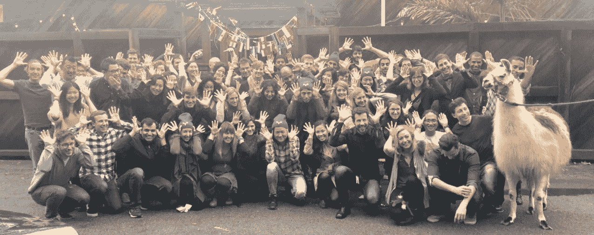
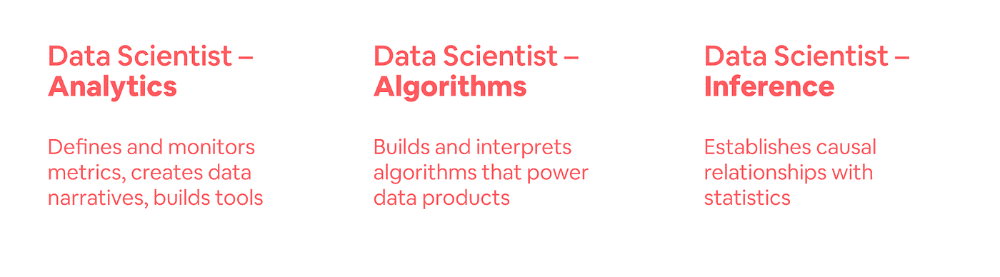
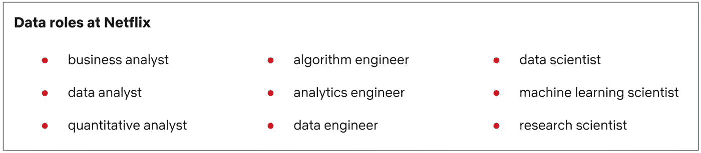
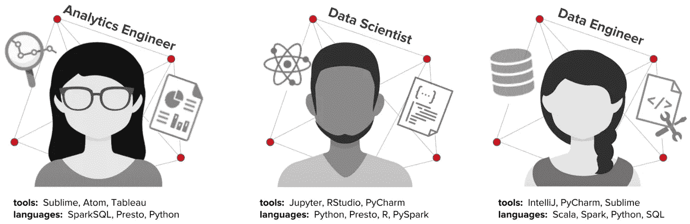
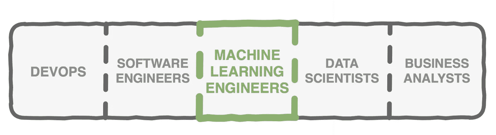
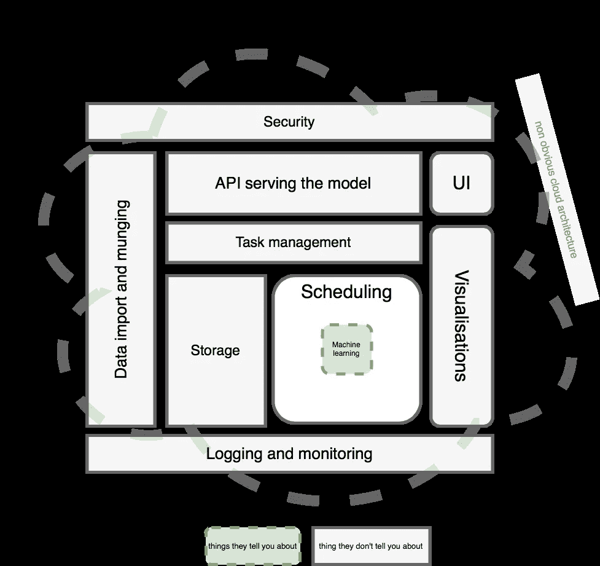

# 数据科学角色:一个分类问题

> 原文：<https://towardsdatascience.com/data-science-roles-a-classification-problem-ebe6fae10169?source=collection_archive---------18----------------------->

## 从业者和思想领袖的观点

Photo by [Nathan Dumlao](https://unsplash.com/@nate_dumlao?utm_source=medium&utm_medium=referral) on [Unsplash](https://unsplash.com?utm_source=medium&utm_medium=referral)

纵观数据科学领域，很明显这个领域不是一个单一的学科。在早先的[帖子](https://medium.com/@nmscott14/the-three-ps-of-data-science-9bfcabac62ae)中，我写道:

*“…数据科学——也是一门艺术——正在技术、人类好奇心和特定领域知识的交汇处发展…”*

同样，职位头衔“数据科学家”也不是一个单一的角色。它本质上是一个包罗万象的术语，包含了广泛的知识体系以及复杂的技能和责任组合。在他列出的 [**30 个数据科学术语解释**](https://www.springboard.com/blog/data-science-terms/) 中，亚历山大·埃金斯引用了美国第一任首席数据科学家 DJ·帕蒂尔的话:

*“数据科学家是一种独特的技能组合，既能开启数据的洞察力，又能通过数据讲述精彩的故事。”*

**这篇文章将介绍一些团队尝试对各种数据科学角色进行分类的方法。它将关注两个拥有成熟数据科学项目的大公司如何组织职称，还将从一个较小组织的数据科学家的角度介绍一些基本的非技术技能。它将考虑行业从业者和思想领袖眼中的数据科学职业轨迹。最后，它将为获得一些数据科学“邻近”技能提供建议，以便在这个快速发展的行业中增加价值并保持相关性。**

# 爱彼迎（美国短租平台）

截至 2018 年，Airbnb 雇用了 126 名数据科学家，而 2010 年只有一名。

[Image per Elena Grewal, Ph.D.](https://www.linkedin.com/pulse/one-data-science-job-doesnt-fit-all-elena-grewal/)

Airbnb 数据科学主管 Elena Grewal 博士在她的 2018 LinkedIn 帖子 [**中描述了公司内部的快速增长(以及行业内标准术语的缺乏)如何导致了一个转折点:**](https://www.linkedin.com/pulse/one-data-science-job-doesnt-fit-all-elena-grewal/)

*在给定的公司中，这种多样性的负面影响是它可能会导致组织混乱和人员流失，因为合作伙伴团队不知道从数据科学家那里可以期待什么，而数据科学家自己可能也不清楚他们的角色。”*

为了缓解这一问题，Airbnb 团队制定了战略，有意创造符合业务和人才需求的角色，同时也实现了预期的清晰化。结果是数据科学角色沿着三条轨道重组:

[Image per Elena Grewal, Ph.D.](https://www.linkedin.com/pulse/one-data-science-job-doesnt-fit-all-elena-grewal/)

团队中的每一位数据科学家都应该至少在数据科学领域的三个专业领域中的一个领域拥有专业知识:

*   **分析** — *仪表盘和可视化、数据探索和分析，通过提出好问题和提出建议来推动业务变革*
*   **算法** — *机器学习，通过生产数据创造商业价值*
*   **推论** — *统计学、经济学、社会科学、改善决策和衡量影响*

虽然这种程度的数据科学专业化对 Airbnb 这样的“高速增长”公司很有效，但 Grewal 建议较小的公司从更通用的方法开始。

# **网飞**

网飞依靠数据为全球 1.3 亿网飞会员提供个性化体验。据网飞科技博客报道:

*每天有超过 1 万亿个事件被写入流接收管道，这些事件被处理并写入 100PB 的云原生数据仓库。每天，我们的用户针对这些数据运行超过 150，000 个作业，涵盖从报告和分析到机器学习和推荐算法的所有内容。*

为了支持这项庞大的工作，网飞雇佣了三类数据专业人员:**分析师**、**工程师**和**科学家**:

Image per [Netflix Tech Blog](https://medium.com/netflix-techblog/notebook-innovation-591ee3221233)

虽然每个类别都有职位，但是角色之间的工具和职责可能会有一些重叠。

Image per [Netflix Tech Blog](https://medium.com/netflix-techblog/notebook-innovation-591ee3221233)

每个类别的数据专业人员可能会利用以下数据科学领域中至少两个领域的技能:

*   **数据探索— (** 发生在项目早期) *—查看样本数据、运行查询、统计分析、探索性分析和可视化*
*   **数据准备** —(迭代任务)— *数据的清理、标准化、转换、反标准化和聚合*
*   **数据验证** —(周期性任务)— *查看样本数据、运行查询、统计分析、汇总分析和可视化，用于数据探索、数据准备、开发、预部署和后部署*
*   **生产化** —(发生在项目后期)— *将代码部署到生产中，回填数据集，训练模型，验证数据，以及调度工作流*

像网飞这样的大公司可能会提供许多分工明确的数据专业人员。与此同时，数据的庞大数量和复杂性可能要求每个数据科学家除了专业技能之外，还需要一些通用的交叉知识。

# 较小的组织呢？

Shubh Loans 的首席数据科学家 Oriol Mirosa 在他的文章 [**为我们其余的人提供数据科学**](/data-science-for-the-rest-of-us-d69e9949b0f0) 中，就为什么小公司的数据科学家应该特别关注非技术工作提出了他的观点。虽然承认技术技能是必不可少的，但他认为特定的软技能可能是成功的关键指标。

对于基础设施和明确定义的数据项目尚未完全开发的小型公司的数据科学家，Oriol 提供了以下建议:

1.  **一直索要数据**
2.  **一直问问题**
3.  **一直问为什么**
4.  **一直求助**
5.  **寻求机会分享你一直以来的发现**

做这五件简单的事情所需要的批判性思维、好奇心、创造力和进取心的结合是不可低估的！这种“走来走去”的数据科学方法使数据科学家能够获得领域知识，理解业务数据和问题，并构思更好的业务指标和数据产品。通过与利益相关者密切合作获得的信誉也将使其更容易申请所需的资源，以在未来建立基础设施、数据和模型。

# 算法之外的数据科学

## 机器学习工程师的崛起

Emmanuel Ameisen 在他关于 2018AI 趋势的帖子中表示:

*“谈到招聘，硅谷各个团队的招聘经理最常抱怨的是，虽然不缺乏能够在数据集上训练模型的人，但他们需要能够构建数据驱动产品的* ***工程师*** *。”*

虽然数据科学家将执行构建机器学习模型所需的数据争论和统计分析，但他们可能并不总是拥有将原型模型集成到生产环境中所需的技能。这是机器学习工程师的专业知识越来越多地被利用的地方。

Image per [Tomasz Dudek](https://medium.com/@tomaszdudek/but-what-is-this-machine-learning-engineer-actually-doing-18464d5c699)

机器学习工程师托马斯·杜德克解释说:

".。。必须有人将所有的“数据科学”和“软件”部分粘在一起。将训练好的模型用于高质量的生产环境。安排批处理作业重新计算 insight 表。实时服务模型并监控其在野外的表现。这正是机器学习工程师大放异彩的领域。”

Image per [Tomasz Dudek](https://medium.com/@tomaszdudek/but-what-is-this-machine-learning-engineer-actually-doing-18464d5c699)

# 数据科学邻近技能

如前一节所述，具有前瞻性思维的数据科学家可能会考虑扩展他们的能力，以包括与机器学习工程师一致的技能。一些受欢迎的技能包括:

*   **Docker** — [*用于打包和部署定制应用的容器，包括所有必需的库依赖*](https://opensource.com/resources/what-docker)
*   **Spark —** [*面向大规模数据处理的统一分析引擎*](http://spark.apache.org/)
*   ***酸洗*** — [*为将来存储对象、函数和类的方法*](https://medium.com/@kwamae.delva/ode-to-pickles-bba6b300b982)

Photo by [Reka Biro-Horvath](https://unsplash.com/@allwithzest?utm_source=medium&utm_medium=referral) on [Unsplash](https://unsplash.com?utm_source=medium&utm_medium=referral)

## 面向未来的数据科学家角色

在她的文章 [**中，数据科学不同于现在的**](http://veekaybee.github.io/2019/02/13/data-science-is-different/) **，**实践者和思想领袖维基·博伊基斯提醒我们:

*“虽然优化模型、可视化和分析占据了你作为数据科学家的一些时间，但数据科学一直以来都主要是在一个地方获取干净的数据，用于插值。”*

对于寻求职业生涯“未来证明”的数据科学家，她推荐了以下三项技能:

1.  **学习 SQL**
2.  非常好地学习一门程序语言
3.  [**学习如何在云中工作**](https://veekaybee.github.io/2018/01/28/working-with-aws/)

Photo by [Dallas Reedy](https://unsplash.com/@dallasreedy?utm_source=medium&utm_medium=referral) on [Unsplash](https://unsplash.com?utm_source=medium&utm_medium=referral)

# **结论**

我希望这篇文章提供了一个对数据科学角色进行分类的框架，以及对数据科学工作不断发展的范围的一些见解。Airbnb 数据科学主管 Elena Grewal 博士就围绕标准分类术语的发展形成对话提出了以下思考:

*“在数据科学领域，我们越是能够联手建立规范，我们的行业就会成熟得越快，我们作为个体也就越有能力驾驭这个行业。”*

## 奖金！

如需更多视角，请查看 Hugo Bowne-Anderson 根据 35 位数据科学家 *对 [***进行的 2018 年哈佛商业评论采访汇编。***](https://hbr.org/2018/08/what-data-scientists-really-do-according-to-35-data-scientists?referral=03759&cm_vc=rr_item_page.bottom)*

Photo by [CoWomen](https://unsplash.com/@cowomen?utm_source=medium&utm_medium=referral) on [Unsplash](https://unsplash.com?utm_source=medium&utm_medium=referral)

感谢阅读！