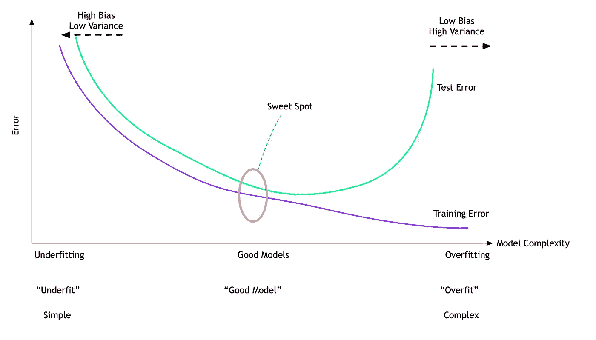
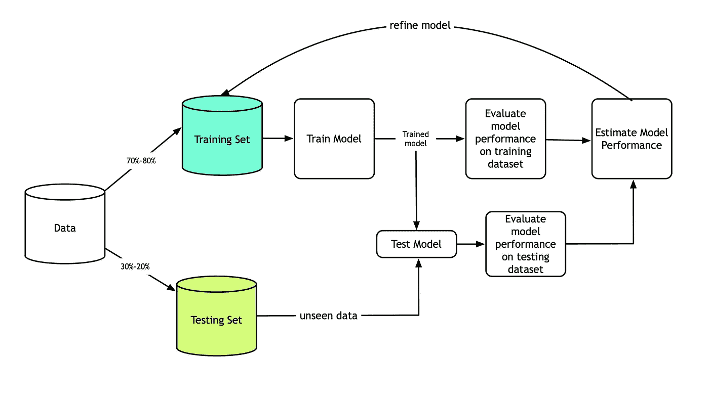
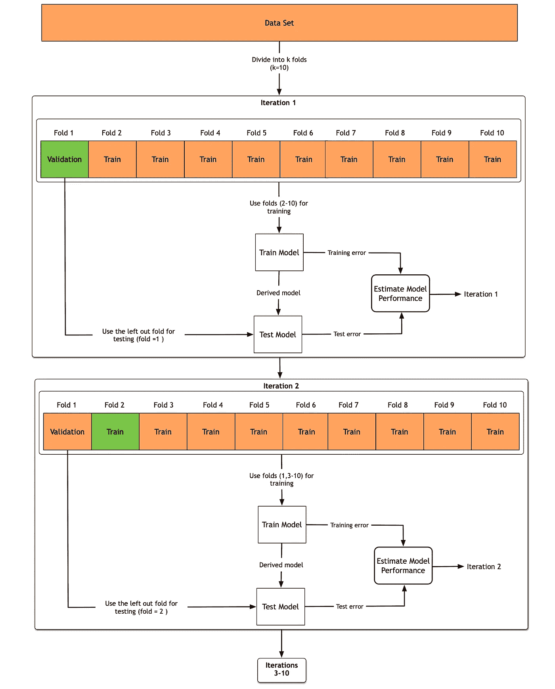
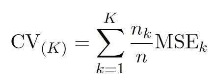
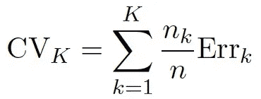
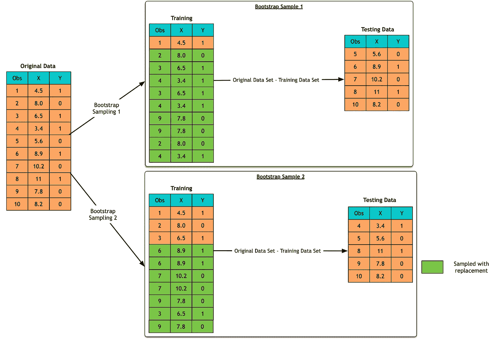

# 数据科学简化版第 12 部分:重采样方法

> 原文：<https://towardsdatascience.com/data-science-simplified-part-12-resampling-methods-e029db77fa9c?source=collection_archive---------11----------------------->

# 概念

机器学习算法有一种从数据中学习模式的方法。该方法是直观的。该模型从给定的数据集中确定潜在的模式。这个过程叫做**训练**模型。经过训练的模型在另一个它以前没有见过的数据集上进行测试。目标始终是找到最佳模型。努力达到模型在训练集和测试集上表现令人满意的最佳状态。

测试误差是模型根据新观测值进行预测时出现的平均误差。这一新的观察结果是以前的模型所没有的。训练错误率通常与测试错误有很大的不同，并且会极大地低估后者。

随着模型复杂度的上升，训练误差也随之下降。训练误差下降是因为模型的复杂性有助于它学习训练数据中发现的所有变化。这个过程被称为过度拟合。然而，由于测试样本是看不见的数据，过度拟合的模型在测试样本上表现不佳。
促成这种行为的成分是偏差和方差。

**偏差定义为预测值与实际值的差距。**
**方差定义为估计值与其平均值相差的程度。**

随着模型变得复杂，会发生以下情况:

*   当拟合度较低时，意味着偏差较高，方差较小。
*   随着模型复杂性的增加，偏差会下降。复杂模型可以适应数据点中的各种行为。
*   然而，方差也会增加，因为这意味着它必须估计越来越多的参数。

> *偏差-方差权衡是该模型渴望实现的最佳点。*

模型训练的过程和它训练的数据一样好。那么，我们如何确保数据中的偏差不会渗透到模型训练中呢？我们如何确保模型足够一般化？

重采样方法用于确保模型足够好，并且能够处理数据中的变化。该模型通过对数据集中发现的各种模式进行训练来实现这一点。本文讨论了这些重采样方法。

# 验证集方法

验证集方法是一种用于训练和测试的简单抽样方法。数据被分成两部分。第一部分用于训练模型。该模型从训练数据中学习。数据的第二次分割用于测试模型。

验证集方法很简单。然而，它也有自己的缺点。

*   首先，模型基于训练数据学习的内容高度依赖于训练集中包含的观察值。如果训练集中包括异常值观察，则模型将倾向于从可能与实际数据不相关的异常值观察中学习。
*   第二，在训练集中仅包括观察值的子集。排除用于训练的观察值意味着模型将无法学习测试集中数据的细微差别。

一般来说，验证集误差倾向于高估测试误差。

# k 倍交叉验证

我们已经看到了验证集方法的挑战。K-fold 交叉验证方法被用来克服这些挑战。这种方法的工作原理如下:

1.  数据被分割成称为 fold (k)的东西。典型地，有 5 或 10 个相等的折叠。每个文件夹都有一组随机数据点。
2.  在第一次迭代中，在(k-1)个褶皱上训练模型，并在一个遗漏的褶皱上进行测试。
3.  重复该过程，直到模型在所有褶皱上被训练和测试。

让我们举一个例子。

1.  在这个例子中，我们有一个数据集。这个数据集被分成十等份。
2.  对于第一次迭代，使用九个折叠来训练模型，即折叠 2-10。
3.  模型在第一次折叠时进行测试，即折叠#1。
4.  为迭代 1 记录训练和测试错误。
5.  在第二次迭代中，再次使用九个折叠来训练模型。但是，在这种情况下，折叠一与其他八个折叠一起用于训练。培训在第 1、3-10 折进行。
6.  该模型在第二次折叠时进行测试，即折叠#2。
7.  迭代 2 中记录了训练和测试错误。
8.  这个过程一直持续到所有的褶皱都被训练一次，然后在所有的褶皱上对模型进行测试。

**基于所有迭代的平均误差来计算模型的整体性能。**

*   对于回归模型，所有折叠的平均误差可定义如下:

其中 MSE 是均方误差。

*   对于分类器，所有折叠的平均误差可定义如下:

其中 Err 可以是分类器指标，如 AUC、召回率、精确度等。

正如我们所看到的，k-fold 交叉验证方法消除了验证集方法的许多缺点。它主要做了一项出色的工作，确保偏见不会渗透到模型性能中。它通过对每个褶皱进行训练和测试来优雅地做到这一点。

然而，正如所预料的那样，与验证集方法所采用的简单方法相比，这种方法可能非常耗时。由于交叉验证方法比验证集方法多训练(k-1)倍，因此所消耗的时间是明显的。这个问题可能会更明显，尤其是当训练集很大的时候。

# 自助抽样

另一种数据抽样方法是使用 *bootstrap 抽样*方法。Bootstrap 是一种灵活而强大的统计方法，可用于量化与估计量相关的不确定性。引导过程采用以下方法:

1.  我们不是从总体中重复获得独立的数据集，而是通过从原始数据集*中重复采样观察值并替换来收集不同的数据集。*
2.  这些引导数据集的每一个都是通过替换采样创建的，并且与我们的原始数据集大小相同。
3.  一个观察值可能在 bootstrap 样本中出现不止一次，也可能根本不出现。

让我们看一个例子来更好地理解它。

在上图中，有十个观察值。自举采样的工作方式如下:

1.  原始数据集有十个观测值。
2.  训练集是与原始数据集大小相同的*，即训练是在 10 次观察的基础上完成的。然而，训练集中的观察结果是从原始数据集中重复的。在上面的例子中，对于第一次迭代，从原始数据集重复观测值 2、3、4 和 9。不重复观察#1。*
3.  一旦模型被训练，它就在看不见的数据上被测试。看不见的数据是那些不在训练数据集中但存在于原始数据集中的观察值。测试数据集是*原始数据集——训练数据集。*

对于自举样本#2，也重复这三个步骤。对于规定数量的引导样本(通常在 1000 个样本的范围内)，该过程继续进行。总体 bootstrap 估计是从每个 bootstrap 样本估计中获得的估计的*平均值。*

与一般的训练测试分割机制相比，Bootstrap 估计在其估计中具有较低的方差。

自举抽样在实践中是有利的。

> *如果感兴趣的观测值相对较少，可以使用 bootstrap 采样对数据集中的相同观测值进行重复采样，以进行训练。*

# 结论

本文阐述了三种重采样方法。总的想法是让模型尽可能多地学习。为了让模型尽可能多地学习，应该对基础数据集中的各种数据点进行训练。在实践中，简单验证方法用于快速创建模型。然后通过使用 *K 倍交叉验证*方法进一步增强。

# 参考

1.  加雷斯·詹姆斯，丹妮拉·威滕，特雷弗·哈斯蒂，罗伯特·蒂布拉尼。《统计学习导论:在 r .纽约的应用》: Springer，2013 年。

本文最初发表于 [www.datascientia.blog](https://datascientia.blog/)