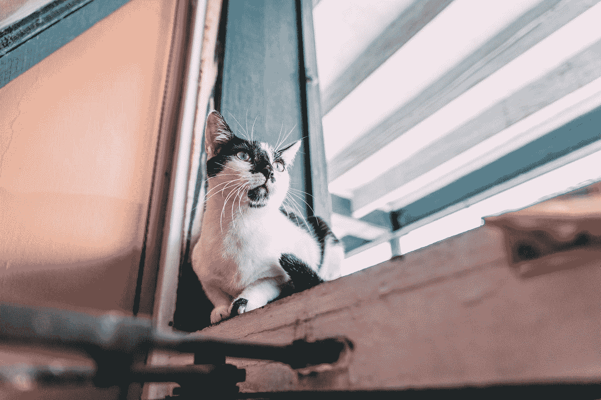
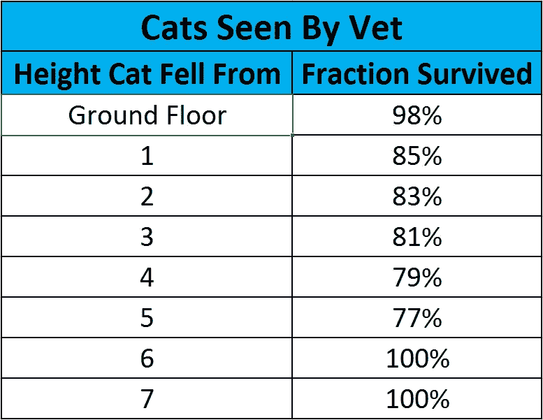
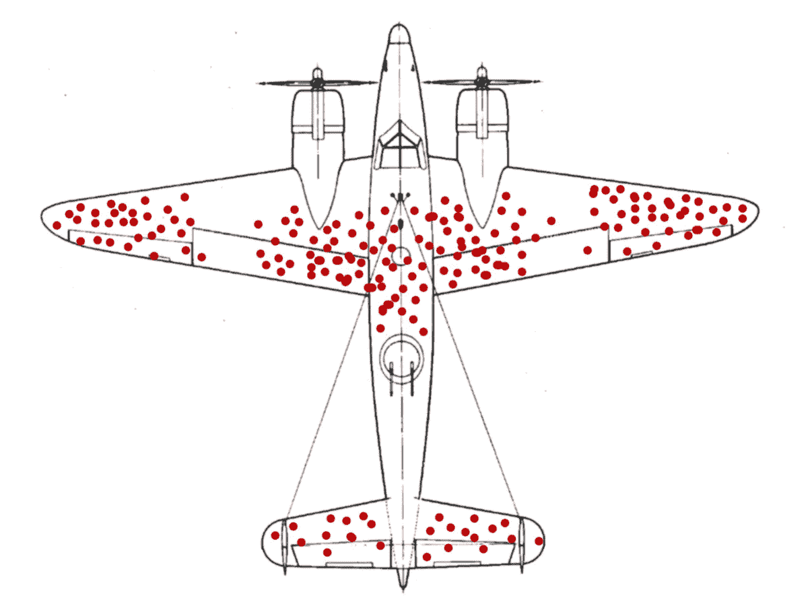

# 缺失的数据可能是最好的数据

> 原文：<https://towardsdatascience.com/data-science-sometimes-the-absent-data-is-the-best-data-ae2fe8b78db1?source=collection_archive---------26----------------------->

Photo by [Sander Weeteling](https://unsplash.com/@sanderweeteling?utm_source=medium&utm_medium=referral) on [Unsplash](https://unsplash.com?utm_source=medium&utm_medium=referral)

作为一名数据科学家，你经常会收到一组数据和一个问题。良好的逻辑思维确实有助于梳理出解决方案，所以让我们从一个虚构的滑稽例子开始，让你的脑细胞运转起来。

# 疯狂猫人住宅

> 一个房地产开发商想进入多层退休建筑市场。给一点背景，他们解释说，该地区的老人往往有很多猫，老人可能会太热，往往让他们的窗户开着。
> 
> 通过询问，他们发现竞争对手有大量的法律问题，比如猫从窗户上掉下来会死。这可能会导致坏名声，而且仅仅密封所有的窗户也不是一个解决方案，因为这会降低他们可以收取的租金，因为他们感觉质量较差，而且他们必须安装昂贵的空调来保持居住者凉爽。
> 
> 他们问你的问题是“我们需要密封多少层楼的窗户，这样我们才能限制掉下来的猫的数量？”

## 不要这样做，蒂布斯！

Photo by [Tucker Good](https://unsplash.com/@tuckergood?utm_source=medium&utm_medium=referral) on [Unsplash](https://unsplash.com?utm_source=medium&utm_medium=referral)

你得到的额外信息是，他们的盈亏平衡是，猫需要至少 85%的机会幸存下来，才能在经济上保持窗户不密封。他们没有关于身高的生存机会的信息，所以你努力去该地区的兽医那里，统计从瀑布带进来的猫的数量，并计算出存活的比例。

Fictitious data for cat survival rates from falls.

瞧啊。你的答案出现了。所以，现在让我们尝试一个更现实的例子。

# 让飞机在战争中停留在空中

在第二次世界大战期间，提高飞机(以及飞行员)的生存能力是一个迫切需要的领域。如果你能让你的飞机比你的敌人生存得更好，那么你就有明显的物质优势(随着战争的进行，这是紧张的战争经济的一个大问题)，但也意味着你有更大的耐力，因为飞机可以被修理和返回，而不需要等待全新的飞机和潜在的新飞行员。

最简单的解决方案是通过增加整体加固来增加飞机的装甲。然而，这是令人难以置信的不可取的，因为它增加了飞机的重量，使用了更多的资源(包括建筑和燃料),并且总体上意味着它在对抗敌人的轻型(和灵活)飞机时表现不佳，实际上降低了它们的生存能力。

> 他们提出的问题是“哪里最急需盔甲？”

要做到这一点，你需要任何科学家或数学家的心血，数据！他们对返航的飞机进行了观察，对遭受的损坏进行了分类，并将其覆盖在飞机的图上。

Hypothetical distribution of damage caused by enemy action. [Source](https://en.wikipedia.org/wiki/File:Survivorship-bias.png)

我们走吧！你可以清楚地看到装甲需要去哪里。但是当图表缺少一个关键的信息来源时，你能做到吗？

# 剧情转折！

Photo by [Ben White](https://unsplash.com/@benwhitephotography?utm_source=medium&utm_medium=referral) on [Unsplash](https://unsplash.com?utm_source=medium&utm_medium=referral)

如果你假设敌人的火力有均等的机会击中飞机的任何部分，那么那些发动机和驾驶舱上有弹孔的飞机在哪里？答案是他们从来没有回家，他们的伤害也没有被记录到之前的图表中。

> 因此，这些空白区域是飞机最脆弱区域的标志，因为在那里受损的飞机不会再返回。

这实际上是一个真实生活的例子，由哥伦比亚大学的统计研究小组(SRG)在美国战争期间进行的。军方倾向于保护他们看到损坏的区域，但在 SRG 工作的亚伯拉罕·瓦尔德指出了这一错误的推断，甚至开发了复杂的统计数据来模拟缺失的数据(这里有一个重印的[为任何有数学倾向的人提供的估计方法](https://people.ucsc.edu/~msmangel/Wald.pdf))，这是一个今天仍在使用的工作领域。这实际上是我们都可能遭受的某个领域的偏见。[幸存者偏差](https://en.wikipedia.org/wiki/Survivorship_bias#In_highly_competitive_careers)。

# 那是什么呢？

幸存者偏差是指在数据中得出错误的结论，这些数据只包括在选择或评价过程中幸存下来的个体。你通常不会意识到这种偏见，因为你并不容易获得这种选择所去除的数据，所以你根据你所拥有的进行推断。

例如，短语“他们不像过去那样制造它们”通常用来表示过去制造的东西比今天的物品质量高得多。这里的偏见是，经过这么长时间后，只有高质量和设计良好的产品仍将运行，但因为你不知道在中间的几年里所有其他已经损坏和被丢弃的产品，你会有偏见地认为它们都是这样的。同样的偏见也适用于这样一种观点，即建筑比今天的建筑建造得更好，更漂亮，因为只有那些拥有这些品质的建筑才有可能保留到现在。

另一个例子(也是基于真实的辩论)是我之前举的猫的例子。看着它，你可能会认为，在第五个故事之后，猫存活得更好，这可能是因为猫有时间做出反应，确定自己的位置，从而更好地着陆，减少了遭受严重伤害的机会。但即使在这里，你也可能遭受幸存者偏见。偏见可能是这些数据来自猫被带到兽医诊所后的存活率。如果猫死于摔伤，不太可能有人把它带到兽医诊所，这将会使结果产生偏差。

所以最简单的方法是:

> 幸存者偏见每天都在我们身边。当心你没有受到它的折磨。

# 丢失数据怎么办？

Photo by [Erol Ahmed](https://unsplash.com/@erol?utm_source=medium&utm_medium=referral) on [Unsplash](https://unsplash.com?utm_source=medium&utm_medium=referral)

沃尔德是一名训练有素的统计学家，他敏锐地意识到分析中可能出现的偏差。有了这些知识，他能够识别缺失的数据是最重要的，甚至想出了一种统计方法来近似它，以便得出正确的决策。

即使你不是这样的世界专家，在许多情况下，一旦你知道失踪幸存者的存在，你也能大致估计出他们的影响，让你的分析回到正轨。

意识到偏见在我们的领域非常重要，因为经常有人会指出一个非常成功的企业或技术，然后说“我想成为那样的人”，但是你通常不想研究那个目标企业，因为他们不能告诉你如何避免失败，因为他们天生就是成功的。相反，看看他们的竞争对手和类似的技术，看看他们为什么倒闭。

这是我在工作中遇到过几次的事情，最常见的问题是，当实验室中的东西转移到生产中时，它们会失败。这通常是因为实验室设备在使用过程中被专家高度修改和改变，而不是所有这些都被记录下来或在生产机器上执行。实验室机器仍然存在的事实意味着他们相信他们都会像这样，他们忽略了他们处理掉的所有坏掉的机器。

一个很好的例子是，当时一位同事不得不处理一个案例，一个更新产品的新生产运行没有通过质量测试，但用于验证它们的可靠性机器没有问题。发生的事情是，可靠性机器是一个较旧的标志，只是在必要的地方用较新的部件进行了升级，但核心部件留下了。这些可靠性机器是幸存者偏差的一个明显例子，因为留在可靠性测试池中的机器必然是因为它们的长寿命制造良好，严重磨损，严格测试，因此结果是高度可靠的。

他们有偏见地认为，因为旧机器运转良好，所以新机器也是一样的。这里正确的决定应该是识别旧机器不再代表新版本，并留出一些新的运行来执行测试。这将有助于发现他们后来发现的制造问题，节省他们的时间和金钱。

# 摘要

幸存者偏差是一个很难注意到的偏差，它会影响大量的分析。然而，即使数据不可用，你也可以通过它的缺失来估计它应该是什么样的，并且仍然可以得出一个好的结论。

如果你想知道更多，我在下面整理了一份进一步的阅读清单，以及这个伟大的 [TedX](https://youtu.be/NtUCxKsK4xg) 关于它的演讲:

TedX talk on how survivor bias skews perceptions

# 参考书目

*   [维基百科:幸存者偏见](https://en.wikipedia.org/wiki/Survivorship_bias)
*   [幸存者偏差例子](http://blog.idonethis.com/7-lessons-survivorship-bias-will-help-make-better-decisions/)
*   [创始人关于幸存者偏见的博客](https://blog.hubspot.com/sales/survivorship-bias)
*   [亚伯拉罕·瓦尔德在飞机生存能力方面的工作](https://people.ucsc.edu/~msmangel/Wald.pdf)(利用统计学填补空白的例子)