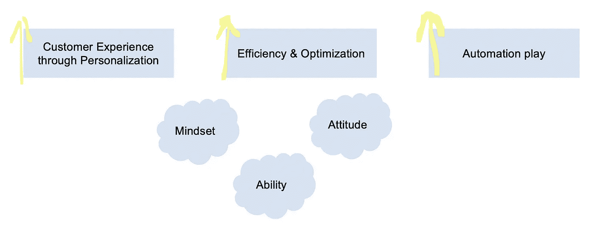
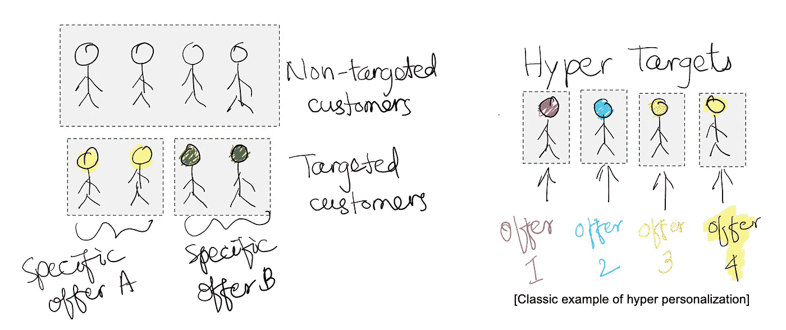

# 零售业的数据科学战略

> 原文：<https://towardsdatascience.com/data-science-strategy-in-retail-daed79ccfd25?source=collection_archive---------19----------------------->

数据科学和人工智能在零售业中的战略作用

Photo by [Artificial Photography](https://unsplash.com/@artificialphotography?utm_source=medium&utm_medium=referral) on [Unsplash](https://unsplash.com?utm_source=medium&utm_medium=referral)

数据科学和人工智能的作用正在以改变当今业务职能的方式增加 it 的足迹。除了 BFSI(银行、金融服务和保险)和其他行业之外，零售业和 CPG(包装消费品)可能是在游戏早期接受这些技术变革的最受关注的行业之一。大多数行业分析师强调，超过四分之三的组织计划到 2021 年在零售业部署数据科学和人工智能。从零售商的角度来看，重点显然是 a)通过个性化和所谓的超个性化来改善客户体验，b)提高效率和优化以降低成本，以及 c)尽可能多地实现自动化以体验增值。当然，这些是由“心态”、“态度”和“能力”驱动的，通过细节来完成战略方向。

Key focus elements

今天有哪些关键挑战？如果我们开始关注零售商，并记下他们的问题陈述或业务优先级，那么数据科学可以在许多不同的领域发挥作用，推动成功。例如，如果我们看一些问题，客户会要求更聪明的反应如下:如何提高客户体验；如何更好地学习客户的行为；如何优化成本，提高大多数运营的效率，无论是做得好的还是做得不好的；与客户先前获得的相比，如何向客户提供更好的价值；我们如何尽早处理并意识到客户群的具体变化，以便更好地应对这些变化；我们如何对产品和服务进行创新，以提高接受度、知名度和销售额等等。

根据分析师调查，近五分之一的公司已经在生产中部署了数据科学和人工智能解决方案，这意味着大约 70%-80%的范围存在，在设计阶段可以对现有解决方案进行即兴创作，可以实施新的解决方案，可以定义和规划新的战略，以实现人工智能的强大作用，从而实现商业价值及其影响。

**7 大应用主题:**未来几个季度，数据和人工智能在零售业的一些主要用途可能会继续如下:

1.  超个性化(针对用户的产品个性化，针对一个用户、一组用户等的服务个性化。)

2.对客户的建议(例如 NBOs —次优产品等。)

3.仓库拣选的自动化设备或机器人(货物拣选和移动任务的自动化)

4.视觉搜索利用图像分析(使客户更容易找到他们要找的东西)和跟踪网络搜索

5.欺诈检测(总是想起来简单，处理起来复杂)

6.有效的定价策略(例如常规定价、促销期间定价或事件驱动定价等。)

7.虚拟现实或增强现实

客户分析和营销分析将继续发挥巨大作用，尤其是在商品销售、品牌管理、CRM 等领域。这些潜在的焦点是客户的实时高度个性化、基于财务和分类的商品规划、优化库存、需求预测、广告效果及其对销售的影响等。

**关注业务影响:**围绕这些战略的大多数战略和行动通过以下方式产生影响:

a)改善顾客体验；

b)根据客户行为跟踪快速做出决策，

c)网站流量、零售店流量或客流量的增加，

d)改进活动响应时间，

e)通过预测需求优化商店库存，

f)通过在非常具体的任务中实现自动化，提高劳动力生产率的有效性

Photo by [Carlos Muza](https://unsplash.com/@kmuza?utm_source=medium&utm_medium=referral) on [Unsplash](https://unsplash.com?utm_source=medium&utm_medium=referral)

**方法:**诗歌方法——“诗人”会将艺术加入科学，以便更好地推动结果。以下是数据科学的角色可能对零售商变得至关重要的原因:

1.  p:实用性和生产性——可行性、获取数据的方法、在给定数据质量和数据有用性的情况下如何应用以及应用哪种方法等。
2.  o:可操作性——监控、跟踪、执行多个实验，以便找出并评估哪个实验将是我们正在解决的问题的解决方案的选择。
3.  e:可解释性——对清晰非常重要。必须解释从步骤 1 到步骤 N 发生了什么，并且可以向相关的利益相关者清楚地说明。我们记录和展示 EDA、特征工程、实验和最终用户评估指标的步骤越多；越好。
4.  t:透明度、信任——正在做什么和如何做，展示哪些参数对预测目标产生影响，反映了哪些见解，考虑了哪种技术，为什么，基于什么实验和围绕它的度量标准。记录风险、合规性、数据敏感性方面将在更大程度上帮助最终用户。

**结论**:

关键是要更好地了解客户的期望，这可以通过一个可靠的方法和一个机制来实现，以便在市场发生动态变化之前了解这些变化并迅速采取行动。虽然有这么多的想法和实施，但要创造价值并将其添加到业务中并产生影响，仍有许多工作要做。数据和人工智能在这一旅程中对零售商发挥着重要作用，并将继续发挥作用。

***免责声明*** *:这里的帖子是来自我的经验、想法和各种来源的阅读的个人观点，不一定代表任何公司的立场、策略或观点。*