# 数据科学策略——研究数据科学的新途径

> 原文：<https://towardsdatascience.com/data-science-tactics-a-new-way-to-approach-data-science-9c3be5cd7e5c?source=collection_archive---------32----------------------->

## **思考数据科学的有效方式**

战术，是一系列的行动，旨在实现某一目标。战术一词源于军事战争，据说起源于 1626 年。其中一个经典的战术是在希腊战争中使用的斜序战术。第一次使用斜序战术的记录是在公元前 371 年希腊的 Leuctra 战役中，当时底比斯人打败了斯巴达人。这种战术的顺序如下

*   在这种战术中，进攻方集中兵力攻击一个侧翼。左翼比右翼更强大
*   左翼前进得更快，右翼则尽可能避免冲突
*   敌人左翼寡不敌众，被打败了
*   然后左翼去击败其他敌人的侧翼

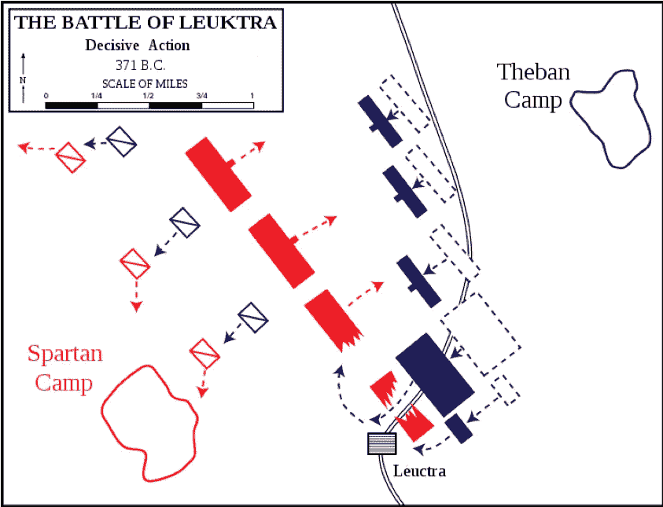

Oblique Order tactic

在国际象棋中，战术指的是限制对手选择并可能导致实际收益的一系列走法。比如足球，高速反击就是一种战术。

在商业中，一个有用的策略是提供折扣以促销产品

战术是任何领域非常重要的一部分，无论是游戏还是商业。它有助于初学者理解什么是好战术，什么是坏战术。它有助于经理们，比如足球经理，根据为比赛制定的战术来规划球队

# 战术优势

那么为什么要有战术呢？它提供了一种在执行前思考和计划的方法。它提供了一种接近战争或游戏的方式。一个人不能在没有首先考虑方法的情况下发动一场战争或踢足球。利害攸关，所以有必要先想个办法。

战术也有助于每个相关人员的行动和交流。在足球比赛中，一旦比赛开始，考虑到比赛的速度，球员之间的距离以及所有的人群噪音，球员之间的交流不是很容易。但是有了适当的战术，球员可以根据比赛的情况迅速就位

战术也是领导者与团队沟通的一种方式。在任何足球比赛之前，经理都会召开一个简报会，向球员解释战术。想象一下在比赛前没有这样的简报的情况。球员们会对如何比赛感到困惑，这对球队来说将是一场灾难

战术发挥作用的最重要的方式之一就是与外界沟通。没有直接参与比赛或战争的人仍然有兴趣知道战争是如何进行的，或者一场比赛是如何获胜的。有各种各样的书籍和文章记录了这些策略。这些文件有助于理解哪些是制胜策略，哪些不是。这些从过去吸取的经验教训对该领域未来的领导人来说是非常有用的资源

# 在数据科学领域，战术意味着什么

战术的概念在数据科学领域并不常用。尽管这个概念非常有用，但战术这个词在数据科学家中并不流行。其中一个原因是没有尝试在数据科学领域引入战术思维。然而，将策略引入数据科学对于数据科学家和数据科学领域都是有用的

让我们先来看看，理解战术对数据科学世界意味着什么。正如上面提到的，战术提供了一种在执行前开发方法的方法。对于数据科学家来说，策略可以帮助决定解决业务问题的方法，并避免直接跳到算法。在许多情况下，数据科学家在考虑如何解决问题之前直接开始编码。这可能不会导致最佳结果和时间的有效利用。拥有战术知识可以带来一种“更高层次”的思考方式，以及探索不同的可能性

战术也有助于避免算法困扰的问题。如果你痴迷于算法，你会试图使用算法中的最新趋势来解决所有问题，而不会首先想到一种方法。然而，先考虑策略，再考虑算法也有助于选择适合问题的正确算法类型

就像在足球或象棋中，有一种方法可以知道过去的比赛是如何赢的。这是通过描述游戏中使用的战术来完成的。这些知识对于现在的教练和分析师来说非常有用，他们研究过去的比赛来决定他们的战术。在数据科学领域，没有对任何解决方案的如此高层次的描述。原因是没有通用的方法来描述数据科学解决方案。每位数据科学家都试图以自己的方式描述解决方案。而且大多数时候，解决方案的描述只是笔记本和代码。

通过使用战术概念，有一种方法可以开发描述任何数据科学解决方案的通用定义。这种通用的高级描述可以从高级方法的角度帮助数据科学解决方案，而不是通过代码或笔记本。

# 用分段说明数据科学中的策略

数据分割或聚类是非常重要的数据科学技术之一。它的目的是找到相似的数据记录，并将它们分配到一个簇或段中。相似数据记录的组称为簇或段。这两个术语都经常使用。

这种将许多数据记录分组为几个簇或段的能力在各种领域都非常有用。例如，在市场营销中，人们可以将数百万的客户分成几个部分。例如，一家服装零售商可以将其客户群划分为时尚爱好者、价格敏感者、折扣爱好者等群体..然后可以为每个细分市场设计具体的营销活动。

让我们看看不同的细分策略

策略 1:目测识别分段形成

策略 2:使用预定义数量的细分市场

## 策略 1:目测识别分段形成

从技术上讲，任何数据都可以被聚集。然而，最好是具有与其他集群分开的结构良好的集群。结构良好且独立的群集有助于赋予群集意义。如果群集过于接近或重叠，则很难理解群集的含义。

这种策略的目的是验证是否存在结构良好且独立的集群。建议进行这种验证，以确保任何聚类是否有意义。它还可以帮助决定应用哪种聚类算法。

**说明战术的数据集**

我们将查看包含汽车信息的汽车数据集。该数据集可在 UCI 机器学习知识库中获得。(* Dua d .和 Karra Taniskidou e .(2017 年)。UCI 机器学习知识库[http://archive . ics . UCI . edu/ml]。加州欧文:加州大学信息与计算机科学学院。)

该数据集包括三种类型的实体:(a)汽车在各种特征方面的规格，(b)其指定的保险风险等级，其与其他汽车相比在使用中的标准化损失。第二个等级对应于汽车比其价格显示的风险更大的程度

此处显示了数据集的快照

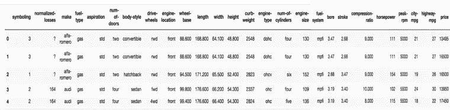

Automobile dataset

**战术序列**

这里显示了战术顺序。这将在下面的章节中解释

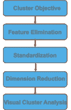

tactic sequence

**集群目标**

聚类练习需要有一个目标。这有助于选择相关的特征，赋予聚类以意义，以及将聚类的结果用于商业目的。在本例中，假设我们的聚类目标是根据技术特征对汽车进行分组。这将有助于确定基于技术特征可以形成多少个集群或组。这也有助于发现哪些汽车在技术特征上是相似的。

**特征消除**

在目标固定的情况下，我们只需要与技术特征相关的数据，而不需要与保险或损失相关的特征。因此，在运行聚类算法之前，您应该首先删除所有与目标无关的特征。

此外，我们将使用主成分分析(PCA)算法进行降维。一般来说，分类特征不会影响五氯苯甲醚。因此，我们也将删除分类特征

因此，我们只保留与此目标相关的连续特征，即:车门数量、整备质量、气缸数量、发动机尺寸、城市 mpg、公路 mpg、轴距、长度、宽度、高度、缸径、冲程、压缩比、马力、峰值转速

我们将删除所有与聚类目标无关的特征，如保险或损失。此外，我们还删除了所有分类特征，如品牌、燃料类型、车身风格等..

**标准化**

所有的分类特征都有不同的单位。例如，车门数量的单位与发动机尺寸不同。下面解释的降维技术是非常敏感的，并且会给出不同单位变量的错误结果。所以我们首先用标准差来表示所有的数字变量。

此处显示的是标准化后的原始值和缩放值的示例

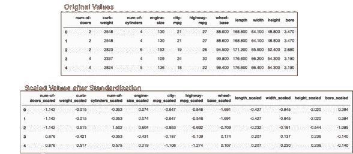

standardisation

**降维**

即使去掉了一些特征，我们还有大约 15 个特征。有如此多的特征，绘制任何可视化都是不可行的。作为人类，我们能够以最大三维可视化数据

因此，在这一步中，我们使用降维技术将维度降低到两个维度，而不会丢失数据中的信息。PCA 或 TSNE 等算法对降维算法很有用。这里我们将使用 PCA 算法

对于二维 PCA，我们看到第一个主成分(我们称之为 PC0)捕获了 40%的方差，第二个主成分(我们称之为 PC1)捕获了 16%的方差。所以在二维情况下，我们获得了 56%的方差。由于这个值大于 50%,所以可以接受，因为前两个主成分应该包含大部分方差

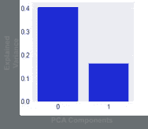

pca components

让我们看看数据集中哪些特征对主成分影响最大。这种影响是由特征值给出的。每个特征和主成分的特征值如下所示。

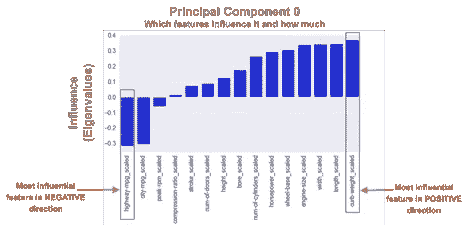

pc0 eigenvalues

pc1 eigenvalues

我们可以看到，第一主成分在正向上受整备质量的影响最大，在负向上受公路里程的影响最大。类似地，第二主成分在正方向上受到峰值转速的影响，在负方向上受到高度的影响

**视觉聚类分析**

现在，我们可以基于两个主成分将数据集转换为二维。此处显示的是包含 15 个要素的数据集，现在绘制在 2D 散点图上。

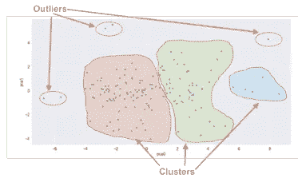

scatter plot

视觉分析，我们看到数据集可能有三个集群。有一些数据点可以被认为是异常值

## 策略 2:使用预定义数量的细分市场

在这种策略中，我们将看到当分段(或聚类)的数量已知时如何进行分段。集群的数量可以由业务给出，例如需要分割成固定数量的部分。或者，已经用上面给出的策略直观地确定了簇的数量。

**说明战术的数据集**

我们将使用之前策略中使用的汽车数据集

**战术序列**

这里显示了战术顺序。这将在下面的章节中解释

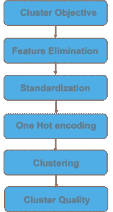

tactic sequence

**集群目标**

与之前的策略相同

**离群点剔除**

由于我们将使用聚类算法进行分段，因此需要注意的是，聚类算法可能对异常值非常敏感。如果存在极端的异常值，那么聚类的结果可能会非常奇怪。因此，在使用聚类算法之前，最好先去除异常值。

正如我们在前面的策略中看到的(直观地识别段形成)，数据集中有一些离群值可以直观地识别出来。下面显示的是之前策略中使用的 PCA 图。此外，异常值标有数据记录号

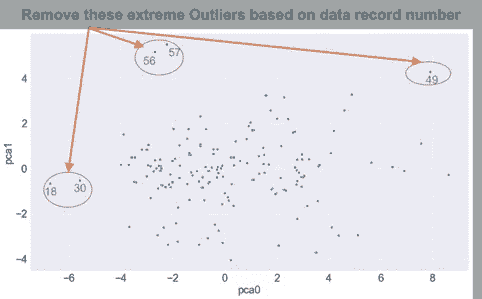

removal of outliers

可以基于数据记录号从数据集中移除这些可视识别的异常值。可以在数据集中识别数据记录号，如下所示，然后可以删除这些数据记录

outlier records

**特征消除**

在目标固定的情况下，我们只需要与技术特征相关的数据，而不需要与保险或损失相关的特征。因此，在运行聚类算法之前，您应该首先删除所有与目标无关的特征。

在前面的策略中，我们已经删除了分类特征，通常分类特征不会影响 PCA。然而，在聚类中，我们可以保持分类特征。它们必须经过一种特殊的处理，称为一键编码，这将在下面解释。

因此，让我们只保留与此目标相关的特征，包括数字特征和分类特征，如下所述:燃料类型、吸气量、门数、车身类型、驱动轮、发动机位置、轴距、长度、宽度、高度、整备质量、发动机类型、气缸数、发动机尺寸、燃料系统、缸径、冲程、压缩比、马力、峰值转速、城市英里数、公路英里数

**相关性**

在这一步中，我们将尝试找出哪些特征是相关的。我们这样做的原因是，我们将使用这些特征来分析聚类的结果。如后面的步骤所示，聚类分析是使用散点图进行的。高度相关(正相关或负相关)的特征可以用作散点图的轴。如果散点图的轴是相关变量，则散点图对于聚类分析非常有效

此处显示的是以热图形式显示的功能相关性。

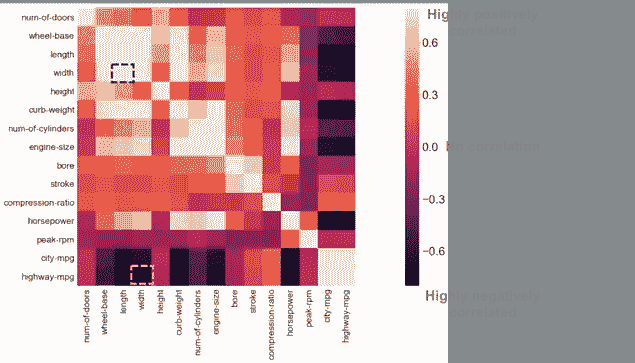

correlation heatmap

非常浅的颜色表示变量高度正相关，非常深的颜色表示变量高度负相关。有许多颜色很浅或很深的盒子。因此，让我们选择几个这样的变量，如

-长度和宽度，这是正相关的

-公路-mpg 和宽度，负相关

**标准化**

与之前的战术相同(目视识别分段队形

**一个热编码**

对于分类变量，我们需要转换成数值。这是通过一种热编码算法来完成的

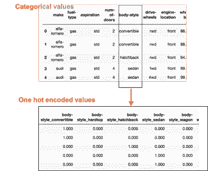

categorical to one hot encoding

例如，分类特征 body-style 被转换成多个特征，例如 body-style_convertible、body-style_hardtop、body-style_hatchback、body-style_sedan、body-style_wagon。将 1 放入对应样式的列中，否则值为 0

**聚类**

有不同的聚类算法。因为这里假设聚类的数量是已知的，所以我们可以使用 K-Means 算法。根据同一数据集的策略“视觉识别聚类形成”,我们得出结论，三个聚类将是一个不错的选择

在这一步中，我们使用 K-Means 算法将所有数据点聚类成三个簇。以下是每个数据点被分配到一个聚类的结果。如下图所示，2D 散点图基于使用 PCA 进行降维后获得的两个主要成分(如前面的战术中所述，目视识别片段形成)。点的颜色基于簇分配

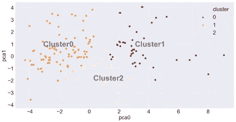

pca clustering

这些簇形成得很好并且是分开的。群集有一些重叠，但这是最小的。集群 0 和集群 1 更紧凑，而集群 1 似乎有点分散。每个聚类的点数用这里显示的条形图表示

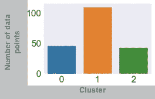

cluster size

另一种可视化方法是使用散点图，其轴是高度相关(正相关或负相关)的特征。正如我们在步骤相关中看到的，下面是相关变量的选择

-长度和宽度，这是正相关的

-公路-mpg 和宽度，负相关

下图显示了基于这些特征以及不同颜色的聚类的散点图

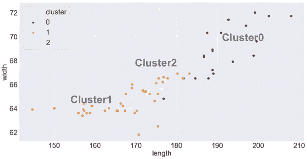

k means clustering

**给集群赋予意义标签**

分割的一个重要任务是给一个簇或段起一个有意义的名字。一旦创建了段，用一些有意义的名称而不是段 0、段 1 等来称呼它们是很方便的..对于商业用户来说，用一些有用的名字来交流细分的结果也更容易。在这个策略中，我们将看到如何赋予一个集群以意义

一种可能性是使用上面显示的散点图来解释集群。

我们可以看到集群 1 是具有小长度和宽度的汽车。因此，我们可以将该集群标记为小型汽车细分市场。群 2 有长度不小也不大的车厢。所以我们可以把它们归类为中型汽车。集群 0 具有长度和宽度更高的汽车。因此，我们可以将该集群标记为大型汽车细分市场。

这也有助于实际查看集群的一些成员，以便更好地理解结果。在这里，我们可以看到每个集群中几辆车的一些照片。根据照片，您会发现 Cluster1 拥有掀背式车身风格的汽车。集群 2 一般是轿车车身风格的汽车。群 0 有许多是货车的汽车

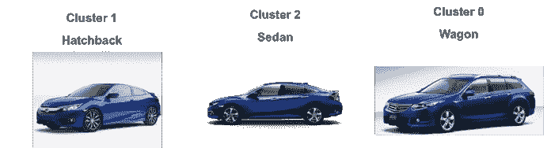

除了散点图，还有其他方法来确定一个片段的意义，我们将在其他策略中探讨

这里，您看到了聚类或细分所需的两种策略的一些示例。

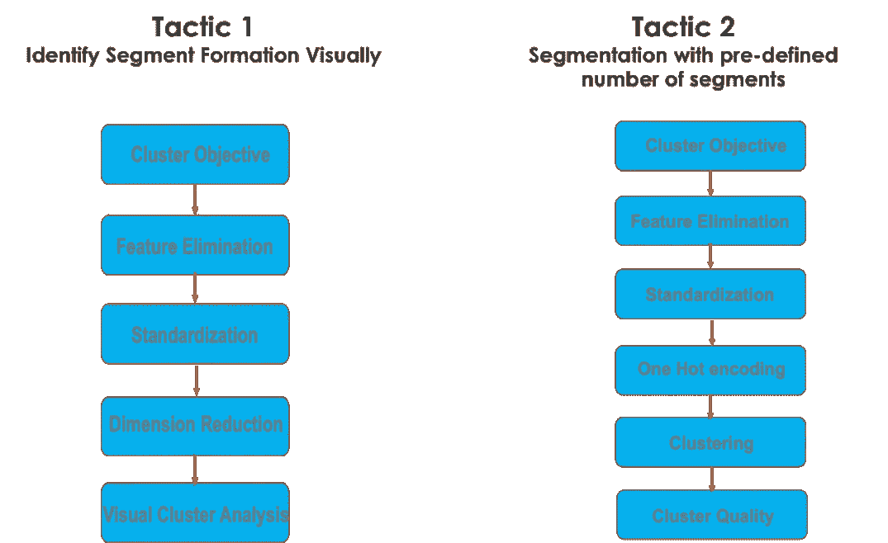

Example of tactics

一旦你开始掌握策略，而不是算法，你将更好地控制数据科学的过程。在算法之前考虑战术将有助于您获得更好的数据科学方法。它还会帮助你变得不那么痴迷于算法，并开拓更广阔的视野。你将对数据科学有一个清晰的思考过程，而不是被无数的算法所困扰

# 额外资源

# 网站(全球资讯网的主机站)

你可以访问我的网站进行零编码分析。[https://experiencedatascience.com](https://experiencedatascience.com)

请**订阅**每当我发布一个新的故事时，请及时通知我。

 [## 每当 Pranay Dave 发表文章时，您都会收到电子邮件。

### 每当 Pranay Dave 发表文章时，您都会收到电子邮件。通过注册，您将创建一个中型帐户，如果您还没有…

pranay-dave9.medium.com](https://pranay-dave9.medium.com/subscribe) 

你也可以通过我的推荐链接加入 Medium。

 [## 通过我的推荐链接加入 Medium—Pranay Dave

### 作为一个媒体会员，你的会员费的一部分会给你阅读的作家，你可以完全接触到每一个故事…

pranay-dave9.medium.com](https://pranay-dave9.medium.com/membership) 

https://www.youtube.com/c/DataScienceDemonstrated 的 YouTube 频道
这里是我的 Youtube 频道
[的链接](https://www.youtube.com/c/DataScienceDemonstrated)