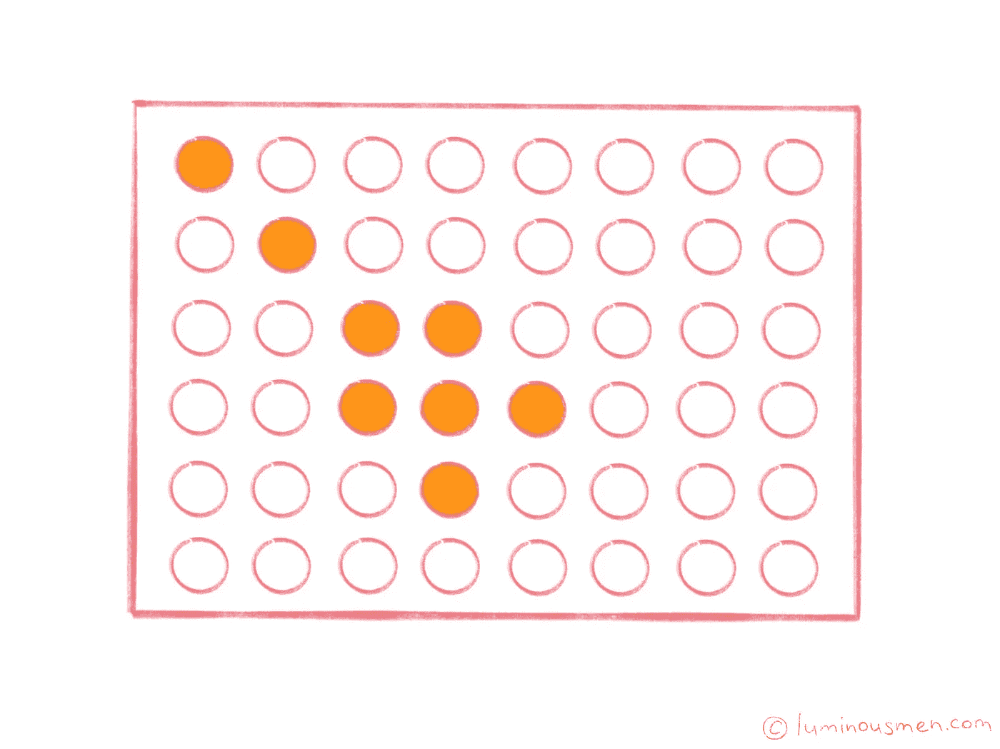

# 数据科学。中心极限定理与抽样

> 原文：<https://towardsdatascience.com/data-science-the-central-limit-theorem-and-sampling-b54245f2ea2d?source=collection_archive---------22----------------------->

## 理解中心极限定理


有很多工程师从未涉足统计学或数据科学。因此，要构建数据科学管道或将数据科学家产生的代码重写为适当的、易于维护的代码，工程方面会出现许多细微差别和误解。对于这些数据/ML 工程师和数据科学家新手，我做这个系列文章。我将尝试用简单的英语解释一些基本方法，并基于它们解释一些数据科学模型概念。

整个系列:

*   [**数据科学。概率**](https://luminousmen.com/post/data-science-probability)
*   [**数据科学。贝叶斯定理**](https://luminousmen.com/post/data-science-bayes-theorem)
*   [**数据科学。概率分布**](https://luminousmen.com/post/data-science-probability-distributions)
*   [**数据科学。措施**](https://luminousmen.com/post/data-science-measures)
*   [**数据科学。相关性**](https://luminousmen.com/post/data-science-correlation)
*   [**数据科学。**中心极限定理与抽样](https://luminousmen.com/post/data-science-central-limit-theorem)
*   [**揭秘假设检验**](https://luminousmen.com/post/demystifying-hypothesis-testing)

研究随机现象的实践表明，尽管单个观察的结果，即使是在相同条件下进行的观察，也会有所不同。但是对于足够多的观察结果，平均结果是稳定的，只有个别观察结果的微弱波动。随机现象的这一显著特性的理论基础是中心极限定理(又名大数定律)。

**根据中心极限定理，随着样本量的增加，数据样本的平均值会更接近总体的平均值，会近似正态。这个定理的重要性来自于这样一个事实:不管人口的分布如何，这个定理都是成立的。**

为了说明这个概念，请查看以下掷骰子的动画和代码:


```
import numpy as np
import seaborn as sns
import matplotlib.pyplot as plot
import matplotlib.animation as animation
from wand.image import Image
from wand.display import display# 1000 simulations of die roll
n, m = 200, 31# In each simulation, there is one trial more than the previous simulation
avg = []
for i in range(2, n):
    a = np.random.randint(0, m, i)
    avg.append(np.average(a))# Function that will plot the histogram, where current is the latest figure
def clt(current):
    # if animation is at the last frame, stop it
    plt.cla()
    if current == n: 
        a.event_source.stop()plt.xlim(0, m)
    plt.hist(avg[0:current])plt.gca().set_title('Expected value of die rolls')
    plt.gca().set_xlabel('Average from die roll')
    plt.gca().set_ylabel('Frequency')plt.annotate('Die roll = {}'.format(current), [3, 27])fig = plt.figure()
a = animation.FuncAnimation(fig, clt, interval=1, save_count=n)
a.save('animation.gif', writer='imagemagick', fps=10)
```

在现实世界中，为了了解一个群体的特征，科学家们通常对数据进行抽样，并对样本数据进行统计。他们通过处理样本来理解和概括对人口的认识。使用大样本量，**中心极限定理允许我们在此过程中应用正态分布的特性。**

我们已经知道正态分布是特殊的。我们也可以将它的一些性质用于严格来说不能称为正态的分布。

# 抽样

在此之前，我们讲过如何， [**知道理论分布**](https://luminousmen.com/post/data-science-probability-distributions) ， [**知道概率论**](https://luminousmen.com/post/data-science-bayes-theorem) ， [**知道分布**](https://luminousmen.com/post/data-science-measures) 的参数，来评估样本对一般总体发生了什么。但是有一个问题，如果我们估计的样本设计不正确或者它不能代表总体，那么即使最好的理论和最了解的分布也不能帮助我们。


*为什么要采样？*

逻辑问题是:如果我们取一个样本，无论如何，我们会丢弃一些数据。为什么不把所有的数据和人口的所有元素结合起来？

第一，需要收集数据，而且非常**贵**。想想调查。即使我们不是在谈论所有美国人的人口，但我们要举个例子，所有 [**加州**](https://en.wikipedia.org/wiki/California) 的居民，那就是 3900 万人。要采访 3900 万人，我们需要预算，当然，我们没有。此外，即使我们有这样的预算，也几乎不可能覆盖任何一个州的所有居民。

一般来说，抽样的概念很简单——取一个很小的样本集，但是这个样本集在一些代表我们总体的关键标准方面是非常异质的。也就是说，不是采访所有的加州居民，而是采取某种方式来代表加州的重要标准。

取样的想法和喝汤的想法很相似。当我们煮的汤含有很多配料时，它们被不同地切割，在不同的时间添加，我们需要评估汤的质量。我们不需要吃完所有的汤来评价它有多美味。此外，如果我们需要吃完所有的汤才能明白它有多好，那么任何集体烹饪的想法都会有些荒谬。但是我们在做什么？我们把汤煮开，之后，我们拿起勺子，舀起来，根据这一小部分，我们试图评估我们是否已经把汤煮好了，或者我们需要改变汤里的一些东西。如果我们只是随便拿一些部分，比如从上面舀，那么我们会有满满一勺的水，它不会给我们任何关于食材(蔬菜或者肉)的概念。如果我们从底部舀，结果可能是我们只得到大块，但我们对小块一无所知。为了将汤的所有成分都放入样品中，以便品尝汤的味道，我们需要首先混合它，然后，在我们混合好之后，舀起它，我们会看到所有的成分都在勺子中——大的，小的，和水，所有的。也就是说，在这一部分，我们已经可以估计出汤里的所有配料准备得有多好。取样也是一样。

在采样的情况下，这种混合的模拟是**随机采样**。它是一种随机选择，其本质是确保样本中的每个元素以相等的概率得到，它为我们提供了样本的这种代表性。

*可怕的是样本不具有代表性？*

我将强调几个问题。最简单和最容易理解的例子——例如，如果我们选择一个**可用样本**。


就是我们研究年轻人的喜好，但是由于我们在某个大学学习或者工作，所以只采访我们大学的学生，说基于这个研究我们会了解所有的年轻人。显然，我们不会了解所有的年轻人，因为样本是一个非常特殊的群体。现有的样本给我们提供了部分情况，但并不完整。在这种情况下，相当一部分不在大学学习或在其他大学学习的年轻人将不会被我们的样本所涵盖。另一个问题是——我们只能选择那些想和我们交谈的人。也就是说，这种非代表性样本的问题在于，我们没有给不同的人平等的机会，让不同的观点在我们的样本中得到代表。随机抽样至少在形式上保证了这种表示的可能性。

# 概率抽样方法


最简单和最容易理解的方法是一个简单的随机样本，当我们有一个完整的总体元素列表时。例如，我们的人口都拥有纽约市的电话号码，我们有这些号码的完整列表。我们打开“随机数传感器”，选择我们需要的物品数量，然后拨打这些电话号码——一个简单的随机选择。


另一种选择是**分层抽样**。在这里我们不再做随机选择，但在这里我们知道一些关于我们的人口。我们知道它由几个同质的集群组成，这些集群需要在我们的样本中呈现。比如一男一女，对一些问题有不同的看法。我们首先将我们的人口分为男性和女性两类，然后我们在两类中随机选择，以保证这些类在最终样本中的代表性。


随机抽样的另一个变体是**整群抽样**。例如，当我们探索城市时，会用到这样的样本，而城市通常会被划分为区。一些地区彼此相似，一些不同，我们有这种类似的地区集群，比如说，在社会经济条件方面。我们首先把城市分成几个区，然后随机选择这些区中的一个，每次一个，这样就不用去所有的 12 个区，而是从 12 个区中随机选择 3 个，先把它们分成这些相似的类别，然后在这些区域内工作。

# 非概率抽样方法



还需要非概率抽样方法。而且，在某些情况下，非概率抽样是不可替代的。比如有一种抽样方法——**滚雪球抽样**。如果我们调查难以接触到的群体，或者我们不知道总人口的确切数量，这是必要的，然后我们与第一个人交谈，他与下一个人联系我们，下一个，下一个，我们有点像积累一个雪球。我们增加了样本，从一个开始，或者有时从几个这样的雪球开始，以保证群体的异质性。当然，这个样本在统计学上并不具有代表性，但是有些任务没有它我们根本无法完成。

# 结论

中心极限定理是统计学中的一个非常重要的概念，因此也是数据科学中的一个非常重要的概念。这个定理将允许我们测试所谓的**统计假设**，即允许测试假设对整个人口的适用性。我们将在后面的文章中讨论这个概念。

抽样是从人群中获取少量但有代表性的数据的一种廉价且容易理解的概念。对于大多数研究问题来说，概率方法是更可取的，但是对于有些任务，只有非随机样本才能有所帮助。有些任务是不可替代的，但在统计学意义上，非随机样本不具有代表性。因此，所有这些关于分布的理论知识，关于根据样本推断总体人口的理论知识，我们只能在随机样本上进行。

**感谢您的阅读！**

有什么问题吗？请在下面留下您的评论，开始精彩的讨论！

查看[我的博客](https://luminousmen.com/)或者来打个招呼👋在[推特](https://twitter.com/luminousmen)或订阅[我的电报频道](https://t.me/iamluminousmen)。
规划好自己！