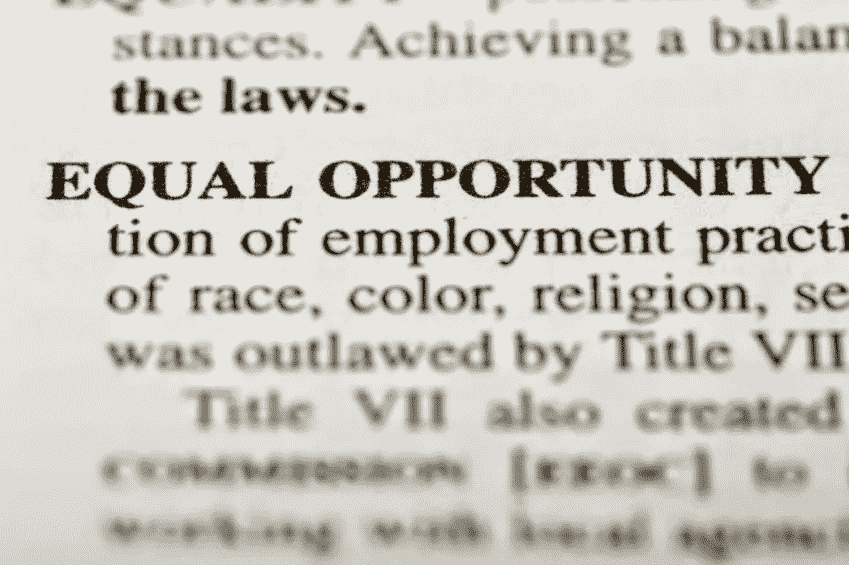
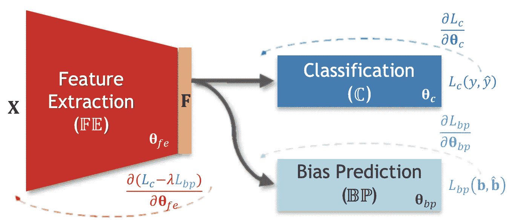

# 2020 年的数据科学趋势

> 原文：<https://towardsdatascience.com/data-science-trends-for-2020-78bda13032c7?source=collection_archive---------11----------------------->

## 数据科学现在无处不在。2020 年我们可以期待什么？

现在，人们已经在庆祝这个十年的结束(有趣的事实:[2020 年代实际上从 2021 年 1 月 1 日开始](https://www.nytimes.com/2019/11/28/us/what-is-decade.html))。去年的时候，我决定思考已经发生的事情，以及在我看来，关于 2020 年的数据科学，我们可以期待什么。

没想到我去年的[反思帖](/data-science-trends-for-2019-11b2397bd16b)有这么多阅读量。从反馈来看，人们觉得很有趣，没有进一步的原因，让我们深入今年的想法，保持论坛开放！

## 数据科学进入保守领域

2019 年，我们开始看到机器学习解决方案被应用于**保守(监管更多)的领域**，如医疗保健——现在，受到了重视！

今年我注意到的最有趣的挑战之一是在胸部 x 光片中识别气胸疾病。本质上，肺萎陷导致严重的呼吸困难。这可能是一个非常困难和微妙的条件，以确定。这将是另一个和其他挑战一样的挑战，但现在它包括了研究这种情况的实际机构的参与。我敢肯定，这些机器学习算法在四年前对我来说可能是很方便的…像这样的系统[已经被 FDA 批准](https://www.genewsroom.com/press-releases/ge-healthcare-receives-fda-clearance-first-artificial-intelligence-algorithms)。

Pneumothorax impacts nearly 74,000 Americans every year [source: [Venture Beat](https://venturebeat.com/2019/12/03/google-details-ai-that-classifies-chest-x-rays-with-human-level-accuracy/), [GE Healthcare](https://www.gehealthcare.com/article/ai-embedded-x-ray-system-could-help-speed-up-detection-of-a-collapsed-lung)]

这一步骤的主要结果不仅仅是帮助受影响的个人，还有更高层次实体的显著参与，即**决策者**，使这些技术能够在以前对采用这些技术非常谨慎的领域中使用。正如许多数据科学家所知，这通常是新项目中最难克服的瓶颈之一。

另一个例子，不仅仅是从 2019 年开始，是使用数据科学来确定药物-补充相互作用( [supp.ai](https://supp.ai/) )。如果你知道[组合](https://en.wikipedia.org/wiki/Combination)，你就能对我们正在谈论的事情的规模有个概念。

## 设计的数据隐私

随着用户越来越关心数据的处理和所有权，工程师和数据科学家不得不寻找方法来满足这些新的用户需求。如果公司实际上不拥有满足其业务需求的用户数据，无数的数据泄露(你可以看看这份令人印象深刻的 2019 年[总结](https://www.cnet.com/news/biggest-data-breaches-of-2019-same-mistakes-different-year/))可以得到缓解。

早在几年前，**联邦学习**就已经成为关于数据隐私的热门话题。本质上，

> 联合学习是一种机器学习设置，其目标是利用分布在大量客户端上的训练数据来训练高质量的集中式模型，每个客户端都具有不可靠且相对较慢的网络连接。[ [谷歌人工智能](https://research.google/pubs/pub45648/) ]

这可能不是灵丹妙药，但它可能有助于软件工程师和数据科学家按照**设计隐私**来构建系统。我们可以将此视为使用更少数据的机会，同时仍然能够创建有用的产品。

Federated Learning is *a new a machine learning technique that trains an algorithm across multiple decentralized edge devices or servers holding local data samples, without exchanging their data samples* [source: [Google AI](https://federated.withgoogle.com/), [Wikipedia](https://en.wikipedia.org/wiki/Federated_learning)]

用更少的资源做更多的事情(数据)。对数据科学来说有点反直觉，对吧？是的，可能是。但信任将是 2020 年的一个关键话题。你如何确保用户[信任软件公司的数据](https://www.cnbc.com/2019/02/13/consumers-dont-trust-tech-companies-with-health-data-rock-health.html)？例如，使用联合学习来训练移动键盘的预测模型，而无需将敏感的打字数据上传到服务器( [Hard，et al .，2018](https://arxiv.org/abs/1811.03604) )。

Servers (companies) do not need to know about every piece of data you generate. [[Hard, et al., 2018](https://arxiv.org/pdf/1811.03604.pdf)]

如果联合学习对你来说是一个新概念，或者你希望更好地理解它，我完全推荐你从这个奇妙的漫画开始。你甚至可以开始用开源框架 [Tensorflow Federated](https://www.tensorflow.org/federated) 创建自己的第一个系统！

## 减轻模型偏差和歧视

2019 年 11 月最大的头条之一与苹果/高盛信用卡(最有可能)[性别歧视](https://www.wired.com/story/the-apple-card-didnt-see-genderand-thats-the-problem/)有关。用户们注意到，它给女性提供的信用额度似乎比男性少。即使这一切都是从大卫·海涅迈尔·汉森的[病毒式推特开始的，它也提醒了我们全自动机器决策的老问题:导致最终决策的主要驱动因素是什么？至今没有人解释，而且现在](https://twitter.com/dhh)[很难得到人类](https://twitter.com/stevewoz/status/1193330241478901760)的帮助。

As soon as a model is put into production it is up for scrutiny of users, specially if the decisions directly affect high stakes personal issues.

尽管看起来很可怕，但数据科学家知道，将性别作为模型的输入并不意味着你不能被指控性别歧视。现在阅读高盛的官方推特[...从这些回答中，你可以看到一些公司在使用新技术时坚持的独创性。重要的是要记住，](https://twitter.com/gsbanksupport/status/1194022629419704320)

> [这就是]现代算法将导致“**代理** **歧视**”的风险代理歧视是不同影响的一个特别有害的子集。像所有形式的不同影响一样，它涉及一种表面上中立的做法，对受保护阶层的成员造成了不成比例的伤害。[ [人工智能和大数据时代的代理歧视](https://papers.ssrn.com/sol3/papers.cfm?abstract_id=3347959)

我们应该始终记住，基于有偏见的数据训练的复杂模型可以学习歧视性模式，从而导致扭曲的决策。而且这些模型可以找到导致歧视的代理，**甚至**如果你实际上不包括你认为可能有历史偏见的实际特征。

It’s up to the data scientists (including machine learning engineers) to come up with new bias identification and mitigation algorithms to help mitigate harm on users [image source: [Adeli, et al., 2019](https://arxiv.org/pdf/1910.03676.pdf)]

作为前进的道路，偏见歧视将继续成为主要话题之一，不幸的是，在公司认真对待这个问题之前，我们会看到更多类似的头条新闻。数据科学家可以通过执行示例性探索性数据分析来提供帮助，确保数据代表整个群体，并探索可以识别和减轻这些偏差的新[架构](https://arxiv.org/abs/1910.03676)。

## Python 是数据科学的事实语言

当我五年前转到数据科学领域时，问题— *【对于数据科学】我应该专注于什么编程语言？*——这个问题很难回答。随着岁月的流逝，随着 Python 的海量增长，已经变得更容易回答了。正如 Stack Overflow 在 2019 年 4 月发布的年度开发者调查中所述:

> 在我们的调查中，增长最快的主要编程语言 Python 再次在编程语言中排名上升，今年超过 Java，成为第二大最受欢迎的语言(仅次于 Rust)。

不仅仅是堆栈溢出，[其他网站](https://hackr.io/blog/best-programming-languages-to-learn-2019-jobs-future)也提到 **Python** 是你可以做的最好的赌注之一，如果你打算开始编程，有一个巨大的支持社区在你身边，或者做一个快速原型。最后一个方面通常与当今的数据科学家最为相关。很难有任何其他编程语言能更好地帮助数据科学家。

回想一下，数据科学是 [*统一统计学、数据分析、机器学习及其相关方法*](https://en.wikipedia.org/wiki/Data_science#cite_note-Hayashi-3) 的一个概念(这要追溯到 [1996 年与 Hayashi](https://www.springer.com/gp/book/9784431702085) ！).我喜欢给它加上“*越快越好”。这就是 Python 的用武之地。*

Python can safely be confirmed as the “*de facto”* data science programming language

我相信 Python 推动了数据科学的巨大发展(或者反过来？).如果对你来说这仍然是一个不确定的决定，那就去做一些研究来找出答案。

## 专注为“别烦我，我只想把事情做完”

聚焦 2020 年！由于每天都有如此多的新文章发表——截至 2018 年底，每天大约有 100 毫升的论文发表在[arXiv.org](https://arxiv.org/)上(是的，它们没有经过同行评审，但即使……)——**聚焦**必须是你添加到目标中的东西。

随着数据科学家独角兽(幸运的是)的想法消失，数据科学专业化的概念已经成熟。就像决策树的第一次分裂一样(很抱歉…)，你可以有两种方法:

1.  **重型工程路径**，专注于数据管道、生产化、软件工程。如果你是计算机专业出身，这个对你来说可能比较容易。
2.  **重分析路径**，侧重统计、数据分析、业务知识。如果你来自应用数学、物理，甚至是社会领域，这对你来说可能是一个更容易的开始。

这并不意味着两条路永远不会交叉，但你应该追求其中的一条。如果你想进入更多的细节，你甚至可以找到更具体的工作名称，就像我去年提到的。

归根结底，更重要的是**把事情做好**！记住，你不需要从零开始创造东西来创造伟大的东西。基于其他优秀的开源工具构建，如 [Tensorflow Extended](https://www.tensorflow.org/tfx) 或 [PyTorch](https://pytorch.org/) 。这两种工具都能让你克服许多最初的头撞墙的时刻。

Keep your boat well steered as you enter 2020\. Focus on what you really want to do. [source: [Evelyn Paris](https://unsplash.com/@evelynparis)]

## 祝 2020 年愉快！

2019 年是一次疯狂的过山车之旅…加入谷歌纽约对我来说是其中一个循环。祝 2020 年愉快！

[*雨果洛佩斯*](https://www.linkedin.com/in/hugodlopes/)