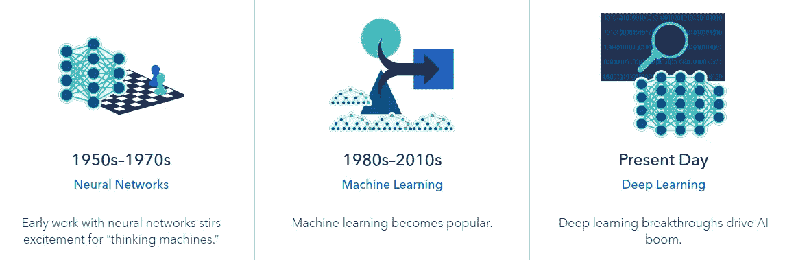
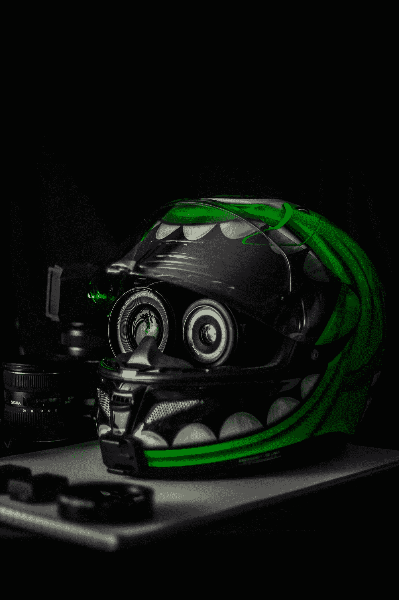

# 数据科学 vs 人工智能 vs 机器学习 vs 深度学习

> 原文：<https://towardsdatascience.com/data-science-vs-artificial-intelligence-vs-machine-learning-vs-deep-learning-9fadd8bda583?source=collection_archive---------1----------------------->

> 首次发布于[我的博客](https://blog.contactsunny.com/data-science/data-science-vs-artificial-intelligence-vs-machine-learning-vs-deep-learning)。

这些天来，经常会遇到这些术语——数据科学、人工智能、机器学习、深度学习、神经网络等等。但是这些流行语实际上是什么意思呢？你为什么要关心这个或那个？在这篇文章中，我尽我所能来回答这些问题。但话说回来，我不是这方面的专家。这是我在过去几年的数据科学和机器学习之旅中获得的知识。我相信你们中的大多数人会比我有更好更简单的方法来解释事情，所以我期待着在下面看到你们的评论。那我们开始吧。

# **数据科学**

数据科学就是关于数据的，我很确定你已经知道了。但是，您知道我们使用数据科学来做出商业决策吗？我很确定你也知道。那么这里还有什么新的东西呢？那么，你知道数据科学是如何被用来做商业决策的吗？没有吗？让我们看看那个。

我们都知道，每一家科技公司都在收集海量数据。而数据就是收入。这是为什么呢？那是因为数据科学。你拥有的数据越多，你就能获得越多的商业洞察力。使用数据科学，您可以发现您甚至不知道存在的数据模式。例如，你会发现某个去纽约度假的人很可能会在接下来的三周内花钱去威尼斯进行一次豪华旅行。这是我刚刚编造的一个例子，在现实世界中可能不是真的。但如果你是一家提供异国目的地豪华游的公司，你可能会有兴趣得到这个人的联系电话。

在这种情况下，数据科学被广泛使用。公司正在使用数据科学来构建推荐引擎，预测用户行为，等等。只有当你有足够多的数据时，所有这一切才有可能，这样就可以对这些数据应用各种算法，给你更准确的结果。

数据科学中还有一种称为规范分析的东西，它做的预测与我们在上面的丰富旅游示例中讨论的几乎相同。但作为一个额外的好处，规定性分析还会告诉你一个人可能对哪种威尼斯豪华游感兴趣。例如，一个人可能希望乘坐头等舱，但三星级住宿就可以了，而另一个人可能准备乘坐经济舱，但肯定需要最豪华的住宿和文化体验。所以即使这两个人都是你的富有客户，他们也有不同的要求。所以你可以用规定性分析来解决这个问题。

你可能会想，嘿，这听起来很像人工智能。实际上，你并没有完全错。因为在巨大的数据集上运行这些机器学习算法也是数据科学的一部分。机器学习在数据科学中用于进行预测，也用于发现数据中的模式。这听起来又像是我们在给我们的系统增加智能。那一定是人工智能。对吗？让我们看看。

# **人工智能**

人工智能，简称 AI，从 20 世纪 50 年代中期就已经出现了。不一定是新的。但是最近由于处理能力的提高，它变得非常流行。早在 1900 年代，就没有实现人工智能所必需的计算能力。今天，我们拥有世界上有史以来最快的计算机。算法实现有了很大的改进，我们可以在商用硬件上运行它们，甚至是你现在用来阅读的笔记本电脑或智能手机。鉴于人工智能看似无限的可能性，每个人都想分一杯羹。

但是人工智能到底是什么？人工智能是一种可以赋予计算机的能力，它使这些机器能够理解数据，从数据中学习，并根据隐藏在数据中的模式做出决策，或者做出人类很难(几乎不可能)人工做出的推断。人工智能还使机器能够根据新的输入来调整它们的“知识”，这些输入不是用于训练这些机器的数据的一部分。

定义人工智能的另一种方式是，它是一组数学算法，使计算机能够理解不同类型和不同数据之间的关系，从而可以利用这种联系知识来得出结论或做出非常准确的决定。

但有一件事你需要确定，你有足够的数据让 AI 学习。如果你有一个非常小的数据湖用来训练你的人工智能模型，预测或决策的准确性可能会很低。因此，数据越多，人工智能模型的训练就越好，结果就越准确。根据训练数据的大小，可以为模型选择各种算法。这是机器学习和深度学习开始出现的地方。

在人工智能的早期，神经网络风靡一时。全球有多组人致力于改善他们的神经网络。但正如我在帖子前面提到的，计算硬件的局限性阻碍了人工智能的发展。但从 20 世纪 80 年代末一直到 2010 年代，机器学习就是这样。每一家大型科技公司都在机器学习上投入巨资。谷歌、亚马逊、IBM、脸书等公司。实际上是在拖 AI 和 ML PhD。大学毕业的人。但如今，就连机器学习也退居二线了。现在都是深度学习。在过去的几十年里，人工智能确实有了发展，而且一年比一年好。你可以从下图中看到这一演变。

Source: [SAS](https://www.sas.com/en_us/insights/analytics/what-is-artificial-intelligence.html)

# 机器学习

现在来说说机器学习。机器学习(ML)被认为是人工智能的一个子集。你甚至可以说 ML 是 AI 的一种实现。所以每当你想到 AI，你就能想到在那里应用 ML。顾名思义，ML 用于我们希望机器从我们给它的大量数据中学习的情况，然后将这些知识应用于流入系统的新数据。但是你可能会问，机器是如何学习的呢？

让机器学习有不同的方法。机器学习的不同方法是监督学习、非监督学习、半监督学习和强化机器学习。在其中一些方法中，用户告诉机器什么是特征或自变量(输入)，什么是因变量(输出)。因此，机器学习提供给机器的数据中存在的自变量和因变量之间的关系。提供的这些数据称为训练集。并且一旦学习阶段或训练完成，机器或 ML 模型就在该模型以前没有遇到过的一段数据上被测试。这个新数据集称为测试数据集。您可以通过不同的方式[在训练数据集和测试数据集](https://medium.com/@contactsunny/how-to-split-your-dataset-to-train-and-test-datasets-using-scikit-learn-e7cf6eb5e0d)之间分割现有数据集。一旦模型足够成熟，能够给出可靠且高精度的结果，该模型将被部署到生产设置中，在生产设置中，该模型将用于全新的数据集，以解决预测或分类等问题。

ML 中有各种算法可用于预测问题、分类问题、回归问题等等。您可能听说过简单线性回归、多项式回归、支持向量回归、决策树回归、随机森林回归、K 近邻等算法。这些是 ML 中使用的一些常见的回归和聚类算法。还有很多。即使在训练模型之前，也有许多数据准备或预处理步骤需要处理。但是像 SciKit Learn 这样的 ML 库已经发展得如此之快，以至于即使是一个没有任何数学或统计背景，甚至没有接受过正式人工智能教育的应用程序开发人员，也可以开始使用这些库在现实世界中构建、训练、测试、部署和使用 ML 模型。但是知道这些算法是如何工作的总是有帮助的，这样当你为你的问题陈述选择一个算法时，你可以做出明智的决定。有了这些关于 ML 的知识，我们现在来谈一谈深度学习。

# 深度学习

深度学习(DL)是 ML 的一个进步。尽管 ML 对于大多数应用程序来说是非常强大的，但是也有 ML 不尽如人意的地方。这就是深度学习介入的地方。一般认为，如果你的训练数据集**相对**小，你就用 ML。但是，如果你有大量的数据可以训练一个模型，如果数据有太多的特征，如果准确性非常重要(尽管准确性总是很重要)，那么你会选择深度学习的路线。

还需要注意的是，深度学习需要强大得多的硬件来运行(主要使用 GPU)，它需要明显更多的时间来训练你的模型，并且与 ML 相比，它通常更难实现。但是当你试图解决的问题非常复杂的时候，你不得不做出一些妥协。

你可能听说过 TensorFlow，这是一个谷歌正在广泛使用并推向开发者的神经网络。嗯，那就是使用深度学习，因为神经网络是一种深度学习模型。我们在过去几年中开始看到的自动驾驶汽车，它们是自动驾驶的，这要归功于深度学习。在现代世界中，深度学习有许多这样的应用，它们都在幕后。例如，网飞等娱乐服务公司正在广泛使用深度学习来改善他们对你的推荐，并根据用户参与度来决定哪些节目值得继续制作，哪些节目需要砍掉，因为它们浪费时间和金钱。

我们今天看到的大多数虚拟助手，如 Alexa 和谷歌助手，都使用深度学习来理解你正在发出的请求(自然语言处理——NLP)、语气、你正在表现的情绪，并在某些情况下认证你的声音。假新闻在今天是一件大事。许多公司因未能控制社交平台上的假新闻传播而遭到起诉。因此，许多这样的公司已经开始使用深度学习来检测在其平台上传播的假新闻，然后采取必要的行动。所以是的，深度学习在今天是一件大事。

关于我在这篇文章中提到的所有这些不同的技术，还有很多可以写的。这些课题是如此的广泛，以至于成千上万的人为了人类的进步而献身于研究和改进这些技术。还有另一群人认为，人工智能的发展正在将人类推向灭绝。不过话说回来，我们谁也没见过未来，时间旅行还是不算事。也许，在未来的某一天，会有一个足够强大和聪明的人工智能来设计时间旅行机器。

但是现在我们在这里，亲身体验人工智能的革命性发展，我觉得我们应该拥抱这项勇敢的新技术，并找出我们可以利用它让世界变得更美好的方法。有如此多的组织和私人公司在研究我们如何在医疗保健中使用人工智能来早期检测疾病并防止生命损失。有很多研究正在进行，以找出人工智能如何帮助癌症治疗。人们正试图发现新的药物，这可能会打开一个全新的治疗机会之窗。像医学成像这样的东西也是人工智能在很大程度上被使用的一个领域。因为人们正在使用具有 GPU 核心(深度学习)的人工智能进行医学成像，并且因为图像的分析也是使用人工智能完成的，所以我们看到在早期检测疾病、准确检测疾病以及及时采取措施避免威胁生命的疾病的过程中取得了一些巨大的进步。

金融行业正在大量使用人工智能来检测金融交易中的欺诈行为。随着 Keras 和 TensorFlow 的日益增长，我们看到了欺诈检测和防范方面的新功能。银行和金融机构能够研究数百万人的交易、银行历史和信用评分，以检测和防止贷款和保险欺诈的发生。在过去几年里，这对于节省数十亿美元至关重要。

由于人工智能和自动驾驶汽车技术的创新，由机器人驾驶的奢华未来正在成为现实。我还会继续说，在未来，我们将拥有现代智能手机大小的小型设备，你可以放在家里监测你的健康和身体的各种参数。我们已经有了这样的血糖和血压监测器，最新的 Apple Watch 甚至还有心电图阅读器。所以，是的，随着技术和智能设备的进步，一旦你开始向他们提供足够的健康数据，这些设备和服务将能够发现你的健康模式并预测未来，这反过来将帮助你尽早做出调整。

你觉得你清楚这些不同技术之间的区别吗？我还试图给出一些这些技术的各种应用的例子。希望有帮助。如果你打算进一步学习这些知识，并亲自尝试机器学习或深度学习，我已经在 Udemy 上策划了一个前五名 ML 和深度学习课程的列表。也许将来你可以报名成为一名数据科学家。

> 在[推特](https://twitter.com/contactsunny)上关注我，了解更多[数据科学](https://blog.contactsunny.com/tag/data-science)、[机器学习](https://blog.contactsunny.com/tag/machine-learning)，以及通用[技术更新](https://blog.contactsunny.com/category/tech)。还有，你可以[关注我的个人博客](https://blog.contactsunny.com/)。