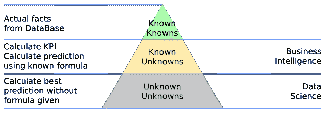

# 数据科学与商业智能:相同但完全不同

> 原文：<https://towardsdatascience.com/data-science-vs-business-intelligence-same-but-completely-different-1d5900c9cc95?source=collection_archive---------6----------------------->

## 对你的第一个数据科学项目有什么期望？商业指南。第二部分

Image by [analogicus](https://pixabay.com/users/analogicus-8164369/?utm_source=link-attribution&utm_medium=referral&utm_campaign=image&utm_content=3703469) from Pixabay

这是本系列的第 2 部分。参见第 1 部分[此处](/data-science-and-ai-for-business-data-analysts-64f28a5d7ff2)

*与大的科技公司不同，一般来说，企业只是刚刚涉足数据科学和人工智能。与早期采用一样，这并不容易——大多数项目没有超过概念验证阶段，从业务角度来看，这被认为是失败的。没有公布有多少数据科学项目失败的数字，但我敢肯定这甚至高于大数据项目* [*令人失望的 85%的数字*](https://www.techrepublic.com/article/85-of-big-data-projects-fail-but-your-developers-can-help-yours-succeed/) *。*

*为什么故障率这么高？主要是因为数据科学是新生事物。它将新类型的协作、需求和文化引入到已建立的企业环境中。由这些新奇事物引起的复杂情况通常在开始时很难看到。但是当他们开始解开，他们经常在某些点上变得太困难。不幸的是，这些复杂因素通常不会在向企业销售人工智能和数据科学的各种营销宣传中列出。*

商业智能是一个总括术语，描述了通过使用基于事实的支持系统来改进商业决策的概念和方法[1]。现代商业智能不仅仅是商业报告。这是一个成熟的系统，提供交互式仪表盘、假设规划、移动分析等。它还包括大型后端部件，用于维护对报告的控制和治理。

由于 BI 是一个总括术语，因此它可能因公司而异。对于一些公司来说，它可能只是所有支持基础架构的基本关键绩效指标(KPI)报告，其他公司可能使用基于统计模型和高级工具的高级预测方法。但是不管使用什么方法或工具，它们都根据业务利益相关者的需求为他们的决策提供事实。

> **但是嘿！数据科学不也是这样吗？是的，它是。**

从业务流程的角度来看，数据科学和商业智能之间没有太大的区别，它们都支持基于数据事实的业务决策。可能这就是为什么在开始他们的第一个数据科学或人工智能项目的企业中，人们经常假设数据科学是同样的旧商业智能，但工作得更聪明。根据这一假设，可以在现有 BI 基础架构和流程的基础上开展数据科学项目。

这就是问题开始的时候:结果是一个数据科学家想要将数据以 CSV 文件的形式从系统中取出，但是公司的安全政策不允许这样做；数据科学家正在使用奇怪的库和软件构建他们的模型，基础设施团队在生产中不支持这些库和软件，等等。

任何公司的任何第一个数据科学项目都会从一开始就对现有团队产生新的挑战性需求。怎么会这样如果数据科学和 BI 做的一样，为什么会发生这种情况？为什么那些奇怪的要求？

> 在现实中，商业智能和数据科学之间的差异是如此之大，以至于它使一切都变得不同:期望、项目方法、相关人员等。但是人们必须从不同的角度去看它。

不同之处在于它们解决的问题类型:BI 使用一些可用的公式，为以前已知的事物提供新的价值。数据科学与未知事物打交道([见本系列第一部分](/data-science-and-ai-for-business-data-analysts-64f28a5d7ff2))，回答以前没有人回答过的数据问题，因此没有现成的公式。

在商业智能中，商业智能开发人员带着一个公式或方法来计算商业智能拥有的报告或 KPI。这意味着企业已经设计了 BI 方法，并且他们理解并乐于使用它。

在数据科学中，情况完全不同:业务带来的是实际数据和一些以前从未回答过的问题。现在由数据科学家来测试多种方法并选择最佳方法，在准确性、简单性、可用性和生产平台的功能之间进行平衡。一旦选择了模型并与业务部门达成一致，它就成为了回答问题的已知方法，成为了数据分析而非数据科学的主题。

您可能会注意到，上述关于 BI 的陈述是有争议的——它没有处理完全已知的事物——它可能有一个公式或方法，但它计算未知的 KPI 值，甚至使用批准的方法进行预测。为了解释这种双重性，我使用了一个很好的已知未知和未知未知的概念，这是由美国国防部长唐纳德·拉姆斯菲尔德在 2002 年关于缺乏证据证明伊拉克政府向恐怖分子提供大规模杀伤性武器的著名回答中推广的。

使用这一概念，我现在可以更简短地表述差异:

> **BI 处理已知的未知，而
> 数据科学处理未知的未知。**

这是他们之间最大最根本的区别。起初，这似乎是一种纯粹的形式主义，专注于一个不那么重要的差异，但一旦你开始考虑后果，它就会改变。

首先，处理未知的未知，数据科学不能保证项目一开始就成功，预测解决方案会是什么样子以及实施起来有多困难。这意味着建立一个商业案例和计划一个项目要困难得多。如果你继续解开这些暗示，你可能会得出这样的东西:

所有这些差异实际上都源于这一区别，而这一区别起初似乎并不显著。事实上，当从一开始就不知道解决方案时，数据科学家会使用试错法。在这种情况下，明智的做法是使用允许快速转变想法的工具和方法，这样每个新的试验都不需要太多的准备时间:如果需要，新数据应该随时可用，实现下一个试验方法的新软件和库应该易于安装和下载，基础设施必须准备好支持新软件或框架，等等。

> 这就是为什么典型的数据科学家的工具箱和实践都是为灵活性和敏捷性而构建的。编程语言、开源库、微服务、容器、API 和 extreme agile 都在帮助数据科学家快速浏览想法并找到解决方案。

然而，所有这些工具在开放、敏捷和流动的环境中工作得最好，在这样的环境中，这些工具的使用不受某些外部因素的限制。这种环境通常可以在科技公司和初创企业中找到。

> **典型的企业环境非常不同——它是为控制和可靠性而构建的，通过严格的流程规则、共同责任、多级决策等来实现。**

Photo by [Joshua Hoehne](https://unsplash.com/@mrthetrain?utm_source=medium&utm_medium=referral) on [Unsplash](https://unsplash.com?utm_source=medium&utm_medium=referral)

这意味着，大多数大型非科技公司的 IT 系统都受到严格监管，实施变革的速度很慢。这些公司中的任何数据科学项目都将面临多个令人分心的障碍:从业务系统中获取数据进行分析的漫长过程，由于当前的 IT 架构不支持容器和微服务，无法实施解决方案，等等。

维护企业系统的人也有非常不同的优先级和思维模式。他们不一定会对更改系统或添加新系统感到兴奋，他们可能会在签署对公司数据的访问权限时担心安全合规性，等等。企业终端用户可能也不会对将人工智能或数据科学引入他们的角色感到非常兴奋。他们可能会担心缺乏新领域的知识，或者担心自己工作的安全性，因为他们从媒体那里获得了对人工智能威胁的错误认知。

然而，所有这些人对于任何数据科学项目都是至关重要的。项目领导人和发起人必须考虑这些问题，以避免“文化冲突”，这可能会毁了任何项目。

> 项目负责人必须为数据科学家提供强有力的支持，否则他们会发现自己在充满敌意的过度监管环境中处于劣势。他们还必须传达为什么公司需要数据科学项目，并向人们保证这不会影响他们的工作安全。如果需要的话，项目发起人还需要能够在公司结构的所有层次上快速推动异常请求。

相比之下，商业智能已经是一个典型的企业景观的一部分，BI 项目基本上没有这些问题。BI 功能通常由已经整合到 IT 架构和流程中的单个或极少数平台提供。商业用户对它非常熟悉和自信。BI 项目将处理已知的未知，这意味着有一种方法可以找到这些未知，因此项目可以提前做好计划。BI 中没有太多的试错。最重要的是，一家公司通常会有成功的 BI 项目的良好经验和跟踪记录，并拥有良好的项目专业知识。

# 摘要

从业务角度来看，数据科学和商业智能在业务流程中扮演着相同的角色，它们都提供基于事实的见解来支持业务决策。但从另一个角度来看，它们是根本不同的，这使得一切都不同:期望、方法、使用的工具等。

区别在于他们处理的问题类型:BI 处理已知的未知问题，即使用已知的公式计算已知 KPI 的新值，而数据科学处理未知的未知问题，回答以前没有人回答过的数据问题。定义上的这一点点差异意义重大。在没有给出公式或方法的情况下，数据科学家使用试错法。在这种情况下，一般来说，数据科学无法在项目开始前保证成功，它无法预测找到解决方案需要多少步骤以及解决方案会是什么样子。

为了尽快找到解决方案，数据科学采用了针对速度优化的工具和方法:编程语言、库、Docker 容器、微服务架构等。这与典型的企业环境非常不同，在企业环境中，It 系统是为了控制和可靠性而构建的。仅这一点差异就给老牌公司的第一批数据科学项目带来了许多困难。

但这还不是全部！还有一个问题潜伏在眼前——使用 ***机器学习*** 。对于以设计和维护业务规则为己任的业务分析师来说，将 ML 引入业务环境可能是一个巨大的文化冲击。对于使用机器学习的解决方案，将不再需要这些规则！谁会喜欢这样的改变呢？在接下来的简短部分，我将触及机器学习给现有企业文化带来的结构性转变。

参考资料:

[1] D. J. Power，[《决策支持系统简史》，4.0 版](http://dssresources.com/history/dsshistory.html)。(2007 年 3 月 10 日)，DSSResources.COM。

*你可以在*[*LinkedIn*](https://www.linkedin.com/in/maxim-scherbak/)*[*Twitter*](https://twitter.com/MaximScherbak)*[*脸书*](https://www.facebook.com/MaxScherbak/) 上找到我**