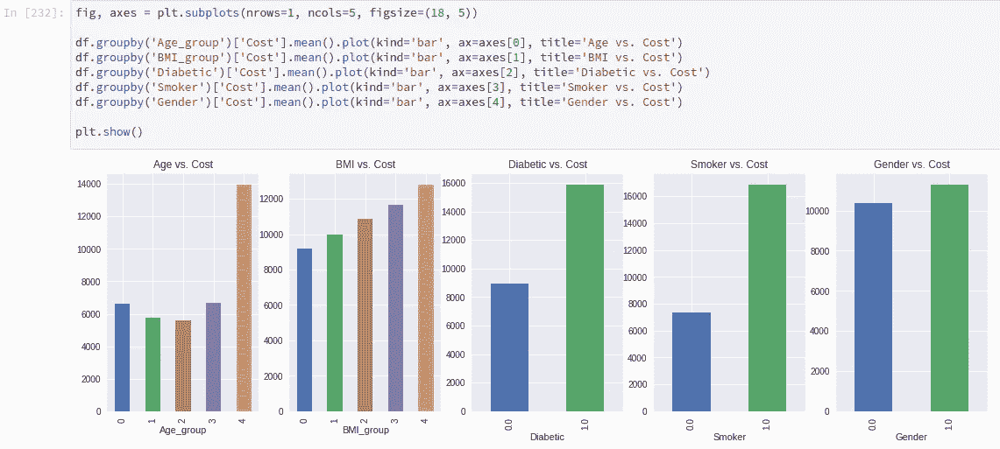

# 没有数据的数据科学

> 原文：<https://towardsdatascience.com/data-science-with-no-data-b3c21acee17c?source=collection_archive---------20----------------------->

## 构建不访问数据集的 AI/ML 模型

在本文中，我们将演示如何生成数据集来构建机器学习模型。根据这个数据，医疗保险欺诈和滥用每年花费纳税人 600 亿美元。AI/ML 可以极大地帮助识别和防止欺诈和滥用，但由于隐私在医疗患者数据中至关重要，因此访问这些数据极其困难。这使得数据科学家无法生成可能对该领域产生积极影响的模型。有没有一种方法可以在不访问底层数据的情况下设计和开发模型？是的，你可以使用真实的随机生成的数据生成一个原型。具体来说，我们将建立一个自动生成的医疗保险数据集，并使用它来识别潜在的欺诈索赔。这些是我们将遵循的高级步骤:

1.  生成患者数据集以开发模型预测。
2.  预处理数据集以输入到模型中。
3.  使用 K-最近邻算法训练模型以预测成本。
4.  为了进行推断，我们将输入新的患者数据，并将实际成本与预测成本进行比较。如果差额超过阈值，我们会将其标记为潜在欺诈。

# 数据集

对于这个项目，我们将在 Jupyter 中使用 Python。完整的代码将发布在 Github 上。我们的数据集包含病人的人口统计信息以及他们的医疗费用。这些字段是:

其中:

*   年龄-1 到 100 之间的随机值
*   吸烟者——随机 0 或 1，调整为 30%的人口是吸烟者
*   性别—随机 0 或 1 (1 为女性)
*   身体质量指数—介于 5 和 45 之间的随机整数
*   糖尿病患者——随机调整 0 或 1，使 20%的人口患有糖尿病
*   成本=当年医疗费用。我使用的平均值是 9596 美元

成本是根据其他字段计算的。下面是创建患者数据的代码。

下一步是根据输入数据计算合理的成本。基本上，我们将为每个变量设定一个乘数，并将其应用于均值保险。对于年龄，我想使用如下所示的函数:

这种观点认为，儿童的健康成本在他们成年之前一直较高，然后随着年龄的增长又开始增加。在我看来，这是一个合理的分布，但整个过程的美妙之处在于，你可以调整公式，使之适合你。

其他字段很简单:

*   从上面的公式乘以年龄开始
*   将吸烟者的平均值增加 100%
*   为女性增加 25%的平均值(当我向我的同事展示这份草案时，这引起了争议。我用的数字来自[这里](https://www.cms.gov/research-statistics-data-and-systems/statistics-trends-and-reports/nationalhealthexpenddata/downloads/2010ageandgenderhighlights.pdf)。)
*   对于每一质量百分比，各添加 1%
*   将糖尿病患者的平均值增加 75%

我必须再次强调，所有这些值都可以调整到对你有意义的程度。我肯定不是医学领域的专家，但这些似乎只是一个很好的起点。稍后调整计算并生成新数据非常容易。最后一步是将计算出的成本作为正态分布的输入，在结果中引入方差。这里的想法只是为了获得一些我们可以在设计模型时利用的数据。下面是为数据集创建一行的代码。

此时，您可以调用 add_row 为您的数据集获取尽可能多的数据行。就是这样！现在您已经有了一些样本数据，可以用来开发模型原型。

# 预处理数据集以输入到模型中

下一步是将数据预处理成适合机器学习模型的形式。此流程的步骤如下:

1.  将数据可视化，以确保它看起来合理。
2.  将连续数据放入桶中。
3.  将数据字段转换为一个热编码列。

## 可视化数据

在这里，我们希望确保我们生成的数据集看起来像我们期望的那样。我感兴趣的第一个字段是年龄字段，所以我绘制了它，以确保它与我上面显示的图表相对匹配。

它看起来非常接近我所期待的。随着我对数据和模型的了解越来越多，我可以随时回头修改公式来改进它。

## 将连续数据放入桶中

我们有两个字段，我称之为连续数据(即，它们不是布尔或分类)。这些字段是年龄和身体质量指数。年龄可以包含多达 100 个唯一值，身体质量指数可以有 40 个唯一值。这对于我们的模型来说可能变得难以处理，所以我们将它们分类到桶中。对于年龄和身体质量指数，我们将它们放入五个桶中。

现在让我们再次可视化数据，并确保一切看起来像预期的那样。

看起来相当不错，所以让我们进行下一步。

## 将数据字段转换为一个热编码列

如你所见，年龄组和身体质量指数组与糖尿病患者、吸烟者和性别的比例不同。例如，年龄组在 0 和 4 之间，而糖尿病患者在 0 和 1 之间。有很多方法可以解决这个问题，对于这个问题，我将使用一种叫做 **one-hot 编码的技术。**我们的想法是将 Age_group 列透视为包含零的五列，除了包含年龄组的列。例如，如果 Age_group ==2，则列的值将为 0，0，1，0，0。幸运的是，Python 有一个内置函数可以为我们完成这种转换。

运行上述代码后，我们的数据集看起来是这样的:

现在所有的输入字段都包含值 0 或 1。我们终于准备好开始建立一个基于数据的模型。

在此之前，我想说明两点。首先，我没有向这个模型添加任何空值检查或数据类型检查。当您开始处理“真正的”数据时，您会希望这样做。第二，您可能想知道为什么我首先要经历所有这些数据处理(也就是说，为什么我不生成一个看起来像完整过程的数据集。答案是，我想生成一个数据集，它看起来像是我可能从真实来源获得的。找到已经分桶和编码的数据集的可能性非常小。

# 训练模特

训练模型的第一步是将我们的数据分成训练集和测试集。我们将在训练集上训练模型，然后通过呈现模型没有看到的数据并将预测结果与实际结果进行比较来测试它。这被称为**误差，**，这是我们在训练模型时想要最小化的。在本教程中，计算误差的方法称为均方根误差，但您可以使用许多函数来计算。下面是分割数据的代码(在这种情况下，我们将 70%用于训练，30%用于测试)。

现在我们有了可用格式的数据，我们可以构建和训练一个模型来预测结果。在这个练习中，我们将使用**K-最近邻**模型。Python 支持我们可以利用的许多不同的模型，但是我觉得这是数据科学中最直观的模型。它是这样工作的:

假设我们有一个如下所示的数据集(X1 和 X2 是输入要素，而 Y 是结果值)。

现在，让我们绘制这些数据，看看它看起来像什么:

这样，我们可以通过对 K 个最近邻点的 Y 值进行平均来预测图上新点的 Y 值。对于这个例子，我们将设置 K = 4。红点将是我们新的输入点。

由于在本例中 K == 4，我们将取最接近新值的 4 个点的平均 Y 值，并用它来预测新点的 Y 值。在这种情况下，我们将使用突出显示的行:

对于我们的新点，Y 值的估计值是 60.5。

Python 的 sklearn 库有一个我们将利用的 K 近邻内置函数。唯一的诀窍是我们应该把 K 设为什么值？最简单的技术是用多个 K 值运行模型，并记录每个值的误差。我们可以利用这一点找到最佳的精确度。下面是实现这一点的代码:

运行上述代码后，我们可以绘制与 K 相关的错误率:

为了确定 K 的最佳值，我们将利用**肘方法。**图表的 Y 轴是误差值。X 轴是 K 值。查看图表，似乎 55 左右是 k 的最佳值。然而,“拐点”出现在 10 左右。之后，你的成绩开始变平，甚至变得更差。对于本教程，我将分裂的差异，并使用 K = 20。

对于这个模型和数据集，我们可以预测一个病人的医疗保健成本在 2400 美元以内(我们生成的数据的平均值约为 11，000 美元)。这不是很好，但是我们可以对我们的模型和数据生成进行许多改进。但是，它仍然有助于识别潜在的欺诈性索赔，这是我们接下来要做的。

# 识别欺诈索赔

现在，让我们看看我们是否能够识别一些欺诈性索赔。为此，我生成了 100 行新数据。这个项目的想法是，一名医生对保险索赔收取双倍费用。因此，90 行按原样使用 add_rows 函数，并将名为“欺诈”的标志设置为零。然后，我添加了 10 行，但我将成本增加了一倍，并将“欺诈”标志设置为 1。这是这个新数据集的图表。

绿点代表欺诈性索赔，而蓝点代表合法索赔。看起来我们有五个异常值需要调查。这种情况下，恰好都是诈骗。其他五个异常值隐藏在非欺诈声明中。发现 50%的欺诈性索赔似乎很不错，但我们能做得更好吗？

对于这个算法，我们将通过我们的模型运行所有 100 个索赔，并将实际成本除以预测成本(我将这个计算结果称为“错误”)，并寻找异常值。下面是显示结果的图表:

在这张图表中，我们看到我们在识别异常值方面做得非常好。这是一个非常好的结果，有助于简化识别欺诈的流程。

# 结论

首先，我要感谢[这篇文章](https://www.analyticsvidhya.com/blog/2018/08/k-nearest-neighbor-introduction-regression-python/),它介绍了使用 KNN 进行回归的过程。其次，我需要在这里澄清一下，让您知道我不是数学家，而且我相对来说是 Python 的新手，所以我很乐意得到您的反馈，告诉我如何在这两个方面改进代码。第三，代码已经发布在 [GitHub](https://github.com/Concretely/knn_fraud) 上，请随意在您的项目中使用它，并让我知道您的想法。