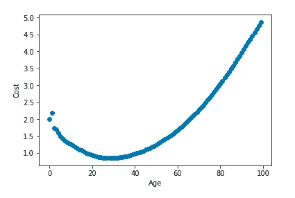

# 没有数学的数据科学

> 原文：<https://towardsdatascience.com/data-science-with-no-math-fd502621728b?source=collection_archive---------14----------------------->

## 使用人工智能建立数学数据集


这是我的上一篇文章的附录，在文章的最后我必须补充一点，我不是数学家，而且我是 Python 新手。我添加这个是因为我努力想出一个数学公式来生成患者数据，这些数据将遵循对我有意义的趋势。本文的目标是生成 10，000 份将年龄与成本相关联的患者记录。我希望这种关联遵循如下模式:


Artists rendition of correlation pattern (not exact)

Y 轴是成本乘数；X 轴是年龄。这里的想法是，病人的费用开始时相对较高，随着他们接近某个年龄而降低，然后又开始增加。经过多次反复试验，我想出了一个公式，它可以生成一个类似这样的图形:


你可以明显看出这个公式有一些瑕疵。最明显的一点是，这意味着一旦病人到了 60 岁，费用就会稳定下来。在我想使用的相关性中，成本随着年龄的增长而不断增加。为了完成这篇文章，我觉得这已经足够了，我已经准备好开始编写实际的代码了。

在我发表文章后的几天里，我继续试图想出一个遵循我的相关性模式的公式，但没有成功。然后有一天我恍然大悟:**为什么不让计算机算出公式**。如果我能成功实现这一点，我就可以集中精力提高我的 Python 知识(这是我的首要目标),而不是找出一个数学公式。让我们使用机器学习来生成一个公式的近似值，我希望使用一些值作为输入。一旦我们训练了一个模型，我们就可以生成一个完整的样本数据集，输入到机器学习模型中。

第一步是设置一些值来训练我们的模型:


现在，如果我们绘制这个，你可以看到它大致遵循我在上面画的图:


我们现在可以使用这些数据作为神经网络的输入来建立一个模型，我们可以训练这个模型来预测我们进入的任何年龄:

```
from sklearn.neural_network import MLPRegressor
regr=MLPRegressor(hidden_layer_sizes=(30),
                   activation='tanh',
                   solver='lbfgs',
                   max_iter=20000)
model=regr.fit(np.array(age_df['Age']).reshape(-1,1),Age_df['Cost'])
```

MLPRegresser 中的 MLP 代表多层感知器，这是一种神经网络，是 sklearn Python 库的一部分。sklearn 库内置了许多回归器，使用它们来为您的应用程序找到最佳结果非常容易。所有回归变量都有一个拟合函数，用给定的输入来训练模型。

现在我们的模型已经训练好了，让我们生成一个测试数据集来看看我们的模型表现如何。

```
df = pd.DataFrame( {'Age': np.arange(0,100), 'Cost': model.predict(np.arange(0,100).reshape(-1, 1))})
```

在这种情况下，我们生成一个数据帧，其中包含 0 到 100 岁之间的每个年龄的一行，以及我们的模型为该年龄预测的成本。绘制结果给我们提供了:


这看起来更像我在文章顶部画的图。然而，我们不希望我们的模型预测一个时代的确切成本乘数。相反，我们希望使用预测作为基线来预测随机值。在这种情况下，我们将调整数据，使成本在预测的 20%以内。下面是在 Python 中如何做到这一点:

```
df['Cost']  = [i + i * random.uniform(-0.2, 0.2) for i in df['Cost']]
```

现在，如果我们绘制数据集，它看起来像这样:


现在，我们已经生成了 100 个值，大致符合文章顶部的图形。让我们使用这个模型生成一个 10，000 行的数据集。

```
df2 = pd.DataFrame( {'Age': (np.random.random_sample((10000,))*100).astype(int)})
df2['Cost'] = model.predict(np.array(df2['Age']).reshape(-1, 1))
```

这是这 10，000 个年龄/成本值的散点图，正如我们可以看到的，它仍然大致遵循文章顶部的绘图。



现在，我们将向数据集添加一些随机性，看看它看起来像什么:

```
df2['Cost']  = [i + i * random.uniform(-0.2, 0.2) for i in df2['Cost']]
```


我们现在可以将此作为数据集的一部分，使用年龄作为输入之一来预测医疗保健成本。这个概念可以有效地用来扩充 Kaggle 上的数据集,该数据集包含有价值的趋势，但只包含 1338 行。使用这种技术，我们可以生成我们想要输入到模型中的任意多的行。