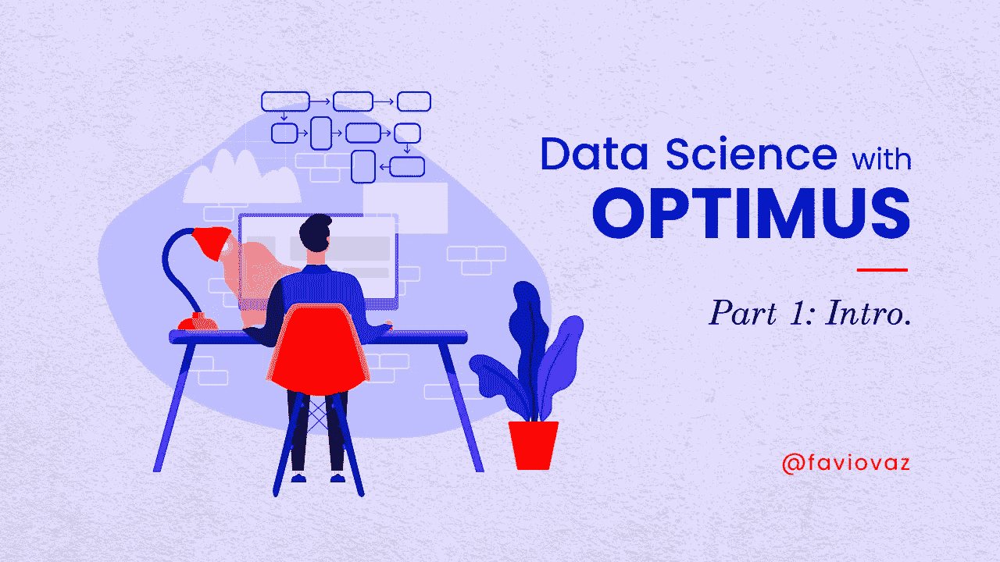
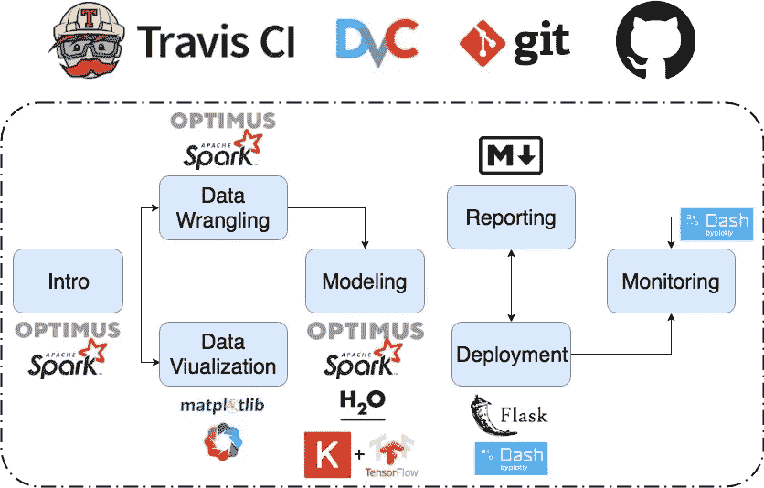
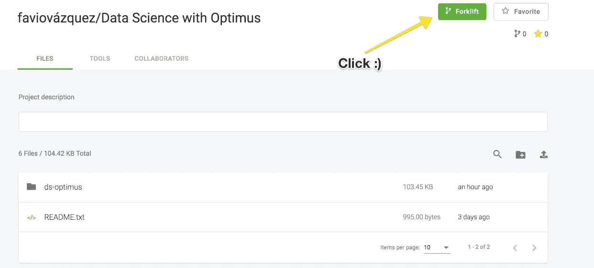
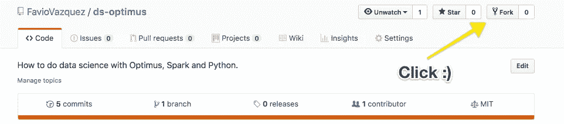

# 擎天柱的数据科学。第 1 部分:简介。

> 原文：<https://towardsdatascience.com/data-science-with-optimus-part-1-intro-1f3e2392b02a?source=collection_archive---------16----------------------->

## [第二部](/data-science-with-optimus-part-2-setting-your-dataops-environment-248b0bd3bce3)。

## 用 Python、Spark 和 Optimus 分解数据科学。你可以在这里阅读第二部《T4》。



Illustration by [Héizel Vázquez](https://heizelvazquez.tumblr.com/)

数据科学已经达到了新的复杂程度，当然也令人惊叹。我已经做了很多年了，我希望人们有一条清晰简单的道路来完成他们的工作。

我已经谈论数据科学和更多东西有一段时间了，但是是时候让我们一起动手编写代码了。

这是关于 Optimus、Spark 和 Python 的数据科学系列文章的开始。

# 擎天柱是什么？


[https://github.com/ironmussa/Optimus](https://github.com/ironmussa/Optimus)

如果你关注我有一段时间了，你会知道我和铁-AI 团队创建了一个名为擎天柱的库。

擎天柱 V2 的诞生是为了让数据清理变得轻而易举。这个 API 被设计成对于新来的人来说非常简单，对于和熊猫一起工作的人来说也非常熟悉。Optimus 扩展了 Spark 数据帧的功能，增加了`.rows`和`.cols`属性。

使用 Optimus，您可以清理数据、准备数据、分析数据、创建剖面图和绘图，以及执行机器学习和深度学习，所有这些都以分布式方式进行，因为在后端，我们有 Spark、TensorFlow、Sparkling Water 和 Keras。

超级好用。就像熊猫的进化，有一块 dplyr，加入了 Keras 和 Spark。您用 Optimus 创建的代码可以在您的本地机器上运行，并且只需简单地更换主机，它就可以在您的本地集群或云中运行。

您将看到许多有趣的函数被创建来帮助数据科学周期的每一步。

Optimus 是数据科学敏捷方法的完美伴侣，因为它可以在过程的几乎所有步骤中帮助您，并且它可以轻松地连接到其他库和工具。

如果你想了解更多关于敏捷数据挖掘方法的信息，请查看:

[](http://www.business-science.io/business/2018/08/21/agile-business-science-problem-framework.html) [## 创建 ROI 驱动的数据科学实践的敏捷框架

### 数据科学是一个令人惊叹的研究领域，学术界和工业界都在积极发展…

www .商业科学. io](http://www.business-science.io/business/2018/08/21/agile-business-science-problem-framework.html) 

# 安装擎天柱

安装过程非常简单。只需运行命令:

```
pip install optimuspyspark
```

你已经准备好摇滚了。

# 运行 Optimus(以及 Spark，Python 等。)


创建数据科学环境应该很容易。无论是尝试还是生产。当我开始思考这一系列文章时，我震惊地发现用免费工具为数据科学准备一个可再现的环境是多么困难。

一些参赛者是:

[](https://colab.research.google.com/) [## 谷歌联合实验室

### 编辑描述

colab.research.google.com](https://colab.research.google.com/)  [## 微软 Azure 笔记本-在线 Jupyter 笔记本

### 提供对运行在微软 Azure 云上的 Jupyter 笔记本的免费在线访问。

notebooks.azure.com](https://notebooks.azure.com/) [](https://cnvrg.io/) [## 主页- cnvrg

### 编辑描述

cnvrg.io](https://cnvrg.io/) 

但毫无疑问，我的赢家是 MatrixDS:

[](https://matrixds.com/) [## 由数据科学家创建的数据科学家社区

### 编辑描述

matrixds.com](https://matrixds.com/) 

有了这个工具，你就有了一个免费的 Python(用 JupyterLab)和 R(用 R Studio)环境，还有像 Shiny 和 Bokeh 这样的演示工具，等等。而且免费。您将能够运行回购中的所有内容:

[](https://github.com/FavioVazquez/ds-optimus) [## FavioVazquez/ds-optimus

### 如何用 Optimus，Spark，Python 做数据科学？-法维奥巴斯克斯/ds-擎天柱

github.com](https://github.com/FavioVazquez/ds-optimus) 

在 MatrixDS 内部有一个简单的项目分支:

 [## MatrixDS |数据项目工作台

### MatrixDS 是一个构建、共享和管理任何规模的数据项目的地方。

community.platform.matrixds.com](https://community.platform.matrixds.com/community/project/5c5907039298c0508b9589d2/files) 

只要创建一个帐户，你就可以了。

# 旅程



Don’t worry if you don’t know what these logos are, I’ll explain them in next articles :)

上面的路径是我将如何组织这个系列中不同的博客、教程和文章。我现在必须告诉你，我正在准备一门完整的课程，这门课程将从商业科学的商业角度介绍一些工具，你可以在这里看到更多信息:

[](https://university.business-science.io/) [## 商业科学大学

### 从虚拟研讨会中学习，这些研讨会将带您了解解决问题的整个数据科学业务流程…

大学.商业-科学. io](https://university.business-science.io/) 

第一部分在 MatrixDS 和 GitHub 上，所以你可以在 GitHub 上叉入，在 MatrixDS 上叉出。

 [## MatrixDS |数据项目工作台

### MatrixDS 是一个构建、共享和管理任何规模的数据项目的地方。

community.platform.matrixds.com](https://community.platform.matrixds.com/community/project/5c5907039298c0508b9589d2/files) 

在 MatrixDS 上，单击叉车:

[](https://github.com/FavioVazquez/ds-optimus) [## FavioVazquez/ds-optimus

### 如何用 Optimus，Spark，Python 做数据科学？-法维奥巴斯克斯/ds-擎天柱

github.com](https://github.com/FavioVazquez/ds-optimus) 

这是笔记本，但请在平台上查看:)

如需更新，请在 Twitter 和 LinkedIn 上关注我:)。