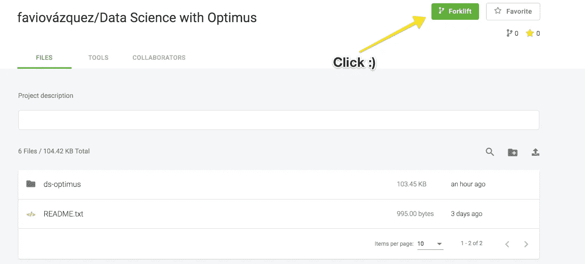

# 擎天柱的数据科学。第 2 部分:设置您的数据操作环境。

> 原文：<https://towardsdatascience.com/data-science-with-optimus-part-2-setting-your-dataops-environment-248b0bd3bce3?source=collection_archive---------18----------------------->

## 用 Python、Spark 和 Optimus 分解数据科学。今天:数据科学的数据操作。..::[此处第 1 部分](/data-science-with-optimus-part-1-intro-1f3e2392b02a)::..在这里，我们将学习为我们的项目设置 Git、Travis CI 和 DVC。


Illustration by [Héizel Vázquez](https://heizelvazquez.tumblr.com/)

欢迎回到 Optimus 的数据科学系列。在第一部分中:

[](/data-science-with-optimus-part-1-intro-1f3e2392b02a) [## 擎天柱的数据科学。第 1 部分:简介。

### 用 Python、Spark 和 Optimus 分解数据科学。

towardsdatascience.com](/data-science-with-optimus-part-1-intro-1f3e2392b02a) 

我们开始这个旅程，谈论擎天柱，火花和创造环境。为此，我们使用 MatrixDS:

[](https://matrixds.com/) [## 由数据科学家创建的数据科学家社区

数据社区的工作台 matrixds.com](https://matrixds.com/) 

要访问回购，只需点击下方:

 [## MatrixDS |数据项目工作台

### MatrixDS 是一个构建、共享和管理任何规模的数据项目的地方。

community.platform.matrixds.com](https://community.platform.matrixds.com/community/project/5c5907039298c0508b9589d2/files) 

在 MatrixDS 上，单击叉车:



GitHub 上也有回购:

[](https://github.com/FavioVazquez/ds-optimus) [## FavioVazquez/ds-optimus

### 如何用 Optimus，Spark，Python 做数据科学？法维奥·巴斯克斯/ds-optimus

github.com](https://github.com/FavioVazquez/ds-optimus) 

你只需要克隆它。


# 数据操作


来自[数据厨房](https://www.datakitchen.io/)的优秀员工:

> DataOps 可以提高数据分析团队创建和向用户发布新分析的能力。它需要敏捷的思维方式，还必须得到自动化平台的支持，该平台将现有工具整合到数据操作开发管道中。DataOps 涵盖了从数据采集到洞察交付的整个分析流程。

因此，对我来说，DataOps(来自数据操作)可以被认为是这些领域的交集:


其功能组件将包括:


你可以在我的朋友 [Andreas Kretz](https://medium.com/u/f28a432ce853?source=post_page-----248b0bd3bce3--------------------------------) 的出版物中读到更多关于这些话题的内容:

[](https://medium.com/plumbersofdatascience) [## 数据科学管道工

### 数据科学背后的工程和大数据社区

medium.com](https://medium.com/plumbersofdatascience) 

# 在 MatrixDS 上设置环境


[https://matrixds.com/](https://matrixds.com/)

我们将使用工具:TravisCI、DVC、Git 和 GitHub 在平台中创建一个简单(但健壮)的数据操作环境。

# Git:


[https://git-scm.com/](https://git-scm.com/)

Git 是一个免费的开源分布式版本控制系统，旨在快速高效地处理从小到大的项目。

在数据科学中，git 就像是我们的内部经理，拥有强大的记忆力。它会记住你做过的所有事情，你是如何做的，以及存储库中每个文件的历史。

Git 默认安装在 MatrixDS 中，但是我们需要设置两个配置。首先，让我们打开一个新的终端并键入:

```
**git config --global user.name "FIRST_NAME LAST_NAME"**
```

设定你的名字，然后

```
**git config --global user.email "MY_NAME@example.com"**
```

设置您的电子邮件。

我建议你放在那里的邮箱和你在 GitHub 上的邮箱是一样的。

要开始使用此存储库，只需克隆它:

```
**git clone** [**https://github.com/FavioVazquez/ds-optimus.git**](https://github.com/FavioVazquez/ds-optimus.git)
```

然后转到目录:

```
**cd ds-optimus**
```

因为这已经是一个 Git repo，所以您不需要初始化它，但是如果您是从零开始，您将需要键入:

```
git init
```

在您想要存储库的文件夹上。

# DVC:


[https://dvc.org/](https://dvc.org/)

DVC 或数据版本控制是一个用于机器学习项目和数据科学项目的开源版本控制系统。这段视频对此做了更好的解释:

因为我们使用的是 Python，我们将通过以下方式安装 DVC:

```
**pip install --user dvc**
```

正如文档所说，为了开始使用 DVC，你需要首先在你的项目目录中初始化它。DVC 不需要 Git，也可以在没有任何源代码控制管理系统的情况下工作，但是为了获得最佳体验，我们推荐在 Git 库之上使用 DVC。

## 重要评论:

> **现在 DVC 的 MatrixDS 中的一些配置有错误，所以为了运行 DVC，你必须在不同的文件夹中执行，而不是在/home/matrix 中。为此，请这样做(我假设您在默认文件夹中有原始项目):**

```
cd /home/
sudo mkdir project
cd project
cp -r ../matrix/ds-optimus/ .
cd ds-optimus
```

因此，要开始在我们的回购中使用 DVC，我们只需键入:

```
**dvc init**
```

如果由于某种原因，这在 MatrixDS 上对您不起作用，请为 linux 安装 DVC:

```
**wget https://dvc.org/deb/dvc.list
sudo cp dvc.list /etc/apt/sources.list.d/
sudo apt-get update
sudo apt-get install dvc**
```

如果由于某种原因，您得到了错误:

```
W: chown to root:adm of file /var/log/apt/term.log failed - OpenLog (1: Operation not permitted)
```

模仿

```
sudo su
```

然后键入:

```
apt-get install dvc
```

好的，如果你在这个回购上运行 **dvc init** ，你会看到:

```
Adding '.dvc/state' to '.dvc/.gitignore'.
Adding '.dvc/lock' to '.dvc/.gitignore'.
Adding '.dvc/config.local' to '.dvc/.gitignore'.
Adding '.dvc/updater' to '.dvc/.gitignore'.
Adding '.dvc/updater.lock' to '.dvc/.gitignore'.
Adding '.dvc/state-journal' to '.dvc/.gitignore'.
Adding '.dvc/state-wal' to '.dvc/.gitignore'.
Adding '.dvc/cache' to '.dvc/.gitignore'.You can now commit the changes to git.+-----------------------------------------------------------------+
|                                                                 |    |                                                                 |
|        DVC has enabled anonymous aggregate usage analytics.     |    |                                                                 |
|     Read the analytics documentation (and how to opt-out) here: |     |                                                                 |
|              [https://dvc.org/doc/user-guide/analytics](https://dvc.org/doc/user-guide/analytics)           |           |                                                                 |
|                                                                 |             |                                                                 |
+-----------------------------------------------------------------+What's next?
------------
- Check out the documentation: [https://dvc.org/doc](https://dvc.org/doc)
- Get help and share ideas: [https://dvc.org/chat](https://dvc.org/chat)
- Star us on GitHub: [https://github.com/iterative/dvc](https://github.com/iterative/dvc)
```

然后提交您的工作(如果您更改了文件夹，您可能需要再次配置 Git):

```
git add .
git commit -m "Add DVC to project"
```

# 特拉维斯 CI:


[https://travis-ci.org/](https://travis-ci.org/)

Travis CI(持续集成)是我最喜欢的 CI 工具。持续集成是指频繁地合并小的代码变更，而不是在开发周期结束时合并大的变更。目标是通过以较小的增量开发和测试来构建更健康的软件。

这里隐藏的概念是自动测试你在做什么。当我们编程时，我们一直在做很多事情，我们在测试新的东西，尝试新的库等等，把事情搞砸并不罕见。CI 可以帮助你，因为你将开始做你的工作，用 Git 提交一点点，你应该有必要的测试来看看你做的新代码或分析是否影响(以好的或不好的方式)你的项目。

关于 Travis 和 CI 工具还有很多要了解的，但这里的计划是使用它，您将在途中学习。所以你要做的第一件事就是去:

[](https://travis-ci.org/) [## Travis CI——满怀信心地测试和部署您的代码

### 编辑描述

travis-ci.org](https://travis-ci.org/) 

并使用您的 GitHub 个人资料创建一个帐户。

然后你会去**(我在这里假设你已经成功地从 GitHub 获得回购)**然后在[https://travis-ci.org/account/repositories](https://travis-ci.org/account/repositories)你会选择 **ds-optimus:**


然后激活回购


如果一切顺利，您会看到类似这样的内容:


好的，现在这个是空的，因为我们还没有任何东西可以测试。这很好，将在下面的文章中讨论这个问题。但是现在我们需要构建将触发“travis builds”的基本文件。

我们需要一个. travis.yml 文件，这是它应该包含的基本内容:

```
language: python
python:
  - "3.6"
# Before upgrade pip and pytest
before_install:
- pip install --upgrade pip
- pip install pytest
# command to install dependencies
install:
  - pip install -r requirements.txt
# command to run tests
#script: pytest
```

正如你所看到的，我们还需要一个 requirements.txt 文件，在我们的例子中，现在只有 optimus。

> 如果你在 GitHub 上有一个项目的分支，确保将我的主人添加为上游，因为文件已经在那里了。

如果你不知道如何添加一个上游，以下是方法:

[](https://medium.com/sweetmeat/how-to-keep-a-downstream-git-repository-current-with-upstream-repository-changes-10b76fad6d97) [## 如何使下游的 git 存储库跟上上游存储库的变化

### 本文演示了如何在您执行…

medium.com](https://medium.com/sweetmeat/how-to-keep-a-downstream-git-repository-current-with-upstream-repository-changes-10b76fad6d97) 

然后，我们必须提交将“. travis.yml”添加到项目中的提交。

当你再次去特拉维斯时，你会看到你的第一件作品:


现在它会给我们一个错误，因为我们还没有创建任何测试来运行:


但是不要担心，我们以后会讲到的。

感谢您看到更新，并开始为此项目设置您的环境。如果您有任何问题，请在此写信给我:

[](https://www.linkedin.com/in/faviovazquez/) [## 法维奥·瓦兹奎-科学与数据公司创始人/首席数据科学家| LinkedIn

### 加入 LinkedIn ‼️‼️重要提示:由于 LinkedIn 技术限制，我现在只能接受连接请求…

www.linkedin.com](https://www.linkedin.com/in/faviovazquez/)