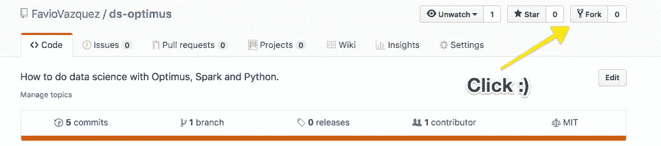

# 擎天柱的数据科学。第 3 部分:理解您的数据。

> 原文：<https://towardsdatascience.com/data-science-with-optimus-part-3-understanding-your-data-4b01c12c5907?source=collection_archive---------29----------------------->

## [第一部分](/data-science-with-optimus-part-1-intro-1f3e2392b02a)，[第二部分](/data-science-with-optimus-part-2-setting-your-dataops-environment-248b0bd3bce3)。

## 在疯狂地创建模型之前，你首先需要理解你的数据。本教程将向您解释如何在我们正在设置的环境中做到这一点。


Illustration by [Héizel Vázquez](https://heizelvazquez.tumblr.com/)

正如我之前所说:

> 数据第一。

但即使在那之前(像宇宙大爆炸之前)，你也需要理解数学、微积分、统计学和你正在解决的问题。

大型科技公司使用的秘密武器是对他们的数据的深刻理解和对项目非常具体的定义。

正如您可以想象的那样，数据现在是公司的重要资产(可能是最重要的资产)。所以在你可以应用机器学习或深度学习之前，你需要拥有它，知道你拥有什么，理解它，治理它，清理它，分析它，标准化它(也许更多)，然后你才能想到使用它。

这篇文章是对一个用熊猫做的伟大回购的修改，为什么？因为你可以比较所有的代码，看看如何在熊猫和用火花和擎天柱。这是原始回购协议:

[](https://github.com/guipsamora/pandas_exercises) [## 吉普萨莫拉/熊猫 _ 练习

### 练习你的熊猫技能！在 GitHub 上创建一个帐户，为 guipsamora/pandas_exercises 开发做贡献。

github.com](https://github.com/guipsamora/pandas_exercises) 

# 获取数据和代码

对于这里的一切，我们使用矩阵。有了这个工具，你就有了一个免费的 Python(用 JupyterLab 和 Jupyter Notebook)和 R(用 R Studio)环境，还有像 Shiny 和 Bokeh 等演示工具。而且免费。看一看:

[](https://matrixds.com/) [## 由数据科学家创建的数据科学家社区

数据社区的工作台 matrixds.com](https://matrixds.com/) 

要访问回购，只需点击下方:

 [## MatrixDS |数据项目工作台

### MatrixDS 是一个构建、共享和管理任何规模的数据项目的地方。

community.platform.matrixds.com](https://community.platform.matrixds.com/community/project/5c5907039298c0508b9589d2/files) 

在 MatrixDS 上，单击叉车:


GitHub 上也有回购:

[](https://github.com/FavioVazquez/ds-optimus) [## FavioVazquez/ds-optimus

### 如何用 Optimus，Spark，Python 做数据科学？法维奥·巴斯克斯/ds-optimus

github.com](https://github.com/FavioVazquez/ds-optimus) 

你只需要克隆它。



如果您回忆起其他部分的图像:


我们现在将关注数据争论和数据可视化部分。


# 第 0 部分。为 Optimus 设置环境

首先创建一个 JupyterLab 会话，打开终端并键入:

```
sudo update-alternatives --config java
```

你会看到:

```
There are 2 choices for the alternative java (providing /usr/bin/java).Selection    Path                                            Priority   Status
------------------------------------------------------------
* 0            /usr/lib/jvm/java-11-openjdk-amd64/bin/java      1101      auto mode
  1            /usr/lib/jvm/java-11-openjdk-amd64/bin/java      1101      manual mode
  2            /usr/lib/jvm/java-8-openjdk-amd64/jre/bin/java   1081      manual mode
```

选择数字 2。我们需要它，因为 Spark 和 Optimus 与 Java 8 配合得最好。

现在，确保您已经安装了 Optimus，如果没有，只需键入:

```
pip install — user optimuspyspark
```


# 第一部分。获取和了解您的数据(基础)


我们将使用的第一个笔记本是这样的(MatrixDS):

 [## MatrixDS |数据项目工作台

### MatrixDS 是一个构建、共享和管理任何规模的数据项目的地方。

community.platform.matrixds.com](https://community.platform.matrixds.com/community/project/5c5907039298c0508b9589d2/files) 

你可以看到她所有的细节:


# 第二部分。过滤和排序您的数据


我们将使用的下一个笔记本是这样的(MatrixDS):

 [## MatrixDS |数据项目工作台

### MatrixDS 是一个构建、共享和管理任何规模的数据项目的地方。

community.platform.matrixds.com](https://community.platform.matrixds.com/community/project/5c5907039298c0508b9589d2/files) 

GitHub:


# 第三部分。将您的数据分组


我们将使用的下一个笔记本是这样的(MatrixDS):

 [## MatrixDS |数据项目工作台

### MatrixDS 是一个构建、共享和管理任何规模的数据项目的地方。

community.platform.matrixds.com](https://community.platform.matrixds.com/community/project/5c5907039298c0508b9589d2/files) 

GitHub:


# 第四部分。连接您的数据


我们将使用的下一个笔记本是这样的(MatrixDS):

 [## MatrixDS |数据项目工作台

### MatrixDS 是一个构建、共享和管理任何规模的数据项目的地方。

community.platform.matrixds.com](https://community.platform.matrixds.com/community/project/5c5907039298c0508b9589d2/files) 

GitHub:


# 第五部分。创建数据统计


我们将使用的下一个笔记本是这样的(MatrixDS):

 [## MatrixDS |数据项目工作台

### MatrixDS 是一个构建、共享和管理任何规模的数据项目的地方。

community.platform.matrixds.com](https://community.platform.matrixds.com/community/project/5c5907039298c0508b9589d2/files) 

GitHub:


# 第六部分。可视化您的数据


我们将使用的下一个笔记本是这样的(MatrixDS):

 [## MatrixDS |数据项目工作台

### MatrixDS 是一个构建、共享和管理任何规模的数据项目的地方。

community.platform.matrixds.com](https://community.platform.matrixds.com/community/project/5c5907039298c0508b9589d2/files) 

GitHub:

[https://gist . github . com/FavioVazquez/1700 B1 a 941 b 17532 fa 6 BF 09 e 9 DFD 8 e3e](https://gist.github.com/FavioVazquez/1700b1a941b17532fa6bf09e9dfd8e3e)


感谢继续阅读这些文章，它们制作起来非常有趣。如果您有任何问题，请通过我的 LinkedIn 或 Twitter 联系我:

[](https://www.linkedin.com/in/faviovazquez/) [## 法维奥瓦兹奎-教员，教授和数据科学的中小企业-荣誉退休研究所…

### 拉斐尔·乌达内塔大学计算工程、科学计算活动和社会学士学位…

www.linkedin.com](https://www.linkedin.com/in/faviovazquez/) [](https://twitter.com/faviovaz) [## 法维奥·巴斯克斯(@法维奥·巴斯克斯)|推特

### Favio Vázquez 的最新推文(@FavioVaz)。数据科学家。物理学家和计算工程师。我有一个…

twitter.com](https://twitter.com/faviovaz)