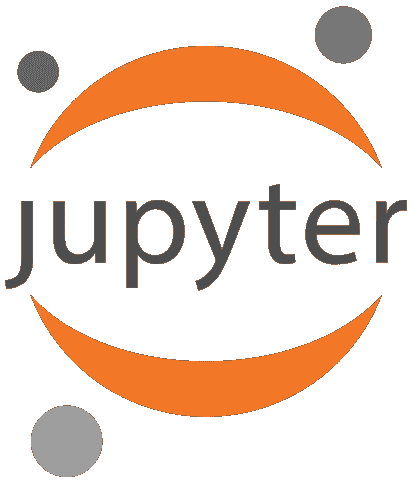
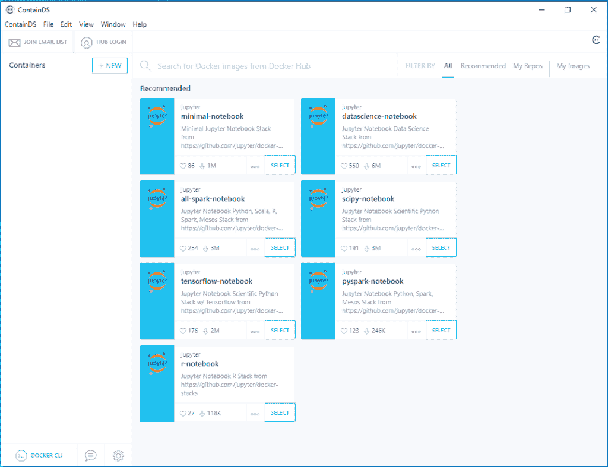
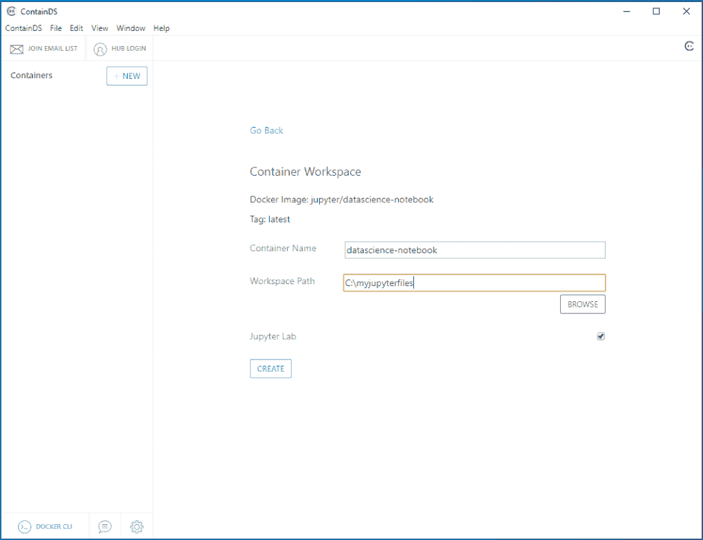
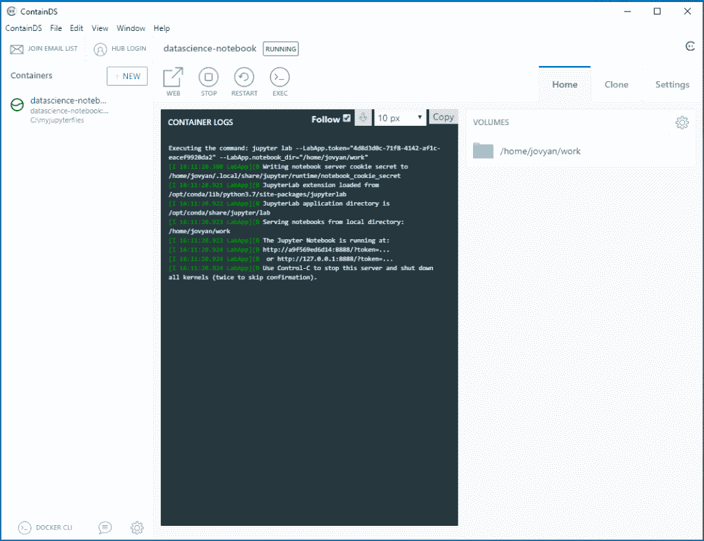
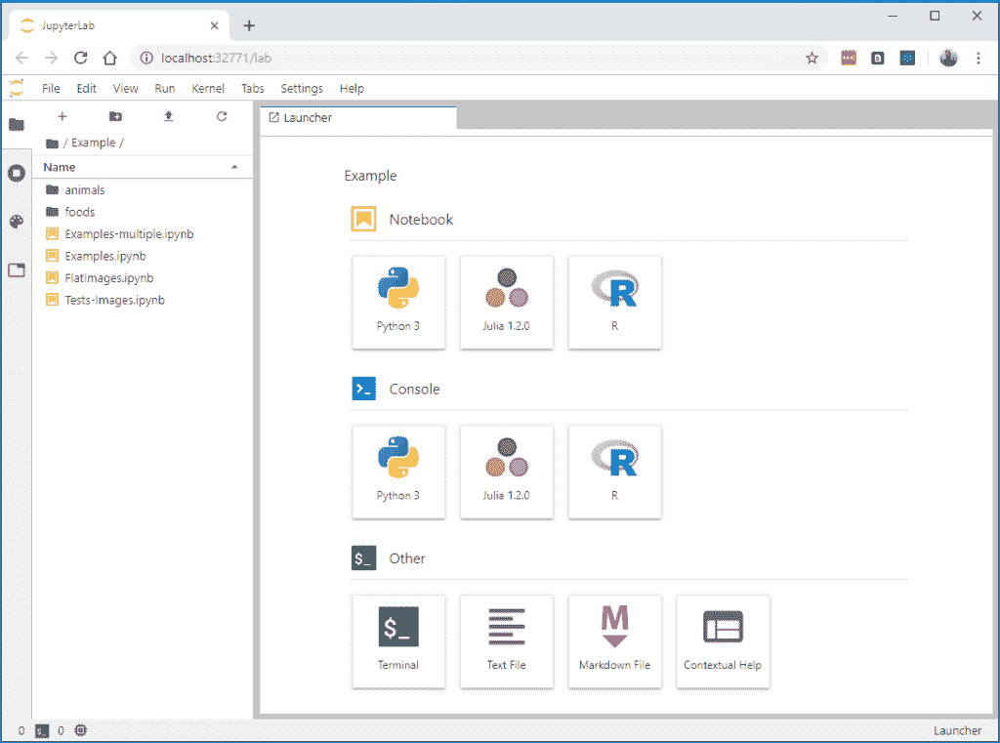

# 没有计算机科学的数据科学

> 原文：<https://towardsdatascience.com/data-science-without-the-computer-science-a9484dea7fcb?source=collection_archive---------20----------------------->

## 无需学习 Docker，运行可重用的独立 Jupyter 环境的更简单方法

我们都有一些战争故事。无法在 Windows 上托管特定 conda 包的 virtualenv。试图进行 Python 升级，清除了操作系统的本机二进制文件。或者一个精心策划的 virtualenv 最终做了我们需要的一切；但是我们不敢进行下一步的配置更改，以免打乱我们迄今为止的所有努力…

环境管理对数据科学家来说很重要，但是您真的希望它全部正常工作。我从多位数据科学家那里听到了这样的评论:我们可能应该使用 Docker 或其他东西来标准化和隔离我们的环境——但我们不想学习更多的计算机科学。

ContainDS 是用于 Windows 或 Mac 的新软件，提供了一个简单的用户界面，用于在 Docker 提供的独立虚拟环境中运行 Jupyter Lab 或笔记本电脑，而无需学习如何从命令行控制 Docker。

Jupyter Logo © 2019 Project Jupyter

基于一系列现成的环境(例如安装了 Tensorflow 的 Jupyter 或 SciPy)，您只需指定一个工作区(即您计算机上用于存储笔记本文件和任何数据的文件夹)，然后单击 ContainDS 将启动一个虚拟的 Linux“容器”,您可以在 web 浏览器中通过 Jupyter 直接访问该容器。它甚至照顾 Jupyter 的密码令牌，所以你不必复制和粘贴它…

您可以安装您需要的任何其他 conda 或 pip 包，然后克隆您的环境以供其他项目重用或与您的同事共享。

# 让我开始

虽然 ContainDS 试图保护你远离 Docker 的细节，但是你当然需要让 Docker 在你的计算机后台运行。

所以在你的电脑上安装 Docker 桌面’(社区版)。包括系统要求在内的更多细节在 Docker 网站上，如果你在 Docker Hub 上注册了一个帐户，你可以在那里下载安装程序。更直接的是，你可以使用链接直接下载安装程序:T2 Docker 桌面 Windows 版 T3 或 T4 Docker 桌面 Mac 版 T5。

接下来，从我们的下载页面安装 Windows 或 Mac 的 ContainDS。

## 选择基本环境

一旦 ContainDS 启动并运行，并且检测到 Docker 在您的计算机上正确运行，您将看到“新容器”屏幕:

选择一个推荐的 Jupyter 图片——也许是“datascience-notebook ”,开始使用 NumPy、Pandas 等安装 Python。单击选择，然后您将看到配置屏幕:

您真正需要输入的只是一个工作空间路径。这只是您要存储笔记本文件和任何数据的文件夹的位置。如果您已经知道要处理哪些文件，它可以是一个现有的文件夹，或者您可以输入 ContainDS 将为您创建的新文件夹路径。

或者，您可以更改容器名称以供将来参考，并且您可以通过取消选中“Jupyter Lab”复选框来选择启动 Jupyter Notebook，而不是最新的 Jupyter Lab web 前端。

单击创建开始下载图像并创建容器。第一次使用特定图像时，可能需要一段时间来下载，但它会被缓存以供将来使用。

## 直接发射到木星

当容器准备好时，您将看到熟悉的 Jupyter 控制台日志:

单击 web 按钮，您的默认 WEB 浏览器将会打开，并且已经连接到 Jupyter:

您会注意到 web 端口是由 ContainDS 自动分配的，您不需要复制和粘贴任何令牌或密码，因为 ContainDS 已经为您完成了这项工作。

## 完善您的环境

大概就是这样。现在你有了 Jupyter 环境，你可以像以前一样与它互动。

要安装其他软件包，您可以在 Jupyter Lab 中打开一个终端窗口(单击+图标，然后从启动器中选择终端)。本质上，此时您只是在 Linux 操作系统中——这可以使一些软件包的安装支持更加容易。Jupyter 图像都基于 conda 虚拟环境，因此您可以使用`conda install`或`pip install`。

或者，直接在你的笔记本里使用魔法命令(如`!pip install <package>`)。

## 不要完全忘记 Docker

所以使用 ContainDS 意味着您不必学习任何 Docker 命令！当然，知道您的环境是通过 Docker 运行的仍然很重要。你需要让 Docker 在后台运行。如果您使用 ContainDS 中的 stop 按钮停止容器运行，那么如果您以后重新启动它，它可能会分配一个新端口—因此您可能需要再次单击 WEB 按钮，在新端口上启动一个新的 Jupyter 会话。

如果您完全删除一个容器，那么它不会影响您的工作区文件夹，但是您当然会丢失您对 conda 环境所做的任何修改。要首先保留此类环境更改，并使您能够在将来重用该环境，请单击 ContainDS 中的 Clone 选项卡来拍摄快照。

## 集装箱真正为我做了什么？

在这个阶段，您真正要做的是基于 Jupyter 映像启动一个 Docker 容器，这个容器可以通过 Docker 命令行获得。ContainDS 使这变得更容易，特别是在“绑定”工作区文件夹、处理 Jupyter 令牌和定位 web 端口方面。

ContainDS 实际上是建立在 Docker 自己的捆绑 GUI 应用程序之上，名为[kite matic](https://docs.docker.com/kitematic/)——为数据科学家更新和定制。

展望未来，数据科学家可能需要 Docker 完成许多任务和配置，ContainDS 的目的是继续为您完成这些任务。为此，我们需要您的反馈和想法！因此，请[与](https://containds.com/support/)联系，让我们更多地了解您希望通过新的集装箱化 Jupyter 环境实现的目标…

Photo by [frank mckenna](https://unsplash.com/@frankiefoto?utm_source=medium&utm_medium=referral) on [Unsplash](https://unsplash.com?utm_source=medium&utm_medium=referral)

拥有一个根据你的需求定制的 GUI 可以让事情变得更快更简单，并且省去了学习 Docker 更多细节的麻烦。但是如果你确实想看到一些 Docker 命令，你可能需要手动实现它，请参阅 Dataquest 的教程:[为数据科学运行 Docker 化的 Jupyter 服务器](https://www.dataquest.io/blog/docker-data-science/)。