# 你需要知道的数据科学-诊断线性回归

> 原文：<https://towardsdatascience.com/data-science-you-need-to-know-linear-regression-2b6d966bc4a8?source=collection_archive---------16----------------------->

*这是我的“你需要了解的数据科学系列”的一部分，探索数据科学中经常被忽视的方面。* [*第一部*](/introduction-to-statistics-e9d72d818745) *和* [*第二部*](/data-science-you-need-to-know-a-b-testing-f2f12aff619a) *推荐阅读。第 3 部分即将推出！*

在本帖中，我们将介绍大多数学生最先学习的机器学习算法之一，线性回归。

你会看到很多跨越数据分析和数据科学的线性回归，不幸的是，很多都很弱。这通常有两个原因:

*   回归模型严重违反了一个或多个关键的统计假设
*   回归没有提供详细的诊断，因此无法评估其稳健性(以及其结论)

在这篇文章中，我们将学习如何避免这些问题，以及如何有效地评估和评论已发布的回归模型。我们将从 A/B 测试评估的角度来处理这个问题，但是同样的原则也适用于*生产化的*回归模型(即后端的模型)。

# 理论:回归独立数据

在我们建立回归模型之前，重要的是要彻底研究数据(例如通过配对图和密度图)并理解我们的 A/B 测试的统计能力(参见 [*第 1 部分*](/introduction-to-statistics-e9d72d818745) *和* [*第 2 部分*](/data-science-you-need-to-know-a-b-testing-f2f12aff619a) *)。*

一旦我们探索了数据，我们就可以开始建立一个线性模型。用于线性回归的 R/Python 代码的简单性可能具有欺骗性。虽然你可以通过简单的`lm(x,y),`产生结果，但你需要了解这些结果是否可靠。

线性回归有一组与其相关的**假设**和**警告**，在我们解释回归结果之前，需要对其进行检查。如果我们违反这些假设，那么代码*仍将运行*，您仍将获得系数、p 值和预测(等等)，但它们很可能*毫无意义！*

> *一点数据科学可能是一件危险的事情！*

# 好模型的标准

在我们着手模型构建之前，最好在头脑中有一个好模型的定义。我们将根据以下标准定义一个好的模型:

*   模型能够解释/预测 Y 值的全范围
*   模型可以准确地提供置信区间，以告知我们对不确定性(和重要性)的理解
*   异常值不会扭曲模型

我们可以通过满足以下线性回归标准来满足这些要求:

*   X 和 Y 之间的关系是线性的，或者可以是线性的。
*   误差与 X 无关(也称为同质性)
*   变量大多彼此不相关
*   残差呈正态分布

因此，为了构建一个好的模型，我们需要理解和评估上面概述的基本假设。我们将通过一系列的图来实现这一点，这些图检查了许多东西，但也许最重要的是模型的**残差**:

*   **残差**是模型预测值和实际观测值之间的差值。

我们将首先通过一个表现良好的回归来探索这些图，以了解这些图在最佳情况下的样子，然后这些图如何对异方差和非线性做出反应。

# 理论:表现良好的回归

首先，一个表现良好的回归模型。我们将(希望)记住直线的定义:

> Y=β。X+c

其中，β是系数矩阵，X 是常数矩阵，c 是截距。

我们将使用这个等式来理解回归，并添加一个 *e* 项来表示我们观察值周围的独立误差。运行回归时，我们的目标是确定:

> Y=β。X+c+e

这样我们就可以*精确地*确定系数 *β* 的大小(因此我们的处理效果)和 *e* (因此我们可以确定其显著性)。

让我们用一个实例来演示回归是如何工作的。首先，让我们定义我们的关系(目的是从回归结果中恢复这些值):

*   截距= 10
*   β = 2
*   误差项= 3

现在，我们将基于该等式模拟 200 个独立值:

```
set.seed(111)
ex1 <- data.frame("Xvals"=runif(1:200, min=1,max=10) )
ex1$Yvals = 10 + 2*ex1$Xvals + rnorm(200,0,3) *# y = \beta . X +c +e*

head(ex1[c("Xvals","Yvals")])
```

屈服:

```
##      Xvals    Yvals
## 1 6.336832 24.47252
## 2 7.538330 21.59567
## 3 4.333798 19.98488
## 4 5.634314 21.88319
## 5 4.398969 16.70039
## 6 4.765036 16.75019
```

现在让我们将 Xvals 回归到 Yvals，来问:“Xvals 和 Yvals 之间有什么关联？”。

```
exreg1 <- lm(Yvals~Xvals, data=ex1)
```

由于我们的回归相对简单，只有一个独立变量，我们可以很容易地用一个简单的图来显示结果:

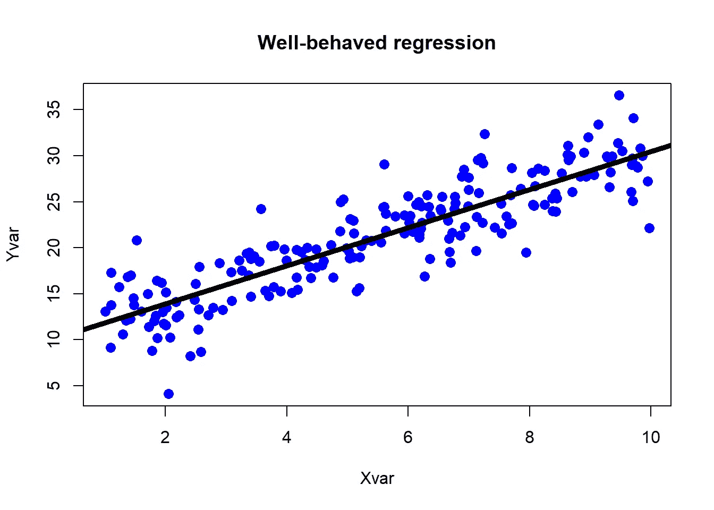

我们可以看到黑线很好地描述了`Xvals`和`Yvals`之间的关系。还要注意，蓝点距离回归线相对等距离；这是我们在回归分析中非常关心的事情。从每个点(蓝色)到模型(黑线)的距离称为*残差*，我们将这些收集在一起(pl。*残差*)来了解我们的模型性能(下图)。

在分析模型残差之前，让我们快速检查一下回归总结:

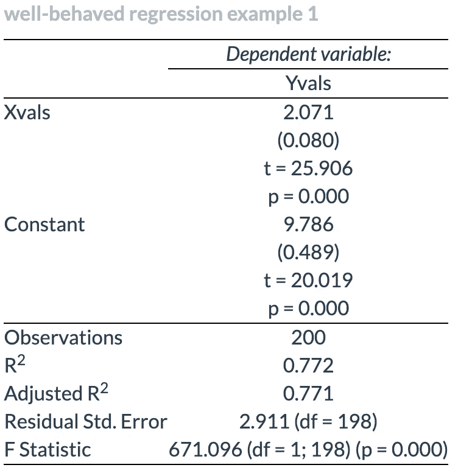

在继续之前，让我们回顾一下这些术语的含义:

*   **P 值**:[P 值](http://blog.minitab.com/blog/adventures-in-statistics-2/how-to-interpret-regression-analysis-results-p-values-and-coefficients)来源于检验零假设*系数= 0* 。如果 p 值低于某个阈值(通常为 0.05)，那么我们*拒绝零假设*并将结果称为“显著”。注意，统计学中的显著性是指“可靠”之类的意思。因此，系数可能非常小，但仍具有统计学意义(可靠)。
*   **系数**:当所有其他预测因子保持不变时，每个[系数](http://support.minitab.com/en-us/minitab-express/1/help-and-how-to/modeling-statistics/regression/supporting-topics/regression-models/what-is-a-regression-coefficient/)估计 X 中每单位增加的平均响应的变化。
*   **常数**:我们方程中的截距项。
*   **观察值**:数据帧中的行数。
*   R^2 [R 平方](http://blog.minitab.com/blog/adventures-in-statistics-2/regression-analysis-how-do-i-interpret-r-squared-and-assess-the-goodness-of-fit)是数据与拟合回归线接近程度的统计度量。它也被称为决定系数，或多元回归的多重决定系数。r 平方=解释偏差/总偏差。r 平方不能确定系数估计和预测是否有偏差，这就是为什么您必须评估残差图。r 平方并不表示回归模型是否合适。对于好的模型，可以使用低 R 平方值，对于不符合数据的模型，可以使用高 R 平方值！
*   **调整后的 r^2**[调整后的 r 平方](http://blog.minitab.com/blog/adventures-in-statistics-2/multiple-regession-analysis-use-adjusted-r-squared-and-predicted-r-squared-to-include-the-correct-number-of-variables)比较包含不同数量预测因子的回归模型的解释能力。调整后的 R-squared 是 R-squared 的修改版本，已针对模型中的预测因子数量进行了调整。只有当新项对模型的改善程度超过偶然情况下的预期时，调整后的 R 平方才会增加。当预测者偶然对模型的改进小于预期时，它会减少。调整后的 R 平方可以是负值，但通常不是。它总是低于 R 的平方。
*   **F 统计量**变量的加入是否整体上改善了回归模型？F 统计报告了零假设，即*我们当前的模型与仅截距模型*无法区分。拒绝这一假设(p < 0.05)表明包含变量是有帮助的。

我们可以看到，我们很好地恢复了截距和系数项(加上一些与误差项成比例的置信区间):

*   *截距* = 9.79
*   β = 2.07

接下来，让我们检查诊断图，以评估模型如何满足我们上面陈述的假设:

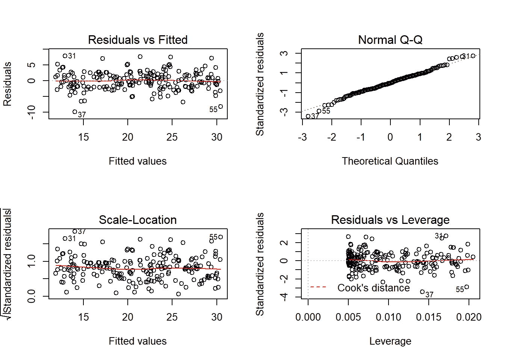

让我们一个接一个地分析这些情节:

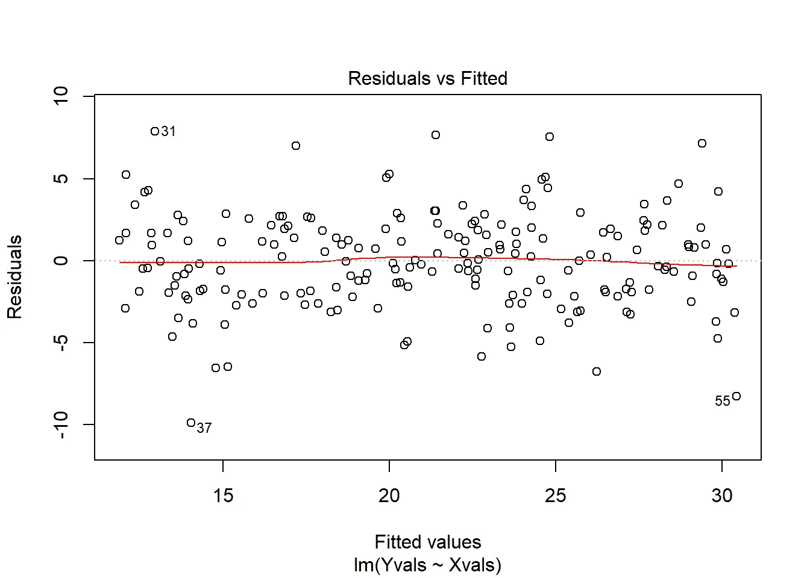

*   该图显示了模型残差与拟合值。理想情况下，我们希望残差在 0 处的黑色虚线周围均匀分布。红线表示平均残值，理想情况下位于 0.0 黑线上
*   不平坦的红线表示我们的数据可能是非线性的(使用上面的“Xvals vs Yvals”图，思考这是为什么)。
*   在 0.0 线周围具有不均匀或不对称散布的点代表异方差或非线性(再次思考为什么会这样)。

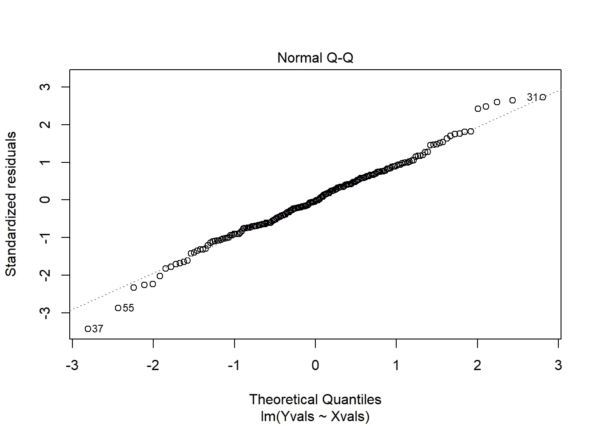

*   这是残差的 QQ 图。趋势偏离对角线(代表完全正态)表明我们的残差是非正态的(更多信息参见 [AMP 第 1 课](https://michael-bar.github.io/AMP-lessons/AMP-1-distributions.html#))。我们在这里看不到残差的任何趋势(高低 X 处的分散较小且不明显，因为它不构成趋势)。

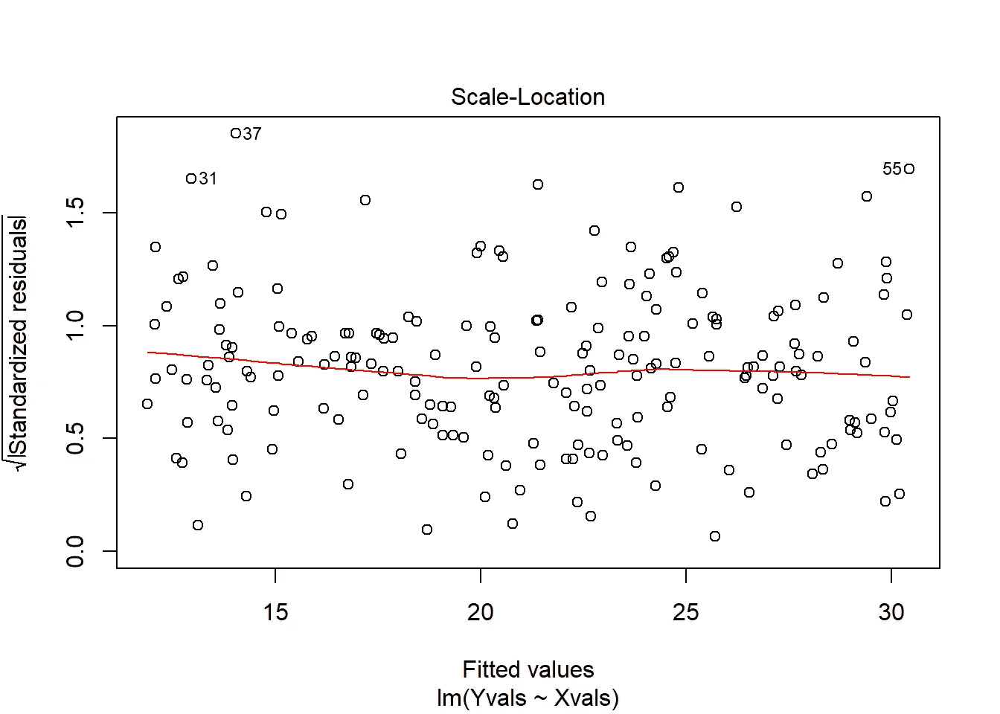

*   比例-位置图显示了作为拟合值函数的标准化残差的平方根。这类似于我们上面的残差与拟合图，应该以类似的方式解释。

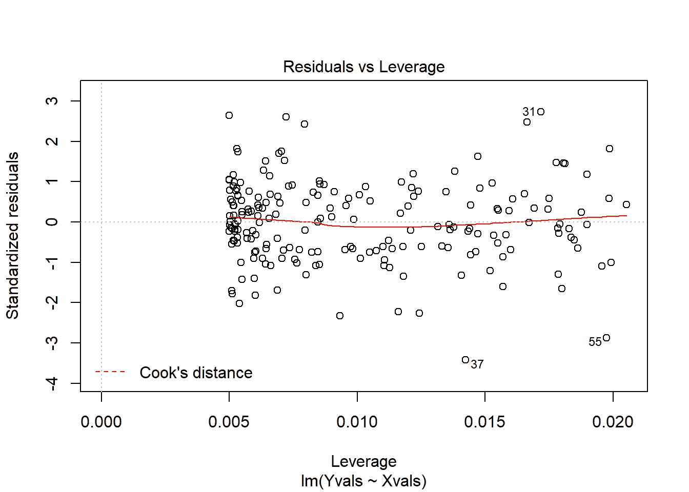

*   最后，杠杆图测量每个点对我们最终产出的影响与该点的剩余。本质上，这个图表将帮助我们发现对我们的模型有巨大影响的数据点。如果一些点具有高杠杆*和*高(绝对)残值，那么它们将比其他数据点更多地扭曲我们的模型。库克距离(虚线)是一个结合了剩余规模和杠杆的度量。
*   请注意，我们在上面没有看到任何库克的距离线，因为我们的库克值太小了(这是一件好事！)

总的来说，这些图看起来很合理，我很高兴我们满足了线性模型的要求。

总之，这种回归看起来非常有效:

*   残差与拟合图显示了一条平坦的直线，并且在残差中没有明显的模式
*   残差的 QQ 图看起来也很合理。虽然我们可以从虚线上看到一些偏差，但这些并不是我所说的“趋势偏差”。我们可以对残差进行夏皮罗检验来证实这一点(p= 0.2613)，但一般来说，我建议简单地检查 QQ 图，而不是重复进行假设检验。
*   我们的比例-位置图同样是平坦的，没有模式
*   我们的残差与杠杆图没有显示任何明显的异常值。

# 理论:非线性关系

现在让我们来看一个表现不佳的回归，具体来说，我们将检查由非线性关系产生的诊断图，并将它们与上面的图进行比较:

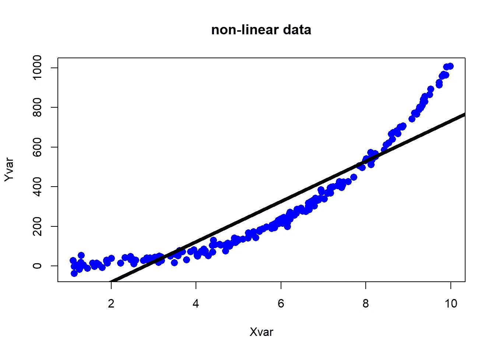

嗯，很明显，我们已经尝试用线性模型来拟合非线性关系了！因此，这个模型是无用的(记住我们在本节开始时对好模型的定义)。请注意，虽然我们可以清楚地看到我们的模型很糟糕(即，在给定一组 x 的情况下，它在预测 Ys 方面做得不好)，但我们仍然能够实现 0.856 的巨大 R 平方。不要盲目追随 R-squared 而被遗忘！

让我们看看诊断图:

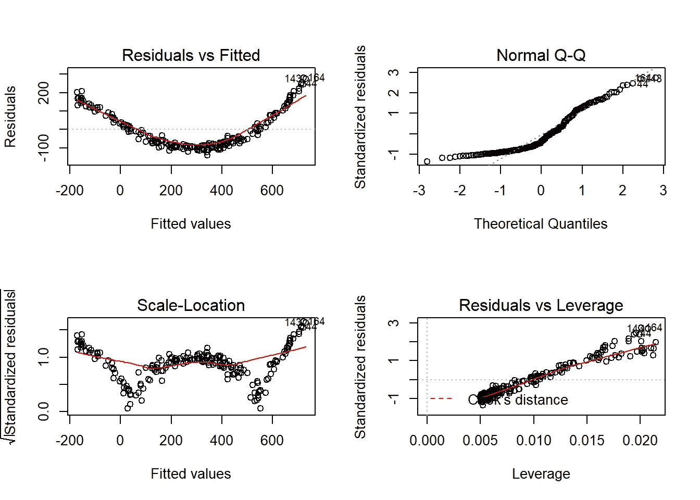

将这些图与表现良好的回归图进行比较，以了解它们在非理想条件下如何变化。同样，花一些时间尝试理解这些图与上面简单的 X-Y 图的关系。

例如:

*   我们可以注意到，在残差与拟合图中，我们的残差与零相交两次，我们的回归线也与非线性数据点趋势相交两次。
*   同样，我们的比例位置图
*   还要注意我们的残差与杠杆图，我们清楚地看到了一个更高杠杆和更高残差的趋势(因为我们的数据点离我们的趋势线越来越远)

如果我们更仔细地检查我们的 QQplot:

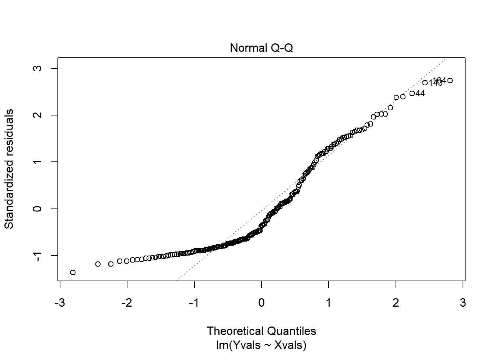

*   我们会注意到，我们的残差图总结了我们在 Xvar、Yvar 图中看到的内容。在 X 的极值处，我们倾向于偏离拟合线。

**花一些时间检查这些图中的关系，以提高你快速诊断违反了哪个线性模型假设的能力。**

# 理论:表现不佳的回归，异方差数据

最后，让我们看看极端异方差是什么样子的(记住:异方差是当我们的误差项依赖于 X 时):

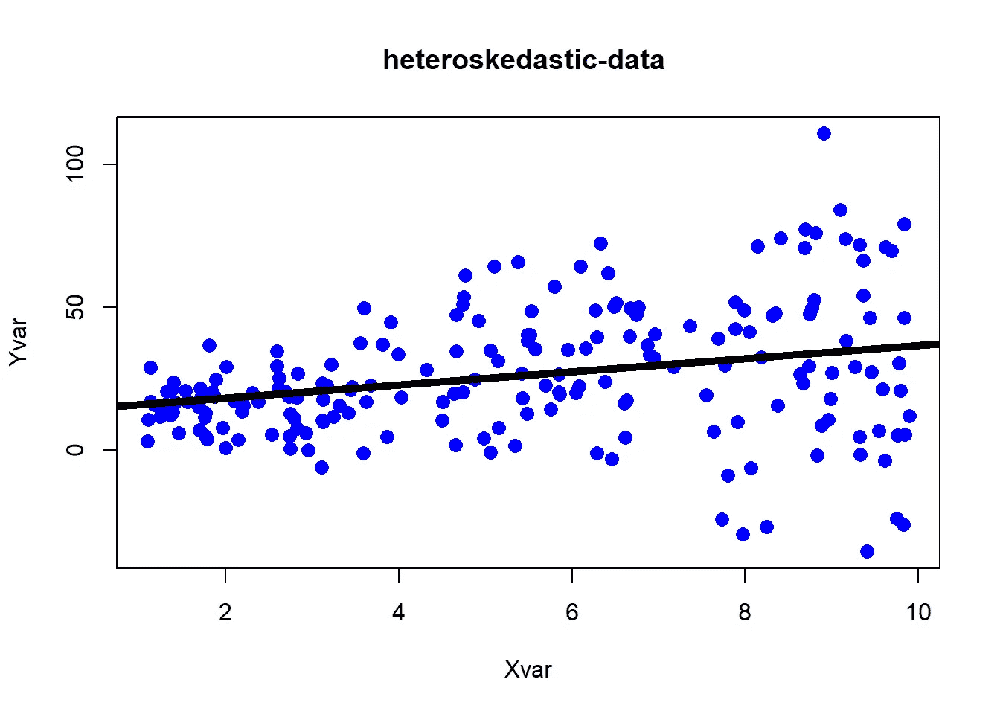

注意锥形数据表明异方差。

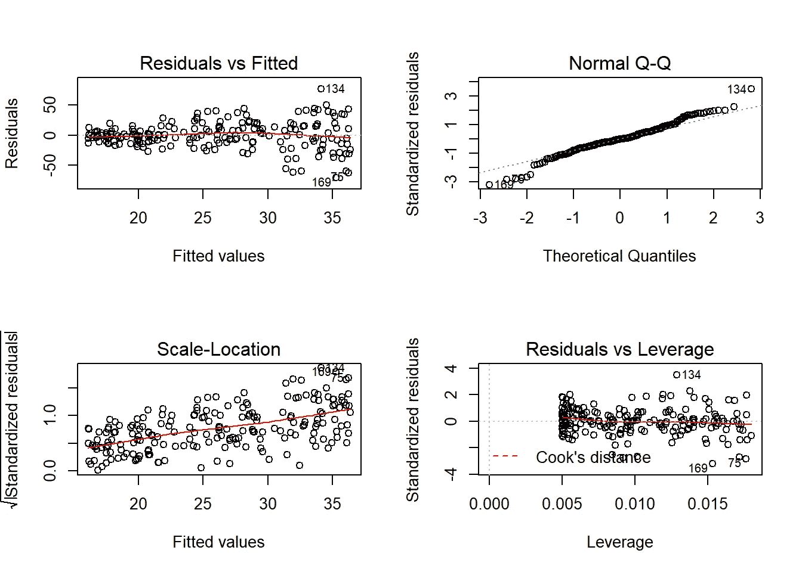

同样，将其与我们表现良好的回归进行比较，以了解异方差数据如何出现在回归图中(提示:仔细检查残差与拟合图，以及尺度位置图)。

**记住——在一个多因素的真实回归分析中，你不会有一个简单的 Xvar-Yvar 回归图来轻松地诊断你的模型，所以你需要习惯于单独使用这些诊断！**

最后，我想介绍一个图，它不是由 R 自动生成的，但是在回归诊断中非常有用。在此图中，我们将绘制拟合值与真实(观察)值的对比图，以了解模型的表现，让我们为上述回归示例绘制这些图表:

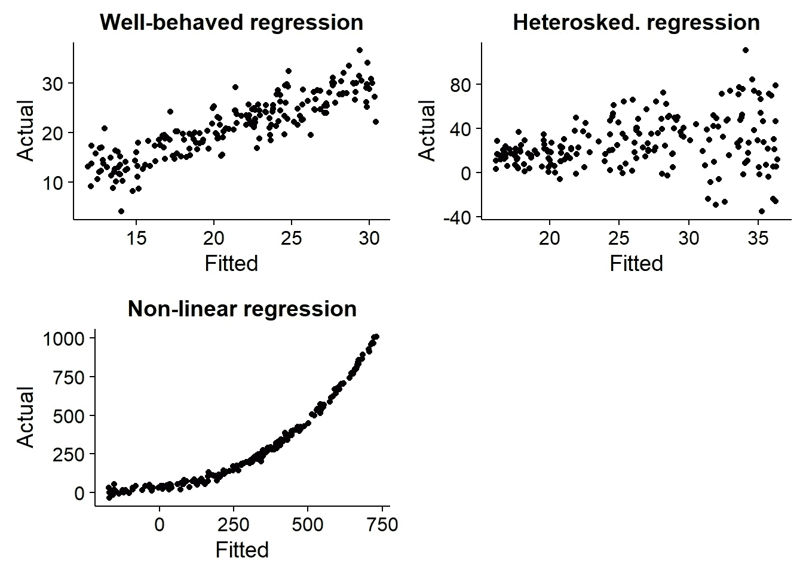

花些时间检查和理解这些图，以及这些模型如何与我们上面概述的标准进行比较:

*   模型能够解释低 Y 值和高 Y 值
*   模型可以准确地提供置信区间，以告知我们对可变性(和显著性)的理解
*   异常值不会扭曲模型
*   给定一组 x，我们的模型可以准确地预测 Ys

# 理论:数据转换

改进回归诊断图的方法之一是转换数据。一般来说，要么 X 变量，要么 Y 变量都会被转换。我们将在这里集中讨论 Y 变量转换，因为它们更常用。

常见的 y 变换包括:

*   ln 或 log10 转换
*   简单的幂变换(平方根或平方)

通常假设，当 y 变量被转换时，我们可以简单地对模型系数进行反向转换(即，应用反函数)以使其可解释。

**这是不对的！用以更复杂的方式改变系数来转换 y 变量！**

通常，对 y 变换数据的系数进行反向变换需要求解复杂的微分方程(这里有一个明显的例外，将在本课的后面讲述)，并且不像反向变换那样简单。让我们通过返回到我们表现良好的回归来证明这一点:

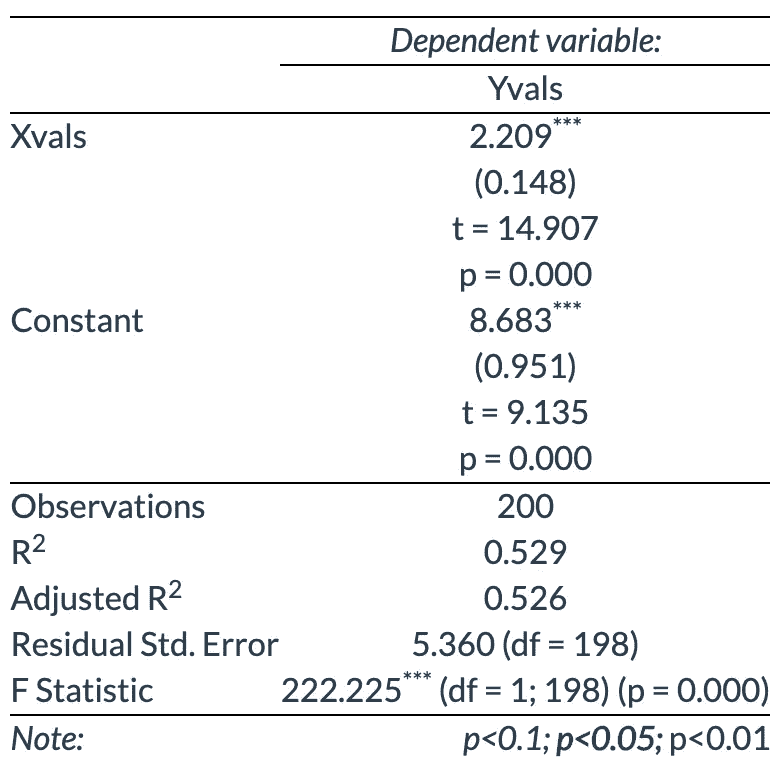

还记得我们计算 Y 使得 Y=10+2βX+eY=10+2βX+e(其中 e 是我们的误差项)。我们可以看到这种回归很好地将这个反馈给了我们。

相反，让我们回归 Y 的平方根，我们可以看到我们的诊断图看起来仍然合理:

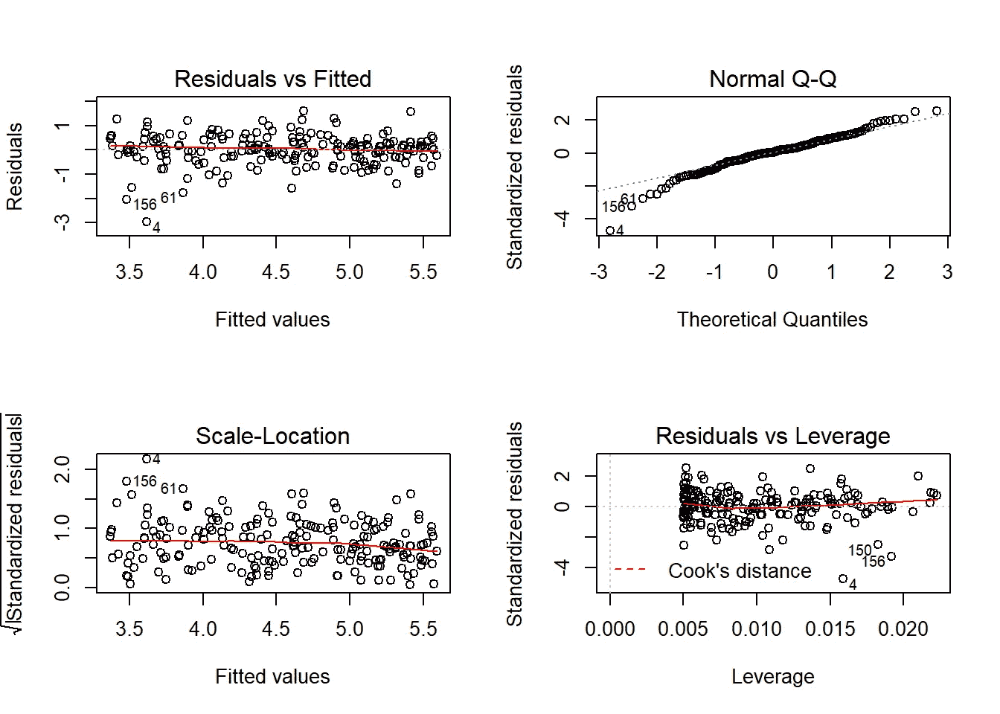

我们的系数是:

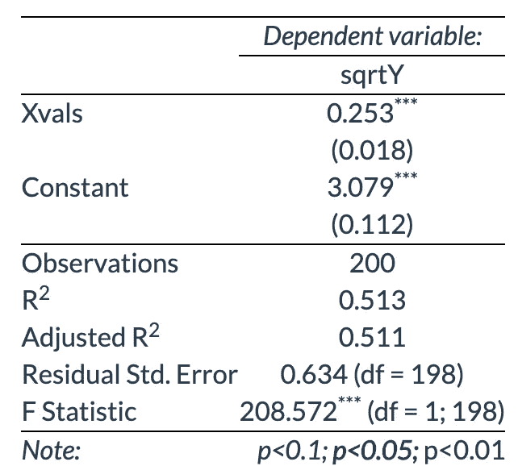

这次我们得到的截距是 3.079，β是 0.253。如果我们平方这些(平方是平方根的倒数)，那么我们得到:

*   截距= 9.48
*   Xvals = 0.064

显然，这些与原始公式或原始回归都没有关系！

如果变换变量是必要的，那么选择一个保留一些物理意义的变换是明智的。例如求面积的平方根(这将产生长度)。转换的一个重要危险是在数据中引入新的责难，例如，将“客户支出(美元)的变化”平方会使*所有*数据为正，从而使模型解释变得不可能。

这些转换的一个显著的例外是自然对数(在 r: `log()`中)。当 Y 数据进行对数变换时，系数可以解释为 x 增加一个单位时 Y 的预期变化百分比。

## 摘要

*   不要盲目的变换和反变换数据！
*   转换后的数据通常会产生无法解释的系数(没有求解适当的方程)
*   自然对数转换是这个规则的一个重要例外。ln 变换产生系数，其中 X 增加一个单位，y 增加β÷100β÷100。

# 帖子摘要:

*   回归有一些假设，必须满足这些假设才能产生有意义的结果和良好的预测。
*   诊断图将允许您评估您的模型满足这些假设的程度。
*   数据的转换需要仔细考虑。
*   始终为您创建的任何模型提供诊断图！您可以将这些内容放在文档/演示文稿末尾的附录中。