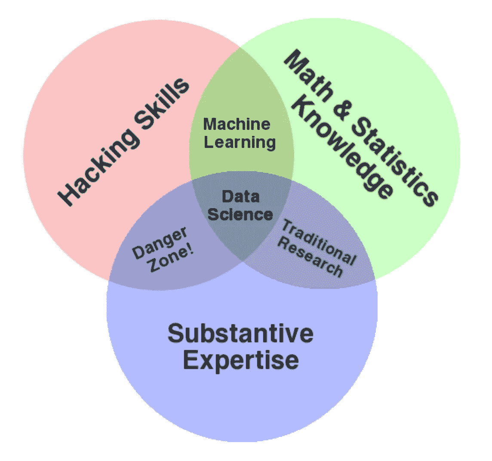

# 企业中的数据科学家

> 原文：<https://towardsdatascience.com/data-scientist-in-a-business-46ed161798b1?source=collection_archive---------9----------------------->

## 数据科学家的角色会有很大不同，达成单一定义是不现实的

Photo by [Carlos Muza](https://unsplash.com/@kmuza?utm_source=medium&utm_medium=referral) on [Unsplash](https://unsplash.com?utm_source=medium&utm_medium=referral)

作为数据科学之旅的一部分，人们将听到关于在商业环境中成为数据科学从业者意味着什么的非常有价值但不同的观点，从传统的数据分析和报告到复杂的机器学习模型开发和部署，这也恰好需要在 [STEM](https://en.wikipedia.org/wiki/Science,_technology,_engineering,_and_mathematics) 领域的高级学位。此外，为了在这个并不精确的世界中追求精确，人们试图明确定义数据分析师、统计师、数据科学家、数据工程师、机器学习工程师、开发人员、数据架构师或其他相关角色，甚至在他们内部分成不同的级别。然后是围绕数据科学教育学位(或一般的[高级 STEM 学位](/do-you-need-a-graduate-degree-for-data-science-8e3d0ef39253))的重要性的讨论，其数量似乎正在快速增长。因此，它很快变得令人困惑。

> 在这个不精确的世界里，我们是在试图精确吗？

尽管不同的视角对于更多地了解该职业以及确定潜在的改进领域极其重要，但我认为定义工作本身是一项永无止境的任务，原因如下:

1.  业务概况和需求千差万别，从只有数百或数千个数据点的传统企业，到每天有大量数据流的高度数字化企业。在某些情况下，趋势分析或逻辑回归可能就足够了，但在其他情况下，只有持续挤压 [AUC](http://gim.unmc.edu/dxtests/roc3.htm) 的微小改善以及实时模型部署才能提供竞争优势。
2.  行业内和行业间的采用率会有所不同；不可避免的是，一些公司在如何从数据科学中获取价值方面将比其他公司更先进，处于前沿的公司不仅建立了复杂的数据科学团队，还对大部分员工进行了数据科学基础知识的培训。
3.  数据科学本身作为一门学科正在发展。在统计学习中，许多概念都非常古老，但已经发生变化的是计算能力的使用，从单台计算机到云服务，以及数据科学相关编程语言和应用程序的可访问性。然后你还有一个像 XGBoost 这样的算法，这是一个最近的有影响力的发展。

那么，我们该何去何从呢？让我们来看看这张经典图表:

[The Data Science Venn Diagram (by Drew Conway)](http://drewconway.com/zia/2013/3/26/the-data-science-venn-diagram)

你知道有多少人拥有这三个主要领域的专业知识？想象一下在企业中工作——销售、运营、客户服务、行政管理、营销等。—对于几个(或许多？)年，然后(或之前，或同时)获得数学和计算机科学方面的同等专业知识。难怪被称为“数据科学”的子集的真正代表经常被比作独角兽，其出现的频率可能与初创企业中的独角兽并无不同。您可以在本文的[中获得数据科学技能的更详细概述。虽然这种数据科学专业知识的三足鼎立令人向往，但却很难确定(您如何知道自己是这三个领域的专家？)，这可能有助于解释为什么数据科学通常作为团队运动效果最佳…我指的是科学(在能够负担整个团队的公司中)。](http://businessoverbroadway.com/2015/10/12/data-science-skills-and-the-improbable-unicorn/)

好吧，隧道的尽头有光吗？是的，一个务实的。

Photo by [Joshua Sortino](https://unsplash.com/@sortino?utm_source=medium&utm_medium=referral) on [Unsplash](https://unsplash.com?utm_source=medium&utm_medium=referral)

我认为一个更好的方法是考虑三个基本支柱，而不是一个业务中数据科学从业者的精确定义:

*   商业专长
*   技术保密
*   性格特征

## 商业专长

Photo by [Nik MacMillan](https://unsplash.com/@nikarthur?utm_source=medium&utm_medium=referral) on [Unsplash](https://unsplash.com?utm_source=medium&utm_medium=referral)

通常，在成为数据科学家的建议中，业务理解和经验被忽视、简单假设或简单提及，然而[这是成为有效从业者的重要因素。](https://hbr.org/2019/05/do-your-data-scientists-know-the-why-behind-their-work)面向企业的数据科学旨在解决实际问题，其中数据是发现和/或解决方案不可或缺的一部分。这种专长有三个方面:

*   对商业战略、经济学和[模型](/10-reads-for-data-scientists-getting-started-with-business-models-78e6a224fd66)的理解
*   特定于个体公司及其行业的商业洞察力和直觉
*   能够引导公司寻找项目来源，交流结果，并实施建议

这对于任何人来说都是一个棘手的问题——尤其是在有等级或专业结构的大公司工作时。虽然商业基础知识可以在工作中和学校里很快学到，但更深刻的直觉来自经验。这种学习有很多好处，从不用高管浪费时间解释基础知识，到能够识别和组织相关数据，发现并解决企业真正关心的问题，以及将技术语言转换为业务用语。此外，业务视角有助于确定优先级，有时，在继续下一个项目之前，用 10%的努力获得 90%的结果可能就足够了。第三波数据科学家文章中有更多关于这个的讨论。

> “…我鼓励您不要将数据科学视为一个需要学习的新知识领域，而是一套可以在当前专业领域应用的新技能。”
> 
> Jake VanderPlas，Python 数据科学手册

然而，如果没有下一个支柱——技术支柱，企业将无法理解数据科学可以完成什么，不能完成什么，可以提取什么价值，以及如何走向(几乎)客观、中立的轶事和数据驱动的现实。

## 技术诀窍

Photo by [Nicolas Thomas](https://unsplash.com/@nicolasthomas?utm_source=medium&utm_medium=referral) on [Unsplash](https://unsplash.com?utm_source=medium&utm_medium=referral)

这个支柱是关于能够实现业务所需的数据支持解决方案，这是在 [Moneyball](https://rafalab.github.io/dsbook/linear-models.html#case-study-moneyball) 中观察到的早期主要例子之一。如果你在网上搜索“如何成为一名数据科学家”或“什么是数据科学家”，你很可能会找到专注于该职位技术方面的文章。似乎有一个巨大的光谱需要学习。

为了帮助理清问题，我将技术方面分为两个角度:一个是不适合的(核心，适用于大多数(如果不是所有)企业的数据科学工作，但可能无法满足所有特定公司的需求，尤其是如果公司在数据科学应用方面处于领先地位)和一个是过度适合的(适应特定公司的需求和数据科学团队设置，因此在被公司雇用之前很难预测)。

以下是我认为“未充分满足”观点包含的内容:

*   统计/机器学习——相关统计/数学知识与其在现代编程语言中的实现的结合。与分别学习统计和编程不同，它们可以协同学习——对我来说，它们是数据科学背景下同一枚硬币的两面。幸运的是，只要你坚持使用在线和 PDF 版本，就可以以无与伦比的免费价格获得优秀的课程([特雷弗·哈斯蒂和罗布·蒂布拉尼的统计学习，斯坦福大学](https://lagunita.stanford.edu/courses/HumanitiesSciences/StatLearning/Winter2016/about)是其中之一)和书籍([统计学习介绍](http://www-bcf.usc.edu/~gareth/ISL/)，以及对那些更倾向于数学的人来说，[统计学习的要素](https://web.stanford.edu/~hastie/ElemStatLearn/))。我个人也关注[吴恩达的教育内容](https://www.deeplearning.ai/)，部分原因是他雄辩地解释复杂概念的能力以及对商业应用的日益关注。关于这个主题有很多世界级的内容。
*   数据项目工作流程——包括伦理、项目设计、数据收集、处理、建模以及得出结论/预测/解释。通常，编程(最常见的是 [Python 和/或 R](https://www.kdnuggets.com/2019/05/poll-top-data-science-machine-learning-platforms.html) ，还有关系数据库的 SQL)将处于这项工作的最前沿，但我们会错误地忽略“拖放”的[演变，即“无代码”或几乎无代码的数据科学平台](https://www.analyticsvidhya.com/blog/2018/05/19-data-science-tools-for-people-dont-understand-coding/)，以及自动化机器学习解决方案。我仍然认为编程是必不可少的，因为现有的数据科学库已经提供了很多便利和足够的抽象，而不会分散注意力(允许人们接近数据和模型的“底层”，即实际了解代码的每一行发生了什么)，但随着时间的推移，这可能会改变。无代码并不意味着“数据科学”的“科学”部分会变得更简单，但是我确信会有忘记这一点的诱惑。虽然可供选择的内容——通过 MOOCs、训练营、书籍和学术界——非常多，但我想强调的是 [R for Data Science](https://r4ds.had.co.nz/) 和[Python Data Science Handbook](https://jakevdp.github.io/PythonDataScienceHandbook/)是优秀的免费起点。在应用数据科学(而非研究)中，编码和数据科学平台现在都处于可访问阶段，它们在有 STEM 学位和没有 STEM 学位的人之间充当最终的均衡器；然而，我怀疑对 STEM 学位的一些偏见将继续存在，因为许多当前的数据科学家拥有这样的背景(并希望根据他们的知识招聘)，也因为缺乏非 STEM 候选人。
*   视觉化——虽然通常是数据工作流程的一部分，但我会把它挑出来，因为我相信一个人可以把知道如何通过视觉讲述一个故事作为整个职业生涯。例如，通过可视化，人们可以使以前对用户不友好的“干”数据——有吸引力的、困难的模型——更容易理解，以及大数据——得到清晰的总结。此外，我预计至少一些可视化软件提供商将扩展其在整个数据工作流中的存在(而其他数据科学软件公司将改进其可视化组件)。同样，有许多选择可以学习，从 Edward R. Tufte 的经典著作到应用书籍、MOOCs，以及可视化图书馆和软件提供商提供的大量示例。

有人可能会说，尽管“吃不饱”，但这似乎仍然很多。我同意——数据科学是一个跨学科的、相当复杂的领域——但我认为这方面的知识非常容易获得。培训资源非常丰富，而且通常是负担得起的，尤其是在初级到中级水平——人们只需要时间和愿望来学习和练习。此外，同行支持(例如 [Stackoverflow](https://stackoverflow.com/) 和 [Stackexchange](https://stackexchange.com/) )和专业网站(本文提供了其中几个网站的链接)允许获得各种问题的答案，这些问题可能过于具体，无法在任何培训中涵盖。**我认为，尽管“能力不足”,但技术知识加上业务专长对于任何数据科学家来说都是一个出色的背景。**

好吧，那么什么属于“过度适合”的观点呢？答案是——可以与最广泛的数据科学理解相联系的所有其他东西(概率加权),这就是我认为数据科学家定义中的许多可变性开始出现的地方。例如，可能需要也可能不需要:

*   知道(或凭直觉)更多的数学知识(特别是。微积分、线性代数、概率、统计)——但不太可能需要[高等数学、](https://www.fast.ai/2019/01/02/one-year-of-deep-learning/)因为许多艰苦的工作已经在各自的数据科学库中为我们完成了
*   在生产模式下部署模型——或者请求 IT /程序员的帮助
*   使用云技术
*   扩展和应用人工智能的知识
*   使用大数据/ Apache Hadoop / Apache Spark
*   使用 NoSQL 数据库/ Apache Cassandra
*   管理团队
*   处理非表格数据，包括图像、空间、语音、文本和 web
*   担心延迟、可扩展性、安全性、存储和实时数据(例如 Apache Kafka)
*   利用除 Python、R 和 SQL 之外的编程语言以及各种操作系统
*   专攻并深入钻研一个狭窄的学科
*   维护知识图谱-了解数据科学相关领域的广泛范围，并了解最新发展，例如，是否有新的算法、云技术解决方案或深度学习研究突破。

久而久之，上面的一些可能就不再是“可能”了。不用说，除了商业和技术基础知识之外，学习并不断实践所有这些知识(甚至更多)对一个人来说是不现实的，尽管他很有抱负。对某些领域有个人兴趣，或者预测个人业务的需求，可能是开始涉猎广泛知识的好方法。在某些方面，在数据科学领域工作类似于在研究生院:你知道总有更多的东西要学，你觉得自己总是落后，但时间有限，因此你必须选择战斗并处理它。

然而，尽管提高这些技能需要时间和精力，但重要的是不要忽视第一支柱——业务。否则，团队就有被视为利基数据处理者的风险，总是需要被告知做什么和解决什么业务问题。

## 选择个性特征

Photo by [Andrew Seaman](https://unsplash.com/@amseaman?utm_source=medium&utm_medium=referral) on [Unsplash](https://unsplash.com?utm_source=medium&utm_medium=referral)

你可以成为一名成功的商业人士，并拥有坚实的技术背景，但有一些性格特征将这一切结合在一起，并有可能进一步放大你作为数据科学家的成功:

*   如果你在[矩阵](https://en.wikipedia.org/wiki/The_Matrix)里，你每次都会吃红色药丸去追求知识，而不是传播“民间智慧”、方便的真理、假设、偏见或者矩阵本身。武术是选修的。
*   如果你是一名侦探，你将成为现实生活中的[赫丘里·波罗](https://en.wikipedia.org/wiki/Hercule_Poirot)，运用铁甲般的方法和逻辑来解决复杂的数据之谜——并且能够以清晰的方式与听者回顾整个过程，尽管其中隐含着复杂。你把复杂的声音变得尽可能简单，但不能再简单了。
*   如果你是一个[强化学习](https://en.wikipedia.org/wiki/Reinforcement_learning)代理人，你会平衡利用你已经拥有的知识和追求新知识的探索。你接受新奇的挑战，保持创造力和求知欲。
*   如果你是一名跑步者，你通常会跑长距离——毅力是许多数据科学项目的关键。

总之，尽管由于上述原因，很难单独定义数据科学家的角色或道路，但专注于业务和“不适合”的技术背景可能是该领域任何职业生涯的重要基础-认识到不同公司是否认为足够将有所不同。

最后但同样重要的是，考虑到数据科学发展如此迅速，并且正在经历某种范式转变，我强烈推荐阅读托马斯·库恩的《科学革命的结构》 *。这是一本永不过时的书。*