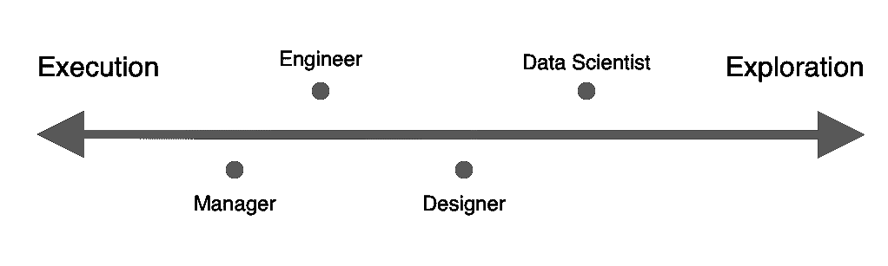

# 数据科学家是思想家

> 原文：<https://towardsdatascience.com/data-scientists-are-thinkers-a36cc186d570?source=collection_archive---------7----------------------->

Photo by [Mitchell Hollander](https://unsplash.com/photos/_zBxc8T-Y1Y?utm_source=unsplash&utm_medium=referral&utm_content=creditCopyText) on [Unsplash](https://unsplash.com/search/photos/thinking?utm_source=unsplash&utm_medium=referral&utm_content=creditCopyText)

## 执行与探索及其对您的意义

数据科学家服务于一个非常技术性的目的，但这个目的与其他个体贡献者有很大的不同。与工程师、设计师和项目经理不同，数据科学家是探索优先，而不是执行优先。

考虑到数据科学的起源，这并不奇怪。如果你快速浏览一下这个领域的早期历史[，你会发现事情是从学者们研究计算统计学的可能性开始的。这种研究员般的思维模式仍然根植于我们的 DNA 中。](https://www.forbes.com/sites/gilpress/2013/05/28/a-very-short-history-of-data-science/#ff5468255cfc)

我们不断被代表大规模业务、产品和客户的数据所包围。这让我们可以从 30，000 英尺的高度看问题，而其他角色大部分时间都在基层工作，致力于执行。重要的是我们要意识到这个事实，更重要的是我们要充分利用它。

# 执行与探索

大部分老牌公司的技术集成电路都专注于执行。这很直观。为了让一个公司成功，它必须完成提供价值的事情。

数据科学角色略有不同。根据团队结构和规模的不同，它们会有很大的不同，但一般来说，执行并不是我们最擅长的地方。我们最有价值的工作往往来自探索。

当涉及到复杂的问题和假设时，执行不是答案。必须有人投入进去，在更深的层次上解决问题。他们必须彻底地分析和探索这个问题。数据科学家是承担这一任务的最佳人选。

思考，产生直觉，然后探索这种直觉的行为是被犯罪[低估的](https://www.conordewey.com/blog/an-ode-to-the-type-a-data-scientist/)。如果处理得当，这项工作不仅会产生有趣的结果，还会推动决策制定。这是数据科学家真正繁荣的地方。

如果您查看某些角色在执行探索谱中的最终位置，您会得到如下结果:

这并不是说数据科学家不能或不应该执行。我们花了大量的时间来构建模型、编写产品代码和自动化常见任务。事实是，我们拥有多样化的技能组合，允许我们探索和执行。这就是为什么很难找到数据科学家，也是这个领域如此激动人心和富有挑战性的原因。

# 找到平衡

数据科学家是不是应该彻底流氓化，为所欲为？大概不会。我们不能公然无视积压的 JIRA 门票，而去调查前一天晚上凌晨 2:00 想到的一个假设。这里必须有一个平衡。

我们必须支持我们的利益相关者。这意味着及时交付他们需要的东西，以便他们能够有效地做出决策并推动事情向前发展。

然而，我们*同样*有义务利用我们独特的地位和分析技能。我们通过花时间思考新的想法，产生假设，并浏览数据来做到这一点。

但问题依然存在:这在实践中看起来像什么？在一个持续关注执行力的世界里，这样想并不容易。最近，我一直在做三件不同的事情来保持探索第一。我对目前的结果很满意。

## 封锁时间

首先，我建议每天留出一个小时左右的时间进行深入思考和探索。最适合你的时间会因人而异。我更喜欢早上做的第一件事，但是你也可以在下午留出一个小时。安排好这个时间是极其重要的。

通过每天与自己定期会面，创造一个成功的[系统](https://www.jotform.com/blog/setting-big-goals/)。这是一次你不能错过或重新安排的会议。对自己负责。这是你思考的时间。

## 把一切都写下来

如果你没听说过，文档是很重要的。你的思维实践也不例外。不管你的想法有多好，把它写下来。创建一个流动的文档或一个记事本，在那里你可以让这些想法、问题和假设继续存在并被重温。

## 保持好奇

作为一名数据科学家，好奇心是你的北极星。有时你会陷入执行模式，忘记发展和探索自己的想法。当这不可避免地发生时，好奇心会把你带回来。我强烈推荐这篇来自多线程的优秀文章，以了解关于数据科学中的[好奇心](https://multithreaded.stitchfix.com/blog/2019/01/18/fostering-innovation-in-data-science/)的更多信息。

> “让您的数据科学家能够提出您以前从未想过的想法。”—埃里克·科尔森

# 转变你的心态

基于执行的工作在数据科学中最受欢迎。你能责怪我们吗？更容易量化。您可以看到构建模型或将代码推向生产的结果。

从一个下午对一个新想法的修补中很难看到具体的结果。这个新想法可能不会导致任何有意义的事情。也许只有 10%的赌注最终会有所收获。不要因此而气馁。10%是值得的。10%是真正变革性工作的来源——这一切都始于思考。

感谢阅读！请随意查看下面我的一些类似文章，并订阅我的时事通讯中的**以获得有趣的链接和新内容。**

*   **[为新的和有抱负的数据科学家汇编建议](https://www.conordewey.com/blog/compilation-of-advice-for-new-and-aspiring-data-scientists/)**
*   **[A 型数据科学家的颂歌](https://www.conordewey.com/blog/an-ode-to-the-type-a-data-scientist/)**
*   **[MVA:最低可行分析](https://www.conordewey.com/blog/mva-minimum-viable-analysis/)**

**你可以在 Medium 上关注我更多类似的帖子，也可以在 Twitter 上找到我。想了解更多关于我和我在做什么，请查看我的网站。**