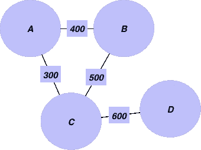
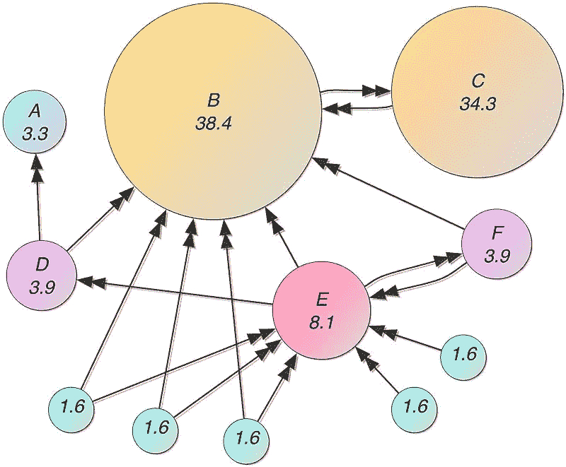

# 数据科学家，你应该知道的 5 种图形算法

> 原文：<https://towardsdatascience.com/data-scientists-the-five-graph-algorithms-that-you-should-know-30f454fa5513?source=collection_archive---------0----------------------->


## 因为图表分析是未来

作为数据科学家，我们已经对 Pandas 或 SQL 或任何其他关系数据库驾轻就熟。

我们习惯于以行的形式看到用户，以列的形式看到他们的属性。但是现实世界真的是那样的吗？

在一个互联的世界中，用户不能被视为独立的实体。它们彼此之间有一定的关系，我们有时希望在构建机器学习模型时包括这种关系。

现在，虽然在关系数据库中，我们不能在不同的行(用户)之间使用这种关系，但在图形数据库中，这样做是相当简单的。

***在这篇文章中，我将谈论一些你应该知道的最重要的图算法，以及如何用 Python 实现它们。***

此外，这里有一个由 UCSanDiego 在 Coursera 上提供的[大数据图形分析课程，我强烈推荐学习图论的基础知识。](https://coursera.pxf.io/YgKbbe)

# 1.连接的组件


A graph with 3 connected components

我们都知道集群是如何工作的？

*你可以用非常通俗的术语把连通分量想象成一种硬聚类算法，它在相关/连通的数据中寻找聚类/孤岛。*

*举个具体的例子:* ***假设你有连接世界上任意两个城市的道路的数据。你需要找出世界上所有的大洲以及它们包含的城市。***

你将如何实现这一目标？来吧，考虑一下。

我们使用的连通分量算法是基于 **BFS/DFS** 的一个特例。我不会在这里过多地谈论它是如何工作的，但是我们将看到如何使用`Networkx`让代码运行起来。

## 应用程序

从零售的角度来看:比方说，我们有很多客户使用很多账户。使用连通分量算法的一种方法是在数据集中找出不同的族。

我们可以基于相同的信用卡使用、相同的地址或相同的手机号码等假设客户之间的边(道路)。一旦我们有了这些连接，我们就可以在相同的上运行连接组件算法来创建单独的聚类，然后我们可以为这些聚类分配一个家族 ID。

然后，我们可以使用这些家庭 id 根据家庭需求提供个性化建议。我们还可以使用这个家族 ID，通过创建基于家族的分组特征来推动我们的分类算法。

从**财务角度**:另一个用例是使用这些家庭 id 来捕获欺诈。如果一个帐户在过去进行过欺诈，则关联的帐户很可能也容易受到欺诈。

可能性只受到你自己想象力的限制。

## 密码

我们将使用 Python 中的`Networkx`模块来创建和分析我们的图表。

让我们从一个用于我们目的的示例图开始。包含城市和它们之间的距离信息。


Graph with Some random distances

我们首先创建一个边和距离的列表，我们将添加边的权重:

```
edgelist = [['Mannheim', 'Frankfurt', 85], ['Mannheim', 'Karlsruhe', 80], ['Erfurt', 'Wurzburg', 186], ['Munchen', 'Numberg', 167], ['Munchen', 'Augsburg', 84], ['Munchen', 'Kassel', 502], ['Numberg', 'Stuttgart', 183], ['Numberg', 'Wurzburg', 103], ['Numberg', 'Munchen', 167], ['Stuttgart', 'Numberg', 183], ['Augsburg', 'Munchen', 84], ['Augsburg', 'Karlsruhe', 250], ['Kassel', 'Munchen', 502], ['Kassel', 'Frankfurt', 173], ['Frankfurt', 'Mannheim', 85], ['Frankfurt', 'Wurzburg', 217], ['Frankfurt', 'Kassel', 173], ['Wurzburg', 'Numberg', 103], ['Wurzburg', 'Erfurt', 186], ['Wurzburg', 'Frankfurt', 217], ['Karlsruhe', 'Mannheim', 80], ['Karlsruhe', 'Augsburg', 250],["Mumbai", "Delhi",400],["Delhi", "Kolkata",500],["Kolkata", "Bangalore",600],["TX", "NY",1200],["ALB", "NY",800]]
```

让我们使用`Networkx`创建一个图表:

```
**g = nx.Graph()**
for edge in edgelist:
    **g.add_edge**(edge[0],edge[1], weight = edge[2])
```

现在 ***我们想从这张图上找出不同的大陆和它们的城市。***

我们现在可以使用连通分量算法来实现这一点，如下所示:

```
for i, x in enumerate(**nx.connected_components(g)**):
    print("cc"+str(i)+":",x)
------------------------------------------------------------
cc0: {'Frankfurt', 'Kassel', 'Munchen', 'Numberg', 'Erfurt', 'Stuttgart', 'Karlsruhe', 'Wurzburg', 'Mannheim', 'Augsburg'}
cc1: {'Kolkata', 'Bangalore', 'Mumbai', 'Delhi'}
cc2: {'ALB', 'NY', 'TX'}
```

如您所见，我们能够在数据中找到不同的组件。仅仅通过使用边和顶点。这个算法可以在不同的数据上运行，以满足我上面提到的任何用例。

# 2.最短路径


继续上面的例子，我们得到一个图表，上面有德国的城市以及它们之间的距离。

**你想找出如何从法兰克福(起点)到慕尼黑的最短距离**。

我们用来解决这个问题的算法叫做 **Dijkstra** 。用 Dijkstra 自己的话说:

> 从[鹿特丹](https://en.wikipedia.org/wiki/Rotterdam)到[格罗宁根](https://en.wikipedia.org/wiki/Groningen)的最短旅行方式是什么，一般来说:从给定的城市到给定的城市。[是最短路径的算法](https://en.wikipedia.org/wiki/Shortest_path_problem)，我用了大概二十分钟设计的。一天早上，我和我年轻的未婚妻在阿姆斯特丹购物，累了，我们坐在咖啡馆的露台上喝咖啡，我在想我是否可以这样做，然后我设计了最短路径的算法。正如我所说，这是一个 20 分钟的发明。事实上，它是在三年后的 59 年出版的。该出版物仍然可读，事实上，相当不错。它如此漂亮的原因之一是我没有用铅笔和纸来设计它。我后来才知道，不用铅笔和纸进行设计的一个好处是，你几乎是被迫避免所有可以避免的复杂性。最终，令我大为惊讶的是，这个算法成了我成名的基石之一。
> 
> — Edsger Dijkstra，在与 Philip L. Frana 的访谈中，ACM 通讯，2001[【3】](https://en.wikipedia.org/wiki/Dijkstra%27s_algorithm#cite_note-Dijkstra_Interview-3)

## 应用程序

*   Dijkstra 算法的变体在谷歌地图中被广泛用于查找最短路线。
*   你在沃尔玛超市。你有不同的过道和过道之间的距离。您希望为顾客提供从通道 A 到通道 d 的最短路径。



*   你已经看到 LinkedIn 如何显示一级关系，二级关系。幕后发生了什么？


## 密码

```
print(**nx.shortest_path**(g, 'Stuttgart','Frankfurt',weight='weight'))
print(**nx.shortest_path_length**(g, 'Stuttgart','Frankfurt',weight='weight'))
--------------------------------------------------------
['Stuttgart', 'Numberg', 'Wurzburg', 'Frankfurt']
503
```

您还可以使用以下方法查找所有对之间的最短路径:

```
for x in **nx.all_pairs_dijkstra_path(g,weight='weight')**:
    print(x)
--------------------------------------------------------
('Mannheim', {'Mannheim': ['Mannheim'], 'Frankfurt': ['Mannheim', 'Frankfurt'], 'Karlsruhe': ['Mannheim', 'Karlsruhe'], 'Augsburg': ['Mannheim', 'Karlsruhe', 'Augsburg'], 'Kassel': ['Mannheim', 'Frankfurt', 'Kassel'], 'Wurzburg': ['Mannheim', 'Frankfurt', 'Wurzburg'], 'Munchen': ['Mannheim', 'Karlsruhe', 'Augsburg', 'Munchen'], 'Erfurt': ['Mannheim', 'Frankfurt', 'Wurzburg', 'Erfurt'], 'Numberg': ['Mannheim', 'Frankfurt', 'Wurzburg', 'Numberg'], 'Stuttgart': ['Mannheim', 'Frankfurt', 'Wurzburg', 'Numberg', 'Stuttgart']})('Frankfurt', {'Frankfurt': ['Frankfurt'], 'Mannheim': ['Frankfurt', 'Mannheim'], 'Kassel': ['Frankfurt', 'Kassel'], 'Wurzburg': ['Frankfurt', 'Wurzburg'], 'Karlsruhe': ['Frankfurt', 'Mannheim', 'Karlsruhe'], 'Augsburg': ['Frankfurt', 'Mannheim', 'Karlsruhe', 'Augsburg'], 'Munchen': ['Frankfurt', 'Wurzburg', 'Numberg', 'Munchen'], 'Erfurt': ['Frankfurt', 'Wurzburg', 'Erfurt'], 'Numberg': ['Frankfurt', 'Wurzburg', 'Numberg'], 'Stuttgart': ['Frankfurt', 'Wurzburg', 'Numberg', 'Stuttgart']})....
```

# 3.最小生成树


现在我们有另一个问题。我们为一家水管铺设公司或互联网光纤公司工作。我们需要使用最少的电线/管道连接图表中的所有城市。 我们如何做到这一点？


An Undirected Graph and its MST on the right.

## 应用程序

*   最小生成树在网络设计中有直接的应用，包括计算机网络、电信网络、运输网络、供水网络和电网(它们最初就是为此而发明的)
*   MST 用于近似旅行推销员问题
*   聚类-首先构建 MST，然后使用簇间距离和簇内距离确定一个阈值来断开 MST 中的一些边。
*   图像分割—它用于图像分割，我们首先在图上构建一个 MST，其中像素是节点，像素之间的距离基于某种相似性度量(颜色、强度等)。)

## 密码

```
# nx.minimum_spanning_tree(g) returns a instance of type graph
nx.draw_networkx(**nx.minimum_spanning_tree**(g))
```


The MST of our graph.

如你所见，上面是我们要铺设的电线。

# 4.Pagerank



这是长期以来为谷歌提供动力的页面排序算法。它根据输入和输出链接的数量和质量给网页打分。

## 应用程序

Pagerank 可以用在任何我们想要评估任何网络中节点重要性的地方。

*   它已经被用于通过引用来寻找最有影响力的论文。
*   已经被谷歌用来对网页进行排名
*   它可以用来对 tweets 进行排序——用户和 Tweets 作为节点。如果用户 A 关注用户 B，则在用户之间创建链接；如果用户发推文/转发推文，则在用户和推文之间创建链接。
*   推荐引擎

## 密码

在这个练习中，我们将使用脸书的数据。我们有 facebook 用户之间的边/链接文件。我们首先使用以下公式创建 FB 图:

```
# reading the datasetfb = nx.read_edgelist('../input/facebook-combined.txt', create_using = nx.Graph(), nodetype = int)
```

看起来是这样的:

```
pos = nx.spring_layout(fb)import warnings
warnings.filterwarnings('ignore')plt.style.use('fivethirtyeight')
plt.rcParams['figure.figsize'] = (20, 15)
plt.axis('off')
nx.draw_networkx(fb, pos, with_labels = False, node_size = 35)
plt.show()
```


FB User Graph

现在我们想找到具有高影响力的用户。

直观地说，Pagerank 算法会给一个有很多朋友的用户更高的分数，而这个用户又有很多 FB 朋友。

```
pageranks = nx.pagerank(fb)
print(pageranks)
------------------------------------------------------
{0: 0.006289602618466542,
 1: 0.00023590202311540972,
 2: 0.00020310565091694562,
 3: 0.00022552359869430617,
 4: 0.00023849264701222462,
........}
```

我们可以使用以下方法获得排序后的 PageRank 或最有影响力的用户:

```
import operator
sorted_pagerank = sorted(pageranks.items(), key=operator.itemgetter(1),reverse = True)
print(sorted_pagerank)
------------------------------------------------------
[(3437, 0.007614586844749603), (107, 0.006936420955866114), (1684, 0.0063671621383068295), (0, 0.006289602618466542), (1912, 0.0038769716008844974), (348, 0.0023480969727805783), (686, 0.0022193592598000193), (3980, 0.002170323579009993), (414, 0.0018002990470702262), (698, 0.0013171153138368807), (483, 0.0012974283300616082), (3830, 0.0011844348977671688), (376, 0.0009014073664792464), (2047, 0.000841029154597401), (56, 0.0008039024292749443), (25, 0.000800412660519768), (828, 0.0007886905420662135), (322, 0.0007867992190291396),......]
```

以上 id 是针对最有影响力的用户。

我们可以看到最有影响力的用户的子图:

```
first_degree_connected_nodes = list(fb.neighbors(3437))
second_degree_connected_nodes = []
for x in first_degree_connected_nodes:
    second_degree_connected_nodes+=list(fb.neighbors(x))
second_degree_connected_nodes.remove(3437)
second_degree_connected_nodes = list(set(second_degree_connected_nodes))subgraph_3437 = nx.subgraph(fb,first_degree_connected_nodes+second_degree_connected_nodes)pos = nx.spring_layout(subgraph_3437)node_color = ['yellow' if v == 3437 else 'red' for v in subgraph_3437]
node_size =  [1000 if v == 3437 else 35 for v in subgraph_3437]
plt.style.use('fivethirtyeight')
plt.rcParams['figure.figsize'] = (20, 15)
plt.axis('off')nx.draw_networkx(subgraph_3437, pos, with_labels = False, node_color=node_color,node_size=node_size )
plt.show()
```


Our most influential user(Yellow)

# 5.**中心性测量**

有许多中心性度量，可以用作机器学习模型的特征。我将谈论其中的两个。这里可以看看其他措施[。](https://networkx.github.io/documentation/networkx-1.10/reference/algorithms.centrality.html#current-flow-closeness)

中间中心性:不仅拥有最多朋友的用户很重要，将一个地理位置与另一个地理位置联系起来的用户也很重要，因为这让用户可以看到来自不同地理位置的内容。 ***中间中心性量化了一个特定节点在两个其他节点之间的最短选择路径中出现的次数。***

**度中心性:**简单来说就是一个节点的连接数。

## 应用程序

中心性度量可以用作任何机器学习模型中的特征。

## 密码

下面是寻找子图中间中心性的代码。

```
pos = nx.spring_layout(subgraph_3437)
betweennessCentrality = **nx.betweenness_centrality(**subgraph_3437**,normalized=True, endpoints=True)**node_size =  [v * 10000 for v in betweennessCentrality.values()]
plt.figure(figsize=(20,20))
nx.draw_networkx(subgraph_3437, pos=pos, with_labels=False,
                 node_size=node_size )
plt.axis('off')
```


您可以在这里看到根据介数中心性值确定大小的节点。他们可以被认为是信息传递者。断开任何具有高介数中心性的节点都会将图分成许多部分。

# 结论

***在这篇文章中，我谈到了一些最有影响力的图算法，它们改变了我们的生活方式。***

随着如此多的社交数据的出现，网络分析可以在改善我们的模型和产生价值方面提供很大帮助。

***甚至对世界多一点了解。***

有很多图形算法，但这是我最喜欢的。如果你愿意的话，一定要更详细地研究这些算法。在这篇文章中，我只是想获得该领域所需的广度。

如果你觉得我把你最喜欢的算法留在了评论里，请告诉我。

下面是 [Kaggle 内核](https://www.kaggle.com/mlwhiz/top-graph-algorithms)的全部代码。

如果你想阅读更多关于图算法的内容，这里有一个由 UCSanDiego 在 Coursera 上开设的[大数据图分析课程](https://coursera.pxf.io/YgKbbe)，我强烈推荐你学习图论的基础知识。

谢谢你的阅读。将来我也会写更多初学者友好的帖子。在 [**媒体**](https://medium.com/@rahul_agarwal?source=post_page---------------------------) 关注我或者订阅我的 [**博客**](https://mlwhiz.ck.page/a9b8bda70c) 了解他们。一如既往，我欢迎反馈和建设性的批评，可以通过 Twitter [@mlwhiz](https://twitter.com/MLWhiz?source=post_page---------------------------) 联系。