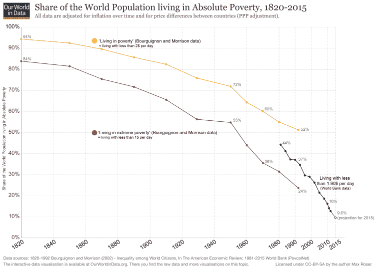
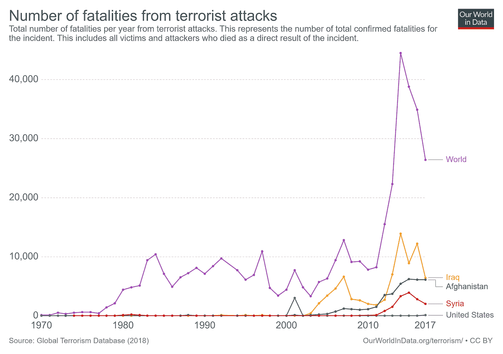
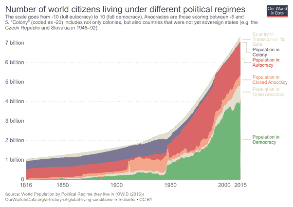
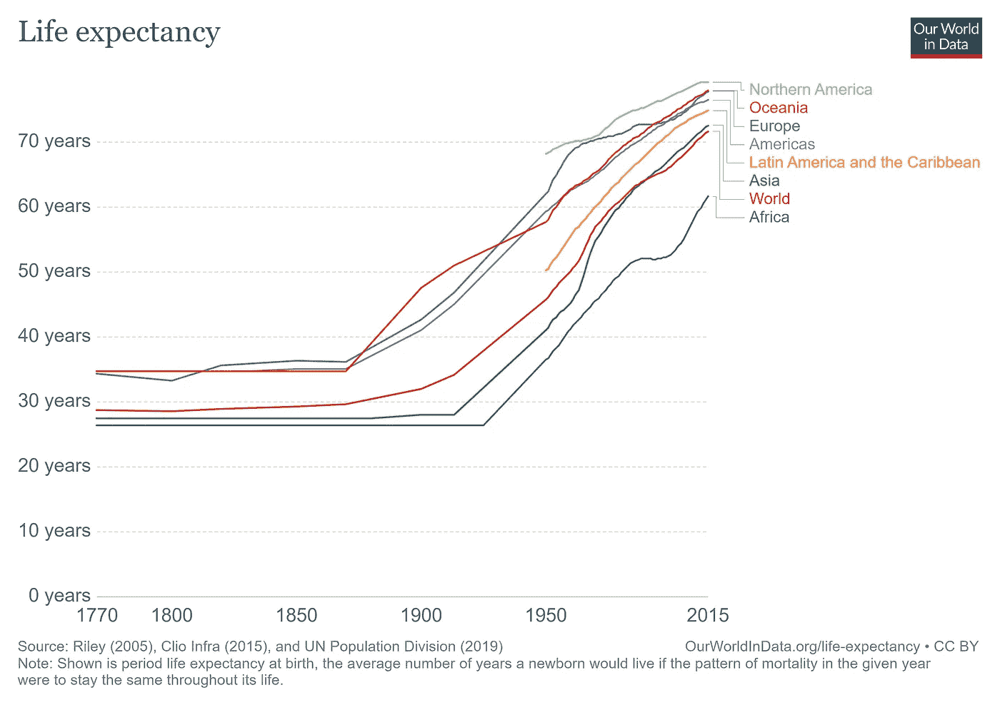
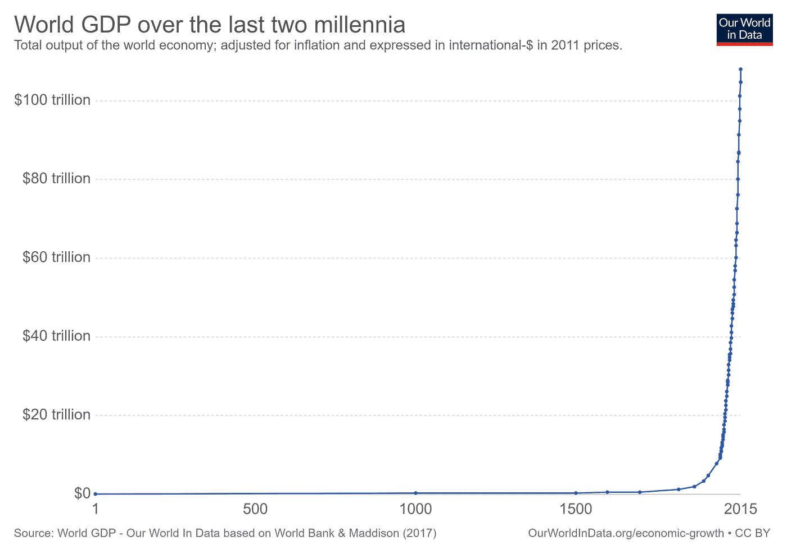
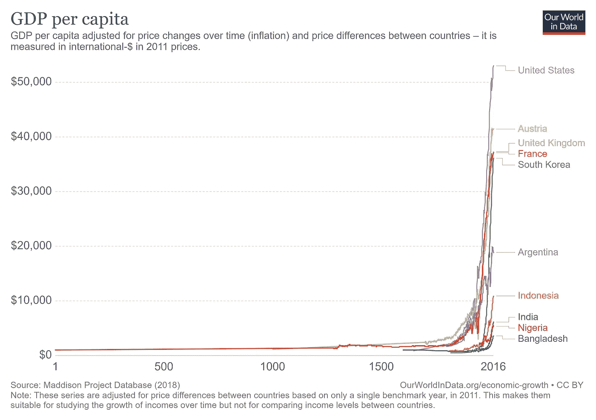
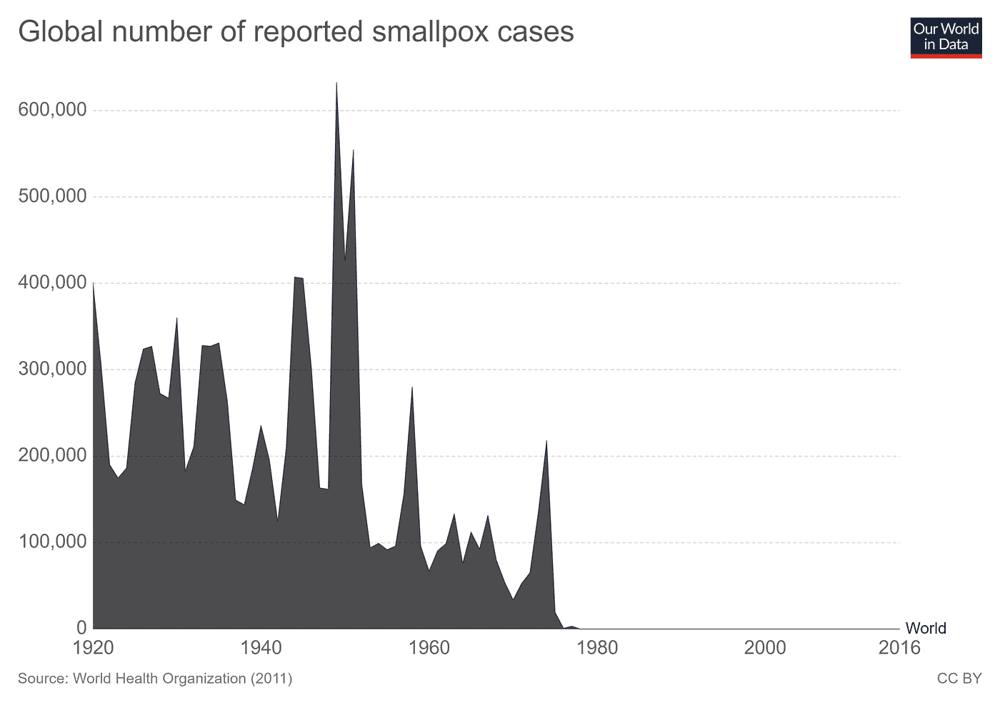

# 数据显示我们对世界的看法是错误的

> 原文：<https://towardsdatascience.com/data-shows-we-are-wrong-about-the-world-ac5608ce6c4f?source=collection_archive---------22----------------------->

Photo by [Vitaly Vlasov](https://www.pexels.com/@ihasdslr?utm_content=attributionCopyText&utm_medium=referral&utm_source=pexels) from [Pexels](https://www.pexels.com/photo/person-pointing-numeric-print-1342460/?utm_content=attributionCopyText&utm_medium=referral&utm_source=pexels)

## 用数据破除神话

## 为什么一切不像媒体告诉你的那么糟糕

埃迪亚告诉我们这个世界正在走向地狱。核战争的风险，民族主义的复兴，大国竞争的回归，也门、叙利亚、利比亚的内战和人道主义灾难…

当最近的一项[调查](https://www.forbes.com/sites/stevedenning/2017/11/30/why-the-world-is-getting-better-why-hardly-anyone-knows-it/)问到“综合考虑所有因素，你认为世界是变得更好还是更坏了？”，人们的反应是(不出所料的)悲观。

在瑞典，只有 10%的人认为情况正在好转，而在美国，这一比例仅为 6%。在英国，55%的受访者认为生活在贫困中的世界人口比例增加了，只有 13%的人认为这一数字下降了。

几乎没有人认为世界正在变好。

> 媒体不会告诉我们世界在如何变化，它会告诉我们世界在哪里出了问题。史蒂夫·丹宁。

但事实证明并非如此。我们从未经历过如此前所未有的进步。随着每一天的过去，世界变得越来越好。用美国前总统巴拉克·奥巴马的话说，“如果你不得不盲目选择你想在什么时候出生，你会选择现在”。

> 当我们的头脑被恐惧占据时，就没有事实的空间了。汉斯·罗斯林

在媒体灌输的非理性恐惧所定义的日益动荡和政治化的环境中，数据是唯一稳定的实体。客观、公正地分析数据，(通常)不容易被操纵，这是更好地理解我们日益复杂的世界的关键。

## 摆脱贫困的大逃亡

Source: Our World in Data

两百多年前，90%的人口生活在极度贫困之中。1950 年，世界上 75%的人仍然生活在极端贫困之中。但如今，生活在极端贫困中的人口还不到总人口的 10%。

很少有人想听到这些，但是每天都有 217，000 人脱离了 2 美元的贫困线。

2000 年，联合国制定了 8 项千年发展目标(始于 1990 年):

*   将全球贫困率减半
*   让 10 亿人摆脱贫困
*   这一切都是在 25 年内发生的

2000 年，大多数专家认为这些目标纯属空想。

你猜怎么着？世界提前五年实现了这些目标。

我们的进步不仅影响了富国，也影响了穷国。到 2008 年，生活在我们星球上的 67 亿人的平均收入相当于西方 1964 年的水平。

## 暴力

Source: Our World in Data

你们巨大的进步不仅触及了贫困，也触及了其他领域。

各种战争的数量从 1950 年代的每年 6 起下降到 2000 年代的每年 1 起，而死亡人数从每百万人 240 人下降到每百万人不到 10 人。

2017 年有近 7 万人因武装冲突丧生。另一方面，每年有近 80 万人死于自杀。

事实证明，在长期和平的时代，一个人自杀的可能性是被士兵杀死的可能性的 10 倍以上。

2018 年，约有 3 万人被恐怖分子杀害。相比之下，交通事故每年导致 125 万人死亡:27 万中国人、8 万欧洲人和 4 万美国人。

糖尿病和高血糖导致 350 万人死亡！空气污染——700 万。你死于糖尿病和空气污染的概率分别是死于恐怖袭击的 100 倍和 200 倍

现在，糖和空气远比火药危险。

> 暴饮暴食已经成为比营养不良更糟糕的问题。

过去，战争意味着没有和平。正如尤瓦尔·赫拉利曾经指出的那样，和平意味着暂时没有战争。

“例如，尽管德国和法国在 1913 年处于和平状态，但每个人都知道他们在 1914 年可能会剑拔弩张。每当政治家、将军、商人和普通公民为未来制定计划时，他们总是给战争留有余地。”

然而今天，和平是战争发生的绝对必然性。当首席执行官、政治家和公民制定近期计划时，他们不会将美中战争的可能性纳入计划。随着我们向知识经济转型，主要资产不再是油田和黄金，而是数据和人力资本，战争数量可能会大幅减少。

## 民主

Source: Our World in Data

媒体和专家正在谈论威权主义的崛起、自由民主的倒退和民粹民族主义的回归。

然而，民主国家的数量一直在稳步增加。1942 年，只有 12 个民主国家。在 1962 年，36 个民主国家。2015 年，有 103 个民主国家。几乎是 60 年前的 10 倍。

根据史蒂芬·平克的数据，2015 年，大约三分之二的世界人口生活在自由或相对自由的国家(1950 年不到五分之二，1900 年不到五分之一，1850 年为百分之七，1816 年为百分之一)。

民主是在无政府状态的混乱和暴政的暴力之间取得不稳定平衡的唯一政府形式。正如卡尔·波普尔指出的，民主不是人民的统治；这是一个无需流血就能推翻糟糕领导的体系。

如果世界变得更加民主，那么这就是进步。

## 生活和财富

Source: Our World in Data

今天的平均寿命是 72.23 岁，是 100 年前的两倍！

自从工业革命以来，世界财富增加了一百倍。2015 年，大约有 30 万人因营养不良而死亡。与此同时，几乎有 300 万人[因为肥胖而灭亡](https://www.who.int/features/factfiles/obesity/en/)！暴饮暴食已经成为比饥荒更严重的问题。

Source: Our World in Data

“有史以来第一次，死于吃得太多的人多于死于吃得太少的人；死于老年的人比死于传染病的人多；尤瓦尔·赫拉利说:“自杀的人比被士兵、恐怖分子和罪犯杀死的人加起来还要多。”。他接着写道，“对于普通的美国人和欧洲人来说，可口可乐比基地组织构成了更致命的威胁。”

Source: Our World in Data

## 我们悲观和无知的原因

证据显示世界正在变得更好。然而，正如史蒂夫·丹宁在《福布斯》 中写道，“在英国和美国，大多数人认为”生活在极端贫困中的人口比例增加了！三分之二的美国人甚至认为极端贫困人口的比例“几乎翻了一番”。"

为什么人们对人类取得的进步如此无知？

正如史蒂芬·平克指出的那样，积极和消极的事情在不同的时间线上展开。“坏事可能会很快发生，但好事不是一天建成的，随着它们的展开，它们将与新闻周期不同步。”

> 新闻是关于发生的事情，而不是没有发生的事情。我们从来没有看到一个记者对着镜头说，“我正在一个没有爆发战争的国家进行现场报道”——或者一个没有被轰炸的城市，或者一所没有被枪击的学校。只要坏事没有从地球上消失，总会有足够多的事件占据新闻，特别是当数十亿部智能手机将世界上大多数人口变成犯罪记者和战地记者时。摘自 s·平克的《现在的启蒙》
> 
> 媒体不会告诉我们世界在如何变化，它会告诉我们世界在哪里出了问题。[福布斯](https://www.forbes.com/sites/stevedenning/2017/11/30/why-the-world-is-getting-better-why-hardly-anyone-knows-it/#7e97d2a07826)

新闻媒体的受欢迎程度取决于它们娱乐、刺激、震撼或灌输仇恨、享受、自信和恐惧等极端情绪的能力。因此，大多数人不知道人类在过去几十年中取得的进步。

用 Max Roser 的话来说，如果新闻媒体真的报道了世界的变化，他们可能会报道生活在极端贫困中的人数在过去 25 年中每天都减少了 217，000 人。

承认我们过去的成就对于理解我们，人类，如果我们关注相关的事情，我们可以在未来取得更大的进步是必要的。

> 依靠媒体来形成你的世界观就像只看我的脚的照片来形成你对我的看法一样。汉斯·罗斯林

Source: Our World in Data

天花是人类几个世纪的祸害，仅在 20 世纪就有 3 亿人死于天花(这大约相当于现代俄罗斯、德国、英国和希腊人口的总和)，消灭天花的计划仅花费了 3 . 12 亿美元！！！

这还不到美国这种隐形轰炸机(B-2)一个机翼成本的一半。

Source: Wikipedia

美国已经建造了 21 架 B-2。

想象一下，如果我们专注于科学、技术和人类福祉的改善，我们会取得什么样的成就。我们的机会和能力是无限的；我们可以不断拓展我们的理解范围，不断扩大我们对周围世界的了解，并有效地解决全球性挑战。

> 关注进步的意义不是沾沾自喜，而是找出原因，这样我们就能做更多有效的事情……进步包括尽可能分解社会进程的特征，以最大化人类利益，同时最小化伤害。史蒂芬·平克

过去几十年取得了巨大的进步，我们的主要目的是最大限度地扩大进步带来的好处，同时消除其负面影响。

我们已经做了。我们可以再做一次。我们可以做到的是无限的，利用数据和人工智能放大的人类理性的力量来促进人类的繁荣。