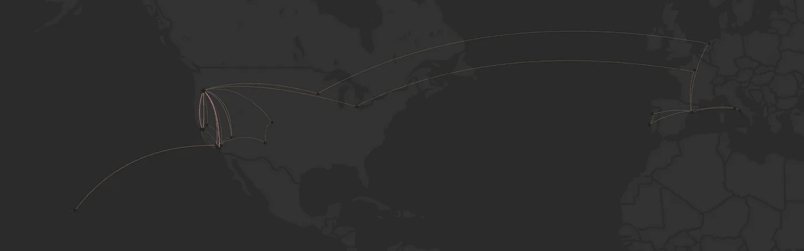
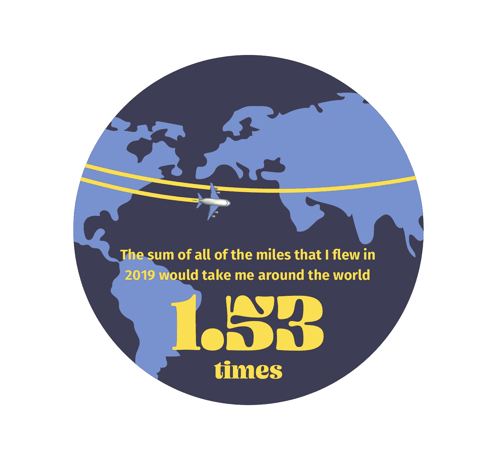
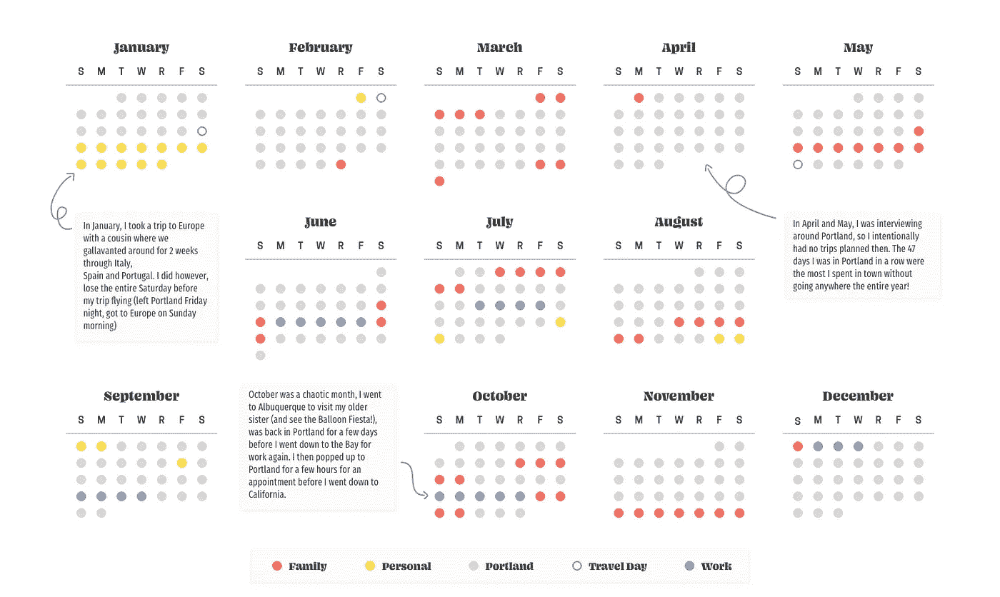
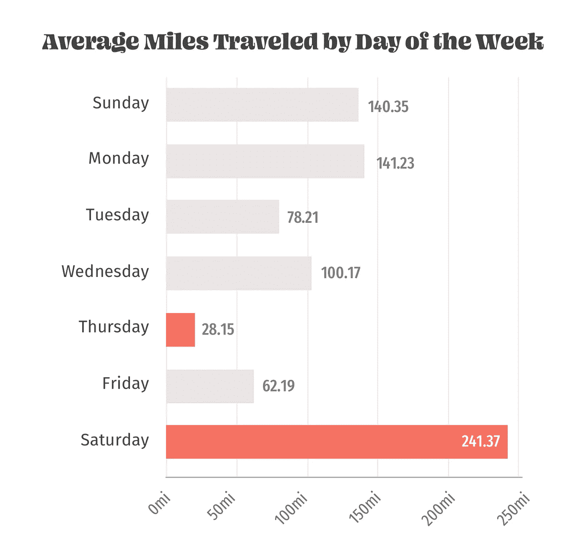
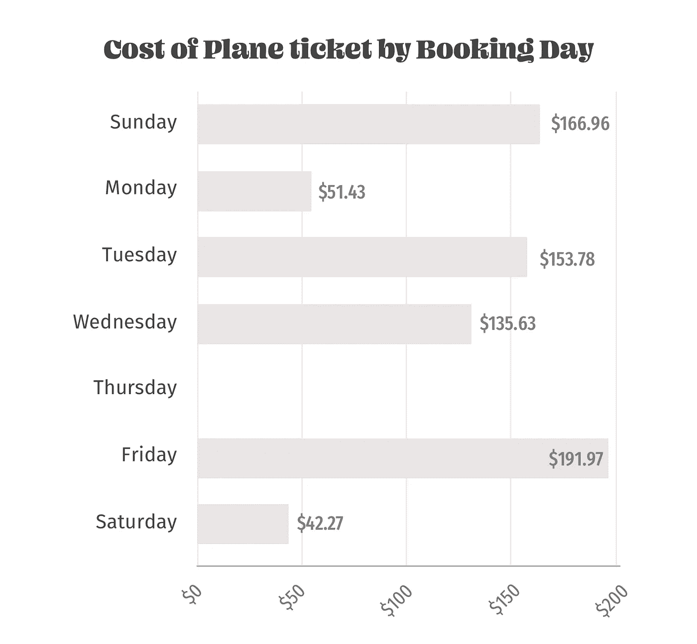
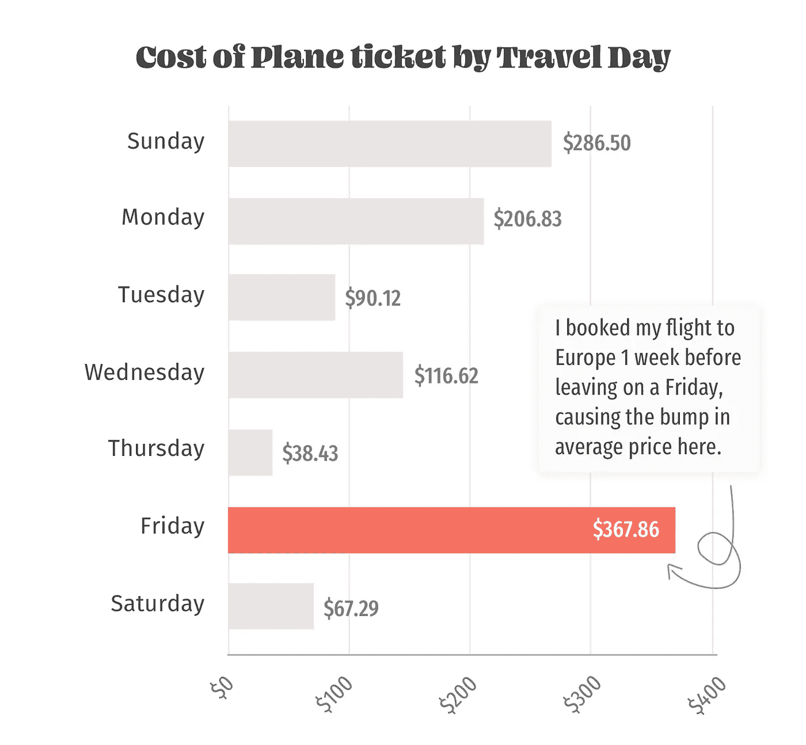
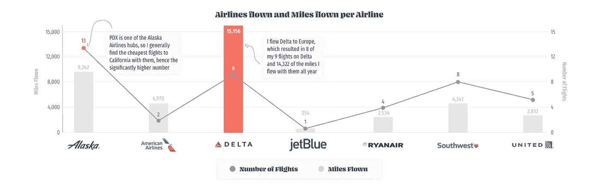

# 数据故事—飞机飞行

> 原文：<https://towardsdatascience.com/data-stories-plane-flights-292b1cce38da?source=collection_archive---------33----------------------->

## 透过我旅行的棱镜看我的 2019 年(以及那对我说了什么😂

我一直对数据中存在的故事感兴趣，这些数据是我们在生活中创造的。在过去的几个月里，我的朋友 Maxy Lotherington 一直在做一个名为“日常数据 Vis”的媒体系列，她启发并激励我开始通过我产生的数据来审视我的生活。*(在这里查看她的文字:***，她的* [*表情反应*](https://medium.com/@maxylotherington/everyday-data-vis-emoji-reactions-b7bdc87bc5db) *片段是我最近读过的最喜欢的东西之一)。**

*如果是 12 月，我会记录下我在 2019 年乘坐的每一次飞机飞行。我的朋友说我从来不在镇上闲逛，在某种程度上，我想知道这有多真实(以及我实际上旅行了多少)。对于那些今天有很多事情的人来说，剧透一下——我确实有点沉迷于旅行，今年我已经累积了很多英里。*

**

*A map of all of my travels for the past year — as you can see, I’m a fairly frequent flier along the West Coast of the United States, mainly because I live in Portland, my company headquarters is in the Bay, and I have a ton of family in LA*

# *我追踪到的*

*我在 2019 年跟踪了我旅行的大量数据:*

*   *一般信息:预订日期、到达日期(如果不同)、旅行日期、出发时间、到达时间、出发时间、到达时间、预订日期、旅行日期、直达航班？每次旅行的费用，我是否支付了费用，每段路程的费用(如果不同)。*
*   *计算信息:预订日期和旅行日期之间的天数，旅行之间的时间。*
*   *机场和航班信息:出发机场、到达机场、飞行持续时间、飞行产生的二氧化碳、飞行里程、航空公司、航班号*

# *我没追踪到的是*

*   *延误。我找不到关于我的哪个航班被延误的一致的事实来源，所以下面所有的航班都是基于延误永远不会发生的想法(如果你最近坐过飞机，你知道这是错误的，但那是另一天的问题)。*
*   *我在 2019 年支付的旅行，但将在 2020 年进行。*

# *🌎那么我到底旅行了多少？*

**

*很多。不算打车时间、等待登机时间，以及在飞机上度过的其他各种时间，我在 T21 的飞行时间为 95 小时 12 分钟(大约占我一年时间的 1%)*

*我的端到端里程数出来是**39490 英里**，查看我的飞行信息显示我产生了 **5597.07 公斤的 CO2** ，这是用这个工具计算出来的[。(超过 6 吨的二氧化碳，几乎是一个正常人年排放量的 1.5 倍😬)](http://www.airmilescalculator.com)*

# *📅这是不是意味着你从来没回家过？*

*我的大多数朋友现在都很清楚，如果他们想和我一起做计划，我很有可能不在城里。我在某种程度上对此感到不快，所以我想我应该看看这些数据，看看这到底是真是假。*

**

*不幸的是，事实证明他们是对的。在我可能在波特兰度过的 365 天中(我在一个被计入地理位置偏好的地方度过了超过 6 个小时的清醒时间)，我在城里度过了 270 天(整整 74%)。**换个角度想想，平均每个月我会离开一周。***

**

*2019 年 Vivek 的一个普通周六看起来是这样的:醒来，淋浴，吃点东西，去机场(一般来说是 PDX，但我没有歧视)，飞行 241.37 英里，寻找新的冒险，家庭时间，或任何激起我兴趣的东西。另一方面，周四平均只有 28.15 英里的空中旅行，这将使我从 PDX 到塞勒姆(俄勒冈州首府)机场的半路上。(在你担心我因为不能在办公室工作而被解雇之前，我花了 2019 年的时间远程工作，所以我可以在周一飞回家😂*

***平均来说，我的旅行间隔时间是 9 天 8 小时 5 分钟**，其中两次旅行间隔时间最长的是 46 天 11 小时 34 分钟，最快的周转时间是 22 小时 30 分钟。*

# *💸那么你一定破产了？？*

*你没有完全错，但你也没有错。由于我非常强大的谷歌航班游戏，以及我注册的航班交易数量，我没有在 2019 年把所有的钱都花在航班上，但我确实在航班上花了 2323.25 美元。(每次飞行大约需要 110.63 美元)。这还不包括我工作支付的机票，或者我使用的礼品卡/旅行信用卡。然而，我并没有节省我的钱包，我在出发前 30 天预订了我的普通航班——如果你把我去新墨西哥州的旅行计算在内，这个数字就下降到 23 天，我提前 3 个月预订了机票。*

**

*不过，让我感到惊讶的一件事是，周二实际上不是我预订航班最便宜的日子，事实上我可能会在未来预订周三的航班更好(周一和周六非常低，因为它们主要包括我在欧洲各地的瑞安航空航班，但即使将这些从数据集中剔除，也导致周二的航班比周三更贵)。此外，我莫名其妙地去了 365 天，预订了 23 次旅行，却没有在周四预订任何东西，我也不完全确定是怎么回事。*

**

*如果我们根据上面的图表假设预订日没有显著影响机票价格，那么当我们查看航班当天会发生什么呢？我们在这里看到的是，与一周中的其他任何一天相比，我在周六乘坐的航班数量在一定程度上可以解释为比周五的航班便宜多少——记住，我在周五离开之前一周花了 450 美元乘坐往返航班前往欧洲。*

# *🛩:你是说你有很多航空里程？*

*不幸的是，这也不是真的，是的，我经常坐飞机，这意味着我有很多里程，但我是一个糟糕的品牌忠诚度飞行员——当我预订航班时，我唯一真正的考验是它有多贵，我不会花更多的钱乘坐任何航空公司的飞机(尽管我以前和阿拉斯加航空公司很亲近😍).*

**

# *TL；速度三角形定位法(dead reckoning)*

*我在 2019 年飞了很多次，更具体地说，绕地球飞了 1.53 圈，实际上我很少长时间呆在波特兰，但我看到了很多很酷的东西，有趣的人，并有一些很棒的经历，所以总而言之，我会接受它。*

*我现在要去做二氧化碳抵消捐赠，但如果你想告诉我你有多喜欢(或讨厌)这个，请随时在 [LinkedIn](https://www.linkedin.com/in/tannav/) 上给我留言。👋*