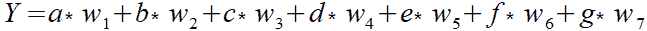
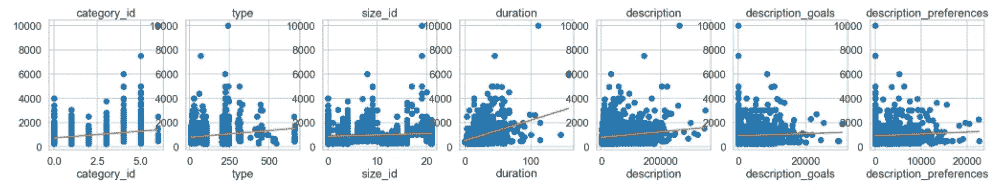
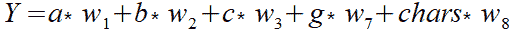
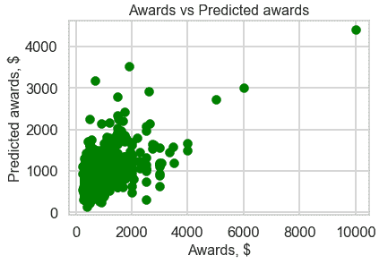
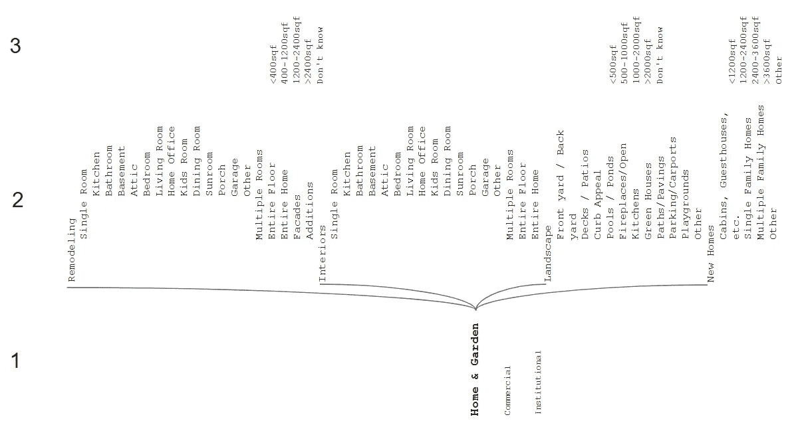
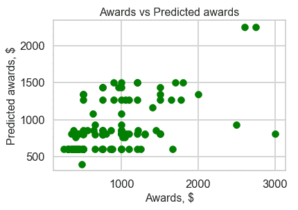
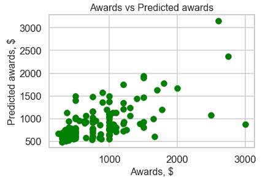

# 选择最佳机器学习方法的数据结构评估

> 原文：<https://towardsdatascience.com/data-structure-evaluation-to-choose-the-optimal-machine-learning-method-eec66076f97a?source=collection_archive---------18----------------------->

## 一组关于数据相关性分析如何在解决回归任务时帮助节省时间的示例。


Photo by [Spencer Watson](https://unsplash.com/@thebrownspy?utm_source=medium&utm_medium=referral) on [Unsplash](https://unsplash.com?utm_source=medium&utm_medium=referral)

没有单一的 ML 方法。为了选择一个适合您的目的，作为开发人员，您需要了解项目中将使用的数据的性质。在这篇文章中，我将分享我在机器学习系统开发方面的经验，描述选择最佳预测模型的步骤。

我很幸运能够围绕一个正在进行的项目进行研究，这个项目是设计师和建筑师最大的市场，位于 Arcbazar.com。这是一个[竞赛平台](https://greenice.net/build-crowdsourcing-platform/)，它允许需要房屋建造或改造的客户在他们的预算范围内获得想要的建筑设计。虽然它比从设计工作室订购便宜，但在该平台上，客户还可以从来自世界各地的参与者提供的大量设计项目中进行选择。同时，Arcbazar 让任何专业水平的设计师都有机会获得认可，展示他们的创造力，并赢得奖金。

# 挑战

任务是为市场创建一个人工智能驱动的奖励建议系统，帮助客户决定设计师获奖者的奖项。

对于每个项目，客户可以自由设定不低于最低要求奖励的任何价格。由于所有人都是不同的，我们应该考虑到客户的决定是基于复杂的主观动机:预算、情绪、时间限制、需求、估计、期望等。这意味着机器学习系统应该解决一种社会心理任务。

# 第一步。数据准备

这个平台有一个大数据库，里面有设计师获奖的已完成的比赛。这个数据库成为机器学习系统的知识来源。数据库结构重复表单中的字段，这些字段必须由客户在开始设计师竞赛之前填写。


这个表单有七个字段:三个下拉菜单、三个文本字段(字符串类型)和一个数字字段(设置截止日期)。在表单的最后一个字段(开始比赛)，客户设置奖励价格。

金额是所有项目特征字段的函数，并且以准连续的方式变化。在机器学习理论中，这种类型的任务被称为回归。表单中的字段总数可以表示为一个线性方程:



其中:

*   y 是奖励金额；
*   a、b、c——是从下拉菜单中表示项目特征的变量；
*   d、e、f——是表示文本描述字段的变量；
*   g —是代表天数的变量；
*   w1..w7 —方程的系数或参数。

通过分析表单字段的数据，我区分了三个类别:

1.  结构化下拉菜单(前三个图)；
2.  非结构化描述字段；
3.  数值字段。



下拉列表的值通常有索引。我用这些值索引替换了文本值。为了最大限度地减少计算时间，在开发的第一阶段，我用一个具有字符总数的数字替换了树文本字段。这个假设让我们保留一个更大的数据集。从后验来看，额外的场对模型拟合数据集的方式有一点积极的影响。

转换后的数据集可由一个五变量公式表示:



# 第二步。选择机器学习方法

在这一步中，我想使用 Python 编程语言的 Scikit-learn 库在一系列实验中找到最佳的机器学习方法。在测试过程中，我改变了 5 个特征数据集的分割比，对于测试子集，分割比从 10%变为 50%。此外，对标准化和非标准化数据进行了所有评估。标准化并没有给模型精度带来明显的提高。

我从预测与对象关联的连续值属性的基本方法开始。这种方法称为线性回归。但是，预测奖励和实际奖励的分布具有决定系数 R 平方= 0.29。在回归中，该系数是回归预测与真实数据点接近程度的统计度量。R 平方为 1 表示回归预测完全符合数据。



[回归方法组中的套索回归](/ridge-and-lasso-regression-a-complete-guide-with-python-scikit-learn-e20e34bcbf0b)给出了非常接近线性回归的分布，R 平方为 0.29。


让出一步，我决定使用人工神经网络。[多层感知器](https://scikit-learn.org/stable/modules/neural_networks_supervised.html#multi-layer-perceptron)即使有 500 个隐藏层，在 R 平方= 0.05 的这一系列实验中显示出最弱的结果。

```
mlpreg = MLPRegressor(hidden_layer_sizes=(500,), activation=’relu’,
         solver=’adam’, alpha=0.001, batch_size=’auto’,
         learning_rate=’adaptive’, learning_rate_init=0.01,
         power_t=0.5, max_iter=1000, shuffle=True, random_state=9,
         tol=0.0001, verbose=False, warm_start=False, momentum=0.9,
         nesterovs_momentum=True, early_stopping=False,
         validation_fraction=0.1, beta_1=0.9, beta_2=0.999,
         epsilon=1e-08)
```


然而，我们的数据集有一个对应于多级下拉列表的结构。这种可视化有助于理解数据集的相互联系。



One client’s choice is a decision tree, many choices — decision forest

当从下拉列表中选择值时，客户从他的“决策树”中的一个分支移动到另一个分支(在图中:级别 1–2–3)。这就是为什么决策树回归给出了更大的 R 平方(0.32)。



决策树回归器的一个更复杂的发展，来自 Sklearn ensembles 的[随机森林回归器](https://scikit-learn.org/stable/modules/generated/sklearn.ensemble.RandomForestClassifier.html)，给出了 R 平方的最好结果——0.37。



**结论**

了解跨数据的相互依赖性有助于选择最合适的算法。

决策树和随机森林方法具有相同的基础，比其他方法更接近数据集的本质。

所选数据集中的数据字段集不足以获得更好的拟合。它创建了一个假设，即文本描述字段包含客户在设置奖励时的隐藏动机。

在本文的第 2 部分，我将公开我对使用自然语言处理技术升级预测系统的见解。