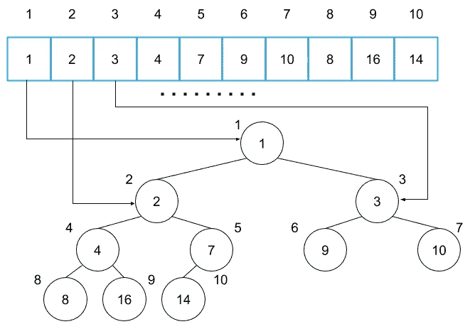

# 用 Python 理解堆的 6 个步骤

> 原文：<https://towardsdatascience.com/data-structure-heap-23d4c78a6962?source=collection_archive---------7----------------------->

## 搜索算法的重要数据结构


Photo by [Rick Mason](https://unsplash.com/photos/2FaCKyEEtis?utm_source=unsplash&utm_medium=referral&utm_content=creditCopyText) on [Unsplash](https://unsplash.com/?utm_source=unsplash&utm_medium=referral&utm_content=creditCopyText)

今天我将解释堆，它是基本的数据结构之一。还有，著名的搜索算法像 Dijkstra 的算法或者 A*都使用堆。A*可以出现在常用于时间序列模式识别的*隐马尔可夫模型* (HMM)中。请注意，这篇文章不是关于搜索算法的。我将解释堆是如何工作的，以及它的时间复杂度和 Python 实现。麻省理工开放式课程的讲座真的帮助我理解了一堆。所以我遵循了那堂课的解释方式，但我做了一点总结，并添加了一些 Python 实现。这篇文章的结构如下，基于[麻省理工学院的讲座](https://www.youtube.com/watch?v=B7hVxCmfPtM)。我们开始吧！

1.  堆概述
2.  表现
3.  如何建立一个堆
4.  时间复杂度
5.  履行
6.  堆排序

# 1.堆概述

堆是优先级队列的[的一种常见实现。优先级队列包含具有一定优先级的项目。您总是可以按照优先级顺序从优先级队列中取出一个项目。根据优先级取出项目是很重要的。当你环顾学术会议上的海报展示时，很有可能你是为了挑选一些展示而设置的。或者你会在去观光之前列出一个优先列表(在这种情况下，一个项目将是一个旅游景点。).堆栈和队列也包含项目。如果某个项目是最后一个添加到堆栈中的项目，则可以从堆栈中取出该项目。这是先进后出(费罗)。对于队列，如果一个项目是第一个添加到队列中的项目，您可以从队列中取出该项目。这是先进先出(FIFO)。您可以将这些视为特定类型的优先级队列。这是因为堆栈中插入项的优先级增加，队列中插入项的优先级降低。](https://en.wikipedia.org/wiki/Priority_queue)


# 2.表现

堆是树结构的一种，用二叉树来表示。我把图像堆在下面。您可以通过指针或数组来实现树结构。在这篇文章中，我选择使用如下的数组实现。就空间复杂性而言，数组实现比指针实现有更多的好处。数组的索引对应于下图中的节点号。



上面的堆叫做*一个最小堆*，每个**节点的值小于或等于子节点*的值。*** 我们称这种情况为堆属性。


在最小堆中，当您查看父节点及其子节点时，父节点总是具有最小值。当一个堆有相反的定义时，我们称它为*最大堆*。在下面的讨论中，我们称最小堆为堆。

您可以使用以下索引访问数组中的父节点或子节点。

*   根节点| *i* = 1，数组的第一项
*   一个父节点|parent( *i* ) = *i* / 2
*   一个左子节点|left( *i* ) = 2 *i*
*   一个右子节点| right(*I*)= 2*I*+1

当您查看索引 4 的节点时，树中节点的关系对应于下面数组的索引。


父节点按父( *i* ) = 4 / 2 = 2 对应索引 2 的项。子节点分别对应索引 8 和 9 的项目，左( *i* ) = 2 * 2 = 4，右( *i* ) = 2 * 2 + 1 = 5。

# 3.如何建立一个堆

从任意数组构建一个堆需要两个操作。

1.  `min_heapify`|使某个节点及其后代节点满足堆属性。
2.  从任意数组中产生一个堆。

我们可以通过对每个节点重复应用 *min_heapify* 来构建一个堆。

## 3.1 分钟 _ 健康

在 *min_heapify* 中，我们用它的子节点交换一些节点来满足下面这两个特性下的堆属性；

1.  某些节点及其子节点不满足堆属性，
2.  子节点及其后代节点满足属性。

树形结构具有以下两个特征。


看看被橙色方块包围的节点。我们发现 9 比 2 和 3 都大，所以这三个节点不满足堆属性(node 的值应该小于等于其子节点的值)。请检查下面的橙色节点。


然而，看看蓝色的节点。这些节点满足堆属性。


这里我们定义 *min_heapify* ( *数组*，*索引*)。这个方法有两个参数，*数组，*和*索引*。我们假设该方法将*数组* [ *索引*的节点与其子节点交换，以满足堆属性。

让我们看看 *min_heapify* 是如何从上面的树形结构中产生一个堆的。首先我们调用*min _ heap ify*(*array*，2)将索引 2 的节点与索引 4 的节点交换。


在将*min _ heap ify*(*array*，2)应用到子树之后，子树在下面发生变化，并满足堆属性。这个子树是蓝色的。


如果子树将索引 2 的节点与索引 5 的节点交换，子树将不会满足如下所示的堆属性。因此子树与父节点交换子树中具有最小值的节点，以满足堆属性。


回到正确交换的树。当我们看橙色的节点时，这个子树不满足堆属性。


所以调用*min _ heap ify*(*array*，4)使子树满足堆属性。


现在，这个子树通过将索引 4 的节点与索引 8 的节点交换来满足堆属性。

上面的这些操作从无序的树(数组)中产生堆。

## 3.2 构建 _ 最小 _ 堆

下面的伪代码代表了 *build_min_heap* 是如何工作的。

```
build_min_heap(array)
    for i=n/2 downto 1
        do min_heapify(array, i)
```

该函数使用 for 循环迭代除叶节点之外的节点，并将 *min_heapify* 应用于每个节点。我们不需要将 *min_heapify* 应用于 *n* /2+1 之后的索引项，它们都是叶子节点。我们在下面的橙色节点中应用了 *min_heapify。*


每个节点在满足能够应用 *min_heapfiy 的条件下可以满足堆属性。*这是因为该函数从底部(倒数第二层)到顶部(根节点层)迭代节点。例如，该函数首先将 *min_heapify* 应用于索引 4 和索引 5 的节点，然后将 *min_heapify* 应用于索引 2 的节点。因此，当应用 *min_heapify 时，索引的节点及其后代节点满足堆属性。*

# 4.时间复杂度

我们来考虑一下 *build_min_heap 的时间复杂度。*首先我们认为 *min_heapify* 的时间复杂度，它是 *build_min_heap 的一个主要部分。*

*min_heapify* 重复交换数组中项目的操作，该操作以固定时间运行。因此 *min_heapify* 的时间复杂度将与重复次数成正比。在最坏的情况下， *min_heapify* 应该重复操作树的高度倍。这是因为在最坏的情况下，min_heapify 会用最深的叶子节点交换根节点。假设 *h* 为根节点的高度， *min_heapify* 的时间复杂度将需要 *O* ( *h* )的时间。

*min_heapify* 在各深度的时间复杂度如下所示。节点的数量也显示在右侧。


从图中可以看出 *build_min_heap* 的时间复杂度将是内部节点的时间复杂度之和。最终的时间复杂度变成:


所以我们应该知道树的高度来得到时间复杂度。

每个深度的节点数之和会变成 *n* 。所以我们会得到下面这个等式。


上面的等式代表几何序列，所以我们可以变形它，得到树的高度如下:


最后我们得到 *O* ( *n* )作为 *build_min_heap* 的时间复杂度。同样，我们得到 *O* (log *n* )作为 *min_heapify* 的时间复杂度。

# 5.履行

这里我们用 Python 实现了 *min_heapify* 和 *build_min_heap* 。 *min_heapify* 实现如下。

```
def min_heapify(array, i):
    left = 2 * i + 1
    right = 2 * i + 2
    length = len(array) - 1
    smallest = i if left <= length and array[i] > array[left]:
        smallest = left
    if right <= length and array[smallest] > array[right]:
        smallest = right
    if smallest != i:
        array[i], array[smallest] = array[smallest], array[i]
        min_heapify(array, smallest)
```

首先，该方法计算索引为 *i* 的节点及其子节点中值最小的节点，然后将值最小的节点与索引为 *i* 的节点进行交换。当交换发生时，该方法将 *min_heapify* 应用于被交换的节点。

Python 中一个列表(一个数组)的索引从 0 开始，访问节点的方式会有如下变化。

*   根节点| *i* = 0
*   父节点|父节点( *i* ) = ( *i* -1) / 2
*   左子节点| left(*I*)= 2*I*+1
*   右子节点| right(*I*)= 2*I*+2

变量*最小*具有最小值节点的索引。如果*最小的*不等于 *i* ，这意味着该子树不满足堆属性，该方法交换节点并对*最小的*的节点执行 *min_heapify* 。

*build_min_heap* 的实现和伪代码差不多。

```
def build_min_heap(array):
    for i in reversed(range(len(array)//2)):
        min_heapify(array, i)
```

for 循环不同于伪代码，但行为是相同的。这个 for 循环还从倒数第二层节点到根节点迭代节点。

# 6.堆排序

Heapsort 是一种使用堆的排序算法。用 *min_heapify* 和 *build_min_heap 真的很容易实现。分拣流程如下。请注意，排序的顺序是升序。*

1.  用 *build_min_heap 从任意数组构建一个堆。*
2.  将数组中的第一项与最后一项交换。
3.  从数组中移除最后一项。
4.  运行 *min_heapify* 到第一项。
5.  回到步骤 2。

在堆中，最小的项是数组的第一项。步骤 3 之后的数组满足应用 *min_heapify* 的条件，因为我们在将第一项与最后一项交换之后移除了最后一项。根据这一特性，我们可以通过重复步骤 2 到 4 对数组进行排序。

heapsort 实现将如下所示。

```
def heapsort(array):
    array = array.copy()
    build_min_heap(array) sorted_array = []
    for _ in range(len(array)):
        array[0], array[-1] = array[-1], array[0]
        sorted_array.append(array.pop())
        min_heapify(array, 0) return sorted_array
```

heapsort 的时间复杂度是*O*(*n*log*n*因为在最坏的情况下，我们要重复 *min_heapify* 数组次数中的项数，也就是 *n* 。

在 Python 的[heapq 模块](https://docs.python.org/3/library/heapq.html)中，已经实现了对堆的一些操作。我遵循了麻省理工学院讲座中的方法，实现与 Python 不同。如果你想知道 Python 的具体实现，请访问[这里的源代码](https://github.com/python/cpython/blob/master/Lib/heapq.py)。例如，这些方法是用 Python 实现的。

*   `heapq.heapify` |对应 *build_min_heap*
*   `heapq.heapop` |对应交换项目，移除最后一个项目， *min_heapify* 立刻*。*

通过使用上述方法，我们可以实现如下的堆排序。请注意，它与官方文件中的[heap sort 的实现不同。](https://docs.python.org/3/library/heapq.html#basic-examples)

```
import heapqdef heapsort(array):
    h = array.copy()
    heapq.heapify(h)
    return [heapq.heappop(h) for _ in range(len(array))]
```

所以这个帖子到此为止。感谢您的阅读！

## 参考

*   [麻省理工学院开放课件 4。堆和堆排序](https://www.youtube.com/watch?v=B7hVxCmfPtM)