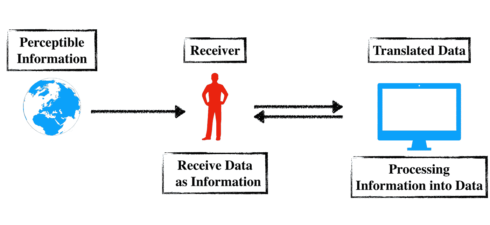
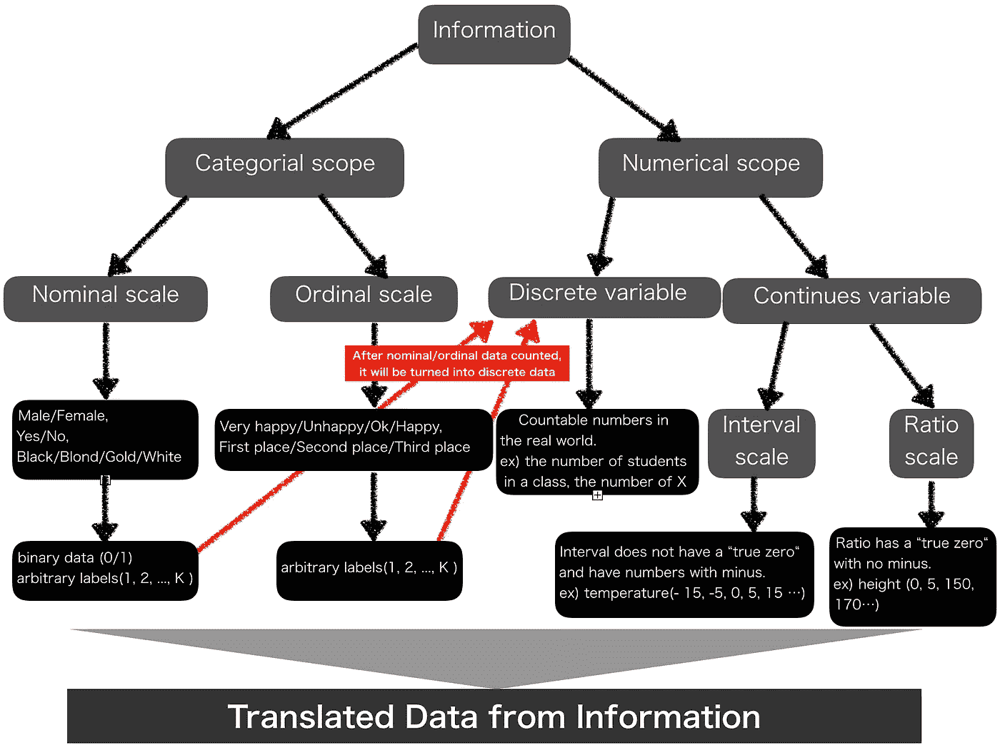
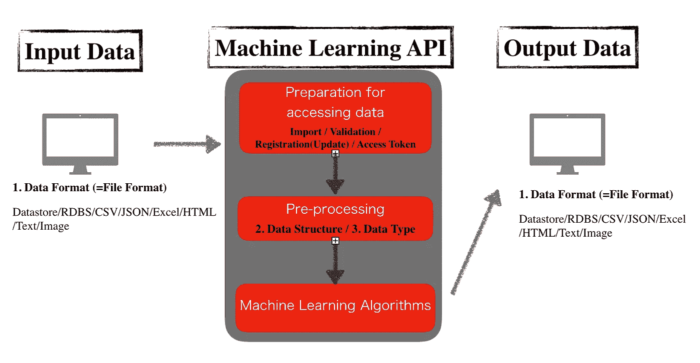

# AI/ML 项目中的数据翻译周期

> 原文：<https://towardsdatascience.com/data-translation-cycles-in-ai-ml-projects-2ff4445802cd?source=collection_archive---------25----------------------->


Photo by [ev](https://unsplash.com/@ev?utm_source=medium&utm_medium=referral) on [Unsplash](https://unsplash.com?utm_source=medium&utm_medium=referral)

## 在 AI/ML 项目中从潜在有价值的数据到有益信息的转换

越来越多的工程师面临着人工智能(AI)和机器学习(ML)相关项目数量的增加。许多人工智能/人工智能项目似乎是面向算法的，但是开发人工智能/人工智能产品的每个过程都是以任何涉及数据的过程为中心的。AI/ML 项目中的工程师需要更多地了解如何在 AI/ML 项目中创建和使用数据。这篇文章可能会帮助初级/中级工程师或数据科学家理解为 AI/ML 产品准备的数据本身。

# **什么是数据？**

定义引自网络词典，因为更新周期比纸质资料快。数据基于信息，因此信息的定义也在下面描述。

> 信息是一种刺激，在某种语境下对接受者有意义。当信息被输入并存储在计算机中时，它通常被称为[数据](https://searchdatamanagement.techtarget.com/definition/data)。经过处理(如格式化和打印)后，输出数据可以再次被视为信息。

数据本身的定义就在这里。

> 在计算中，数据是已经被转换成高效移动或处理形式的[信息](https://searchsqlserver.techtarget.com/definition/information)。相对于今天的[计算机](https://searchwindowsserver.techtarget.com/definition/computer)和传输介质，数据是信息转换成[二进制](https://whatis.techtarget.com/definition/binary)数字形式。数据可以用作单数主语或复数主语。[原始数据](https://searchdatamanagement.techtarget.com/definition/raw-data)是一个术语，用于描述最基本的数字格式的数据。

这两种定义的含义可以绘制成如图 1 所示的图片。**作为人类的接收者在我们周围的环境中感知信息，测量信息，并将其转化为定性/定量信息，以便容易地识别信息的含义。可以容易地被计算机识别的接收信息被处理，具有新见解的新信息被创建，并被传递到接收器。**



Figure 1 created by Jesse Tetsuya

# 接收者的翻译测量

将信息转化为数据的测量类型可以是下图 2 中的灰色方框。



Figure 2 created by Jesse Tetsuya

**分类数据**是定性数据，由名义数据和序数数据组成。为了将这样的数据传递给代码并使用数据进行分析，必须将分类数据转换成数字，如**二进制数据或任意编号标签。**

另一方面，**数字数据**是定量数据，由离散和/或连续数字组成。**离散数字**包括可计数的数字，如学生人数，它可以等于名义或顺序数据的计数输出。**连号**分为两种:**区间刻度和比例刻度**。两者的区别在于**数据是否有“真零”和数字有无减号。**严格来说，连续变量的规模不是根据数字有无负号来决定的，但是度量的方式很容易理解。

# 描述数据的三种方式

描述数据的三种方式是 **1)数据结构，2)数据类型，3)数据格式(=文件格式)。**本节将根据常用的 python 语法对它们进行简单总结。**不包括不常用的 python 语法信息。**

## 1.数据结构

*   列表/字典/序列/元组/集合(示例如下)

**列表和词典**

```
**>>>** tel = {'jack': 4098, 'sape': 4139}
**>>>** tel['guido'] = 4127
**>>>** tel
{'jack': 4098, 'sape': 4139, 'guido': 4127}
**>>>** tel['jack']
4098
**>>> del** tel['sape']
**>>>** tel['irv'] = 4127
**>>>** tel
{'jack': 4098, 'guido': 4127, 'irv': 4127}
**>>>** list(tel)
['jack', 'guido', 'irv'
```

**序列和元组**

```
**Sequences
>>>** t = 12345, 54321, 'hello!'
**>>>** t[0]
12345**Tuples
>>>** t
(12345, 54321, 'hello!')
**>>>** *# Tuples may be nested:*
**...** u = t, (1, 2, 3, 4, 5)
**>>>** u
((12345, 54321, 'hello!'), (1, 2, 3, 4, 5))
**>>>** *# Tuples are immutable:*
**...** t[0] = 88888
Traceback (most recent call last):
  File "<stdin>", line 1, in <module>
TypeError: 'tuple' object does not support item assignment
**>>>** *# but they can contain mutable objects:*
**...** v = ([1, 2, 3], [3, 2, 1])
**>>>** v
([1, 2, 3], [3, 2, 1])
```

**设置**

```
**>>>** basket = {'apple', 'orange', 'apple', 'pear', 'orange', 'banana'}
**>>>** print(basket)                      *# show that duplicates have been removed*
{'orange', 'banana', 'pear', 'apple'}
**>>>** 'orange' **in** basket                 *# fast membership testing*
True
**>>>** 'crabgrass' **in** basket
False
```

## **2。数据类型**

*   字符串/整数/浮点/布尔

## 3.数据格式

*   数据存储/RDBS/CSV/JSON/Excel/HTML/Text/Image

# 将数据转化为有价值信息的过程

在 AI/ML 项目的情况下，工作流可以描述为如图 3 所示。



Figure 3 created by Jesse Tetsuya

首先，根据上一节提到的**数据转换测量**收集并格式化输入数据。输入的数据可以是 **RDBS、CSV、JSON、Excel、HTML、文本、图片等。如前一节所述。**

之后，这些输入数据被导入机器学习 API。机器学习 API 通常由与**相关的三个程序代码组成，即访问数据的准备代码、预处理数据和机器学习算法。在将数据传递到机器学习模型之前，需要根据算法对数据结构和数据类型进行不同的操作和处理。**

最后，对于人类来说没有明确表示有价值意义的输入数据**通过图 3 所示的机器学习 API 被转换成有价值的信息。然后，它作为有用的信息被人类接收。**

# 参考

[](https://searchsqlserver.techtarget.com/definition/information) [## 什么是信息？-WhatIs.com 的定义

### 信息是一种刺激，在某种语境下对接受者有意义。当信息被输入和存储时…

searchsqlserver.techtarget.com](https://searchsqlserver.techtarget.com/definition/information) [](https://searchdatamanagement.techtarget.com/definition/data) [## 什么是数据？-WhatIs.com 的定义

### 在计算中，数据是指已经被转换成可有效移动或处理的形式的信息…

searchdatamanagement.techtarget.com](https://searchdatamanagement.techtarget.com/definition/data)