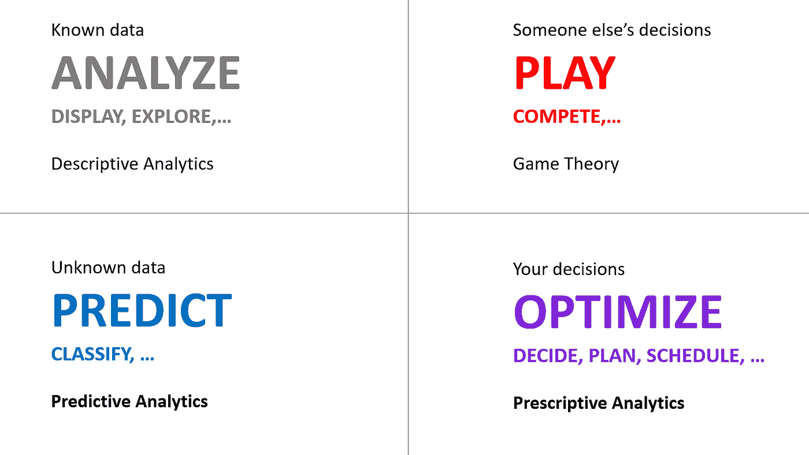
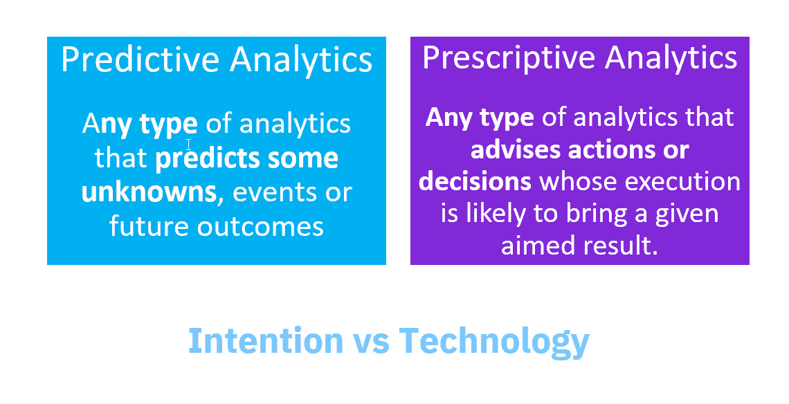

# 数据科学的数据类型

> 原文：<https://towardsdatascience.com/data-types-for-data-sciences-65dcbda6177c?source=collection_archive---------4----------------------->

大数据和数据科学现在在每个人的脑海里。但并不是每个人都清楚地知道并非所有的数据都是相同的，并对数据科学中可用的应用程序和技术类型有清晰的认识。数据科学、人工智能和机器学习通常被认为是相当等同的。为了理解所有数据科学技术并不等同，理解并非所有数据都是相同的是至关重要的。

这张幻灯片是我这个月在巴黎大数据公司演讲的主要幻灯片。

这种会议充满了多年来为公司创造软件来更好地管理他们的数据以便更好地管理他们的业务的人。当谈到人工智能或机器学习这两个当今重要的时髦词汇时，我觉得有些混淆，似乎它们都或多或少被视为等同。我希望澄清，不同类型的数据存在，有不同的需求，这可能受益于不同类型的科学。

# 流行语。

**大数据。**随着数据量的显著增长，我们现在谈论大数据。

**数据科学。**我们不希望只是管理数据，存储数据，并将其从一个地方移动到另一个地方，我们希望使用数据，并利用**科学**方法围绕数据做出巧妙的事情。这就是数据科学。简而言之，数据科学*“利用科学的方法、流程、算法和系统，从各种形式的数据中提取知识和洞见”。*这是明确的定义，有不同类型的方法、流程和算法。

**机器学习。**机器学习是最适合大量数据的数据科学技术之一，因为它使用数据来提取知识。其他数据科学技术，如决策优化，由于是基于领域知识，因此不太消耗数据。只有一个数据集和一个业务问题的公式，您就可以开始使用决策优化。另一方面，机器学习沉迷于数据。更多的数据，更多的学习，更好的结果。

**人工智能。**这似乎是新的最重要的流行语，但实际上这是纯粹的复古。根据维基百科，这仅仅是*“机器展示的智能”*。机器像人一样聪明的想法已经存在多年了。我们现在更加谦虚，认为人工智能是机器代替人类自动化非物理过程所做的任何事情(事实上，我们也降低了对人类智能的期望)。我们中的一些人多年来一直在做某种人工智能，进行规则自动化或决策优化。

人工智能炒作的好处是，我的孩子现在认为我有一份有趣的工作，而他们多年来认为我的工作只是无聊的数学。

# 数据类型

在看哪种科学对一个问题有益之前，我需要看一下涉及哪些类型的数据。让我们回顾一下我强调的四种类型。

我将使用典型的和众所周知的供应链问题的例子来说明，其中我想计划在我的工厂生产多少产品，在我的仓库储存多少，以及向我的商店交付多少。

**已知数据**

首先是我所说的“已知数据”。这是我确信的数据，或者至少我可以认为是已知的。

在供应链运作问题中，给定链的拓扑结构，已知不同节点的生产和存储能力。顾客想要购买多少商品是未知的数据。竞争将使用什么价格是未知的数据。我想生产和储存多少产品是未知的数据。

已知数据的领域对应于**描述性分析**。我将**从操作系统中提取**这些数据，我将**组织**它，我将**探索**它，我将**显示**它。

这些数据非常有价值。如果我不知道我的生产工厂或仓库的属性，我就不能做任何认真的计划。并不是所有的数据都是“有价值的”，这是“好数据”的概念，也不是“数据越多越好”。如果数据没有结构化，它将更难使用。所以好的数据是有价值的，我们可以购买。并非所有的数据都是开源的，获取和转售好的数据是一项伟大的事业。

**未知数据**

我们可以在已知数据中找到的结构实际上是附加数据。这是我们最初不知道的数据，我们可以从已知的数据中提取。我们可以**分类**，我们可以**构造**，我们可以**预测**。

在我的供应链例子中，基于大量已知的历史数据，我可能**预测**下个月我的不同商店或市场会有多少需求。

这是**预测分析**的领域。

如前所述，这个区域由已知数据提供信息。预测和分类不是来自水晶球，而是从历史数据中推断出来的。没有已知数据，就无法提取任何未知数据。预测就像一个额外的维度，你无法从你的已知数据中看到，但它已经存在，你可以用某种特定的眼镜看到。

预测将取决于你所拥有的已知数据的质量和种类。这就是大家都在说的偏差问题。

**他人的决定**

下一个数据区域是其他人将要设置的数据。

在我的供应链例子中，一个重要的数据集与竞争有关:我的竞争对手将在哪里销售什么，以什么价格销售，这是他们的决定，不是我的。

在某些情况下，与前面的区域有一些重叠。在市场上做出决策时，如果市场具有某些特征，我们可以预期结果将遵循预测模型可以提取的趋势。但在其他一些情况下，这可能真的是某人的个人决定，他可能有一个策略并做出不可预测的决定。例如，一个竞争对手可以决定下个月开一家有特价的新店。这将严重影响我的销售计划。

虽然新闻中充斥着专注于人工智能的公司的故事，让计算机在游戏中玩游戏并战胜人类，但在我看来，这个领域在实践中并不是最重要的，存在工业、运输、供应链、生产等问题。

大多数情况下，博弈都是基于多步博弈。如果没有多个步骤，使用不可预测的策略是没有意义的。如果我做了一些不同的事情，这是因为我希望用对手无法预测的事情来迷惑他，或者让他以某种方式做出反应。这是**博弈论**的领域。如果我考虑的是一般的对手，那么我会考虑对手的可预测的反应，当然我会使用可预测的策略，因此这属于前面的领域。

**你的决定**

最后，还有一组与您的决策相对应的数据。

我根据自己的原则和目标做出决定。

这是**规定性分析**的领域。

以我的供应链为例，除了我想设定的价格之外，我将决定我想在我的工厂生产多少，我想在我的仓库储存多少，我想向我的商店交付多少。

有不同的方法来做决定，虽然机器学习在某些情况下可以非常强大地规定要做什么，但这个领域仍然是决策优化的王国。

通过决策优化，一个数学引擎被输入我的业务描述(规则和目标)，以及一个特定的案例(我的系统的当前情况，对未知数据的一些预测)，该引擎将**推导出**对我来说什么是最优的决策集。决策优化是一种基于知识的技术。

请注意，在实践中，现实生活中的问题确实包括来自所有这些类别的数据，但是虽然已知数据总是数据的一个非常重要的部分，但是其他类别的数据量可能会因问题而异。这就是为什么清楚地理解这些类型的数据非常重要，以便能够选择使用哪种类型的数据科学技术。

# 数据科学的类型

我强调的每一个领域都不完全符合数据科学中的一种技术。这些区域对应于我们想要对数据执行的处理类型，它们对应于**意图**。在这里，我主要关注我认为更重要的两个问题，也是更容易混淆的地方:

一方面，**未知数据**的区域对应于**预测分析**，其中意图是**从已知数据预测**未知信息(数据或数据结构)，并且存在不同的技术，从使用回归技术的众所周知的预测模型，到最近的机器学习和神经网络。

另一方面，**我的决策**的区域对应于**规定性分析**。同样，这并不仅仅与一种数据科学技术相关，而是与一个目的相关:**规定**针对当前情况采取的下一个最佳行动。

在某些情况下，机器学习可能是最好的技术，但在大多数情况下，决策优化(过去称为运筹学或数学规划)在技术上仍是该领域的主导者。这是因为决策优化对日常决策有着直接的影响:它告诉你在面对成千上万种可能性的选择时该怎么做。它是你决策的专家顾问。今天的报纸对此报道不多。

在另一篇文章中，我用一个常见的日常场景来介绍不同的现有技术。

# 结论

所以我的结论是，我们要小心，不要把数据和数据科学直接和人工智能、机器学习联系起来。

当我们面对一个包含大量数据的复杂问题时，需要考虑不同类型的数据。对于不同类型的数据，我们可能希望执行不同的操作，尽管我们希望应用人工智能和数据科学，但我们应该考虑不同类型的数据科学和不同的技术，使用最适合数据和我们考虑的意图的技术。

对于复杂的问题，涉及到两到三种类型的数据，我们可能需要使用和组合两到三种不同类型的数据科学技术。这就是为什么像 Watson Studio 这样的平台可以提供不同类型的工具，包括决策优化，来帮助你处理这些问题。

参见这篇文章，了解[决策优化如何集成到 Watson Studio](https://medium.com/ibm-watson/decision-optimization-is-now-available-in-watson-studio-66e834220ed2) 中。

[试试 IBM Watson Studio](https://dataplatform.cloud.ibm.com/) 。

【alain.chabrier@ibm.com 号

【https://www.linkedin.com/in/alain-chabrier-5430656/ 

[@AlainChabrier](mailto:@AlainChabrier)