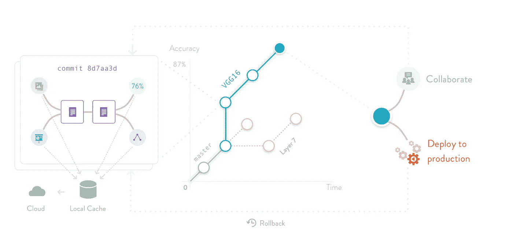

# 使用 DVC 和 GitHub 进行数据版本控制和机器学习过程控制

> 原文：<https://towardsdatascience.com/data-version-control-machine-learning-process-control-using-dvc-github-c629511e95b5?source=collection_archive---------33----------------------->



DVC workflow

即使我们今天在机器学习(ML)方面取得了所有的成功，特别是深度学习及其在商业中的应用，数据科学界仍然缺乏组织项目和跨各种 ML 项目有效协作的良好实践。

提高机器学习工作流的生产率是必要的。作为 K 集团诊断公司的一名数据科学家，我要处理数百千兆字节的数据。对于数据科学家来说，管理和跟踪数据确实非常困难。数据跟踪对于任何数据科学工作流都是必不可少的。对数据版本化的需求是极端的，因此数据版本控制(【https://dvc.org】)对于任何数据科学家来说都是非常重要的工具。对于您的数据科学项目来说，这是一个非常方便和有用的工具。主要原因是，

*   **DVC 跟踪 ML 模型和数据集:** DVC 旨在使 ML 模型可共享和可复制。
*   **ML 项目版本控制:**版本控制机器学习模型、数据集和中间文件。
*   **ML 实验管理:**利用 Git 分支的全部力量来尝试不同的想法，而不是代码中草率的文件后缀和注释。
*   **部署&协作:**使用推/拉命令将一致的 ML 模型、数据和代码束移动到生产、远程机器或同事的计算机中，而不是特定的脚本。

这里的主要优势是，我们可以使用亚马逊 AWS S3，微软 Azure 和其他数据/资源管理系统。我们可以配置这些系统来存储、读取、写入和快照数据。设置和使用非常简单，

1.  使用安装 DVC，(假设您已经准备好 python 环境)

```
pip install dvc
```

2.执行 DVC 初始化，(假设您在 Github 存储库中，如果不是，则执行)

```
git initdvc init
```

3.现在让我们假设我们的项目有“数据”文件夹，其中有各种数据目录(通过 AWS S3 连接和下载)

```
├── data   
│    ├── exp1
│       ├── x1.png
│       ├── y1.png
│    ├── exp2
│       ├── x2.png
│       ├── y2.png
│    └── exp3
│       ├── x3.png
│       ├── y3.png
│    └── exp4
│       ├── x4.png
│       ├── y4.png
```

第一次使用这些数据后，我们将执行以下步骤。

```
dvc add ./data/exp1 && git add ./data/exp1.dvcdvc add ./data/exp2 && git add ./data/exp2.dvcdvc add ./data/exp3 && git add ./data/exp3.dvcdvc add ./data/exp4 && git add ./data/exp4.dvc
```

这将创造。每个文件夹的 dvc 文件，该文件将被提交到 GitHub，这样我们就知道哪个版本的模型使用哪个版本的数据。

在这之后，如果我们使用远程数据存储，我们需要推动 dvc 变化，

```
dvc push filename 
```

该命令将推送最近的更改并将更新缓存，让我们来做，

```
dvc status
```

这将检查数据中的任何潜在变化，如果有的话，它将跟踪它，我们可以提交它。

DVC 让合作变得非常容易。合作者可以用同样的方式设置它，或者他们可以用“dvc pull filename”命令提取数据。

此过程还适用于包含比当前持久存储在数据文件夹中的数据多得多的数据版本，因为 dvc 在其缓存中存储不同版本之间任意大小的差异，因此可以通过其 checkout 命令重新创建数据目录的较旧或较新状态。当然，结账也可以是另一个方向。

关于命令的更多信息，请访问它们的文档[这里](https://dvc.org/doc)。

要将 DVC 与亚马逊 AWS S3 配合使用，请访问 https://dvc.org/doc/user-guide/external-dependencies

最好的总体亮点和特点是，

1.  它是 Git 兼容的！DVC 运行在任何 Git 存储库之上，兼容任何标准的 Git 服务器或提供商(GitHub、GitLab 等)。数据文件内容可以由网络可访问存储或任何支持的云解决方案共享。DVC 提供了分布式版本控制系统的所有优势——无锁、本地分支和版本控制。
2.  这是存储不可知论。你可以使用 S3、谷歌云和 Azure。
3.  它附带了度量跟踪，并包含一个命令来列出所有分支，以及度量值，以跟踪进度或选择最佳版本。
4.  与语言和框架无关
5.  为 ML 管道框架提供端到端支持。
6.  它可以跟踪故障！
7.  它也兼容 HDFS，蜂巢和阿帕奇火花。

所以试试吧，让你的生活变得轻松！点击[这里](https://dvc.org/doc/get-started)开始吧！作为一名数据科学家，我强烈推荐每个数据科学家在他们的 ML 管道中使用它。