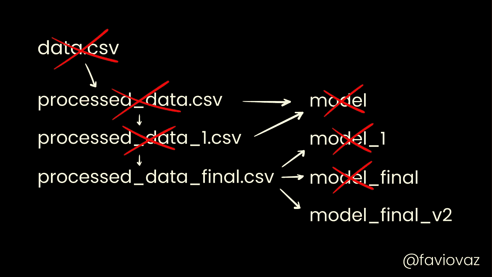

# 使用 DVC 进行数据版本控制。作者有什么要说的？

> 原文：<https://towardsdatascience.com/data-version-control-with-dvc-what-do-the-authors-have-to-say-3c3b10f27ee?source=collection_archive---------4----------------------->

## 数据版本化是数据科学项目中最被忽视的特性之一，但这必须改变。在这里，我将讨论一个最近的播客，它是为此目的的最佳工具的创造者之一， [DVC](https://dvc.org/) 。

If your data project looks like this, you have to read this article.

[数据操作](/data-science-with-optimus-part-2-setting-your-dataops-environment-248b0bd3bce3)在数据科学中非常重要，我认为数据科学家应该更加关注数据操作。这是数据科学项目中较少使用的功能。目前，我们通常对代码进行版本控制(用 Git 之类的东西)，越来越多的人和组织开始对他们的模型进行版本控制。但是数据呢？

在下一篇文章中，我将详细介绍如何将 Git 和 DVC 以及其他工具结合使用，对数据科学(和科学)项目中的几乎所有内容进行版本控制。

最近，DVC 项目创始人[德米特里·彼得罗夫](https://www.linkedin.com/in/dmitryleopetrov/)在播客上接受了托比亚斯·小萌的采访。__init__ 一个 Python 播客。在这篇博文中，我提供了一份采访的文字记录。你可能会对 DVC 背后的想法以及 Dmitry 如何看待数据科学和数据工程的未来感兴趣。

你可以在这里收听播客:

 [## 机器学习项目的版本控制

### 采访 DVC 的创造者，了解它如何提高协作并减少数据科学上的重复工作…

www.pythonpodcast.com](https://www.pythonpodcast.com/data-version-control-episode-206/) 

# TL；速度三角形定位法(dead reckoning)

> 我们需要更加注意如何组织我们的工作。我们需要更多地关注我们如何构建我们的项目，我们需要找到我们浪费时间而不是做实际工作的地方。作为一名数据科学家，变得更有组织性、更有生产力是非常重要的，因为今天，我们仍然处于蛮荒的西部。

# 文字记录

> **免责声明:这份文字记录是我听播客并写下我所听到的内容的结果。我用了一些软件来帮助我转录，但大部分工作是由我的耳朵和手来完成的，所以如果你能改进这个转录，请随时在下面留下评论:)**

## 托比亚斯:

你的主持人一如既往的托拜厄斯·梅西，今天我要采访德米特里·彼得罗夫关于 DVC，一个机器学习项目的开源版本控制系统。德米特里，你能从自我介绍开始吗？

## 德米特里:

当然可以。嗨，托拜厄斯。很高兴参加你的节目。我是德米特里·彼得罗夫。我有数据科学和软件工程的混合背景。大约 10 年前，我在学术界工作，有时我会说，我从事机器学习超过 10 年，但你可能知道，10 年前机器学习主要是线性回归和逻辑回归(笑)。这差不多就是我一直在做的。

后来转行做软件工程。我写一些生产代码。那时候数据科学还不是个东西。大约五年前，我转回定量领域。我成为了微软的数据科学家。我看到了现代数据科学的样子。最近，我，我实际上又回到了软件工程。今天我们在研究 DVC，我主要是为机器学习开发工具。

## 托比亚斯:

你还记得你是如何第一次接触 Python 的吗？

## 德米特里:

我想这发生在 2004 年。这是偶然发生的，我在我的硕士项目期间得到了一个实习机会，我参与了一个 Python 项目，这是我的第一个脚本语言。当然，至少在我的函数式编程课上我不算，它是由 Python 2.2 驱动的，然后我们切换到 2.3。

我花了许多不眠之夜调试 Python 2 中的 Unicode 问题(笑)，如果你使用 Python 2，你可能知道我在说什么。后来我发现自己在从事的每个研究项目中都在使用 Python。我们还在用 MATLAB 进行机器学习。10 年前，Python 非常流行，我们使用普通的 C 语言来表示低级软件，让我们想象一下，当驱动器跟踪一些信号时，但一般来说，Python 是我实验室的主要语言，当我作为软件工程师工作时，我的主要语言是 C++。所以，我仍然使用 Python 进行自动化的特别项目。

那时有很多关于 Python 和 Perl 的讨论，对我来说这不是一个问题。所以在我回归数据科学的过程中，我一直使用 Python。Python 成为我的主要语言，因为它是当今人们使用的顶级语言之一。我们为数据科学家构建工具，我们使用 Python。

## 托比亚斯:

你一直在做的一个工具是名为 DVC 或数据版本控制的项目，你能先解释一下它是什么以及这个项目是如何开始的吗？

## 德米特里:

DVC 它基本上是机器学习项目的版本控制系统，你可以认为 DVC 是一个命令行工具，它是 ML 的一种 Git，它给你什么。它给出了三个基本的东西。首先，它可以帮助您跟踪我们的大型数据文件，例如，10 GB 数据文件、100 GB 数据集、ML 模型，它还可以帮助您版本化管道、机器学习管道，这与数据工程管道不同。这是一个轻量级版本的管道，DVC 帮助你组织你的实验，并使它们自我描述，描述，自我记录，基本上，你知道，一切，一个模型是如何产生的，你需要运行什么样的命令，作为这个实验的结果产生了什么样的指标。

您将在 Git 历史中拥有所有这些信息。DVC 从技术角度帮助你浏览你的实验，我们使用 Git 作为基础。所以它 DVC 工作在 Git 和云存储之上。你可以使用 S3，你可以使用谷歌存储或 Azure，或者只是随机的 SSH，服务器你存储数据，DVC 基本上编排 Git 和云存储。

你还问，DVC 是如何开始的。这其实是另外一个故事。因为最初，当我们开始这个项目的时候，我们没有想到用 Git 来代替 ML。我们想的是数据科学经验，什么是最佳实践，我们受到数据科学平台想法的启发，你可能听说过米开朗基罗，优步的数据科学平台，你可能听说过多米诺数据实验室。

今天，实际上，每个大型技术公司都有自己的数据科学平台，因为他们需要以某种方式在大型团队中工作，对吗？他们需要合作。软件工程工具集对于 ML 项目或数据科学项目来说并不完美。但是当我们在看这个平台的时候，我们在想，未来的平台应该是什么样子，我们应该如何创建一个数据科学家可以使用的平台，这个平台可以被广泛采用，高度可用。我们提出了这个想法，未来数据集平台的原则。它必须是开源的，这是你可以像社区驱动一样的方式，这是你可以创建一个每个数据科学家都可以使用的公共场景的方式。

如果它必须是分布式的，这很重要，因为有时你在你的桌面上工作，因为你有 GPU，例如，有时你仍然需要你的笔记本电脑工作。有时你需要云资源来运行一个特定的模型，例如，你需要大量的内存。无处不在很重要。

根据这个原则，我们想出了这个主意，为什么我们不重用 Git 作为我们工具的数据科学平台的基础。然后我们意识到这非常接近版本化的想法，我们只需要版本数据集，我们需要版本实验。DVC 就是这样开始的。

## 托比亚斯:

你提到用于常规软件项目的传统版本控制系统对于机器学习来说是不够的，因为需要能够跟踪数据集以及代码本身和一些结果模型。那么你能不能介绍一下与 DVC 一起工作的整个工作流程，以及它与软件工程项目的常规 Git 工作流程有何不同，后者可能侧重于 Django 应用程序。

## 德米特里:

首先，我们需要了解软件工程和机器学习的区别是什么。机器学习是由实验驱动的，问题是，你有一堆实验，你有几千个，有时几百个实验，你需要和你的同事就实验进行交流。基本上是和自己，因为明天你就不记得今天发生了什么。在一个月内，你不可能记得你今天做了什么，以及为什么这个想法产生如此差的结果，你需要像在许多情况下一样跟踪每件事。你可能会遇到这样的情况:你的一个同事来到你的办公室，说——嘿，你知道吗？我花了两天时间尝试这个想法。你知道吗，这不管用。你会说，是的，我试过了，两周前我试过同样的想法。我知道，没用。很难交流这些想法，因为你只有几十个，有时几百个。这就是区别。你需要一个框架来交流大量的想法，大量的实验。

在软件工程中，工作流是不同的。您的 idea 功能请求和错误修复数量有限。我可以说一句有争议的话——在软件工程中，你几乎从来不会失败。如果你决定实现一些问题，实现一些特性，或者修复一个错误，你创建一个分支。十有八九，分支会被合并到主流。你可能会在你生产的软件的质量方面失败，你可能会在预算方面失败，因为你认为它就像一个一天的项目，而你最终花了两个星期来实现这个功能。但最后还是会合并。

在数据科学中，你尝试了 10 个想法，其中一个效果最好，其余的都没用。但是你仍然需要沟通所有这些。DVC 基本上帮助你做到这一点，它帮助你版本化你的实验，你的实验的度量，你看到产生的度量，你看到用于这个特定实验的代码，这个特定版本的数据集。

例如，这比 Excel 电子表格工作得更好。因为今天，许多团队只使用 Excel 电子表格来跟踪他们的实验。这就是自我记录实验的基本区别，清晰的合作实验方式，以及观察结果的方式。

数据版本化是一件独立的事情，对实验来说很重要，是实验的必备。有时人们使用 DVC 只是为了数据版本控制，通常，例如，在部署端工作的工程师，他们使用 DVC 来部署模型。有时他们，数据工程师，数据科学家使用 DVC 只是为了版本化数据集。有时人们用 DVC 代替 LFS，因为 LFS 有一些限制，而 DVC 是为几十或几百千兆字节优化的。

## 托比亚斯:

对于您正在进行的实验类型，我知道一些输入可以采用特征工程的形式，您可以尝试提取数据的不同属性，或者更改您正在调整的超参数，以尝试获得模型的特定输出。因此，您能否讨论一下 DVC 如何能够跟踪这些以及它所支持的一些通信范例，以确保您不会因为无法提前识别特定的功能集、超参数和数据输入都已一起尝试过，而与他人重复相同的工作，从而浪费时间和精力？

## 德米特里:

哦，从数据文件的角度和数据集的角度来看，DVC 只是跟踪他们。所以你的特点是，基本上 DVC 把每个文件都当作一个 blob，我们通常不涉及数据文件的语义和数据文件的结构。模特也一样。所以模型只是二进制的。DVC 能理解模型被改变了，它能理解二进制文件的这个特定版本是在这个特定步骤上产生的。这个特定的输入被消费了，但是它没有进入特性内部，没有进入数据的语义。

## 托比亚斯:

就整体沟通模式而言，当数据科学家在通过 DVC 管理的项目中工作时，他们会关注哪些事情，以确保他们不会重复这项工作，以及他们会识别的任何类型的信号，如果只使用 Git 本身，这些信号会丢失吗？

## 德米特里:

首先，实验的结构。这是数据科学中非常重要的，你需要知道。我的意思是，不仅仅是在数据科学领域。在工程案例中也是如此。您需要了解使用了哪种代码，您的代码的确切版本是什么，以及所使用的数据集的确切版本是什么。这就是你如何相信你三周前做的实验。

还有一点就是度量。如果您知道这一点，那么这个版本的数据集的代码会产生它所创建的信任度的特定值。如果您在 Excel 电子表格中看到这个结果，您不需要再次重做这项工作，它可能有一些差异，对吗？这可能是您流程中的一个错误。你可能会重复做同样的事情。

对于文档，您可以只使用 Git 提交。当您提交您的结果时，这意味着您提交了管道，您提交了您的数据集和输出结果的一个版本，您放置了一个消息。Git 中的消息，因为它是非常简单的文档形式。这其实是一个非常强大的。DVC 所做的基本上是为数据项目服务。因为在我们的常规工作流程中，您可以提交代码，但您与数据没有联系，您与您的输出指标没有明确的联系。有时你甚至没有与你的管道连接。因为该提交可能与一个特定的改变相关，所以将执行管道的一个特定部分，而不是整个管道。

## 托比亚斯:

至于您正在跟踪的指标，您能否谈一谈这些指标是如何获取的，以及它们在整个评估和实验周期中的一些考虑因素，以确保模型产生您期望的输出类型和整个项目？

## 德米特里:

DVC 是一个数字不可知的工具，也是框架不可知的。DVC:它也是度量不可知论者。这意味着我们以简单的文本文件形式来跟踪指标。您的指标是带有一些头文件的 TSV 文件，或者 CSV 文件或 JSON 文件。当你刚刚输出我们有一个五个指标的值，DVC 允许你查看你的整个实验，哪些指标是产生的，你可以发现这个想法，例如，哪个失败了，因为指标不完美，实际上产生了一个更好的另一个指标有一个好的方法。你可能需要深入研究这个实验。

所以它向你展示了你的分支，你的提交的度量，它基本上帮助你通过度量导航你复杂的 Git 结构树。这是一种数据驱动的方式来浏览您的 Git 存储库。在一个数据项目中，您可能有数千个提交，数十万个分支。DVC 基本上帮助你通过这个复杂的结构导航。这就是我们需要指标的原因，这就是 DVC，它特别支持指标。

## 托比亚斯:

是否有一个内置的支持来搜索这些指标值并跨分支进行比较？或者，你需要在每个项目的基础上，实现一个特定的函数调用，来决定，在不同的比较中，它是正值还是负值。

## 德米特里:

今天，我们基本上展示了这些指标。如果你需要导航，你需要正确地实现一些东西，但是如果我们实现一些逻辑指标特定的逻辑，例如，显示这个特定指标的最大值，我不会感到惊讶。告诉我这些指标组合的最大值，就像这样。

## 托比亚斯:

除了通常用于常规软件应用程序的版本控制。还有许多其他类型的工具有助于确保您正在构建的项目是健康的，并且您没有代码退化。所以类似于林挺或者单元测试支持的东西。我想知道，当你在构建机器学习项目时，应该考虑哪些相邻的问题？你和 DVC 的工作或者你的其他项目有什么联系吗？

## 德米特里:

这是个很好的问题。因为，一般来说，数据项目中的工具集与软件项目中工具集的状态不同。大概一个月前，在西麦肯锡的一次采访中。他说，在数据科学方面，我们仍然处于蛮荒的西部。这实际上是正在发生的事情(笑)，我们对许多场景没有很大的支持。

但从工具的角度来看，我今天看到的是，它在算法方面已经相当成熟了。因为我们有 PyTorch，我们有 TensorFlow，我们有一堆其他算法，比如基于随机树的算法。今天，有一场在线监控工具的竞赛。例如 TensorBoard，你可以在训练时在线报告你的指标，并查看现在训练阶段的实际情况。这对深度学习尤其重要，因为算法仍然很慢，我想说，它们是这个领域的一堆商业产品，而 MLflow 是开源项目之一，正变得越来越受欢迎，它可以帮助你跟踪你的指标并可视化训练过程。这是当今的一种趋势。

另一个趋势是如何可视化你的模型，如何理解你的模型里面有什么。同样，有很多工具可以做到这一点，但是这个工具的状态仍然不完美。就单元测试而言，你可以只使用常规的单元测试框架。但我不能说它对 ML 项目真的有效，具体来说，我多次看到的是单元测试或者可能不是单元，而是数据工程师的功能测试。在数据工程部分，当一组新的数据进入你的系统时，你可以获得基本的指标，并确保指标没有漂移，它们不是指标的大变化。这就是单元测试，或者至少是测试在数据世界中的工作方式。但是总体来说，工具仍然处于蛮荒的西部。

## 托比亚斯:

接下来是内置于 DVC 中的数据版本。当我通读文档时，它提到实际的数据文件本身存储在外部系统中，如 S3，或谷歌云存储或类似 NFS 的东西。因此，我想知道您是否可以谈谈 DVC 实际上是如何管理这些数据的不同版本以及它能够跟踪的任何类型的增量更改，或者您在构建该系统并将其与您使用的软件控制集成的过程中面临的任何困难或挑战，Git for in the overall project structure？

## 德米特里:

是的，当然，我们不会将数据提交到存储库(笑)，我们通常会将数据推送到您的服务器、您的云中，您可以重新配置数据以将其放入云中。如前所述，我们将数据视为二进制 blobs。对于每个特定的提交，我们可以为您带来实际的数据集，以及所有正在使用的数据工件。我们对每个文件不做任何区分，因为你需要理解文件的语义才能做区分，对，这不是区分。在 Git 中，让每个文件都与众不同是有意义的。

在数据科学中，你需要知道你使用的数据文件的确切格式。然而，我们将目录作为独立的结构类型来跟踪。如果您有一个包含 100.000 个文件的目录，然后您在目录中添加了几个文件并提交这是您数据集的新版本，那么我们知道只有一小部分文件发生了更改，比如说修改了 2000 个文件并添加了 1000 个文件，然后我们在 diff 上进行版本化，这样您就可以每周轻松地在数据库中添加标签，而不用担心目录的周期，我们会进行这种优化。

另一个优化，我们做的重要优化是优化您的工作空间。当 Git 从我们的内部结构中签出文件时，它会在您的工作空间中创建一个副本，但是在数据世界中，有时这是没有意义的，因为您不想创建 100 个副本，比如说千兆字节的数据，另一个副本。我们通过一些参考来优化这个过程。

所以你没有数据集的副本。因此，您可以轻松处理数百 GB 或数十 GB 的数据，而无需担心这个问题。

## 托比亚斯:

对于正在参与现有项目的人来说。他们只是第一次检查存储库的状态，是否有能力说我只想下载代码，我还没有准备好下载所有数据，或者我只是想下载数据的子集，因为正在处理数百 GB 数据集的人不一定希望在他们的笔记本电脑上安装所有这些数据，因为他们正在进行这些实验。我很好奇，当您在本地工作时，当您训练模型时，整个工作流是什么样子，它如何处理这些大型数据存储库并与之交互，以确保它不会完全填满您的本地磁盘。

## 德米特里:

这是一个好问题。我们做这种精细拉动，我们也优化这一点。作为一名数据科学家，你可以决定你到底需要什么。例如，如果您想要部署您的模型，它可能在 100 兆字节以内，您可能不需要为 100 GB 的数据集浪费时间，这是为了产生模型而使用的。

然后，您可以在数据文件上指定任何内容，比如用代码和元数据克隆一个新的存储库。然后说我只需要一个模型文件。所有的模型文件将被传送到你的生产系统到你的部署机器上，并且是相同的数据集。

## 托比亚斯:

我已经谈到了一些其他项目，人们正在构建它们，例如 Quilt 或 Pachyderm，它们内置了对数据版本的支持。我想知道您目前是否有任何与这些系统集成的计划，或者只是为 DVC 的数据存储部分增加额外支持所涉及的整个过程？

## 德米特里:

对于一些系统集成可以很容易地完成，例如，Pachyderm 这是一个项目，它主要是关于数据工程。他们对我们的管道有一个概念，有点像数据工程管道。DVC can 可用于数据工程流水线。它有 ML 管道的概念，一个轻量级的概念。它是专门为机器学习工程师优化的，它没有数据工程管道的所有这些复杂性，但它可以很容易地用作单步和工程管道。

我们已经多次看到，当人们采取，例如 DVC 管道，并把内部气流作为一个单一的步骤。有了这种设计，其实是一个很好的设计，因为你给了 ML 工程师和数据科学家一个轻量级的工具，所以他们很容易产生一个结果。他们可以更快地迭代以创造他们的工作。你有一个生产系统，DVC 可以很容易地注入其中。

有一个术语我不记得是哪个公司用的了。网飞，可能——甲板内甲板；这意味着你有一套数据管道，你有一套解决特定问题的 ML 平台，然后基本上在数据工程平台中注入许多 ML 平台。因此，从这个角度来看，没有集成的问题，没有集成到厚皮动物或气流或其他系统的问题。关于被子数据，他们做版本控制，他们也和 S3 一起工作，潜在地我们可以做我们可以和他们集成。我们正在思考这个问题，我们正努力做到以消费者为导向，以客户为导向。今天最大的需求可能是与 MLflow 的集成，因为 MLflow 在在线指标跟踪方面表现非常好。有时人们喜欢使用 MLflow 进行跟踪，在线跟踪指标，使用 DVC 对数据文件进行版本控制。这是我们今天正在思考的整合之一。

## 托比亚斯:

就 DVC 本身的实际实现而言，我知道它主要是用 Python 编写的。您提到，这在很大程度上是因为它正在成为数据科学家的通用语言。所以我想知道，现在你是否在 DVC 的整体实施和维护方面更进一步，如果你认为这仍然是正确的选择？如果你今天重新开始，在语言选择、系统设计或整个项目结构方面，你会做哪些不同的事情？

## 德米特里:

我认为 Python 是这类项目的好选择，有两个主要原因。第一，我们的目标是数据科学家，他们中的大多数人都熟悉 Python。我们期望数据科学家为我们的代码库做出贡献。如果你用 C 或 C++，或 Golang 编写这类项目，很可能你不会看到社区的很多贡献。因为社区讲不同的语言。对我们 for works 完美来说，数据科学家正在贡献代码，这很棒(笑)。

第二个原因是编程 API。之前，我们考虑通过 API 创建一个 DVC，这是使用 DVC 的另一种选择。如果你用 Python 写代码，它有点开箱即用，你可以重用 DVC 作为一个库，并将其注入到你的项目中。如果你将使用一种不同的语言，这只会产生一些开销，你需要考虑将这些转换成一种更好的形式。这些就是原因。到目前为止，我们是快乐的 Python，它工作得很好。

## 托比亚斯:

你提到能够使用 DVC 也是一个图书馆。所以我想知道是否有你见过的特别有趣或意想不到或新奇的用例，无论是在那个库用例中，还是在它最初设计的面向命令行的方式中？

## 德米特里:

有时候你们这些人会要求库支持，因为他们需要实现一些更疯狂的场景(笑)。例如，我可以说，人们使用 DVC 来构建自己的平台，如果你想要数据科学平台，他们希望构建持续集成框架，当 DVC 在你的本地经验和 CI 经验之间发挥所有这种粘合剂的作用时，他们要求库，但我们有一个如此棒的命令行支持命令行工具集，人们只需切换回命令行体验。但是有一天，如果有人将 DVC 仅仅作为一个图书馆，我不会感到惊讶。

## 托比亚斯:

我还对您谈到的将 DVC 集成到数据工程管道中的能力很感兴趣，因为只需包装一个实施步骤就可以运行模型培训部分。因此，我想知道您是否可以就此以及您所看到的一些具体实现多谈一点？

## 德米特里:

是啊，绝对的。这其实是一个很好的问题。我相信数据工程师需要管道，对吗？。数据科学家和机器学习工程师需要管道。但事实是，他们的需求完全不同。数据工程师确实关心稳定的系统，如果它失败了，系统需要做些什么，它必须恢复。这是数据工程框架的主要目标。

在数据科学中，情况正好相反。你总是失败(笑)。当你想出一些主意，你写代码运行一个失败的分数，你觉得它失败了，等等。你的目标是建立一个框架来快速检查想法，快速失败。这是 ML 工程师的目标。这是一个很好的实践来分离两个框架有两种管道框架。一个是稳定的工程，第二个是快速，轻量级的实验管道，如果你愿意的话。

当你把这两个世界分开时，你就大大简化了 ML 工程师的生活。他们不需要处理复杂的东西，我们不需要浪费时间去理解气流是如何工作的，Luigi 是如何工作的，他们只是生活在他们的世界里，制作模型，一旦模型准备好了，他们需要一种清晰的方式来将这条管道注入数据管道。为了做到这一点，您可以构建一个非常简单的工具。我记得当我在微软工作的时候，我花了大概几个小时来生产我的管道。因为我有一个独立的工作流程，所以我有一个独立的 ML 管道工具。这个很好用。我相信在这种未来的工程师中，我们需要把这两件事分开。

## 托比亚斯:

我还对 DVC 提供的部署功能感兴趣，只要它能够将模型投入生产，或者在产生错误输出的情况下恢复模型的状态，或者预测是它提供的结果给业务带来问题，或者只是在生产中运行机器学习模型所涉及的一些整体工具和工作流， 特别是度量跟踪，以了解模型何时需要重新训练，并完成构建和部署这些模型的整个过程。

## 德米特里:

是的，部署，我们正等着得到它，因为它接近业务。还有一个关于 ML 模型部署的小趣事。有时候是这样的——一个软件工程师和一个数据科学团队，我们能不能对我们的模型做更多的检查，不是对上一个模型，而是对上一周的模型？数据科学家喜欢——是的，当然，我们有数据集，你需要五个小时来重新训练它(笑)。

花五个小时是没有任何意义的，在软件工程工作世界中，它不是这样工作的。你需要准备好所有可用的东西。你需要马上复习，因为等五个小时意味着浪费做生意的钱。

DVC 基本上帮助你组织这个过程，它帮助，它基本上在你的产生一个模型的数据科学家和拿模型和部署模型的 ML 工程师之间创造一个共同的语言。因此，下一次，有了适当的数据管理，你甚至不会要求数据科学家给你一个以前的模型，你应该在你的系统中拥有 DVC 或 DVC 的一切，不管你需要什么，都是可用的工件。

从在线指标跟踪的角度来看，这实际上是一个独立的问题。因为当你在生产中谈论度量跟踪时，它通常意味着在线度量。这通常意味着基于用户反馈的指标。这是另外一个问题。所以 DVC 主要是关于部署或不部署，主要是关于开发阶段。它基本上不会对在线指标做任何事情。

## 托比亚斯:

所以你实际上是在 [iterative.ai](http://iterative.ai) 的主持下构建和维护这个项目，这实际上是一家风险投资支持的公司。所以我很好奇，对于你的投资者来说，总的价值等式是什么，使得他们值得为你构建和发布这个开源项目的努力提供资金。以及你对业务的总体战略。

## 德米特里:

你会惊讶(笑)投资者对今天的开源项目如此感兴趣，尤其是去年开源项目非常成功。去年，Mulesoft 被数百万或数十亿收购，对不起，去年弹性搜索上市。纯粹是开源公司。

而当你做开源的时候，通常意味着你在做 it 基础设施。在许多情况下，你做的是 IT 基础设施，它们有利于盈利。对于一个成功的开源项目，那些将开源项目货币化的公司，理解你的商业模式是非常重要的，因为开源有一些共同的模式。

一种是服务模式，一种咨询模式。第二件事是开放核心模式，当你构建软件，并为企业生产一个具有高级功能的软件，或一个不同版本的软件，作为产品。

第三个模型是生态系统。当你构建一个产品，一个开源产品，并创建服务作为一个独立的产品。一个例子可能是 Git 和 GitHub，当他们有开源和 SaaS 服务时，这是绝对不同的产品，是绝对不同的体验和用例。你需要明白你适合哪种模式。对于成功的项目是很多希望在这种企业感兴趣的这种经验。

最初，我开始了这个项目，因为它是我最喜欢的项目，持续了大约一年。然后我在想——如何把这件事做大，如何在这件事上花更多的时间，如何找到更多的资源来做这件事。很明显，这个项目如果成功，将会有一些企业在这个领域赚钱。我们为什么不做这个业务，它打造一个产品，把这个产品货币化。所以我会说，这是现代开源世界的自然之路。

## 托拜厄斯:

就构建和维护 DVC 项目和社区的整体经验而言，我想知道您在这个过程中发现了哪些最有趣、最具挑战性或最意想不到的经验教训。

## **德米特里:**

我学到的一课，实际上，我认为这是通常的商业课。所以当你建立你的项目时，你知道你做什么，你知道，你的路线图，你知道你的目标，你只是在建立，但有一天用户来找你。他们要了很多不同的东西。

然后你就有了紧张，你的愿景，你的计划和用户的需求之间的紧张。今天，我们每天都会收到用户的一些请求，所以我们每天有 10 个请求(笑)。平衡这些东西不容易。因为如果你按照人们的要求去做，你就没有时间制定你的路线图了。事实上，你没有时间去解决和实现人们要求的每一件事。所以你需要学会如何区分事情的轻重缓急。你需要学会怎么说，有时候对用户说不，说我们会这么做，但很可能不是现在。所以这并不容易做到。这是你在过程中需要学习的。正如我所说的，开源软件的体验和商业环境中的体验是一样的。我已经看过很多次了。

## **托拜厄斯:**

展望你为 DVC 计划的工作，我很好奇你在路线图上有什么类型的特性或改进。

## 德米特里:

在不久的将来，我们将发布对数据集版本化和 ML 模型版本化的更好支持。我们正在向 DVC 介绍新来者，这简化了你今天的体验。一些公司正在使用 mono-repos，里面有一堆数据集。我们需要新的命令来做得更好，有时是因为这些数据集以不同的速度发展。有时，您需要使用数据集一个版本，一个版本使用其他版本。所以基本上，这是我们正在采取的步骤之一。

数据集的另一个用例是交叉存储库引用。其他公司没有使用单一回购，而是使用一系列回购。例如，他们可能有 10、20 个数据集的回复，还有 20 多个模型的回复。他们需要交叉引用数据集，这是我们要实施的下一个命令，以支持这种交叉引用、跨存储库的情况。这是我们不远的将来。

从长远来看，下一步将是实现更多的特性来更好地支持实验，特别是当人们处理诸如超参数调整这样的场景时。他们需要做 1000 次实验。他们仍然需要控制他们。他们不想有 1000 个分支(笑)。这是我们需要改进的体验。我们对如何做到这一点有一个明确的计划。这差不多是未来半年的事了。最终，我们相信 DVC 可以成为这个平台，当人们可以在一个团队中在相同的环境下工作，并相互分享想法。在未来，我们相信我们可以创造体验，当人们可以分享想法，甚至在公司之间，团队之间，伟大的体验。

我相信这是 DVC 的美好未来。

## 托比亚斯:

你在 DVC 做的工作或机器学习项目的整体工作流程中，有没有其他方面是我们还没有讨论的？你认为我们应该在节目结束前讨论一下吗？

## 德米特里:

我不知道他们有什么要补充的。但是我相信，我们需要更加注意如何组织我们的工作。我们需要更多地关注如何构建我们的项目，当我们浪费时间而不是做实际工作时，我们需要找到更多的地方。作为一名数据科学家，这对于提高组织能力和工作效率非常重要，因为今天我们仍然处于蛮荒的西部，这需要尽快改变。注意这一点很重要，理解这个习题集也很重要。

## 托比亚斯:

好吧。好吧，对于任何想跟进你正在做的工作或者想取得联系的人，我会让你把你的首选联系信息添加到展示笔记中。因此，我将把我们带到图片中，本周，我将选择一个我最近开始使用和试验的工具，名为 otter.ai。

它被宣传为一种语音笔记服务，可以将你的会议笔记或你自己的记忆笔记转录到文本中，以便于搜索。我一直在尝试用它来为播客制作转录。所以我期待着开始更频繁地使用它，并开始录制节目。所以，如果你正在寻找一个能以合理的价格自动生成副本的工具，那绝对值得一试。就这样，我会把它传给你来认识你。你这周有照片吗？

## 德米特里:

所以我认为开源部分和开源与风险投资是我们将要讨论的问题。事实上，我没有什么特别的建议，但是今天天气很好。春天刚刚开始。所以只是花更多的时间在城市或城镇之外的地方走走。

## 托比亚斯:

好的，非常感谢你今天抽出时间和我一起讨论你在 DVC 做的工作，并为机器学习生命周期的整体项目开发添加一些更好的结构。所以谢谢你。我希望你今天过得愉快。

## 德米特里:

哦，谢谢你，托拜厄斯。谢谢你。

# 结论

[https://dvc.org/](https://dvc.org/)

我们需要测试和版本控制来理解我们在做什么。当我们编程时，我们一直在做很多不同的事情，我们在测试新的东西，尝试新的库等等，把事情搞砸并不罕见。这是数据科学的道路，快速失败，迭代成功。

DVC 是我们目前拥有的控制数据项目的最佳工具之一，正如你所看到的，它可以与其他伟大的工具相连接。我希望这篇采访和文章能帮助你开始使用它们。

如果您有任何问题，请在此写信给我:

 [## 法维奥·瓦兹奎-科学与数据公司创始人/首席数据科学家| LinkedIn

### 加入 LinkedIn ‼️‼️重要提示:由于 LinkedIn 技术限制，我现在只能接受连接请求…

www.linkedin.com](https://www.linkedin.com/in/faviovazquez/) 

祝学习愉快:)