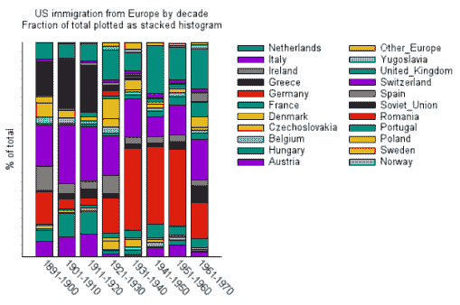
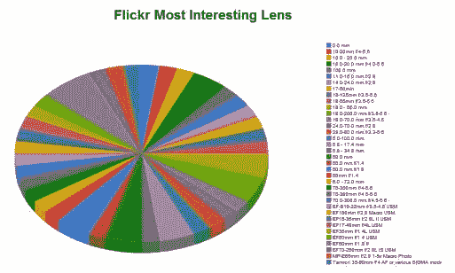
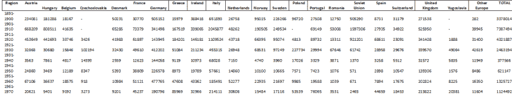

# 数据可视化 101:开发图表最重要的规则

> 原文：<https://towardsdatascience.com/data-visualization-101-the-most-important-rule-for-developing-a-graph-2f9a6cdeb8c5?source=collection_archive---------41----------------------->

## 记住图表是视觉句子

Photo by [kreatikar](https://pixabay.com/illustrations/statistics-graph-chart-data-3411473/)

我想每个人都见过糟糕的图表，一堆乱七八糟的条、线、饼状图，或者你害怕看到的东西。也许你已经做了一个，当你今天看着它，想知道你到底在想什么。

这些图表违反了数据可视化中最基本的图表制作规则:

这条规则适用于图表的所有用途，无论你是数据科学家、数据分析师、T2 统计学家，还是仅仅为了好玩给你的朋友制作图表。

在小学，你的语法老师可能会解释说，一个句子，最基本的，表达了思想或观点。图表是视觉句子:它们应该陈述一个且只有一个关于数据的想法或观点。

当你看一个图表时，你应该能够用一句话说出图表在说什么:比如“A 组比 B 组强”，或者“Y 开始有所提高，但现在正在下降。”如果你不能，那么你有自己的运行图。

Photo by [Linux Screenshots](https://www.flickr.com/photos/xmodulo/23635690633/) (CC BY 2.0)

例如，上面的图表试图表达太多的陈述:试图描述近一个世纪以来二十二个不同国家的移民模式。在这些数据中可能有有用的陈述，但是作为一个图表的表示阻止了观察者/读者能够容易地破译它们。

Photo from [Andrew Guyton](https://www.flickr.com/photos/disavian/4435971394/) (CC BY-SA 2.0)

同样，这张图显示了太多的镜头尺寸，无法有意义地表达一个单一的、连贯的想法，让读者/观众难以确定应该关注哪个领域。

# 潜在异议 1:但是我对数据有比一句话更多的话要说。

太好了！然后提供一个以上的图表。说出你需要说的关于数据的一切；为你的每一个陈述使用一个图表。

不要陷入*一张图统治一切的谬论*:试图用一张图来表达你对数据的所有陈述，结果却是一团看不懂的混乱。创建多个易读的图表，每个图表一次展示一个要点。将所有内容浓缩在一张图中只会让你的观众无法判断你到底要说什么。

Photo from [TymonOziemblewski](https://pixabay.com/illustrations/bar-chart-chart-statistics-1264756/)

Photo from [kreatikar](https://pixabay.com/illustrations/statistics-graph-chart-data-3411473/)

# 潜在异议#2:我希望观众自己解释这些发现，而不仅仅是传达我自己的想法/结论。

公平点。在展示/交流数据时，有一段时间可以展示你自己的见解，也有一段时间可以开放式地展示信息，让你的观众/读者自己去解读。对于前者，图表是工具，对于后者，使用表格。除了其他潜在用途之外，表格还为读者/查看者传达了广泛的信息，以便他们自己进行解释。

还记得上面第一个关于来自欧洲各地的美国移民的例子吗？表格(见下文)可以更容易地传达信息，并允许读者跟踪他们想了解的任何地方、模式或问题。您是否希望报告大量信息，以便读者可以为自己的目的所用？那么表格是比图表更好的起点。

Photo from [Michael Waskom](https://seaborn.pydata.org/tutorial/distributions.html)

有些情况下，我倾向于分享我的见解/分析，而其他情况下，我倾向于鼓励我的读者/观众形成他们自己的结论，但由于大多数情况下需要两者的结合，我通常会结合图表和表格。当我可以的时候，我试着在文档或幻灯片中放一些小的表格，当我不能的时候，在附录中放一些完整的表格。

# 潜在异议 3:我的主要观点有多个分点。

许多句子也有表达单一思想所需的多个要点，这并不妨碍句子结构有意义地捕捉这些思想。这种子点的奇特语法单词是*子句*。尽管有些句子简单明了，只有一个主语和谓语，但许多句子(就像这个句子)需要多组主语和谓语来表达思想。

同样，一些图形化的想法需要多个从属或复合的子点，有一些类型的图形允许这样做。考虑联合地块，如下图所示。为了充分展示两个变量之间的关系和组合分布，它们还在上方和右侧显示每个变量的单独分布。这样，观众可以看到两种分布如何影响组合分布。因此，它像一个从句一样在边上显示每个变量的分布。

Photo from [Michael Waskom](https://seaborn.pydata.org/tutorial/distributions.html)

这些都是需要制作的高级图表，因为就像多部分句子一样，你必须仔细地呈现分论点，以明确要点是什么。同样，多部分句子需要仔细考虑如何连贯地组织多个分句。我打算稍后写一篇文章，更详细地描述如何开发这些多部分图。

一般规则仍然适用于这些更复杂的图形:

如果不能，请不要使用/显示该图表。我们的大脑非常善于凭直觉判断一个句子是否承载一个思想，所以用这个来判断你的图是否有效。

*原文发布于此:*[https://ethno-data . com/data-visualization-graphing-making-no1-rule/](https://ethno-data.com/data-visualization-graphing-making-no1-rule/)*。关于该网站和其他文章的更多信息，请访问*[https://ethno-data.com/](https://ethno-data.com/)*。*

*也感谢《数据科学》杂志发表这篇文章。更多关于他们工作的细节，请看***。**