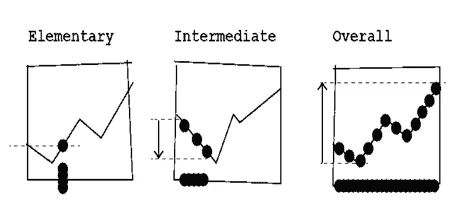
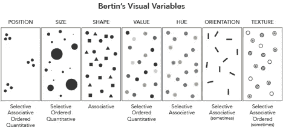
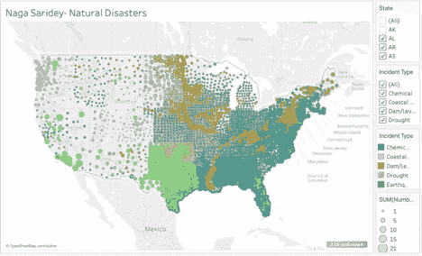
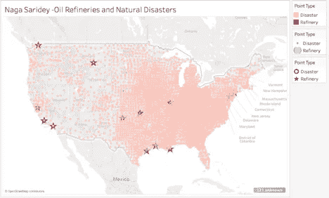
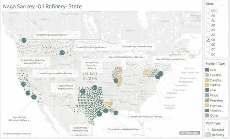
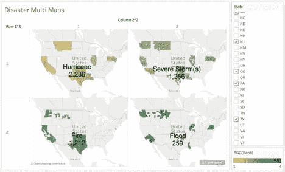

# 数据可视化:人类认知的催化剂

> 原文：<https://towardsdatascience.com/data-visualization-a-catalyst-to-human-cognition-4c851e8f7b2?source=collection_archive---------32----------------------->

## 理解可视化和叙事可视化的基础如何帮助模式识别和决策的概念交响乐

数据可视化从一开始就存在了。从描绘原始生活方式的洞穴绘画，到查尔斯·密纳德关于拿破仑进军的信息图，可视化已经被用来传达抽象的思想和历史时代，并将它们转化为有形和可行的概念。这是一个整合的过程，它有局限性，只有当我们的眼睛能够解码它，我们的大脑能够理解它时，它才是有用的。那么，到底是什么让人类的思维立即与所呈现的洞察力联系起来呢？

数据可视化是外部认知的一种形式——帮助内部认知做得更好，并推动它看到模式。大脑喜欢模式，因为它是在呈现的信息中“看见”关系。所以，当 Jacques Bertin 第一次提出图形编码或者我们现在所知道的数据可视化的想法时，他恰当地说它是“传达意义的符号系统”。他们努力帮助交流，并使用八个视觉编码变量跳过三个层次的信息。

这三个级别的信息是:

1.基本信息—了解单个数据点

2.中间信息—了解一组数据点

3.总体信息——着眼于更大的图景，您可以结合起来形成所有数据点的模式

Three levels of information processing

理解并能够通过这些级别的信息操纵数据包括调整流程。在初级和中级之间过渡的情况下，可以使用处理例程。应用处理程序是你能够处理和理解初级信息的地方，通过识别一个接一个呈现给你的所有信息并在此基础上建立，从而打开中级信息。在此之后，可以通过使用下面提到的视觉编码的 8 个变量来形成数据可视化。这使人们能够回答通过视觉分析过程提出的问题，在视觉分析过程中，人们可以识别问题或目标，然后相应地构造数据以处理它并在不破坏的情况下简化它。这个过程使用了信息的力量和 Bertin 视觉编码的八个变量，为出于交流目的对数据进行恰当的认知处理创造了条件。

Bertin 的视觉编码的八个变量是:

1.转换为位置的 x 和 Y (2 个变量)

2.大小

3.价值

4.纹理

5.颜色/色调

6.方向

7.形状

The 8 visual variables. Size and Value translate to Z variables. [image:https://www.axismaps.com/guide/general/visual-variables/]

因此，当一个人可以处理这些以创建可视化而不破坏数据和模式时，它导致理想认知条件的安排，其中大脑致力于决策和/或识别图像内的关系。

让我们从数据中辨别一些模式，以理解如何回答“哪些灾难可能会影响全国各地的康菲炼油厂？”这将有助于我们了解人类思维如何在这种外部认知工具的帮助下处理数据。

首先，必须处理原始数据以消除异常和空值，这样才能创建一个可行的数据文件来处理信息，而不会产生异常值。在这里，我可以用美国各地的灾难数据集来做这件事。然后，我使用 Tableau 这款出色的可视化工具创建了一张地图，您可以在地图上以点的形式看到不同的灾难——这种级别的信息几乎是以自上而下的方式处理的，您可以看到所有灾难的全貌，并且在定义中可以包括炼油厂所在的所有位置以及哪些灾难可能会影响它们。看看我在下面创建的可视化。你将能够看到我在可视化中使用了位置、大小以及色调/颜色的变量。

Points depicting disasters around the United States using color and size

这些价值观在美国大陆上被表现出来，以呈现一个叙事过程的开端，在这个过程中，你将故事设定在哪里，故事在哪里发生。在此之后，我进一步处理可视化，以打开与我的问题的细节相关的信息。我介绍了康菲石油公司在美国各地的炼油厂的位置，同时在某种意义上用灰色显示不同的灾难，以吸引观众对炼油厂位置(x，y)的注意。这有助于视觉化的过程，让人类的思维一次专注于一条信息，创造一个焦点。

Bringing the focus to Conoco-Phillips refinery locations surrounding the disaster data

现在，我将把认知集中在这些炼油厂所在的州，我还将添加它们周围的数据集中的灾难。这要求我使用位置、大小、颜色/色调的变量，同时也标记精炼厂，通过使用 Tableau 中给出的工具提示属性来帮助观众记住精确的位置。

States, disaster types, and refinery locations

最后，在叙事可视化过程中，必须有一个冲突的解决方案。因此，当我们第一次打电话来定义目标/问题时，我们现在将通过我们已经采取的步骤来回答这个问题。通过我展示的图像，我试图回答哪些灾难可能会影响康菲炼油厂的问题。完成上述步骤后，我又采取了一个额外的步骤，根据这些灾难在这些州发生的频率对它们进行排序。这是通过使用 Tableau 计算字段实现的。结果并不令人惊讶，但在叙事可视化过程中，随着信息水平的使用和 Bertin 的八个编码变量-它要求采取解决方案的席位。我制定了一个更容易被大脑整理和分析的决议。使用颜色/色调，这种多地图可视化的外部认知辅助启动了内部认知过程。它允许大脑以图像的形式理解科学和数据。下面是贯穿整篇文章的冲突解决方案。

Prominent disasters surrounding Conoco-Phillips refineries, ranked.

有了这个，认知过程立即识别出哪些灾难正在影响康菲炼油厂所在的州。它认识到了我们从视觉化一开始就一直试图辨别的模式。因此，正如谚语所说，“一张图片胜过千言万语”，这个创建和分解可视化以回答一个中心问题的过程实际上相当于一千个数据点！

总之，通过视觉分析过程和叙事视觉分析，人们可以很容易地发现，三个层次的信息和视觉编码的八个变量共同构成了任何数据可视化的基础。他们本质上是必要的和复杂的，他们互相利用以给出更大的图景。它们是启动我们头盖骨内无限和不可量化器官的内部认知过程的火花塞。在一个技术处于知识和想象力前沿的世界里——创造了理想的混沌形式，这些数据可视化对人类思维具有特殊的重要性。他们就像一个超级英雄，通过组织和处理模式来拯救世界。你看，大脑喜欢模式，反过来也喜欢视觉化。所以，想象一下，当一个嵌入模式的外部信息帮助我们更容易地做出决策时，人类认知的兴奋程度。这就像带一个小孩去糖果店，但在这种情况下，糖果是统计数据表示，以创建不同类型的可视化。最棒的是。它们都服务于人类思维的一个共同目的——它们交流不可交流的事物，并且从时间开始就一直在这样做。

参考资料:

雅克·贝尔坦。*图形和图形信息处理*。w·德·格鲁埃特，1981 年。