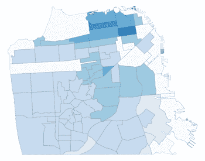

# 数据可视化—高级散景技术

> 原文：<https://towardsdatascience.com/data-visualization-advanced-bokeh-techniques-e33f92537415?source=collection_archive---------18----------------------->



## 散景交互式地图、数据表、文本输入和文档布局

如果你想创建强大的数据可视化，那么你应该考虑使用散景。在之前的文章“如何使用 Python 和散景创建交互式地理地图”中，我演示了如何使用散景创建交互式地理地图。本文将更进一步，演示如何使用交互式地图以及使用散景布局组织的数据表和文本字段来创建用于显示数据的交互式仪表板。

首先，让我们来看看文章《T2》中的成品:小心 Zillow，Jestimate 来了！”:

[点击这里观看三藩市 2018 Jestimates！](https://sf-2018-sales.herokuapp.com/SF_2018_Sales)

**关于代码的一句话**

该项目的所有代码、数据和相关文件都可以在 my [GitHub](https://github.com/JimKing100/Jestimate_Live) 访问。该项目分为两个 Colab 笔记本。一个运行线性回归模型(为可视化创建数据)，另一个使用 Heroku 上的 Bokeh 服务器生成交互式可视化。

**安装并导入**

让我们从图表所需的安装和导入开始。Pandas、numpy 和 math 是用于清理和争论数据的标准 Python 库。geopandas、json 和 bokeh 导入是映射所需的库。

我在 Colab 工作，需要安装 fiona 和 geopandas。当您在 Colab 中开发应用程序时，您需要将这些安装保存在代码中。然而，一旦你开始用散景服务器测试，你将需要注释掉这些安装，因为散景不能很好地与魔术命令(！idspnonenote)一起工作。pip 安装)。

```
# Install fiona - need to comment out for transfer to live site.
# Turn on for running in a notebook
%%capture
!pip install fiona

# Install geopandas - need to comment out for tranfer to live site.
# Turn on for running in a notebook
%%capture
!pip install geopandas# Import libraries
import pandas as pd
import numpy as np
import math

import geopandas
import json

from bokeh.io import output_notebook, show, output_file
from bokeh.plotting import figure
from bokeh.models import GeoJSONDataSource, LinearColorMapper, ColorBar, NumeralTickFormatter
from bokeh.palettes import brewer

from bokeh.io.doc import curdoc
from bokeh.models import Slider, HoverTool, Select, TapTool, CustomJS, ColumnDataSource, TableColumn, DataTable, CDSView, GroupFilter
from bokeh.layouts import widgetbox, row, column, gridplot
from bokeh.models.widgets import TextInput
```

**初步代码**

由于本文的重点是交互式仪表板的创建，我将跳过以下步骤，这些步骤在我的上一篇文章“[如何使用 Python 和 Bokeh 创建交互式地理地图”](/how-to-create-an-interactive-geographic-map-using-python-and-bokeh-12981ca0b567)中有详细介绍。

1.  准备制图数据和地理数据框 geopandas.read _ file()
2.  创建颜色条查找表— format_df 数据帧
3.  为 GeoJSONDataSource-JSON _ Data 函数创建 JSON 数据
4.  创建绘图函数— make_plot 函数
5.  颜色栏-颜色栏，make_plot 函数的一部分
6.  悬停工具—悬停工具

**数据加载、清理和争论**

我将简要讨论应用程序中使用的数据，如果你有兴趣，可以查看完整的清洗和争论[这里](https://github.com/JimKing100/Jestimate_Live/blob/master/Final_SF_Map_Code.ipynb)。

应用程序中使用了两个数据框架:用于显示每个街区 2018 年总统计数据的街区数据，以及由我的文章“[中的线性回归代码生成的 2018 年销售的每个单独房产的显示数据。](https://medium.com/p/look-out-zillow-here-comes-jestimate-145a96efbfbb?source=email-607257182a94--writer.postDistributed&sk=c7ba752420820a3ef1b8b7cabf535b47)

**邻域 _ 数据数据帧**


neighborhood_data DataFrame

**显示 _ 数据数据帧**


display_data DataFrame

**应用程序的主要代码**

让我们看一下应用程序的主要代码，然后一步一步地详细介绍。

```
### Start of Main Program

# Input geojson source that contains features for plotting for:
# initial year 2018 and initial criteria sale_price_median
geosource = GeoJSONDataSource(geojson = json_data(2018))
original_geosource = geosource
input_field = 'sale_price_mean'

# Initialize the datatable - set datatable source, set intial neighborhood, set initial view by neighborhhood, set columns
source = ColumnDataSource(results_data)
hood = 'Bernal Heights'
subdist = '9a'
view1 = CDSView(source=source, filters=[GroupFilter(column_name='subdist_no', group=subdist)])
columns = [TableColumn(field = 'full_address', title = 'Address')]

# Define a sequential multi-hue color palette.
palette = brewer['Blues'][8]

# Reverse color order so that dark blue is highest obesity.
palette = palette[::-1]

#Add hover tool to view neighborhood stats
hover = HoverTool(tooltips = [ ('Neighborhood','@neighborhood_name'),
                               ('# Sales', '@sale_price_count'),
                               ('Average Price', '$@sale_price_mean{,}'),
                               ('Median Price', '$@sale_price_median{,}'),
                               ('Average SF', '@sf_mean{,}'),
                               ('Price/SF ', '$@price_sf_mean{,}'),
                               ('Income Needed', '$@min_income{,}')])

# Add tap tool to select neighborhood on map
tap = TapTool()

# Call the plotting function
p = make_plot(input_field)

# Load the datatable, neighborhood, address, actual price, predicted price and difference for display
data_table = DataTable(source = source, view = view1, columns = columns, width = 280, height = 280, editable = False)
tap_neighborhood = TextInput(value = hood, title = 'Neighborhood')
table_address = TextInput(value = '', title = 'Address')
table_actual = TextInput(value = '', title = 'Actual Sale Price')
table_predicted = TextInput(value = '', title = 'Predicted Sale Price')
table_diff = TextInput(value = '', title = 'Difference')
table_percent = TextInput(value = '', title = 'Error Percentage')
table_shap = TextInput(value = '', title = 'Impact Features (SHAP Values)')

# On change of source (datatable selection by mouse-click) fill the line items with values by property address
source.selected.on_change('indices', function_source)

# On change of geosource (neighborhood selection by mouse-click) fill the datatable with nieghborhood sales
geosource.selected.on_change('indices', function_geosource)

# Layout the components with the plot in row postion (0) and the other components in a column in row position (1)
layout = row(column(p, table_shap), column(tap_neighborhood, data_table, table_address,
              table_actual, table_predicted, table_diff, table_percent))

# Add the layout to the current document
curdoc().add_root(layout)

# Use the following code to test in a notebook
# Interactive features will not show in notebook
#output_notebook()
#show(p)
```

**步骤 1 —初始化数据**

散景提供了几种处理数据的方法。在典型的散景交互式图形中，数据源是 ColumnDataSource。这是散景中的一个关键概念。然而，当使用地图时，我们使用 GeoJSONDataSource。我们将同时使用两者！

```
# Input geojson source that contains features for plotting for:
# initial year 2018 and initial criteria sale_price_median
geosource = GeoJSONDataSource(geojson = json_data(2018))
original_geosource = geosource
input_field = 'sale_price_mean'

# Initialize the datatable - set datatable source, set intial neighborhood, set initial view by neighborhhood, set columns
source = ColumnDataSource(results_data)
hood = 'Bernal Heights'
subdist = '9a'
view1 = CDSView(source=source, filters=[GroupFilter(column_name='subdist_no', group=subdist)])
columns = [TableColumn(field = 'full_address', title = 'Address')]
```

我们将希望加载的数据年份(2018)传递给 json_data 函数。然后，json_data 函数从 **neighborhood_data** 中提取所选年份的数据，并将其与映射数据合并，为散景服务器返回转换为 json 格式的合并文件。我们的 GeoJSONDataSource 是 geosource。initial_field 用 sale_price_mean 初始化。

我们的 ColumnDataSource，Source，用 **results_data** 初始化，列数据源视图(CDSView)，view1，用 Bernal Heights 邻域(subdist=9a)初始化。CDSView 是一种过滤数据的方法，允许您显示数据的子集，在本例中是 Bernal Heights 邻域。datatable 的列被初始化以显示属性的完整地址。

**步骤 2——初始化颜色条、工具和地图绘制**

```
# Define a sequential multi-hue color palette.
palette = brewer['Blues'][8]

# Reverse color order so that dark blue is highest obesity.
palette = palette[::-1]

#Add hover tool to view neighborhood stats
hover = HoverTool(tooltips = [ ('Neighborhood','@neighborhood_name'),
                               ('# Sales', '@sale_price_count'),
                               ('Average Price', '$@sale_price_mean{,}'),
                               ('Median Price', '$@sale_price_median{,}'),
                               ('Average SF', '@sf_mean{,}'),
                               ('Price/SF ', '$@price_sf_mean{,}'),
                               ('Income Needed', '$@min_income{,}')])

# Add tap tool to select neighborhood on map
tap = TapTool()

# Call the plotting function
p = make_plot(input_field)
```

ColorBar 调色板、HoverTool 和 TapTool 被初始化，并且调用 make_plot 函数来创建显示中间价格邻域热图的初始地图图。

**步骤 3——用初始数据填充数据表和文本字段**

```
# Load the datatable, neighborhood, address, actual price, predicted price and difference for display
data_table = DataTable(source = source, view = view1, columns = columns, width = 280, height = 280, editable = False)
tap_neighborhood = TextInput(value = hood, title = 'Neighborhood')
table_address = TextInput(value = '', title = 'Address')
table_actual = TextInput(value = '', title = 'Actual Sale Price')
table_predicted = TextInput(value = '', title = 'Predicted Sale Price')
table_diff = TextInput(value = '', title = 'Difference')
table_percent = TextInput(value = '', title = 'Error Percentage')
table_shap = TextInput(value = '', title = 'Impact Features (SHAP Values)')
```

使用源(从 results_data 填充的 ColumnDataSource)、视图(针对 Bernal Heights 过滤的 view1)和列(仅使用 full_address 列的列)填充 datatable。Bokeh 中的 TextInput 小部件通常用于从用户那里收集数据，但也可以很好地显示数据！所有的 TextInput 小部件都用空格初始化。

**第四步——回调函数**

这是交互性发挥作用的关键功能。散景小部件使用事件处理程序基于回调原理工作。on_change 或。on_click —提供自定义交互功能。然后，这些事件处理程序调用表单函数(attr，old，new)中的自定义回调函数，其中 attr 是指已更改属性的名称，old 和 new 是指属性的以前值和更新值。

```
# On change of source (datatable selection by mouse-click) fill the line items with values by property address
source.selected.on_change('indices', function_source)
```

对于数据表来说，这很容易，只需使用 source 的**selected . on _ change**event _ handler，并在用户单击数据表中的一行时调用函数 **function_source** ，将该行的索引传递给它。然后，根据从数据表中选择的索引，从源(results_data)更新 TextInput 值。

```
def function_source(attr, old, new):
    try:
        selected_index = source.selected.indices[0]
        table_address.value = str(source.data['full_address'][selected_index])
        table_actual.value = '${:,}'.format((source.data['sale_price'][selected_index]))
        table_predicted.value = '${:,}'.format((source.data['prediction'][selected_index]))
        table_diff.value = '${:,}'.format(source.data['difference'][selected_index])
        table_percent.value = '{0:.0%}'.format((source.data['pred_percent'][selected_index]))
        table_shap.value = source.data['shap'][selected_index]

    except IndexError:
        pass
```

对于地图，我希望能够单击一个街区，并根据所选的街区填充数据表。奇怪的是，没有内置。HoverTool 的 on_click 事件处理程序。很明显，HoverTool 知道它在哪个街区盘旋，所以我自己建了一个！

我意识到有一个 TapTool，在用地图测试后，我发现它是一个选择工具。换句话说，当您在地图上的多边形上单击鼠标时，它实际上使用邻域 id 作为索引来选择多边形！这也会触发。geosource 中的 on_change 事件处理程序。因此，使用与数据表相同的基本方法:

```
# On change of geosource (neighborhood selection by mouse-click) fill the datatable with nieghborhood sales
geosource.selected.on_change('indices', function_geosource)
```

对于地图，使用 geosource 的**selected . on _ change**event _ handler，并在用户单击某个邻域时调用函数 **function_geosource** ，向其传递该邻域的索引。基于新的索引(邻域 id/subdistr_no)，将 CDSView 重置为新的邻域，用视图中的新数据重新填充 datatable，并将 TextInput 值设置为空。

```
# On change of geosource (neighborhood selection by mouse-click) fill the datatable with nieghborhood sales     
def function_geosource(attr, old, new):
    try:
        selected_index = geosource.selected.indices[0]
        tap_neighborhood.value = sf.iloc[selected_index]['neighborhood_name'] 
        subdist = sf.iloc[selected_index]['subdist_no']
        hood = tap_neighborhood.value

        view1 = CDSView(source=source, filters=[GroupFilter(column_name='subdist_no', group=subdist)])
        columns = [TableColumn(field = 'full_address', title = 'Address')]

        data_table = DataTable(source = source, view = view1, columns = columns, width = 280, height = 280, editable = False)
        table_address.value = ''
        table_actual.value = ''
        table_predicted.value = ''
        table_diff.value = ''
        table_percent.value = ''
        table_shap.value = ''

        # Replace the updated datatable in the layout
        layout.children[1] = column(tap_neighborhood, data_table, table_address, table_actual, table_predicted,
                                    table_diff, table_percent)

    except IndexError:
        pass
```

**步骤 5 —布局和文件**

散景提供了几个布局选项来安排地块和部件。布局的三个核心对象是 row()、column()和 widgetbox()。这有助于将屏幕想象成一个由行、列组成的网格。widgetbox 是小部件的容器。在应用程序中，组件在一行中排列成两列:

1.  第一列-包含绘图 p(地图)和文本输入微件 table _ shap(Shapley 值)。
2.  第二列—包含数据表 tap_neighborhood 和其余的 TextInput 小部件。

```
# Layout the components with the plot in row postion (0) and the other components in a column in row position (1)
layout = row(column(p, table_shap), column(tap_neighborhood, data_table, table_address,
              table_actual, table_predicted, table_diff, table_percent))

# Add the layout to the current document
curdoc().add_root(layout)
```

然后，该布局被添加到文档中进行显示。

我欢迎建设性的批评和反馈，请随时给我发私信。

在推特上关注我

这篇文章最初出现在我的 [GitHub 页面](https://jimking100.github.io/2019-10-22-Post-5/)网站上

*这是探索三藩市房地产数据系列文章的一部分*

*旧金山房地产数据来源:旧金山 MLS，2009–2018 年数据*