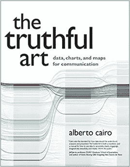
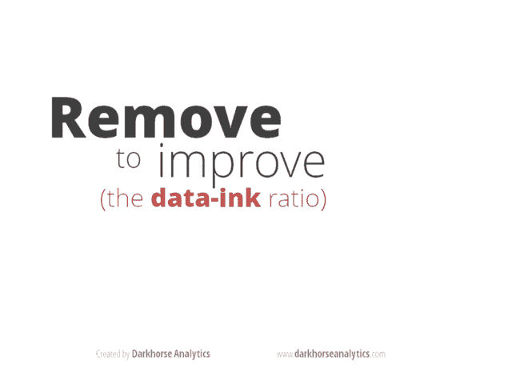

# 数据可视化和真实性艺术

> 原文：<https://towardsdatascience.com/data-visualization-and-truthful-art-324b13a2ad34?source=collection_archive---------21----------------------->

## 阿尔贝托·开罗的《真实的艺术》是一本关于数据可视化的极好的书，我怎么推荐都不为过。

在*的真实艺术*中，Cairo 解释了良好数据可视化的原则。何描述了当你使用数据可视化时，应该作为你基础的五个品质:真实、实用、漂亮、有洞察力和启发性。Cairo 也给出了一些有偏见和不诚实的可视化的例子。

# 数据-油墨比

在我深入探讨“伟大可视化的五个品质”之前，我想介绍另一个相关的概念:数据-墨水比率，由爱德华·塔夫特在*定量信息的可视化展示*中引入。

Tufte 将数据油墨比定义为数据油墨量除以打印图形所需的总油墨量。现在，我不认为他要求我们测量纸上的墨水量。相反，Tufte 建议我们删除那些不会给图形添加新信息的元素。

也许最著名的减少数据墨水的例子之一是由加拿大艾伯塔省埃德蒙顿的一家信息、可视化和设计公司 Darkhorse Analytics 创造的。Darkhorse 收集了四个如何提高数据-墨水比的例子。他们的主要概念是“裸露的数据看起来更好”和“移除以改善”

黑马的这个动画非常具有说明性:

# 伟大可视化的五个品质

根据开罗的说法，这五种品质并不是相互独立的。所有不同的品质都是相互关联的，它们与所有其他的品质相互作用。

## 真实的

我们需要倡导真实的数据。基于数据分析的真相可能是主观的。但作为数据科学家，我们应该尽最大努力保护真相。这些方法帮助你达到真实:

*   首先，当你清理和总结数据时，要对自己诚实。仔细考虑你对原始数据所做的每一个修改。你遮住了什么吗？实践开罗所说的“自我欺骗”——理解你自己头脑中的诡计。对数据科学家来说，质疑自己的能力至关重要。我们可以如此专注于寻找模式，以至于我们以与所描述的现象不真实的方式减少或呈现数据。
*   第二，记住你的义务是对观众的。使用行业公认的数据科学和信息可视化技术来揭示特定的数据。通过批准的流程和系统从数据中获得答案是数据科学的定义。让您的数据可视化适应您的受众，而不是相反。并考虑观众的阅读能力和理解水平。

## 功能的

考虑你的视觉化是否有用。数据-墨迹比有助于增加可视化的功能。我将在另一篇文章中讨论这个问题。有很多增加功能的试探法，比如用户测试。

## 美丽的

这听起来可能有点奇怪，但是美观对数据可视化很重要。要达到美，你需要了解你的受众。“情人眼里出西施”是一个常见但准确的表达。对美的不同理解是基于人们的生活经历和其他方面，如性别和文化。对于任何数据科学家来说，创建一个被观众认为漂亮的可视化效果都是一项伟大的成就。

## 富有洞察力的

好的可视化不仅仅是从表格或文件中复制数据。它以可视化格式显示相关数据，揭示趋势或关系。当洞察力被成功可视化时，观众会“啊哈！”瞬间。

数据科学写作新手的一个常见做法是为他们拥有的每一份数据都附上一张图表。过多的信息是不必要的，会导致读者疲劳。正确的数字能很快说明研究的结果。

## 有启发作用的

虽然听起来差不多，但是启发和有见地是不同的概念。Cairo 说这种品质是由前面四种品质组成的:真实、实用、美丽和有洞察力。启蒙意味着每一个重要的组成部分都被成功地结合起来，产生一个新的有价值的启示。

# 社会责任呢？

Cairo 还提出了一个问题，即社会责任是否是伦理数据可视化中需要考虑的一个方面。这个问题没有明显的答案。谁能判断对特定科学知识的压制或选择性释放是有害的还是有帮助的？

# 创造意义，而不是欺骗

最重要的是，要有意图创造有意义的视觉效果，识别欺骗和不道德的工作。数据科学家负责以适合其技能和目的的方式，将正确的信息呈现给正确的受众。毫无疑问，应用 Cairo 的五大可视化品质将有助于产生具有事实和相关价值的数据可视化。

# 参考

*   阿尔贝托·开罗,《真实的艺术:用于交流的数据、图表和地图》
*   黑马分析博客，2018 年 7 月。