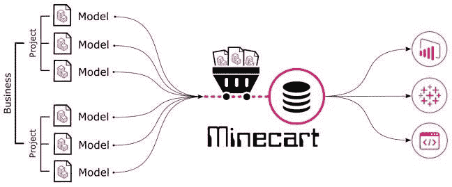
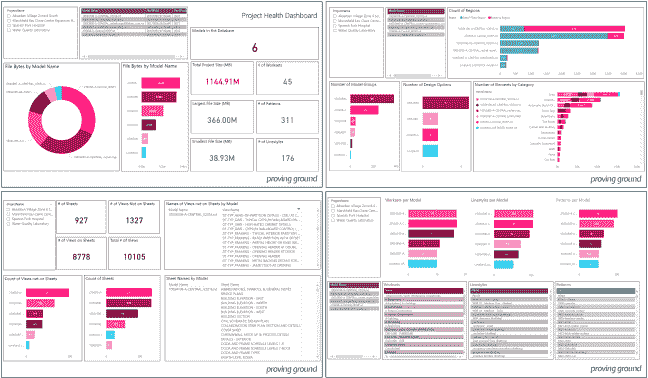
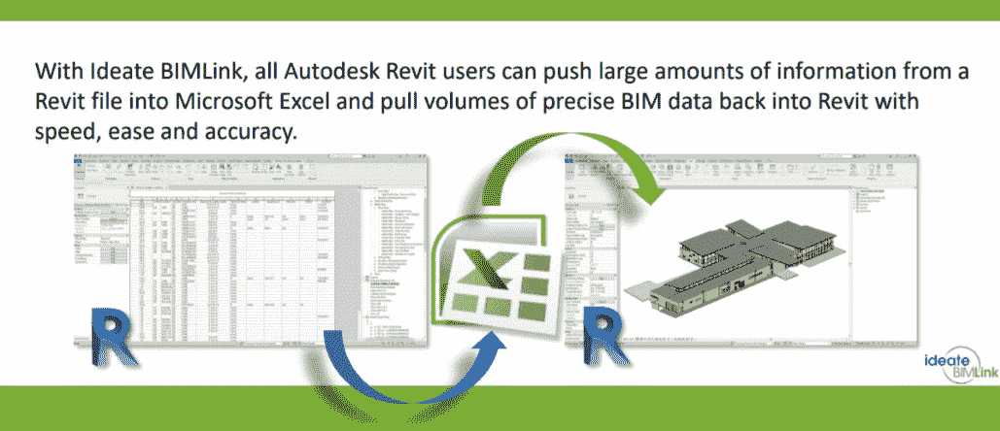
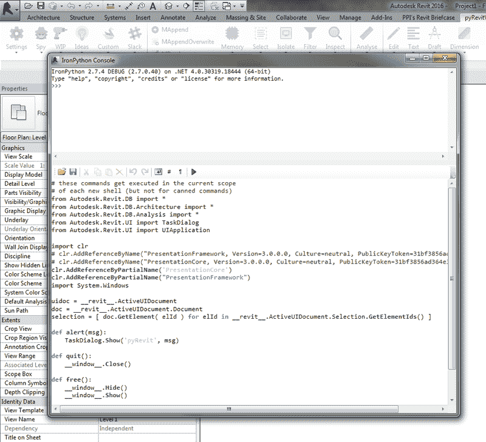
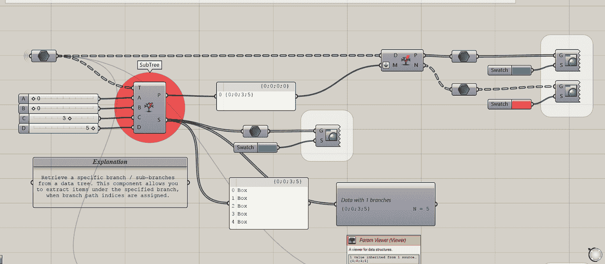
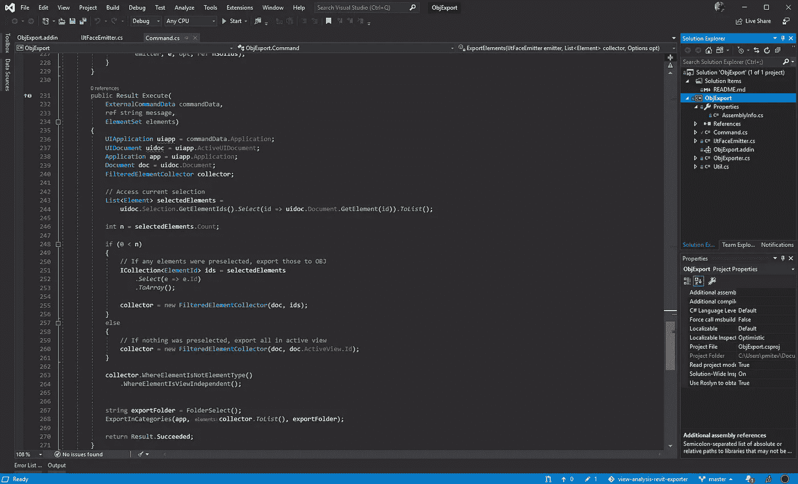
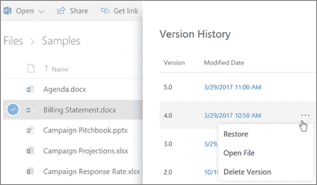
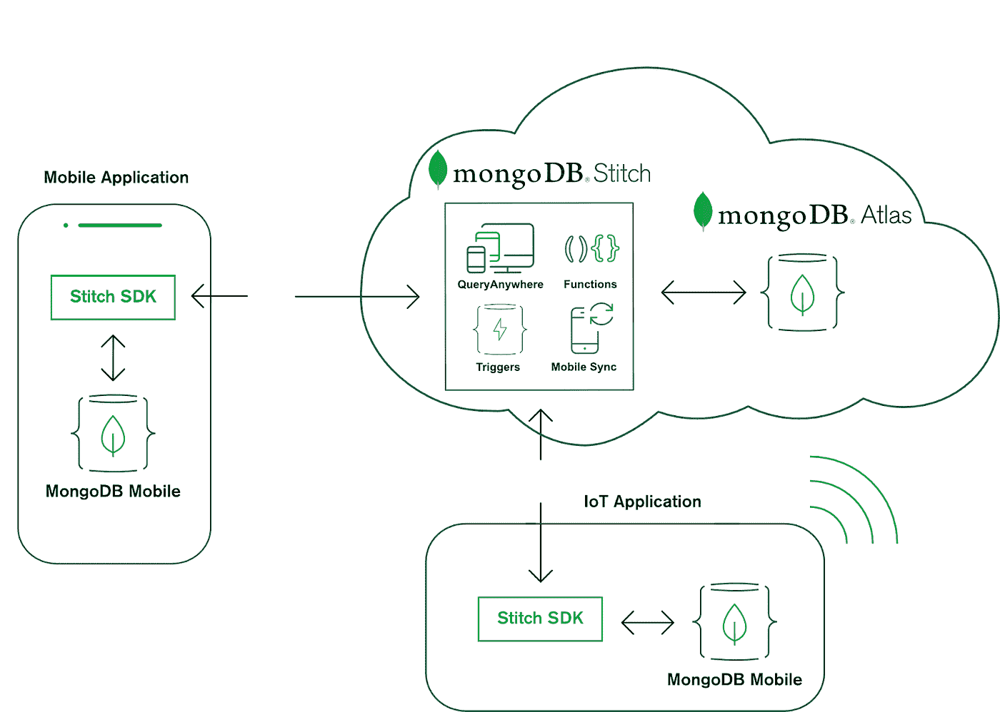

# 面向所有人的数据可视化第 1 部分

> 原文：<https://towardsdatascience.com/data-visualization-for-everyone-pt-1-68b443d29b87?source=collection_archive---------9----------------------->

## [第二部分](https://medium.com/p/data-visualization-for-everyone-pt-2-d7f80b49e17d)

## 第 1 部分:收集、存储和版本控制

# 介绍

我的背景是在 [AEC](http://www.imscadglobal.com/industries-AEC.php) (建筑、工程和&建筑)行业——这个行业在采用和应用新的变革性技术方面一直落后于其他大多数行业。随着现代向数据驱动的企业框架的转变，这一挑战今天依然存在。尽管我们的目标是以逻辑为导向的，但我们“右脑思考”的历史仍有一些教训可供我们今天借鉴。AEC 行业依靠沟通成为最有效和最成功的方式。无论是精致内部空间的[渲染](https://www.ronenbekerman.com/best-of-week/best-of-week-2019/)还是复杂释放阀的模型[开启](https://labs.blogs.com/its_alive_in_the_lab/2017/05/cctech.html)，我们都依赖某种形式的交流来传达我们的想法。在这样做的过程中，我们在各自的交流分支中变得独特而高度熟练。

我们的目标是将这些知识和流畅转化为另一个交流领域:数据可视化。在今天的实践中，数据无处不在。一些实践可以奢侈地收集数据，并投入时间从中提取信息和见解，但许多其他实践必须敏捷，并在日常工作中找到机会，这将增强他们的过程。本文将通过关注数据收集和可视化，并通过为我们中间的修补者提供易于使用的入门工具和更复杂的解决方案，来解决等式的两个方面。

数据可视化是一个广阔的领域，背后有大量的工作。虽然我们不能体现所有的经验，但我们可以很好地将我们独特的行业专业知识与 it 的精选部分结合起来，以进一步提高我们沟通和合作的能力。

# 数据收集

在能够考虑数据可视化之前，首先我们必须确保我们有足够有意义的数据通过可视化产生价值。收集过程通常是公司和团队试图做出“数据驱动”决策的第一个障碍。收集干净、系统化的数据需要在时间和技术方面进行前期投资，才能真正有价值。这似乎是一个令人望而生畏的障碍，特别是对于较小的团队和组织，但幸运的是，今天有一个完整的解决方案可供我们使用，涵盖了广泛的时间/成本投资要求。

由于“收集”在组织和行业之间可能是一个非常不同的过程，本文将着眼于收集媒介和 AEC 行业的机会。然而，同样的概念可以应用于其他市场，数据源是区分因素。

## 回顾的主题

1.  [矿车](https://provingground.io/tools/minecart/)
2.  [Ideate 的 BIMLink](https://ideatesoftware.com/ideatebimlink)
3.  [耐热玻璃](https://ein.sh/pyRevit/)
4.  [蚱蜢](https://www.grasshopper3d.com/)和[发电机](https://www.autodesk.com/products/dynamo-studio/overview)
5.  [Visual Studio](https://visualstudio.microsoft.com/)

## 商业解决方案

如果由于时间限制和/或缺乏特定领域的知识，您目前没有从您的工作中收集数据，您可能会在处理数据提取和收集的成熟商业解决方案中找到价值。这些产品通过将核心逻辑打包到易于理解和使用的接口中，消除了对特定领域知识的需求。不利的一面是，这些产品和服务是有成本的，这可能就像最初缺乏该领域的专业知识一样令人望而却步。

目前市场上有许多这样的产品，本指南将仅重点介绍几个关键产品作为示例。强烈建议您继续研究这一领域的产品，因为它们变化非常快。

**优点**:节省时间，不需要“专家”使用
**缺点**:成本，有限定制

## 矿车(试验场)

[Minecart](https://provingground.io/tools/minecart/) 是 Proving Ground 的全方位服务数据解决方案。他们不仅从 [BIM 模型](https://www.autodesk.com/solutions/bim)中提取数据，还准备模板仪表板和可视化。这是该领域最全面的服务之一，因此可以应用于任何团队或组织，无论他们是否拥有数据科学专业知识。实施成本是基于服务的，这意味着它会根据公司要求、定制级别、知识/培训需求以及许多其他因素而有很大差异。因此，我们鼓励团队了解他们的需求范围，并向服务提供商寻求最准确的价格信息。

Minecart Concept (Image Credit: [Proving Ground](https://provingground.io/))

Sample Dashboard Output (Image Credit: [Proving Ground](https://provingground.io/))

## BIMLink (Ideate)

[Ideate 的 BIMLink](https://ideatesoftware.com/ideatebimlink) 是 [Autodesk Revit](https://en.wikipedia.org/wiki/Autodesk_Revit) 最受欢迎的数据提取解决方案之一。该工具允许用户从 BIM 模型中选择要导出和格式化/过滤的属性，并且只有在模型中已经有有价值的数据时才是有效的。与 Minecart 不同，这个工具只是一个数据提取应用程序。因此，值得注意的是，在数据导出之后，团队仍然需要至少具有一些关于数据管理和可视化的特定领域知识的人来实现该数据的全部价值。

Ideate BIMLink Concept (Image Credit: Ideate)

## 定制解决方案

如果现有的商业解决方案不能满足您的数据需求，那么探索定制解决方案可能是值得的。定制解决方案是团队或组织自己构建的解决方案——根据他们工作的特定需求对其进行定制，并相应地管理他们的数据。定制解决方案的缺点是，根据特定需求对其进行定制是一个耗时的过程——一旦大规模部署，这些工具的创建和维护都将成为大量的时间投资。创建和维护还伴随着对知识的需求——与商业解决方案提供给用户的“前台”或后台知识相同。

有无限多的工具和平台可以列在这个类别中，供开发人员用来创建解决方案，但我们将只重点介绍一些与我们的 AEC 行业更相关的工具和平台。

**优点**:可定制、无订阅/费用、可扩展
**缺点**:时间、需要特定知识、维护

## PyRevit(伊朗埃赫桑-内贾德)

PyRevit 是 Ehsan Iran-Nejad 的开源软件项目，允许用户使用 Python 为 Autodesk Revit 创建脚本甚至插件。默认情况下，PyRevit 附带了许多工具，但它真正的强大之处在于用户能够使用 [Python 语言](https://www.python.org/)的可访问且强大的语法来原型化和构建自己的逻辑。使用 Python 可用的许多库和包，任何人都可以创建数据挖掘脚本，甚至是成熟的数据提取应用程序。

使用这个工具的额外好处是，数据科学长期以来一直倾向于 Python。该语言的可访问性和“非个人化”特性使其成为数据处理、分析、清理甚至可视化的自然选择。因此，学习 Python 使用 PyRevit 提取数据只会让您在提取之后从事更令人兴奋的工作！

Prototyping & Creating Custom Solutions With Python

## 蚱蜢和迪纳摩(麦克尼尔/欧特克)

[Grasshopper](https://www.grasshopper3d.com/) 和 [Dynamo](https://www.autodesk.com/products/dynamo-studio/overview) 是[可视化编程接口](https://en.wikipedia.org/wiki/Visual_programming_language)，允许用户创建类似于编码/软件开发的业务逻辑，无需编写文本代码。这些接口使得那些没有特定领域知识的人更容易原型化和创建逻辑例程、自动化和其他功能。

除了它们为创作提供的灵活性之外，它们还提供了许多软件包，可以从 BIM 模型或 [CAD 文件](https://whatis.techtarget.com/fileformat/CAD-AutoCAD-drawing-database-file)中提取数据。通过这两种方式，用户还可以选择使用可视化编程界面，或者使用基本的 UI 组件创建更加人性化的界面。在这两种情况下，可视化编程简化和民主化了对大量计算资源的访问，其中许多资源对于数据提取或处理是有用的。

Visual Programming Makes Brings Custom Solutions Within Reach

## Visual Studio(微软)

Visual Studio 是一个集成开发环境，它允许开发人员构建。使用 [C#](https://en.wikipedia.org/wiki/C_Sharp_(programming_language)) 的 [NET](https://dotnet.microsoft.com/) 应用程序(以及许多其他应用程序/语言)。对于我们的用例，我们可以使用 Visual Studio 为 Autodesk Revit 或 [McNeel 的 Rhino](https://en.wikipedia.org/wiki/Rhinoceros_3D) 等软件构建成熟的插件，这些插件可以将我们的数据提取到我们选择的任何格式或平台。与 Python 不同，C#不太容易理解，尤其是如果用户没有任何编码/开发经验的话。尽管不太友好，但它确实提供了[编译语言](https://kb.iu.edu/d/agsz)的显著性能提升，因此对于大型数据集和/或大型应用程序非常有用。

除了创建成熟的应用程序，C#和 Visual Studio 还可以用于创建可视化编程接口的节点和组件，如 [Grasshopper](https://developer.rhino3d.com/guides/grasshopper/your-first-component-windows/) 或 [Dynamo](https://github.com/DynamoDS/Dynamo/wiki/Zero-Touch-Plugin-Development) 。尽管这种语言在数据科学工作流中并不十分流行，但是通过这种方法，您可以获得一些额外的价值，通过可视化编程接口为他人创建更易于访问/消化的资源。

Microsoft Visual Studio IDE Interface

# 数据版本控制和存储

在收集/提取数据后，另一个挑战出现了—保持所有内容都是最新的，或者至少知道什么是过时的以及什么时候过时的。这种挑战与组织或团队的规模成比例，个体成员打破了既定的实践和标准，倾向于快速的“解决方案”。

在当今数据快速增长的环境下，许多公司已经开始在组织层面解决这个问题。微软的 SharePoint/OneDrive 和谷歌的 Docs 产品已经慢慢迁移到一个完整的云存储系统，完成了语义版本化、标记和其他基础设施，这些基础设施系统化和组织了我们放入其中的数据。除了“office”解决方案之外，Google、Amazon 和 Microsoft 等数据库提供商也为他们的数据库产品增加了类似的复杂性，使它们比以往任何时候都更容易使用。

在这种产品创新的环境下，我们必须谨慎选择我们的方法，不要被不符合我们特定需求的功能和服务分散了注意力。像以前一样，我们可以从广泛的解决方案中进行选择，从全定制到全用户就绪。

## 回顾的主题

1.  [OneDrive](https://onedrive.live.com/about/en-us/)
2.  [谷歌驱动](https://www.google.com/drive/)
3.  [MongoDB](https://www.mongodb.com/)
4.  [燃烧基地](https://firebase.google.com/)

## 商业解决方案

有许多现成的解决方案可用于存储和版本化数据。最常见的格式是基于文件的，文件集合构成一个完整的数据集，每个文件的版本代表数据集的历史。即使使用基于文件的方法，我们也可以应用许多最佳实践，让我们超越太熟悉的“Data _ final 2 . CSV”范式，并帮助我们从数据中提取更多价值。

**优点**:快捷/易用、有效&直观
**缺点**:局限于文件，缺乏标准/一致性

## OneDrive 和 Google Drive(微软/谷歌)

[OneDrive](https://onedrive.live.com/about/en-us/) 和 [Google Drive](https://www.google.com/drive/) 都是云文件存储解决方案。它们还能很好地与各自的、更广泛的产品生态系统集成在一起(微软的 Office 套件、谷歌的 G 套件和 T20)。除了在云中存储我们的文件之外，它们还允许我们共享、消费和保存我们文件的历史记录。这非常有用，因为最终的数据可视化需要共享/消费，而保留历史对于询问数据集的更深层次的问题非常有用。

OneDrive File Versioning

尽管这两者都很容易获得并且被广泛使用，但这也使得它们在存储数据时存在风险。数据需要一致性才是有用的—格式化、清理等。对于基于文件的系统，在确保数据符合标准方面，用户是最终的责任点。因此，如果团队/组织中的用户在使用这项技术时不承担这一责任，存储的数据可能对最终的应用程序没有什么用处。

## 定制解决方案

在当前的技术市场上，定制数据库解决方案“多如牛毛”。这对消费者来说非常好，因为这意味着当我们试图将技术与组织需求相匹配时，我们可以从一系列选项中进行选择。与前面的主题一样，本指南不会涵盖所有可能的数据库解决方案，但会重点介绍一些关键产品，它们在定制能力和民主化访问能力之间提供了良好的平衡。

**优点**:标准化是内置的，能够扩展，可以广泛集成
**缺点**:成本高，需要调校&维护

## MongoDB

[MongoDB](https://www.mongodb.com/) 是一个基于云的数据库，是当今市场上最受欢迎的产品之一。它的受欢迎程度来自于其全面的文档、开发人员友好的语法以及用于管理数据的图形界面等附加工具。MongoDB 数据库可以接受许多不同类型的数据，并且可以与数据集的大小并行扩展。此外，它与大多数主要的编程语言、框架和语法都有接口，这使得它很容易成为任何定制软件解决方案的“插件”。

MongoDB Sample App Flow

## Firebase(谷歌)

Firebase 是另一个基于云的数据库，提供了与 MongoDB 相同的功能(如上所述)。它与 MongoDB 和目前市场上其他数据库解决方案的不同之处在于它的实时特性。这种功能本质上意味着应用程序或开发人员不必在每次更新时都请求整个数据集，而只需维护一个到数据库的实时(监听器)链接。这使得它成为频繁变化的数据集的首选，并要求用户了解这些变化。跟踪建筑物的房间面积或计算机械散流器是一个很好的例子，这些信息在设计师或工程师每次处理模型时都会发生变化。

Google Firebase Realtime Database Functionality

# 总结和第 2 部分

我们已经讨论了很多内容，但是我们还没有进入“有趣”的部分。本文的第 2 部分将利用我们在这里建立的强大基础深入到可视化过程中。尽管数据收集和存储可能不是流程中最有趣或最吸引人的部分，但它们是最重要的部分，因为它们直接关系到我们数据可视化和信息交流的最终有效性。如果没有一致可靠的数据来源，我们根本没有机构来询问或回答我们希望能够回答的问题。

## [第二部分](https://medium.com/@mitevpi/data-visualization-for-everyone-pt-2-d7f80b49e17d)