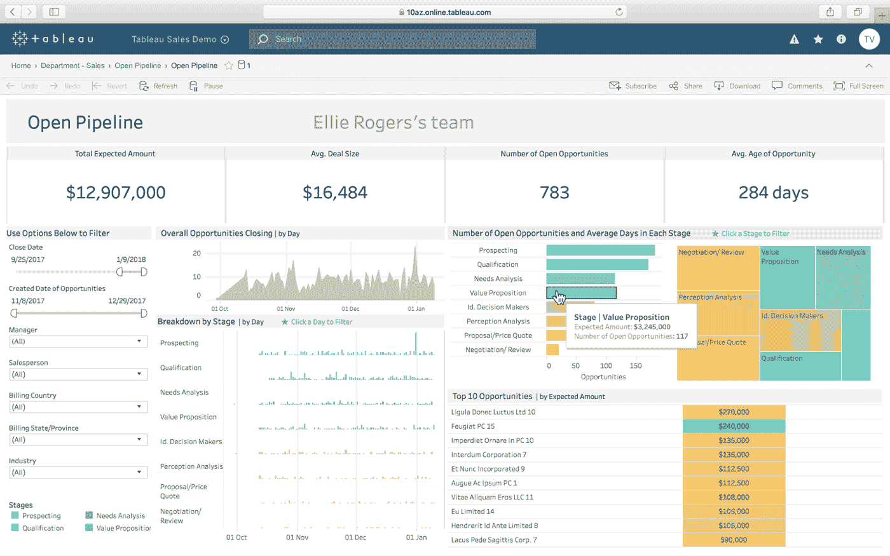
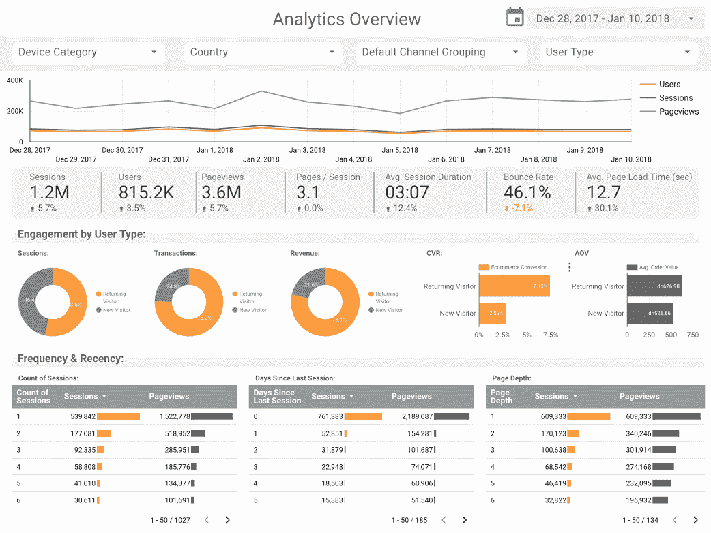

# 每个人的数据可视化 Pt 2

> 原文：<https://towardsdatascience.com/data-visualization-for-everyone-pt-2-d7f80b49e17d?source=collection_archive---------14----------------------->

## [第 1 部分](https://medium.com/p/data-visualization-for-everyone-pt-1-68b443d29b87)

## 第 2 部分:创建和管理可视化

# 介绍

我的背景是在 [AEC](http://www.imscadglobal.com/industries-AEC.php) (建筑、工程、&建筑)行业——这个行业在采用和应用新的变革性技术方面一直落后于大多数其他行业。随着现代向数据驱动型企业框架的转变，这一挑战今天依然存在。尽管目标以逻辑为导向，但我们的“右脑”历史有一些教训我们今天可以借鉴。AEC 行业依靠沟通才能最有效、最成功。无论是精致内部空间的[渲染](https://www.ronenbekerman.com/best-of-week/best-of-week-2019/)还是复杂释放阀的[模型](https://labs.blogs.com/its_alive_in_the_lab/2017/05/cctech.html)，我们都依赖某种形式的交流来传达我们的想法。通过这样做，我们变得越来越有个性，也越来越擅长我们各自的交流分支。

我们的目标是将这些知识和流畅性转化为另一个交流领域:数据可视化。在今天的实践中，数据无处不在。一些实践可以奢侈地收集这些数据，并花时间从中提取信息和见解，但许多其他实践必须敏捷，并在日常工作中寻找机会，以加强其流程。本文将通过关注数据收集和可视化来解决这两方面的问题，并为我们中的修补者提供易于使用的入门工具和更复杂的解决方案。

数据可视化是一个广阔的领域，背后隐藏着大量的工作。尽管我们不能体现其中的每一课，但我们可以很好地将我们独特的行业专业知识与精心策划的部分结合起来，进一步提高我们的沟通和协作能力。

# 数据可视化

现在已经收集并存储了数据(第 1 部分)，我们可以开始考虑它的表示和通信。为了策划这种交流，我们首先必须了解我们的目标是什么，或者更简单地说，我们想通过询问数据来回答什么问题。在这种情况下，数据探索不应与数据可视化混淆。如果我们天生不熟悉数据，我们可能会采取探索性的步骤来更好地理解数据，但这个过程应该与我们希望通过可视化实现的精心策划的交流分开。

一旦我们制定了一组我们希望用数据来回答的问题，我们就可以开始将工具和技术与问题相匹配。与我们之前的主题一样，我们可以采用各种各样的解决方案来回答我们的问题，这里我们将只重点介绍一些最受欢迎或最有用的解决方案。

# 商业解决方案

不久前，商业解决方案还局限于这一领域。仅在 5-10 年前，Excel 中的数据透视表被认为是可视化和呈现数据的标准。现在，我们有了像 Tableau 和 PowerBI 这样的工具——专门致力于创建和管理数据驱动的演示的工具。这一领域的创新在很大程度上是由金融部门推动的，但这并不意味着我们不能利用其他行业的创新来提高效率。

**优点**:节省时间，不需要特定领域的知识，产品质量更高

**缺点**:成本，定制有限

## （舞台上由人扮的）静态画面

[Tableau](https://www.tableau.com/) 是一个商业智能(BI)平台/应用程序，允许用户使用熟悉的图形用户界面创建动态和交互式数据可视化。与其他 BI 工具相比，Tableau 具有更陡峭的学习曲线，但也提供了更多定制和管理数据可视化的机会。这种权衡适用于我们将在本指南后面讨论的其他数据可视化平台，包括商业和定制解决方案。

除了更陡峭的学习曲线，Tableau 还有一个非常重要的相关成本。因此，它只对完全致力于这种类型的工作流的团队和组织有财政意义。还有一个免费版本，但它要求用户在互联网上发布他们的数据集，这在与大多数客户和合作伙伴合作时既不可取也不可能。

Sample Tableau Dashboard

## 微软公司

[PowerBI](https://powerbi.microsoft.com/en-us/) 是另一个 BI 平台，它提供了与上面讨论的 Tableau 非常相似的功能。这两个平台的主要区别在于它们的可访问性和成本。PowerBI 旨在对任何人和每个人都有用——它不依赖数据科学或数据可视化知识来允许用户创建出色的视觉效果。相反，它简化了许多与数据的交互，并让用户通过简单的操作进行创建和探索。没有任何经验的普通用户可以在几个小时或最多几天内启动并运行 PowerBI。面对 Tableau 的同一个用户可能需要至少一个星期，如果不是更多，才能真正有效。(此信息纯属轶事/经验，并非测量的统计数据)。

PowerBI 还提供免费和付费版本，但与 Tableau 不同，免费版本是可用的。PowerBI 的免费层限制了该应用程序的一些功能，如多作者协作和自定义数据源定义，但总体而言，它在很大程度上是相同的产品，几乎任何规模的团队都可以有效地使用。付费版本可以与 Office365 订阅捆绑在一起，因此，如果您的组织已经提供了这种服务，这可能比单独购买成本更低。

PowerBI 的缺点是定制限制。因为这个工具是如此的用户友好和易于使用，所以缺乏深度定制和更“强大”的功能。对于普通的数据集和用户来说，这可能不是一个问题，但对于试图专注于美学或试图争论真正大规模数据集的团队来说，这个工具会带来问题。

## 谷歌数据工作室(谷歌)

谷歌数据工作室是这一领域的新玩家，是更广泛的 G 套件的一部分。这是商业解决方案中成本最低的产品，因此可能最适合较小的团队和组织。它也非常容易访问，并提供非常强大的免费计划，这使它成为原型开发或尝试数据科学和数据可视化的最佳选择。

Sample Google Data Studio Dashboard

# 定制解决方案

数据可视化领域的定制解决方案正在迅速发展壮大！代码库和开源贡献不断地使这个领域变得更容易被程序员和软件开发人员访问和使用，从而将这些类型的工作流注入到他们的项目中。我们在这里讨论的主要库植根于 Python 和 JavaScript 语言——2019 年最流行的两种编程语言。

尽管编码对新手来说可能是令人生畏的，但应该注意的是，许多这些库的存在是为了简化与工作的交互。仅仅因为有人可能想探索一个定制的解决方案，并不意味着它的每个部分都需要定制-他们可以选择一个“更高级”的库，该库抽象出他们不需要控制或定义的大量数据。

**优点**:定制、无购买成本、可扩展性、互操作性

**缺点**:维护，需要知识创造，时间

## JavaScript 库

JavaScript 是数据可视化的一个很好的自然选择。由于它是在浏览器中运行的，所以它提供了在许多不同平台上接触观众的机会——移动、网络甚至桌面。出于同样的原因，在创建和管理可视化时，它允许高度的定制和交互性。如果我们可以控制屏幕/网页上的单个元素，我们就可以轻松地将数据点绑定到它们，并在这些点之间创建关系，进而创建有意义的视觉信息，供我们消费并转化为见解。这个用例中 JavaScript 的另一个好处是它的流行。随着[继续保持“世界上最流行的编程语言”](https://www.geeksforgeeks.org/top-10-programming-languages-of-the-world-2019-to-begin-with/)的头衔，这也意味着先例和例子随时可供学习。这可能看起来不是一个巨大的好处，但是由于许多这些库在本质上是[【低级】](https://stackoverflow.com/questions/10773174/how-are-low-level-libraries-made)，例子和先例对于快速开发是至关重要的，尤其是如果开发人员没有数据科学或前端背景的话。

JavaScript 没有给人留下深刻印象的地方是数据处理和操作过程。由于天生是[单线程](https://www.red-gate.com/simple-talk/dotnet/asp-net/javascript-single-threaded/)，当与 Python、Go 甚至 C#/C++之类的编译工具相比时，它在性能方面往往表现不佳。除了性能之外，也没有一个庞大的科学团体像 Python 那样致力于开发实用程序、库和包。仍然有大量的实用程序来完成这项工作，但是有时仅仅是为了可视化而处理数据就感觉像是一场艰苦的战斗。

## 著名的 JavaScript 库

[**D3.js**](https://d3js.org/)

*   非常低级、陡峭的学习曲线
*   非常通用/模块化
*   高度可定制
*   [样品](https://github.com/d3/d3/wiki/Gallery)

[**Charts.js**](https://www.chartjs.org/)

*   高水平，非常小的学习曲线
*   有限的定制，但是有很多开箱即用的功能
*   [样品](https://www.chartjs.org/samples/)

[**Three.js**](https://threejs.org/)

*   非常低的水平，非常陡峭的学习曲线
*   3D 可视化成为可能
*   有限样本作为三维数据仍是一个新兴领域

[**ECharts**](https://ecomfe.github.io/echarts-doc/public/en/download.html)

*   高水平、小的学习曲线
*   受欢迎程度有限
*   [样品](https://echarts.apache.org/examples/en/index.html)

[**顶点图表**](https://apexcharts.com/)

*   高水平、小的学习曲线
*   有限的可视化选项
*   [样品](https://apexcharts.com/javascript-chart-demos/)

[**谷歌图表**](https://developers.google.com/chart/)

*   高水平、小的学习曲线
*   有限的定制选项
*   [样品](https://developers.google.com/chart/interactive/docs/examples)

## Python 库

Python 在这方面的优势和劣势几乎与 JavaScript 截然相反。虽然 JavaScript 并没有针对科学计算和数据处理进行优化，但是 Python 不仅如此，而且得到了一个为 Python 数据科学创建和支持开源工具的庞大社区的支持。像 [SciPy](https://www.scipy.org/) 、 [NumPy](https://numpy.org/) 和 [Pandas](https://pandas.pydata.org/) 这样的库使得数据准备变得更快、更简单、更少挫折。使用 Python 堆栈的另一个好处是，使用相同的堆栈可以进行大量的机器学习开发。了解可视化工作流的语言和工具可以很容易地为 ML/AI 工作流设置一个。

就弱点而言，很难指出 Python 在数据可视化方面的具体方面——对于这个用例来说，它已经相当全面了。一个挑战是交付和共享创建的可视化。因为 JavaScript 是网络语言，所以将可视化嵌入到网络或移动体验中是很简单的，但是使用 Python，分发必须更仔细地计划。科学计算社区的一个流行媒介是 Jupyter，它也可以用于这个用例。

[**织女星/织女星建兴**](http://vega.github.io/vega-lite/)

*   中级，中等学习曲线
*   “语言”输出格式是 JSON，而不是常规的 Python
*   [样本](https://vega.github.io/vega-lite/examples/)

[散景 ](https://bokeh.pydata.org/)

*   中级，中等学习曲线
*   与 Python 科学计算社区完美集成
*   [样品](https://bokeh.pydata.org/en/latest/docs/gallery.html)

[**牛郎星**](https://altair-viz.github.io/)

*   高水平、小的学习曲线
*   围绕织女星的伟大的高层包装，提供互动
*   [样品](https://altair-viz.github.io/gallery/index.html)

*   **高水平、小的学习曲线**
*   **非常少的代码获得有价值和可用的可视化。大型社区。**
*   **[样品](https://seaborn.pydata.org/examples/index.html)**

**[**阴谋地**](https://plot.ly/python/)**

*   **高水平、小的学习曲线**
*   **在商业 Python 应用程序中日益流行**
*   **[样品](https://plot.ly/python/)**

# **摘要**

**追求数据可视化有很多不同的途径。积极的一面是，选择范围很广——从非常用户友好到完全低级和可定制。消极的一面是做出选择会很困难。做出选择应该是个人的决定-它应该与您的目标、组织的目标以及大规模实施这些解决方案之一所需的时间和培训的现实相一致。但最重要的是，它应该是关于沟通。我们可以集体“沉迷”于数据，我们同样可以欣赏华丽的数据驱动的图形，但我们也必须保持专注，即我们正在创造和交流信息以实施变革。实现这一目标需要的不仅仅是精通技术。**