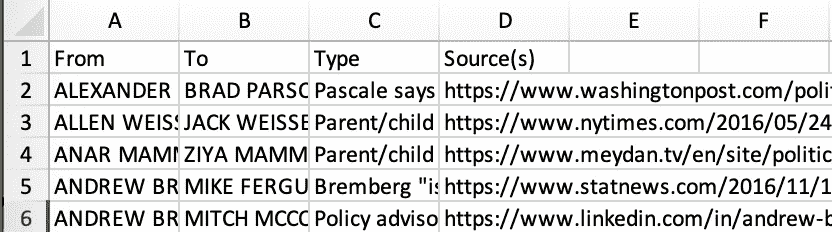

# 用 Kumu.io 实现网络制图中的数据可视化

> 原文：<https://towardsdatascience.com/data-visualization-in-network-mapping-with-kumo-io-fe23d0986f3c?source=collection_archive---------18----------------------->

网络映射是一种非常有效的方式来显示网络中的关键变化点或关键利益相关者。Kumu.io 是一个免费的初学者友好的网络地图数据可视化平台。

在本教程中，我们将向您展示如何在 10 分钟内完成简单的网络映射可视化，而无需编写一行代码。

# 步骤 1:数据集配置

我们将使用 Kaggle 上的 [**特朗普的世界**](https://www.kaggle.com/skylord/trumpworld) 数据集，其中包含 1500 多个与特朗普家族、他的高级顾问或他的内阁人选有联系的人/组织。

Kaggle’s Dataset

在这个数据集中，我们有三个工作表可以使用:

1.  每一行代表一个人和另一个人之间的联系。
2.  `**Person_Org.csv**`:每行代表一个人和一个组织之间的联系。
3.  `**Org_Org.csv**`:每行代表一个组织与另一个组织之间的联系。

在将数据导入 Kumu 之前，我们需要构建电子表格，以便 Kumu 能够读取。我们需要将每个电子表格的第一列标题改为`From`，第二列改为`To`，第三列改为`Type`。

Example

你也可以从谷歌电子表格中导入数据。点击此处查看将数据导入 Kumu [的更多说明。](https://docs.kumu.io/guides/import.html)

# 第二步:在 Kumu.io 上注册

只需创建一个免费的、无限制的公共项目的个人帐户。

# 步骤 3:创建新项目

Kumu 提供了四个模板:系统、涉众、SNA 和其他。

因为我们在这个样本中的目标是描绘唐纳德·特朗普的系统中涉及的人和组织，以及他们的关系。所以我们打算在本教程中使用`Stakeholder`。

点击查看其他模板描述[。](https://docs.kumu.io/getting-started/first-steps.html#picking-a-template)

Kumu provides four templates

我们首先为`Person_Person.csv`数据集创建一个映射`Person-to-Person Ties`。

Create a map

# 步骤 4:导入数据

点击页面下方的绿色加号按钮->选择`Import` - >选择您的文件(本例中为`Person_Person.csv` ) - >点击`Import spreadsheet` - >点击`Save import`。

Import data spreadsheet

我们现在可以看到数据被自动绘制成网络图。

Imported Succesfully

你可以移动鼠标或点击右边的按钮来放大和缩小，并探索。

# 步骤 5:定制可视化

默认的贴图不能给我们太多简单灰点的信息。所以我们要做一些配置，让它的信息量更大。

## **1。设置点的尺寸**

我们想知道谁是特朗普网络中的关键利益相关者。

在页面右下方，找到`Blocks`图标，选择`Social Network Analysis`。

我们需要统计每个人的联系，所以我们选择了`Degree`指标，然后点击`Discover the connectors/hubs`。

> **度中心性**是最简单的中心性度量，计算一个元素拥有的连接数。一般来说，度数高的元件是本地连接器/集线器，但不一定最好连接到更大的网络。

我们现在得到了拥有最高联系的人的结果。

Degree Centrality

关闭区块，在页面右侧，点击`Settings`。

在`SIZE BY`下，选择`degree`，将量程改为`between 0.5 and 20`。点击`SAVE`。

Configure SIZE BY

现在，我们可以很容易地通过圆点的大小来区分人脉较广的人。

## **2。为照片设置圆点**

灰点仍然不足以有效显示谁是关键利益相关者。我们需要为他们添加照片。

点击一个点。在左侧`Profile`部分，点击摄像头标志并粘贴人物图像 url。

Set photos for dots

这是为点添加照片后的可视化效果。它变得比默认的绘图信息丰富得多。

现在我们完成了`Person-to-Person Ties`地图。

现在让我们转到`Org_Org.csv`数据集。从导入数据到配置点尺寸，重复上述步骤。你会得到一个类似下图的可视化效果。

## 3.配置点颜色

我们不想使用令人眼花缭乱的组织的图片作为他们的点。我们将使用简单的颜色来区分它们。

在`Settings`中，通过 `degree`设置**颜色，将**颜色**更改为`RdBu`或任何你喜欢的调色板。然后，viz 将看起来像这样:**

## 4.向点添加标签

我们还想给点添加标签来显示组织名称。

在`Settings`页面中，点击`MORE OPTIONS`，选择`Customize view defaults`。在`**Element defaults**`下，将`Element label position`改为`center`。

Element defaults

在`**Font defaults**`下，将`Font color`改为白色，并增加`Font size`。

Font defaults

现在我们完成了`Org-to-Org Ties`地图。

`Org-to-Org Ties`

而现在你可以自己用最后一个数据集`**Person_Org.csv**` 练习了！

# 参考

1.  Kumu.io
2.  [特朗普的世界](https://www.kaggle.com/skylord/trumpworld)数据集