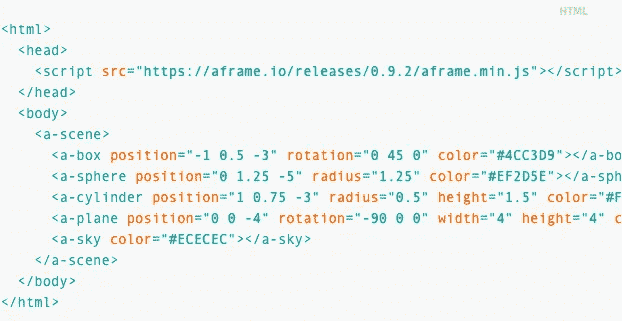
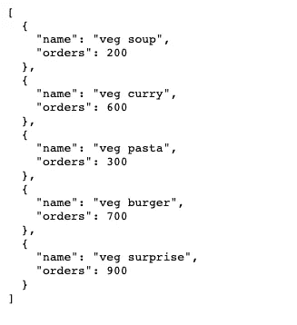
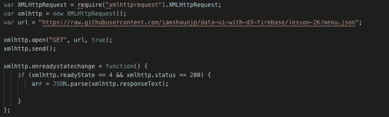
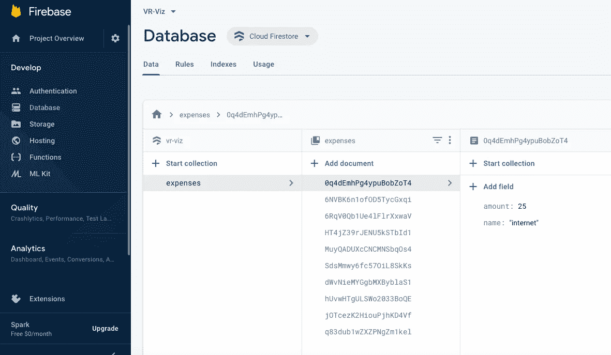
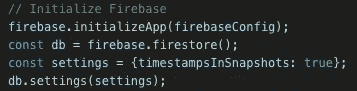
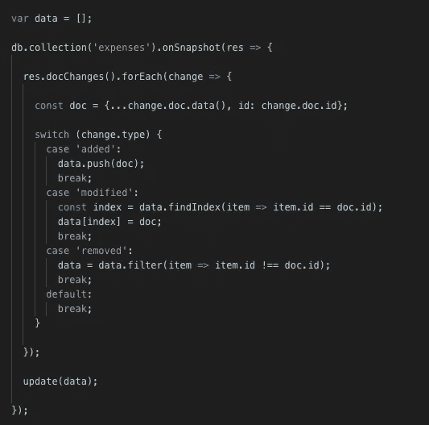
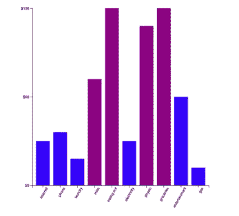
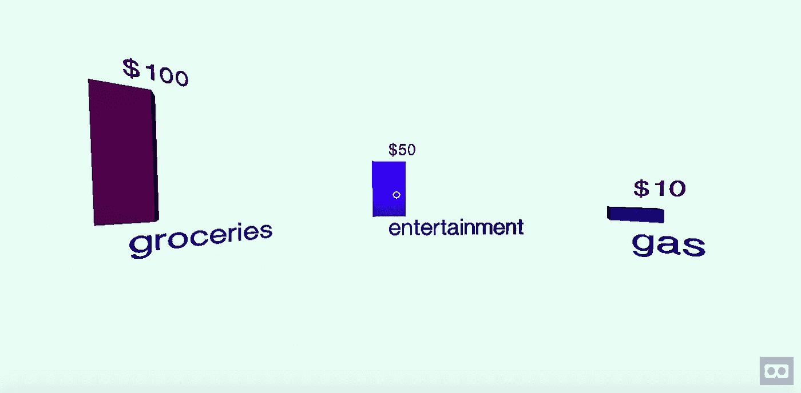

# 虚拟现实中的数据可视化

> 原文：<https://towardsdatascience.com/data-visualization-in-virtual-reality-32408475b66?source=collection_archive---------33----------------------->

## 探索与创造

# 介绍

数据可视化，简单来说，就是数据的图形化表示。如今，它已经成为数据科学的重要组成部分。与原始数据相比，关键利益相关者对干净清晰的视觉效果反应更好，因为它们有助于快速有效地理解信息。目前有大量的可视化库在使用，其中最突出的是 matplotlib (Python)和 ggplot2 (R)。

然而，这些图书馆还没有在虚拟现实领域取得重大突破。随着技术在虚拟和增强现实领域取得有希望的进展，用户也可以在 AR/VR 中体验数据可视化是至关重要的。考虑到这一点，这个项目的目标是探索和创造虚拟现实中的数据可视化。

## 网络虚拟现实

目标是让每个人都更容易进入 VR 体验，不管他们有什么设备。正是因为这个原因，WebVR 被选为最佳媒体。WebVR 是一个实验性的 JavaScript 应用编程接口(API)，为虚拟现实设备提供支持。它是一个开放的规范，也使得在浏览器中体验 VR 成为可能。体验 WebVR 需要两样东西:一个耳机和一个兼容的浏览器。

## a 形框架

A-Frame 是一个用于构建虚拟现实体验的网络框架。A-Frame 基于 HTML 之上，使入门变得简单。但是 A-Frame 不仅仅是 3D 场景图或标记语言；核心是一个强大的实体组件框架，它为 three.js 提供了一个声明性的、可扩展的、可组合的结构。或者，可以创建一个 HTML 文件并在中包含一个 A 帧，如图 1 所示。

*Fig 1: Example HTML file with A-Frame |* Image by author

## D3.js

A-Frame 构建在 DOM 之上，因此大多数库和框架都可以工作。这包括 D3.js，这是一个基于数据操作文档的 JavaScript 库。D3 使用 HTML、SVG(可缩放矢量图形)和 CSS(层叠样式表)帮助数据变得生动。D3 对 web 标准的重视为用户提供了现代浏览器的全部功能，而无需将自己与专有框架捆绑在一起，结合了强大的可视化组件和数据驱动的 DOM(文档对象模型)操作方法。例如，可以使用 D3 从一组数字生成一个 HTML 表，或者使用相同的数据创建一个交互式的 SVG 条形图，具有平滑的过渡和交互。

# 实施可视化 I

这个可视化的目标是从包含静态 JSON 文件的 URL 中读取数据，并在 VR 中创建一个条形图。相机的初始点将在图表的中心，各种棒线围绕着它。构建这个可视化需要两个文件——一个使用 A-Frame 实体定义页面主体的 HTML 文件，一个在读取数据后执行可视化的 Javascript 文件。图 2 描述了包含要可视化的数据的 JSON 文件。

*Fig 2: Static JSON file |* Image by author

## XMLHttpRequest (XHR)

为了从 URL 中读取类似上面 JSON 文件的数据，有必要使用 XMLHttpRequest。XMLHttpRequest 是一个内置的浏览器对象，允许用 JavaScript 发出 HTTP 请求。尽管名称中有“XML”一词，但它可以处理任何数据，包括 JSON、HTML 或纯文本。人们可以上传/下载文件，跟踪进度，并使用 XMLHttpRequest (XHR)对象与服务器进行交互。用户可以从 URL 中检索数据，而不必进行完整的页面刷新。这使得网页可以只更新页面的一部分，而不会干扰用户正在做的事情。

*Fig 3: Code Fragment — XMLHttpRequest |* Image by author

在上面的图 3 中，执行以下步骤

1.  创建一个 XMLHttpRequest 对象
2.  所需的 URL 被分配给一个变量
3.  用“GET”方法和指定的 URL 初始化 XHR 对象
4.  连接被打开，并向服务器发送请求
5.  听完响应后，将读取响应文本
6.  使用 JSON.parse 将响应文本从字符串转换为 JSON，并存储在一个变量中
7.  变量在处理数据可视化的函数中使用

## 浏览

在制定可视化函数并将 Javascript 文件与 HTML 文件链接后，仍然会出现错误。原因是代码段的第一行出现了“require”方法。“require”方法用于将模块包含在项目中，并将其用作基于浏览器的 XHR 对象。问题是虽然 Node.js 定义了“require”方法，但浏览器没有。使用 Browserify，可以编写使用“require”的代码，就像在 Node 中使用它一样。为了使用此功能，请遵循以下步骤

1.  “xmlhttprequest”是使用 npm 从命令行安装的
2.  使用 browserify 命令，从 main.js(工作 js 文件)开始，所有需要的模块都被递归地捆绑到一个名为 bundle.js 的文件中
3.  HTML 文件中包含一个单独的

## 可视化功能

负责 DOM 操作和数据可视化的函数从 XHR API 获取数据。数据被推入数组，然后进行缩放以适合屏幕。A 帧“A 场景”被选中，“A 立方体”条被附加到它上面。随后，定义了条的各种属性，如高度、宽度、位置和旋转。“鼠标进入”和“鼠标离开”动画也是使用“过渡”方法定义的——这有助于鼠标悬停时扩展和照亮一个工具条。最后，可视化中位于条下面的标签以及所需的属性被组合起来。最终可视化的快照显示在图 4 中。

*Fig 4: VR Visualization I |* Image by author

# 实施可视化 II

第一个可视化只能从静态 JSON 文件中读取数据。如果可视化能够读取动态变化的数据，将会更加实用和有用。这是第二个视觉化的目标。它将借用 Visualization I 的基本结构和功能，同时添加实时更新自身的能力。

## 云 Firestore

在这个可视化中，因为数据不是来自静态 JSON 文件，所以不需要使用 XMLHttpRequest 和 Browserify。相反，这些数据是从谷歌 Firebase 的云 Firestore 获得的。Cloud Firestore 是一个灵活、可扩展的 NoSQL 云数据库，用于 Firebase 和 Google 云平台的移动、web 和服务器开发。它通过实时监听器保持客户端应用程序之间的数据同步，并为移动和 web 提供离线支持，以便用户可以构建响应迅速的应用程序，无论网络延迟或互联网连接如何都可以工作。对于这种可视化，使用具有多个文档的“费用”集合，如图 5 所示。

*Fig 5: Cloud Firestore Database |* Image by author

对于访问云 Firestore 数据库中的数据的可视化，HTML 文件中包含了一个

*Fig 6: Code Fragment — Firebase Initialization |* Image by author

下面图 7 中的代码解释了程序如何处理数据的变化。集合中的每个条目都属于“已添加”、“已修改”或“已删除”类型。代码中的 switch 语句通过操作输入数据来处理每一种情况。一旦数据被重新定义，它就被传递给处理可视化的函数。

*Fig 7: Code Fragment — Switch Statement for Dynamic Data Manipulation |* Image by author

## 可视化功能

正如前面提到的，第二个可视化的主要设计功能是从第一个借用的。场景、条和标签以相似的方式构造，具有相同的属性。增加的一个特性是，现在条形的颜色是基于条件的——如果值大于 50，则为紫色，否则为蓝色。然而，在这个可视化中添加的关键组件是文本注释，它被设计成每个条形上方的第二个标签。这些注释表示条形的高度，只有当鼠标悬停在条形上时才会出现。这使得查看者能够理解相对值并更有效地可视化数据。

同样的可视化最初是在常规 D3 上创建的，没有使用 A 帧 VR。这样做是为了测试与云 Firestore 数据库的交互，并用作 VR 可视化的参考。2D 可视化显示在图 8 中。

*Fig 8: 2D version of Visualization II |* Image by author

一旦观察到上述可视化实时更新自身，它就被转换到虚拟现实空间，如下图 9 所示

*Fig 9: VR Visualization II |* Image by author

# 结论

这个项目的目标是研究在虚拟现实中可视化数据的可能性。为了实现这一点，需要了解的关键组件是 WebVR、A-Frame 和 D3。WebVR 是用户体验可视化的媒介，A-Frame 提供了设置 VR 场景和实体的工具，而 D3 支持 DOM 操作和各种可视化属性的定义。

在 Visualization I 中，使用 XMLHttpRequest 和 Browserify 从静态 JSON 文件中读取数据，并生成相应的条形图。Visualization II 在基本功能上模仿了第一款，但数据来源于 Google Firebase 的云 Firestore。除了能够从数据库中读取动态数据之外，Visualization II 还具有自定义注释，当鼠标悬停在一个栏上时会出现这些注释。这使得用户能够理解条形的值和相对高度，从而体验数据的有效可视化。因此，可以看出，使用正确的工具和方法，数据可以有效地在虚拟现实空间中可视化。

# 未来的工作

这个项目只处理使用 A-Frame 的“a-cube”实体的条形图。可以使用各种其他实体构建许多不同类型的可视化。例如，饼图和圆环图可以分别使用“圆柱”和“圆环”实体来制作。当前的可视化是使用本地目录中的 HTML 文件在 web 上演示的。将来，这些可以通过谷歌、GitHub、GoDaddy 等网站发布。这将允许在互联网上共享可视化的能力，也将促进合作。

在这个项目的过程中，人们发现手头上关于这个主题的资料非常少。由于数据可视化还没有真正进入虚拟和增强现实领域，这个研究项目有望在不久的将来推动这一对话。

> 上述工作是南加州大学 Saty Raghavachary 博士指导下的定向研究项目的一部分。
> 
> 你可以在这里找到我的项目[的 GitHub 库和下面的可视化:-](https://github.com/IshaanVasant/VR-Viz)
> 
> [可视化 I (VR)](https://bl.ocks.org/IshaanVasant/raw/b84726b84c14d9ba3e058cef85376acb/a65ab438a0e25b9037710b2b001fcf79b1cec721/)
> 
> [可视化 II (2D)](https://bl.ocks.org/IshaanVasant/raw/a48d9913dd7e09f00e9a75fd5fdc275f/16c77118283a6fd869ffbea1d4fa458edaf9b188/)
> 
> [可视化 II (VR)](https://bl.ocks.org/IshaanVasant/raw/dd43e5511102eb6e3c3fab4b8638584f/a9d7b9815f2cc1e7cd0c5a800fbbf28826ef5b0c/)