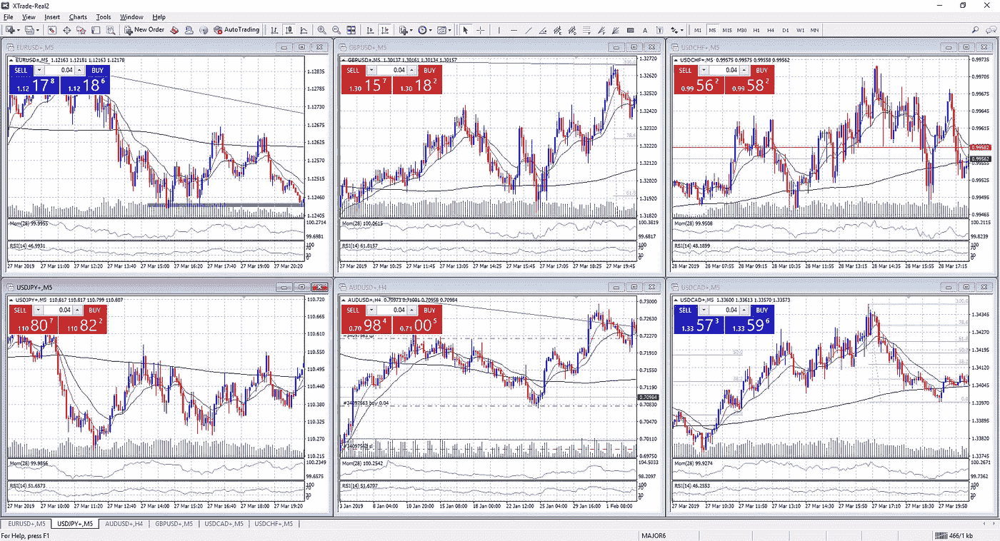
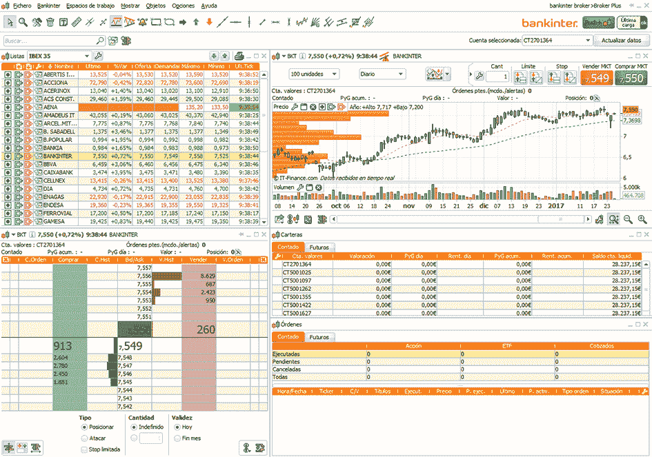

# 数据可视化至关重要:对绘制市场数据替代方案的快速回顾

> 原文：<https://towardsdatascience.com/data-visualization-matters-a-quick-review-on-alternatives-to-plot-market-data-de400ee640c5?source=collection_archive---------6----------------------->

数据可视化在量化交易中被高度忽视。在一个由算法主导的领域，对数据的视觉检查似乎不再相关，它属于自主交易，但事实上，这是正确分析和业余方法之间的关键区别之一。

数据可视化也是一个广泛的领域，它涵盖了几种图表和绘图类型。在金融市场中，有足够的空间来处理经典的直方图和散点图(根据我的经验，这些是最有用的)。绘制这样的图形非常容易，不需要任何特殊要求，因为几乎任何绘图/图表库都可以轻松处理它们。

这篇文章专门讨论市场时间序列图，通常是包括开盘价、最高价、最低价和收盘价的条形图或蜡烛图，加上成交量和/或未平仓合约。金融市场作为纯时间序列的本质创造了其他领域所没有的特殊需求和特殊性。

时间序列图——正如我们提到的，主要是蜡烛图和条形图——在市场投机和投资中起着重要作用。它们规范了我们展示和分析资产价格演变的方式。它特别适用于技术价格分析，因为大部分分析依赖于图表中的特定模式和趋势。

> 在量化交易中，数据可视化很容易被忽视，因为所有的焦点都放在算法上。这是一个巨大的错误，因为数据可视化在定义和验证策略中扮演着重要的角色。

在这篇文章中，我将介绍显示数据的不同选择。我们将主要回顾标准制图软件包、定制的高级独立制图库和软件包以及低级图形库。对于每个解决方案，我将描述其优点和发现的问题，并强调我认为与建立专业的市场数据分析方法相关的领域。

# 标准制图软件包

有许多著名的图表平台和软件包可以用来显示和分析市场图表。任何投资者或投机者都会有自己的图表软件，用于定期进行交易决策。大多数活跃的交易者也将使用该软件直接从图表中提交市场订单，这允许容易地设置利润和损失水平，警报，限制订单等。虽然这些图表平台提供了高度的灵活性，但它们通常被设计成处理交互式的、任意的和非标准的数据分析方式。

在小投资者和散户投资者最常用的两个平台中，我们发现了 ProRealTime 和 Metatrader。Metatrader 是一个轻量级的简单工具。尽管它有一定的局限性，而且只在场外交易市场使用，但它已经成为活跃的散户投资者中最受欢迎的工具之一；这可能是因为它已被全球大量零售 OTC 经纪人所采用。

Metatrader 4 is one of the most widely used chartings and trading platform for CFD instruments.

**Pro RealTime** 是另一个在小散户中广泛使用的工具。能力是比 Metatrader 好得多的功能，用于受监管的市场。它有更多的功能，如订单深度，体积概况和许多分析工具。

Pro RealTime is a well-known platform for regulated markets among retail investors.

这只是行业中众多可用工具中的两个例子。我选择这两个只是因为它们是我更熟悉的，但市场与许多其他知名平台一样重要。

虽然图表软件适用于自由市场分析和交易，但它们更侧重于传统交易，不太适合历史数据分析。他们希望有人在屏幕后面与工具交互，并且他们提供的灵活性是突出的。它是如此的出色，以至于我认为对于定量交易和系统的市场分析来说它是太多了。

# 复杂图表:多即是少

一个可以做任何事情的制图软件，在每一个可能的范围内，看起来都是一个好的选择，但事实并非如此。每个交易者在技术分析的旅程中都有一个共同的模式。在最初的几个月——当技术指标和方法被发现时——有一种趋势是用多种指标、趋势线、辅助线等进行过度复杂的图表分析。人们很容易认为越多越好，全套指标将导致更安全的操作。这种情况一直持续到复杂性达到稳定水平。从那一点开始，最大限度地简化图表是很常见的。这个过程可能会经历一个巩固反弹期，直到出现一个相当简单的情景。

简化的程度取决于每个人和使用的具体方法，有些人喜欢画一个只有价格和几个支撑位或阻力位的图表，有些人喜欢使用成交量、一两个指标(取决于使用的具体策略)和一些辅助的斐波纳契水平。

我们的目标是只有那些绝对必要的行，但是一些额外的指示器和一些辅助线有时会有所帮助。一些策略，如 Elliott wave 分析，需要更广泛的价格和时间延伸以及目标区域的绘图。常规的价格架构交易通常促进更少的图纸，以避免对价格正在做的事情分心。

更进一步的细节——例如是否使用网格、平均值、很少指标或没有指标等。—仍然更多地取决于每个人的特定偏好。

# 天平:似乎没人注意它们

灵活性可能成为问题的领域之一是规模。全权交易鼓励灵活处理几乎任何潜在的时间和价格组合，而量化交易鼓励更结构化的方法。而从更科学的角度分析任何事件，都要求测量尺度不变或者以可控的方式变化。用不同的价格尺度来观察市场是没有意义的。同样，在每次分析中使用不同的时间框架是没有意义的(一次半天，一天半秒，三天半三分之一)。此外，当用图表软件可视化市场时，除非你非常了解你正在跟踪的市场——这是必须要做的——否则你将无法理解给定的每日价格波动是否很大，以及这种波动通常发生的频率。

定量分析处理如此多的可能性，以至于需要定义分析发生的边界。在这样做的时候，建议总是用清晰明确的价格尺度来处理相同的时间框架设置。我并不是提倡为每一个分析建立一个单一和固定的设置，而是要使图表的观察方式专业化。

我们可以用制图学来做类比。地图的潜在比例可能有无限多种，但最终，专业制图师会定义一小组可用的比例，在行业中广泛使用，然后为每个特定地图选择更合适的比例。这样做可以更容易地评估每张地图。如果每张地图都使用不同的比例，或者每次分析特定地图都使用不同的比例，制图员就很难理解距离的大小。

> 任何比例都可以用于地图，但大多数组织已经确定使用几种常用比例

使用标准的制图软件通常会促进这种不同的比例场景，用户可以选择任何潜在的价格和时间比例，而科学方法则鼓励相反的情况:限制查看图表的方式。

我个人的制图方法是用价格变动直方图确定价格变动，然后在有限的范围内选择适合每个图表的比例。我没有统计数据或证据证明这种方法降低了风险或增加了利润，但这听起来像是一种公平的方法。

关于时间尺度，我也喜欢处理特定的、固定的时间段。日内是 24 小时——我最近倾向于使用美国东部时间来反映美国股市对全球市场的深刻影响——48 小时来应对超过一天的较大波动，5 天来应对每周波动，然后是双周、每月和每年。如果需要更长的时间，我会使用标准的图表软件。

这种固定时间段的方法显然与图表软件的灵活性相矛盾，在图表软件中，时间段通常由条形宽度、屏幕大小和缩放来定义。它们基本上显示尽可能多的信息。这可能被视为一种优势，但它基本上改变了你每次想要观察一个物体或事件的视角和距离。确实不是一个非常系统的方法。

# 历史数据:标准的图表软件不能很好地处理它

虽然图表软件可以很好地分析最近发生的事情——或者如果你绘制的是更长时间的图表，则不是最近发生的事情——但它通常是一个非常糟糕的工具，无法系统地观察更长时间内一天内发生的事情。获得两年前某一天发生的事情并不像人们想象的那么容易，而且很可能根本不可能，因为制图软件依赖于经纪人提供的实时数据，而经纪人通常会限制当天可用数据的数量。通常情况下，您将无法检索超过两周的信息。在一些图表工具中，在时间上向后导航图表实际上是非常困难的；它们是用来作为交易平台的工具，而不是历史和策略分析平台。

# 使用现有库定制图表

这些情况导致许多参与定量分析、密集回溯测试或历史分析的人最终不得不使用定制的图表软件。

尽管可以通过现有制图软件的 API 来利用这些软件，从而节省开发时间，但这种方法有很大的局限性，它将我们的软件和方法与第三方平台紧密结合在一起，而第三方平台可能会在未来改变其 API 或许可条款。

解决这个问题的最初方法是使用许多现有的图表库或已经可用的模块化软件包中的一个。虽然这似乎是一个好方法——并且通常是您要解决的第一个方法——但是它有局限性，最终很容易得出结论，利用现有的软件包是不够的。我为此专门测试了 Gnuplot 和 Matplotlib。

如果有一个众所周知的老派绘图软件，那就是 **Gnuplot** 。它是在 30 多年前设计的，至今仍是将绘图功能融入项目的最简单、最容易的方法之一。

Gnuplot 完美地遵循了 UNIX 的理念，即作为一个独立的工具，可以在操作系统级别与我们的软件进行管道连接或集成。它简单、功能强大、易于集成并且有据可查。作为一个特定的图表工具，它非常容易使用和集成，但是它的交互选项非常少。

虽然将鼠标和键盘事件与外部程序集成是可能的——Gnuplot 可以在事件上启动外部命令，并从标准输入控制台获取命令，这有效地实现了基本的接口实现，但是这种集成既不自然也不简单。它缺乏实现复杂的用户界面所需的速度和灵活性，并且将其与外部软件正确集成极其笨拙。

在我的测试中，我原型化了一个简单的 Gnuplot 实现。显示包含所有数据的图表很容易，但实现一个交互式用户界面来绘制趋势线或斐波纳契曲线被证明是复杂而缓慢的。事件处理很难，因为需要在您的软件和 Gnuplot 之间实现一个硬权重接口。它只是表现不好，并且在其操作中缺乏平稳性。规模也是一个问题。

发现 Gnuplot 等孤立的工具缺乏实现最小用户界面所需的集成—在绘制图表时，我们希望至少能够绘制趋势线、斐波纳契线和支撑位/阻力位—第二层复杂性是使用绘图库。Matplotlib 是一个完善的库，它有所有主要编程语言的包装器，并有更丰富的 API 来处理鼠标和键盘事件。

Matplotlib 作为绘图库在数据科学中被广泛使用和推荐，但它同样缺乏实现复杂用户界面的速度。

Matplotlib prototype implemented using Python wrapper showing an intraday chart for Telefonica stock (SIBE TEF ES0178430E18).

一个复杂的用户界面需要嵌入 Tkinter——或者任何其他更低层次的小部件工具包——如图所示。

我使用 Tkinter 实现了一个原型，虽然可以显示图表，但我再次发现处理鼠标和键盘事件并不容易。

Tkinter 也不使用 GPU 硬件加速，这将在复杂的图表中造成性能问题。此外，在处理布局时，使用 Matplotlib 会造成一定程度的复杂性，因为您处理的是一个嵌入式库，它并没有真正设计为与小部件工具包集成。

还值得一提的是，Matplotlib 有一个特定的财务扩展，可以即时绘制蜡烛图。然而，这种扩展不再被维护，并且实际上比常规的 Matplotlib 条形图更难使用(条形图可以垂直偏移，因此很容易用条形图和折线图的组合来绘制烛台)。我的建议是远离这个扩展，根据我的个人经验，它已经过时，功能性差，缺乏适当的文档，并且在最近的版本中不受支持。

# 低级图形库

一旦我们发现图表库对于静态图表来说很棒，但是它们的交互能力却远远没有用上，很明显我们需要一个底层的库，并且我们的实现必须覆盖基本的方面，比如缩放。在这方面，我尝试了两种方法:Cairo Graphics 和 Java2D/AWT。

我们不包括 Tkinter，因为我们包括了使用 Matplotlib 的原型，尽管另一个选项是在 Tkinter 中使用 Canvas 小部件直接实现图表。这意味着实现所有图表功能。由于没有仿射变换，并且 Tkinter 不使用 GPU 硬件优化，我们将发现性能更慢，编程更困难，因为我们需要在 Tkinter 中完全实现缩放。当前的硬件可以处理性能损失，但是增加代码复杂性可能是一个问题。我还制作了这个选项的原型——事实上这是我很久以前制作的第一个原型——我发现它太复杂了，没有用。

我们量化项目的最后一个原型测试包括 Cairo 和 Java2D。我们发现 GPU 的使用是必需的，并且从理论上来说 **Cairo** 看起来是一个不错的候选，但是在发现在 Windows 计算机上运行 Cairo 的复杂性之后，我在开始评估的同一天放弃了这个想法。让它运行起来是极其复杂的，我们认为这将是以后的发行和维护问题。

# Java2D/AWT

对于新的开发，不推荐使用 AWT，它已经过时了，是在 90 年代包含在 Java 中的。Swing 是作为一种现代的替代品出现的，最近 JavaFX 是新开发的推荐方式。这个建议对于常规用户界面可能是有价值的，但是当处理财务图表时，我们将花费更多的时间处理面板和画布，而不是实际的小部件。由于 Swing 和 JavaFX 体积较大，使用 Java2D 和 AWT 是一个非常有效的解决方案，即使它们是有点过时的库。

Java2D 使用硬件加速，并且支持仿射变换。仿射变换的使用简化了实际价格和条形图的处理，有效地将我们的软件与窗口/设备尺寸分离。

Java2D/AWT prototype showing an intraday chart for CME GLOBEX 6E future contract.

我们的第一个原型是成功的，在不同的类中分离功能相对容易，实现的性能也很好。原型还允许堆叠底部和左侧面板。

我们计划将该原型进一步扩展为一个完整的工作解决方案，包括功能的完整封装、用于绘制辅助线和标高的自定义用户界面，以及提供体积轮廓和可选指示器/面板的能力。

# 摘要

尽管现有的图表软件有许多功能和灵活性，但它在定量交易和系统回测中的使用并不是最好的选择，建议使用定制的解决方案。

在面临的挑战中，我们可以强调需要简化图表中的信息，需要适当和一致的尺度(价格和时间),以及系统分析历史数据的复杂性，特别是当这些数据作为专有存储库存储时。此外，这些环境通常需要一定程度的自动化，这使得标准软件的使用变得复杂。

当只需要显示静态图表时，利用现有的绘图库或模块化软件(如 Matplotlib 或 Gnuplot)似乎是一个不错的选择，但它们的用户界面功能远非完美，并且这些库不是为金融时间序列图表的特性而构建的。

使用 Cairo 和 Java2D 等低级库是一个很好的选择，因为我们可以完全定制图表的呈现方式，尽管它们需要更多的开发工作，但它们的功能简化了开发，并且它们提供了硬件加速。使用仿射变换能力的可能性减少了开发时间，因为可以毫不费力地管理价格和时间尺度。

在这两个选项中，我发现 Java2D 是处理这种需求的最简单的选项，尽管肯定会有其他的选择。Java2D 的一个优点是它真正面向用户空间的 2D 矢量图形，这是您在处理这种图表时真正需要的。

我们没有介绍基于网络的库(如 TechanJS ),因为此时我们正在寻找一个桌面解决方案，但它们与标准绘图库一样复杂。它们的定制、集成和开发时间一点也不简单——它们通常建立在标准绘图库之上。如果 web 用户界面对您的项目有任何好处，那么它们显然是一个不错的选择。实现这一目标的另一个选择是使用 SVG，这是一种强大的图形语言，它使管理比例和用户界面像在网络上一样简单。SVG 没有被广泛使用，但是它非常容易使用，并且可以很容易地与 jQuery 和 Javascript 集成。