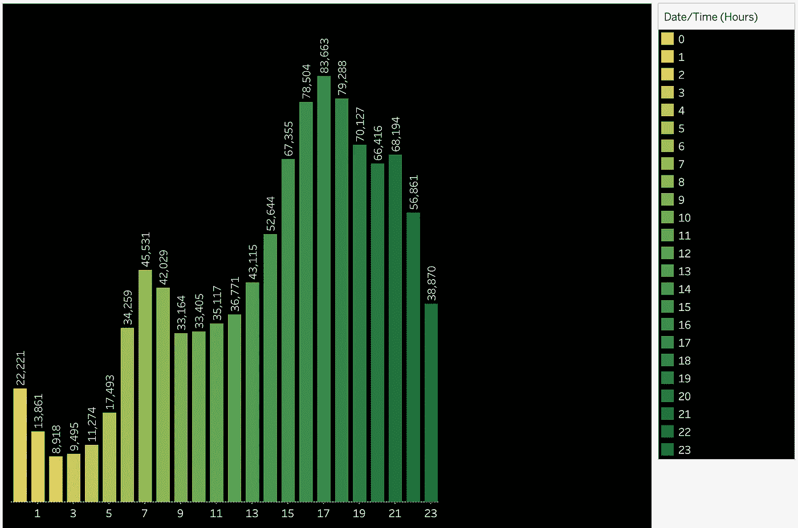

# 用 Tableau 实现优步游乐设施的数据可视化

> 原文：<https://towardsdatascience.com/data-visualization-of-uber-rides-with-tableau-67988f61f712?source=collection_archive---------14----------------------->

这件作品的灵感来自于纽约优步游乐设施的演示样品。但我们将在 Tableau 中完成，无需编写任何代码。

你可以在我的 Tableau 页面[这里](https://public.tableau.com/views/UberRidesinNYC/Dashboard1?:embed=y&:display_count=yes&publish=yes&:origin=viz_share_link)找到我的作品。


该可视化创建了 2014 年 4 月至 5 月纽约市的优步游乐设施的视图。它旨在为消费者提供关于在一个月的不同天的不同时间段内，在不同的纽约市街区，优步乘坐次数如何变化的见解。

我们使用地图来显示乘坐次数的地理分布，使用柱状图来显示一天中不同时段的乘坐次数分布。

# 步骤 1:导入数据

我们将使用由 [FiveThirtyEight](https://github.com/fivethirtyeight/uber-tlc-foil-response/tree/master/uber-trip-data) 提供的数据。

你可以在这里找到如何将数据源链接到 Tableau [。](https://help.tableau.com/current/pro/desktop/en-gb/examples_excel.htm)

# 第二步:第一页—地图

## 1.画地图

将`Lat`和`Lon`从`Measures`拖动到`Columns`和`Rows`绘制地图。


## 2.地图图层

我们想为我们的地图创建一个黑暗的主题，就像大多数地图可视化一样。

2.1.选择`Map`->-

2.2.将`Background`样式改为`Dark`。

2.3.在图层中选择`Streets, Highways, Routes`、`Cities`。


地图现在显示了更多的地理信息。

## 3.颜色

3.1.将`Date/Time`从`Dimensions`拖动到`Marks`->-

3.2.在`Marks`部分点击`Date/Time`右侧的下拉按钮，选择`More`->-`Hour`


3.3.点击`Color`->-`Edit Color`，选择调色板`Green-Gold`，点击`Assign Palette`

3.4.点击`Color`->-`Effects`->-`Border`->-`None`


现在，高对比度的颜色使地图更加清晰。

## 4.过滤器

我们想在地图上添加过滤器，让用户选择特定的日期和时间。

4.1.将`Date/Time`从`Dimensions`拖动到`Filters`，选择`Month/Day/Year`，点击`All`

4.2.在`Filters`部分点击`MDY(Date/Time)`右侧的下拉按钮，点击`Show Filter`

4.3.点击表单上`MDY(Date/Time)`右侧的下拉按钮，选择`Single Value (drop down)`


现在，我们完成了地图图表。

# 步骤 3:第 2 页—直方图

打开一个新工作表来创建直方图。

## 1.绘制直方图

1.1.将`Date/Time(Hours)`从`Dimensions`拖至`Columns`，将`Number of Records`从`Measures`拖至`Rows`。

1.2.点击轴名`Number of Records`，取消选择`Show Header`

1.3.点击工作表中的轴名`Date/Time`，选择`Hide Labels`


## 2.颜色；色彩；色调

我们将使用与地图相同的颜色主题。

2.1.将`Date/Time(Hours)`从`Dimensions`拖动到`Marks`->-

2.2.将记录数从措施拖到`Marks`->-`Label`

2.3.右击直方图，选择`Format`->-`Lines`->-`Grid Lines`->选择`None`

2.4.右击直方图，选择`Format`->-`Shading`->-`Worksheet`->选择黑色



我们完成了直方图。

# 第四步:仪表板

*现在我们想创建一个仪表板来同时显示地图和直方图。*

点击仪表盘，点击`Format`->-`Dashboard`->-`Dashboard Shading`->-`Default`->选择黑色

将工作表 1(地图)和工作表 2(直方图)拖到仪表板上，直方图位于底部。

分别在工作表标题上点击右键，点击`Hide Title`


## 1.工作表格式

1.1.点击`Month, Day, Year of Date/Time`过滤器，点击应用到工作表，选择`All Using Related Data Sources`。这样我们可以删除工作表 2(直方图)的`Date/Time (Hours)`图例。

1.2.点击`Month, Day, Year of Date/Time`滤镜，取消选择`Show Title`

1.3.点击工作表 1(地图)的`Hour of Date/Time`图例，取消选择`Show Title`

1.4.点击表 1(地图)的`Hour of Date/Time`图例，选择`Floating`

1.5.移动地图右侧的`Hour of Date/Time`图例，调整地图大小以适应图例


## 2.添加文本描述

我们想添加一些描述，让用户更好地理解。

2.1.标题:将文本框拖到仪表板上，键入

```
UBER RIDES IN NYCApril - May 2014
```

2.2.说明:将文本框拖到仪表板上，键入`Select the legends on the map or bars on the histogram to section data by time.`


2.3.描述:将文本框拖到仪表板上，键入

```
TOTAL RIDES:SOURCE: FIVETHIRTYEIGHT
```

2.4.总乘坐次数

为了显示基于日期和时间过滤器的动态`TOTAL RIDES`文本，我们需要添加一个新的工作表。

2.4.1.将`Number of Records`从`Measures`拖动到`Marks`->-T20。纸张上应显示一个数字。

2.4.2.右击数字，点击`Format…`->-`Font`->-`Worksheet`->白色

2.4.3.右击号码，点击`Format…`->-`Shading`->-`Worksheet`->黑色


2.4.4.将新工作表拖到仪表板上

2.4.5.点击新建工作表->选择`Hide Title`

2.4.6.点击新建工作表->选择`Floating`。拖动`TOTAL RIDES`文本旁边的数字。

2.5.添加空白

在仪表板的必要位置添加空白，让文本垂直居中对齐。


现在我们完成了可视化。

# 参考

[纽约优步游乐设施](https://dash-gallery.plotly.host/dash-uber-rides-demo/)